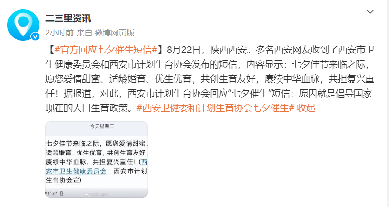

# 多名西安网友七夕收到催生短信 官方回应：倡导国家现在人口生育政策

8月22日，据二三里资讯报道：在陕西西安，多名西安网友收到了西安市卫生健康委员会和西安市计划生育协会发布的短信，内容显示：七夕佳节来临之际，愿您爱情甜蜜、适龄婚育、优生优育，共创生育友好，赓续中华血脉，共担复兴重任！据报道，对此，西安市计划生育协会回应“七夕催生”短信：原因就是倡导国家现在的人口生育政策。

**【来源：二三里资讯】**

