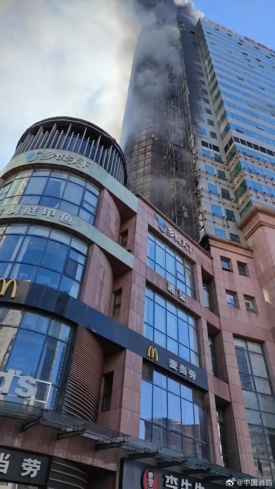

# 天津一高层大厦着火，老建筑为何易燃？危险或在外墙材料里

8月22日14时许，天津市南开区一栋高层大厦发生火灾。根据网传视频显示，着火大楼楼顶有“平安银行”字样，大楼侧面有大面积明火与滚滚浓烟。

火灾发生后，不少网友表示这与去年9月发生在长沙电信大楼的火灾有点像，比如都是外墙迅速燃烧，且两个高楼都是建成十年以上的建筑。《一起来唠科》栏目对话了一位从事火灾调查的专业人士，以下是他结合相关新闻报道和网络视频，对类似建筑物的火势蔓延作出的判断。

**一、目前一些现场视频显示，天津这个大楼的火势和去年长沙电信大楼的有点像，也是顺外墙往上蔓延，速度较快，这可能是什么原因导致的？**

答：可能主要有3个方面的原因。

一个方面的原因是，有可能这个大楼的外墙装饰材料是易燃或者可燃的。比如聚氨酯泡沫或铝塑板这种装修材料。它们在明火的作用下，燃烧速度很快。

第二方面的原因，可能和这个起火点有直接关系。我们从视频可以看到它最初的起火位置，是在大楼的偏下方。火焰高温作用下，它主要是作用于上边，那么对上边的热辐射和灼烧程度，形成了一个叠加效应。所以向上边蔓延就越来越快。

第三个原因就是有一个倚墙效应在里边。什么是倚墙效应呢？就是这个热气流明火焰向上发展的时候，在热作用力下，它周围的空气还有大楼内部的空气的温度是相对低的，那么在这个温度高的地方呢，就形成了一个热压力，这样的话呢，就把外部的新鲜空气给卷入进来，参与到燃烧，这就相当于加大了它的这个供氧量。供氧量的增加，对于这个燃烧的快速蔓延，是有很明显的作用的。

就比如说我们手里面竖着拿一个火柴棍，这个火柴棍从下边着了，那么它就会向上蔓延。一方面是火柴本身是易燃可燃材料，加上它周边的空气又不断被气压挤进来形成倚墙效应，火和热的作用主要就集中在这个燃烧材料上了，这样一来，它的燃烧速度就加快了，所以我们看到了一个很快速的蔓延。

**二、目前高楼大厦常用或常见的哪些建筑材料是会助燃的？**

答：比如说大型综合体或者大厦、商厦、酒店等，它们外部的装修装饰材料，除了我刚才说到的可能有些采用聚氨酯泡沫或铝塑板以外，还可能有其他的一些可燃材料。

比较常见的就是大楼外部的大型广告喷布。广告喷布本身也是可燃的，这些东西会让火焰蔓延的速度加快。但因为这种材料比较轻薄，通常燃烧起来不会造成太严重的后果。

还有，比如说跨越楼层的空调外机，或者其他的一些悬挂物。这些物体当中，有一些电线的绝缘层，还有空调冷凝管的保温材料，这些大部分都是可燃的。

所以大楼外立面这一块，一方面是设计上要加强安全性能的优化；另一方面呢，也要考虑外边的这些附着物，包括大型的广告喷布、广告牌、霓虹灯、外部空调挂机等等。还包括一些高层居民住宅的阳台杂物等，都应该加以关注。

**三、从消防角度来看，当发生这种火灾时，大楼内的消防设施如何发挥作用？**

答：一般而言呢，现在主要的建筑消防设施都是集中在大楼的内部，是针对大楼内部的火灾而进行设计的，并且它是一个被动的作用。

什么是被动作用呢？也就是你必须先有火灾的烟、热等信号来触发自动报警、自动喷淋等。那么对于外部的这种火灾呢，我们在大楼设计的时候，基本上不考虑他本身外部发生火灾的情况。所以当这个火灾的烟、气、热还没有完全或者是足够影响到内部的时候，内部的消防设施一般是很难响应的。即使内部的消防设施响应了、被触发了，它是能起到报警作用，但是自动喷水灭火等这些系统对外部的火灾也是无济于事的。

**四、从常规角度来看，高楼大厦起火，一般可能有哪些高危诱因？**

答：这个大楼具体的起火原因根据目前的情况还不方便进行判断，那么从通常的可能原因来讲，大体分为几个方面。

比如说，如果当地没有雷暴天气，那么基本可以排除雷击了。还有常见的电气火灾，比如说空调等电气设备故障、电线短路等等，这些电气故障所产生的火灾占的比例还很大。除了电气以外，还有用火不慎的情况，比如说在装修、施工、拆卸广告牌等等作业时，也可能有电焊、气割等危险性作业。如果操作不当的话，也会引发火灾。

还比如说外来火源遗留火种，特别像吸烟这种情况。大厦外层的底层阳台，如果堆放了很多的垃圾，并且这些垃圾是可燃的，那么当楼上或者楼外有烟头飞入，它也会引燃。所以这里面的原因是非常复杂的，没有经过调查，确实是不好先入为主去加以判断。

**五、很多起火的大楼可能是十几年甚至几十年前建的，那么以当下的防火标准来看，现如今新建的高楼外墙是不是有更好的防火材料？**

答：当然是有的。因为如果是老建筑的话，可能当时按照经济水平还有相关的规范要求，设防的能力有限。本来高层又曾是超高层建筑是不允许用可燃材料进行装修的，但在现实当中，可能就会存在用聚氨酯泡沫保温板等进行装修的情况，不知道出事的这个大楼是不是这样，但是现实中确实有一些大楼还存在这样的问题。

那么后来呢，我们国家对外墙保温有了一个明确的标准，如果说你用这个可燃材料，那么外部必须是全封闭的水泥砂浆，确保可燃材料不与外界发生接触，并且在施工的时候不是说整块板挂上去，而是到一定的区域范围以后，要加一个水泥砂浆的隔断层。这样一来，某一个小区域着火以后，不至于整面扩散。这些都是很好的办法。

但是对于一些老楼、旧楼来讲，它的改造需要很大的工作量，这个恐怕要经历一个消化的时间。那么当然了，在设计的时候最好是采用不可燃材料，这当然是最好的，就保温层来讲，阻燃或难燃、不燃材料也是有的，只不过相对来讲价格可能会贵一些。不燃材料的使用或者直接喷涂装饰涂料等等，这些都能有效降低火灾风险。

**版权声明：本文系腾讯新闻《一起来唠科》独家稿件，未经授权禁止媒体转载，但欢迎转发至个人朋友圈。**

