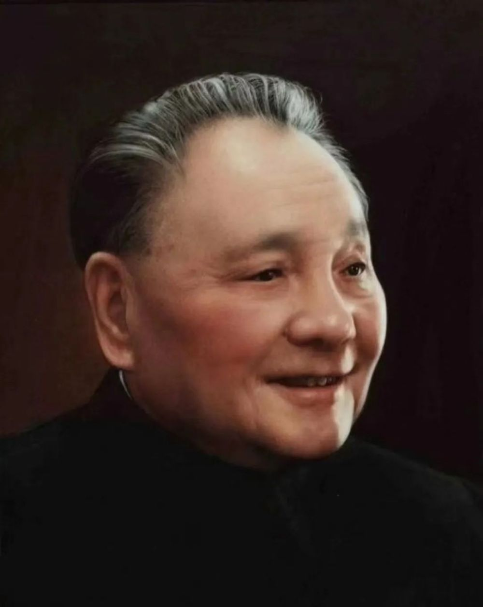
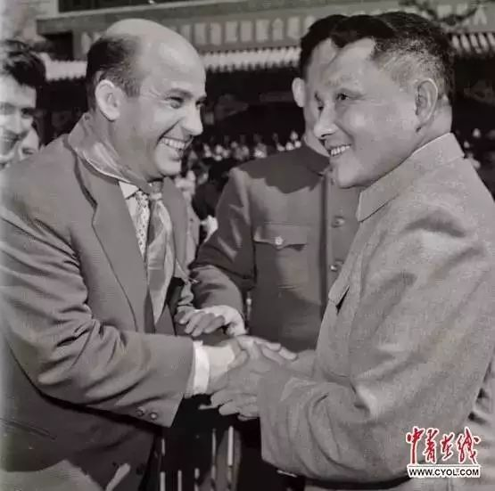
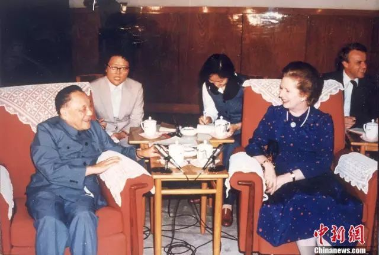
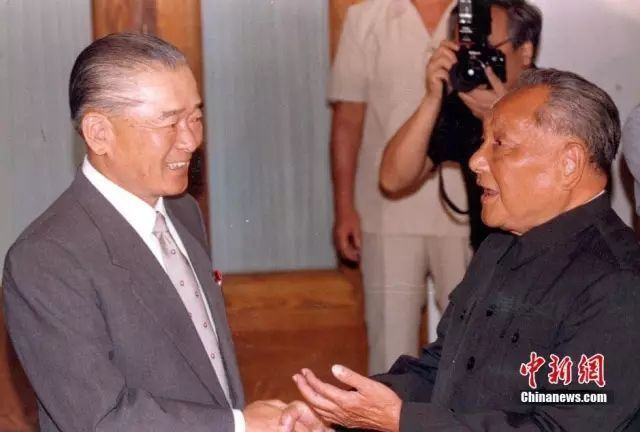

# 小平，您好！

视频编辑：李晴

**“我是中国人民的儿子**

**我深情地爱着我的祖国和人民”**

2023年8月22日

是邓小平同志诞辰119周年纪念日

作为改革开放的总设计师

邓小平永远留在国人的记忆中

今天

我们格外怀念邓小平

怀念一位将个人命运

与国家发展的历史责任

联系在一起的政治家

如今中华大地全面建成小康社会

开启全面建设社会主义

现代化国家新征程

新的春天的故事正在接续上演

**身处盛世**

**我们也更加缅怀**

**这位可亲可敬的老人**

 _1992年1月18日到2月21日，邓小平视察深圳、珠海等地并发表谈话。_

**不曾走远的身影**

1919年

15岁的邓小平遵父命

到重庆为赴法勤工俭学作准备

**1920年**

**邓小平赴法国勤工俭学**

**这件事改变了邓小平的人生**

 _1920年，留法勤工俭学时的邓小平，时年16岁。_

1923年

18岁的邓小平加入了

旅欧中国共产主义青年团

成为最年轻的成员

但革命思想在他心中的萌发

则在更早前就已经产生

在人生观形成阶段

邓小平的信念纯洁

一如他在莫斯科中山大学

填写履历表时所说：

**“我从来就未受过其他思想的浸入**

**一直就是相当共产主义的”**

_1929年12月11日，邓小平、张云逸、韦拔群领导和发动百色起义，创建了中国工农红军第七军和右江革命根据地。邓小平任红七军前敌委员会书记、红七军政治委员。_

_1937年，邓小平任八路军政治部副主任。_

 _1938年，邓小平、朱德、周恩来、彭德怀、贺龙等人合影。_

_八路军第129师创建晋冀豫根据地。图为朱德总司令（右）与第129师师长刘伯承（中）、政委邓小平（左）研究作战计划。_

_1945年8月，邓小平任晋冀鲁豫中央局书记兼军区政治委员。_

_1948年11月，中央军委决定，组成由邓小平任书记的五人总前委，统一领导和指挥中原、华东两大野战军，举行淮海战役。（左起：粟裕、邓小平、刘伯承、陈毅、谭震林）_

_1957年5月，中国新民主主义青年团第三次全国代表大会在北京召开，党和国家领导人接见全体代表，中共中央总书记邓小平（前排右一）参加会见。_

_1959年4月，邓小平会见来华访问的匈牙利共青团代表团。_

_1963年5月1日，邓小平在北京会见来访的阿尔巴尼亚青年代表团。_

 _1965年建军节，邓小平等接见人民解放军先进连队和军烈属代表。_

 _1977年，邓小平在庆祝建军50周年的纪念活动上。_

 _1978年3月的全国科学大会后，邓小平接见会议代表。_

_1978年10月，邓小平观看空军部队训练表演后，同飞行员握手。_

_邓小平为厦门经济特区题词。林维英 摄_

 _1982年9月，邓小平会见访华的英国首相撒切尔夫人，提出了中国对香港问题的基本立场。_

_1984年10月1日，参加庆祝中华人民共和国成立35周年群众游行的北京大学学生，突然举起“小平您好”的横幅，通过天安门广场。_

_1984年10月1日，中华人民共和国建国35周年，邓小平检阅人民解放军三军部队。_

_1988年8月26日，邓小平会见日本首相竹下登。_

_1988年9月，邓小平与李先念等接见被授予上将军衔的17位将军。_

_1990年，邓小平会见香港基本法起草委员会委员。_

_1992年1月18日邓小平南巡武昌、深圳、珠海、上海等地，发表了重要讲话，通称“南方谈话”。1992年春，邓小平先后赴武昌、深圳、珠海和上海视察，沿途发表了重要谈话。_

**中国改革开放的总设计师**

1978年至今，中国的改革开放已经40多个年头。今天，我们仍然忘不了改革开放和社会主义现代化建设的总设计师邓小平。

1977年7月，邓小平第三次复出后，针对我国农业发展状况，对农村的体制问题进行了深入的思考。他说，近20年里，农民和工人的收入增加很少，生活水平很低，生产力没有多大发展。中国的农业问题太严重了。

特别是中国农民的贫穷生活，给这位70多岁的老人很深的感触。邓小平说：我们现在必须发展生产力，改善人民的生活条件。

1978年1月底至2月初，邓小平出访尼泊尔，途经成都时作了短暂停留。在听取了中共四川省委汇报工作后，他说：农村政策、城市政策，中央要清理，各地也要清理一下，自己范围内能解决的，先解决一些。总要给地方一些机动。

1978年9月，邓小平在东北之行中，多次谈到农村问题。他说，一个公社有自己的条件，有自己的情况，一个大队有自己的条件，有自己的情况，有一般，也有特殊，大量的是特殊，更重要的是要根据自己的特殊情况考虑问题。

**邓小平的这些讲话，如一石激起千层浪，解放了人们的思想。**

**他是孩子眼里的“邓爷爷”**

1985年的春天，81岁的邓小平到南京视察。一张老照片定格了当时邓小平在中山陵视察的瞬间。

那年2月3日上午，邓小平一行来到了中山陵。在陵道上漫步时，邓小平看到路边栽满了雪松，露出笑容说：“雪松四季常绿，你们要多栽一些。”

这时，游览的人群中有人认出了邓小平，一个五六岁的小男孩突然挣脱母亲的手，喊着“邓爷爷好”一路奔过来。警卫人员想要拦，却见邓小平慈祥地向孩子伸出双手，迎上去搂住他。

这个小男孩姓周，是上海人，当时上小学二年级，和妈妈一起在南京旅游。据介绍，当时，邓小平把小男孩拉到身边，慈祥地抚摸他的脸蛋和耳朵，还嘱咐道：“你要好好读书，长大了做有用的人才。”

这里，还有一些“邓爷爷”和家人在一起的老照片，透过这些照片我们不难看出，他不仅仅是改革开放的总设计师，还是一位慈祥的老人。

**这些时候**

**我们总会想起他**

1977年8月4日，邓小平在人民大会堂主持召开科学和教育工作座谈会。就是在这次会议上，邓小平果断决策恢复中断十年的高考。图为恢复高考后第一届高考考场。

1979年2月，在第五届全国人大常委会第六次会议上，决定每年3月12日为全国的植树节。1982年植树节，邓小平率先垂范，在北京玉泉山上种下了义务植树运动的第一棵树。

1992年，邓小平为希望工程亲笔题词，并以“一位老共产党员”的名义，为希望工程捐款5000元。图为邓小平为希望工程的题词和他两次为希望工程捐款的收据。

**再道一声：小平，您好！**

一代人有一代人的使命

一代人要走好一代人的长征路

**邓小平同志为我们擘画的**

**社会主义现代化蓝图**

**正在一步步变成美好现实**

我们伟大的祖国

正在一天天走向繁荣富强

中华民族正在

一步步走向伟大复兴

斯人已逝，余音在耳

这个名字在我们心中

依旧没有丝毫褪色

_1997年2月25日，邓小平追悼大会在人民大会堂隆重举行。群众自发在天安门广场悼念。_

邓小平的一生

几乎贯穿整个20世纪

他建立了永不磨灭的历史功勋

也留下了丰富宝贵的精神遗产

**今天**

**让我们一起缅怀、致敬伟人**

**再道一声：小平，您好！**

编 辑丨翁腾月

校 对丨张依霆

校 审丨孙小千

值班编委丨刘 斐

来源：微信公众号“共青团中央”（ID：gqtzy2014）综合整理自微信公众号“小平故里新青年”（ID：gqtgasw），中国青年网客户端

