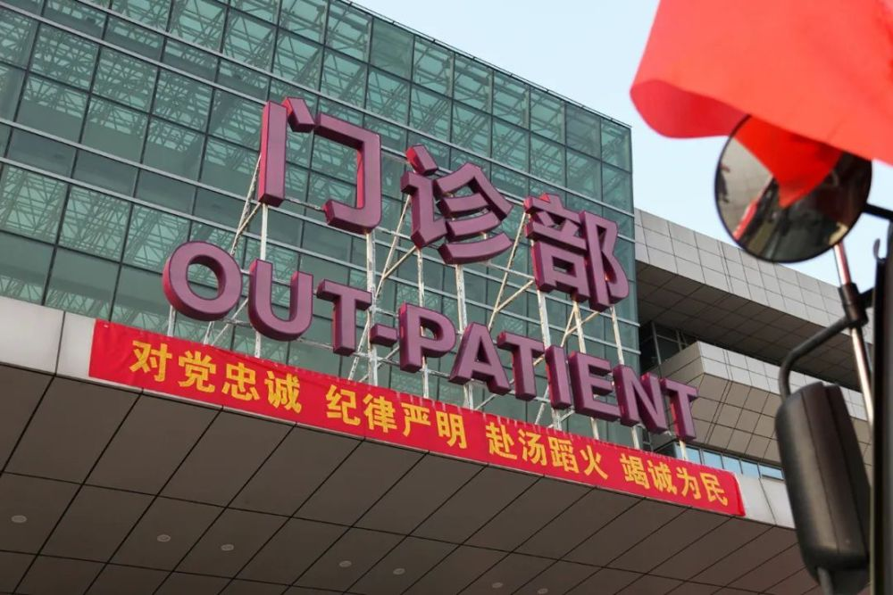

# 收入1年降30%，离职医药代表谈反腐：没有网传“一年买房”的暴利

医药反腐风暴正劲时，涂宏钢写了一篇文章，希望为绝大多数普通临床医生和医药代表发声，消除不必要的误会。据他观察，一直以来，百姓对医生群体的看法普遍存在一些误区，比如医生是不是都是高收入群体；医生给人看病，是不是总惦记患者口袋里的钱。

涂宏钢在医药行业有相当丰富的阅历。他当过10多年医生，后来辞职下海，创办无锡医库软件科技有限公司，同时他还是医药圈的初代网红，他的ID“Dr.2”经常出现在行业论坛。

“这次医药反腐的舆论出圈了。”涂宏钢对《每日经济新闻》记者说，他在行业内20多年，这次尤其不一样，无论走到哪里，人们都在讨论医药反腐，个别医药代表、医生、主任的腐败事件钉在热搜榜，成为人们的谈资。

大家都关注医药反腐自然是好事，随着本轮高强度的反腐工作推进，医药行业会迎来“净化”。但他也担心，有些医生贪腐的案例被放大后，会让医药代表、医生和学术会议被污名化、符号化。

中央电视台知名新闻评论员、主持人白岩松也公开表示，卫健委强调，最近正在进行的医药反腐针对的是关键少数和关键岗位，不能让绝大多数医师感受到委屈，甚至被污名化……希望医疗领域改革更有力度，让医生们的收入在阳光下日益提高。

_图片来源：每经记者 韩阳 摄_

**多地相继出招**

**“最严”反腐盯紧“关键少数”**

医药反腐的号角吹响半月，多地市场监管部门相继出招。8月18日，黑龙江省、内蒙古自治区相关部门均表示，公开征集医药领域商业贿赂线索。最近一个月，北京、内蒙古、海南、山西、浙江等多地卫健委陆续在官网公布举报电话，明确推进医药领域腐败问题集中整治工作。

8月16日，国家卫健委发布三千字长文详解医药反腐，文章称：反腐已在医药行业内形成广泛共识，集中整治的各项工作正在稳步开展。下一步，集中整治工作将根据总体安排。加大对典型问题处置及通报力度，确保整治工作成效。

“最严”反腐风暴下，医、药两端都在震动。据中新网不完全统计，截至8月17日，今年全国已有超过180名医院院长、书记被查，从实力雄厚的三甲医院到基层乡镇卫生院，“关键少数”、关键岗位都是医药反腐的发力点。

医生、医药代表、药企各方谨慎观望，也有人主动投案。8月17日，根据中共雅安市纪委微信公众号“清风雅语”通报，雅安市中医医院党委委员、副院长谭慧涉嫌严重违纪违法，主动投案，经雅安市纪委监委指定管辖，雅安市雨城区纪委监委正对其进行纪律审查和监察调查。

转行半年的前医药代表李森（化名）告诉记者，国家卫健委提到的“全面覆盖”“聚焦重点”“关键岗位”“关键少数”意味着国家已经就本次医药反腐画了重点，而且下笔比往常更重。他不禁想起今年4月家乡医院“一把手”被直接带走一事，原来那不是特殊情况，而是山雨欲来。

此前的一些腐败案例显示，有医院院长为自己创造了会上“一言堂”、花钱“一支笔”、用人“一句话”、决策“一挥手”的环境，“一把手”甚至变成了“一霸手”。有些医院“拔出萝卜带出泥”，出现一、二把手以及重点科室负责人接连被查的“塌方式”腐败。

国家卫健委在最近的相关问答中明确回应，针对“关键少数”、关键岗位的腐败问题进行重点突破，对重点问题、典型案件进行调查核实、处置处理、通报剖析，形成全国性集中整治医药领域腐败问题的高压态势。

中国新闻网发表评论称，需要明确的是，
**强化对“关键少数”的监督，目的是清除影响医药领域健康发展的“黑手”，而不是捆住担当实干者的双手，更不会导致什么“医疗系统崩溃”**
。一个良性健康、行稳致远的医药卫生体系，绝不能靠“潜规则”甚至违法违纪行为来维持运转。只有刮骨疗毒、猛药去疴，才能还兢兢业业的医务人员更加阳光体面的收入，还医药卫生系统更加风清气正的发展环境，才能构建更加和谐的医患关系，强化“尊医重卫”的社会风尚，人民群众健康权益才能得到更加充分而可靠的保障。

“查处的院长、科主任与药械企业的数量和力度都是空前的。”涂宏钢说，很多查处都是从末端抓起，反腐的本质是从源头切掉利益驱动，而腐败的核心动力，来自于医生、主任还有院长从药械的招标、进院和处方的自由裁量权获得利益分配，通过利益驱动来扭曲真实的临床处方行为。他预计，医疗机构反腐中涉及的关联企业将成为反腐的下一站。

**不能让绝大多数医生**

**医药代表污名化**

对于李森等靠近医药代表的人，他们看到巨大金额和桃色细节的反腐案例，心情是复杂的。一方面，他们也觉得“林子大了什么鸟都有”，有些报道中同行“走偏门”的办法自己之前都没有听说过；但另一方面，他们被评论区的恶意困扰。

在医药代表这一行待了十多年的刘洋认为目前的舆论认知存在偏差，“假设100个医生或者100个医疗代表里有99个都是好的，但只要有1个不好的被广泛报道，大家都认为所有或大多数人都是不好的。”李森也发现“很多网友会非黑即白地讨论一些事”。

涂宏钢也不希望看到这种情绪扩散开来，他写了一篇文章，标题是《不应该妖魔化医药代表和污名化学术会议！》，被很多圈内人转发。在这篇文章中，涂宏钢提出了三点，一是医药代表是列入《职业分类大典》的正当职业，二是亲身感受多数医药代表都是正直、谦虚好学的，三是学术会议由企业赞助在全世界通行，符合行业规则。

他觉得药企与医务人员的正常交流非常有必要，不是所有学术会议都是利益输送，医药代表也不是洪水猛兽。这些交流不只是药企需要推销产品，医学在不断发展创新，医务人员需要了解如今有哪些新药、新仪器出现，能对患者的治疗带来哪些改变。这就需要有与药企交流的机会。另一方面，很多医药创新也需要从临床实践里寻找方向、灵感。

医药代表是舶来品，在海外已有40多年历史，总体来说是一份高尚而体面的职业，它的核心任务是“传递药品信息、收集临床反馈”，是连接医生、医院和制药企业的重要纽带。中国医师协会副会长蔡忠军曾形象地比喻说：“医生是战士，药品是武器，医药代表就是解释、说明、宣传、推广甚至协助你使用武器的人。

《检察风云》2017年第18期一篇文章写道，据统计，美国临床医生新药知识的73%来源于医药代表的讲解，医药代表要对药品使用中出现的意外情况及时进行处理，把医生用药的临床状况，如药物的不良反应信息和治疗范围的变化等反应给药企，然后组织一些学术研讨会，让医学专家对药品进行鉴定，并提出改良建议。美国食品与药品管理局(FDA)收到的药品不良反应报告中，90%以上是通过医药代表收集来的。

在我国，“医药代表”在竞争中慢慢有了变化，与之对等的标签都是“低端、暴利、隐秘”等负面词语，久而久之，大众对医生也产生“收红包、吃回扣”的联想，对医药代表和医生群体之间的正常互动有了“商业贿赂”的刻板印象。

但最开始时，它并不是这样，现在人们脑海中的医生“腐败”画像也不是真实情况。涂宏钢说起一个例子，上世纪外资药企医药代表曾因专业、渊博，受到国内医院拉横幅欢迎的礼遇，而如今医院到处贴着“禁止医药代表入内”的标语，甚至有些还附上“背着双肩包”等形象描述的具体字眼。

刘洋观察到，7点左右甚至7点之前就到医院，
**手术到晚上八九点甚至半夜的外科医生比比皆是，辛苦级别可谓“超级”，而李森没有遇过主动暗示要好处的医生，他觉得医生“其实挺苦逼的”** 。

 _某医院门诊 图片来源：每日经济新闻 兰素英 摄_

今年2月，李森因为收入下降辞职，离开待了10多年的医药圈。他的收入在一年时间内差不多缩减了30%，没有网传的“一年买房”级水平；对于刚走出医学院的毕业生，医药代表这一职业的薪酬吸引力越来越小。

涂宏钢告诉记者，由于药品集采和医保准入等一系列改革推进，国内药品市场洗牌加剧，医院药品销售额同比下滑，如果偏头部企业的代表年收入相比之前一些年降幅在30%左右，小企业降得肯定还要多。

他还呼吁，医学是一个高度依赖技术进步的行业，对患者和医生来说，好的药物和器械并不仅仅是个商品，更是医生的武器，没有麻醉的进步就没有现代外科学，没有胰岛素，糖尿病的患者可能会很早产生并发症和更严重的情况。把好的产品信息和学术推广出去，让更多的医生患者知道，并且让患者获得好的疗效，是一件正确的事情。

**通过行政、司法和市场方式**

**多维打击“坏孩子”**

涂宏钢表示，医药反腐是一种纠偏，很可能是为了更好地进行医改。三明医改操盘手詹积富曾经表述过，医改顺利的关键之一是要反腐。

而这一过程可能要持续几十年的时间。以全球医疗最发达的国家之一美国为例，其对医疗领域商业贿赂的规制，可追溯到1972年制定的《医疗反回扣法》，但2000年以来，美国医疗领域的商业贿赂现象愈演愈烈。2011年通过的奥巴马医保法案里的《医生薪酬阳光法案》（the
physician payment sunshine act），规定了医药企业与医生、教学医院的经济往来必须每年都做公开。

现在，美国的联邦医疗保险与联邦医疗补助计划服务中心（cms）的网站上可以查找到任何一家药企与任何一位医生的财务关联。2022年美国的药企支付给执业医生的一般费用（包括餐饮、劳务、旅行住宿、资讯等多种）共计24.8亿美元。

同时， **《医疗反回扣法》为违法者设立了极高的违法成本**
（违法者可被施以最高2.5万美元和（或者）不超过五年有期徒刑的刑事处罚）；现有的法律中的《反欺骗政府法》则能“策反”一些医药企业的销售代表成为“告密者”，举报自己公司的违法行为。因此，大多手握高薪的美国医生视贿赂如洪水猛兽，不想因为一点好处丢了工作。

而顶层设计优化也是本轮医药反腐的关键一环。经济观察报获取的一份时间安排显示，这一年的整治工作，2023年7月底前是自查自纠阶段，宽大处理主动说明问题、主动投案的人员；此后十个月集中整治；2024年6月总结整改，届时将会出台一批制度文件或修改相关法律法规。

实际上，刑法修正案（十二）草案今年7月25日提请十四届全国人大常委会第四次会议审议。草案加大对行贿犯罪惩治力度，增加惩治民营企业内部人员腐败相关犯罪的条款。

在加大对行贿犯罪惩治力度方面，草案增加规定，对多次行贿、向多人行贿，国家工作人员行贿等六类情形从重处罚。同时，调整行贿罪的起刑点和刑罚档次，与受贿罪相衔接。

实践中，单位行贿案件较多，与个人行贿相比法定刑相差悬殊。一些行贿人以单位名义行贿，规避处罚，导致案件处理不平衡，惩处力度不足。为此，草案将单位行贿罪刑罚由原来最高判处五年有期徒刑的一档刑罚，修改为两档刑罚：“三年以下有期徒刑或者拘役，并处罚金”和“三年以上十年以下有期徒刑，并处罚金”。

涂宏钢预测，近期密集出台的医药反腐政策，将给整个行业带来巨变，整个行业短期内在承压，也可能带来巨大的阵痛。比如导致一批违规竞争的医药企业死亡，医院及其领导将优胜劣汰，会形成常态化的监督机制。对于整个医药行业，会减少中间环节，减少代理商，减少摩擦和流动成本，“活下来的企业都会受益”。

具体来说，一个个处罚是靴子落地的过程，落地之后预期也就明确了。随着监管压力的持续，一大批除了商业贿赂之外、没有任何别的办法的制药企业，会在公平市场竞争情况下自然消亡。

反过来看，对规模药械企业构成实质性利好，也会促进市场集中，再通过行政、司法和市场的方式多维打击“坏孩子”，也希望把一些被迫跟随的“坏孩子”，最终变成“好孩子”。

这又将牵动千万医药代表的职业走向。“反腐这一年，我判断医药代表的数量怎么也得减少30%，短期阵痛的时候，收入会降一点或持平，但长期肯定会涨，职业门槛也会提升。”涂宏钢说。

**记者|** 金喆 林姿辰

**编辑|** 陈俊杰 卢祥勇 杜恒峰

**校对|** 刘思琦

｜每日经济新闻 nbdnews 原创文章｜

未经许可禁止转载、摘编、复制及镜像等使用

