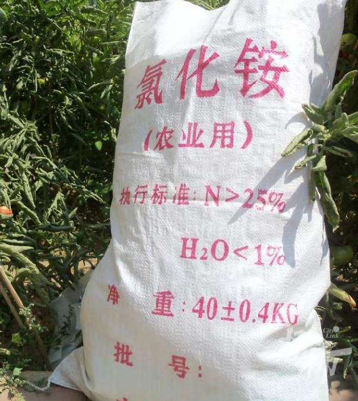

# 网传河南洛阳天降不明物体砸出大坑，当地消防：是农用氯化铵，已处理

今天，网传洛阳王城大桥附近一不明物体从天而降，将路面砸出大坑。

目前，网传视频都比较模糊，路上疑似有白色不规则“不明物体”，从网传现场图片看到，有消防车抵达现场，还有人穿着专业防护服正在作业。

下午，橙柿互动联系王城大桥附近所在洛阳西工区消防救援大队，工作人员表示，昨晚8点多确实接到警情，说 **王城大桥道路上有个东西掉在地上**
，不清楚具体是什么。

“接警后我们就去了现场，确认是农用的氯化铵，不是危险物，当晚专业人员已经清理走了。”

氯化铵，简称氯铵，化学式NH4Cl，多为制碱工业副产品，作为农药多用于稻田。

 _市场上常见的农用氯化铵肥料袋，网络图片_

为什么一大袋农用肥料会在那里，地上是不是砸出大坑？具体情况还在了解中。

