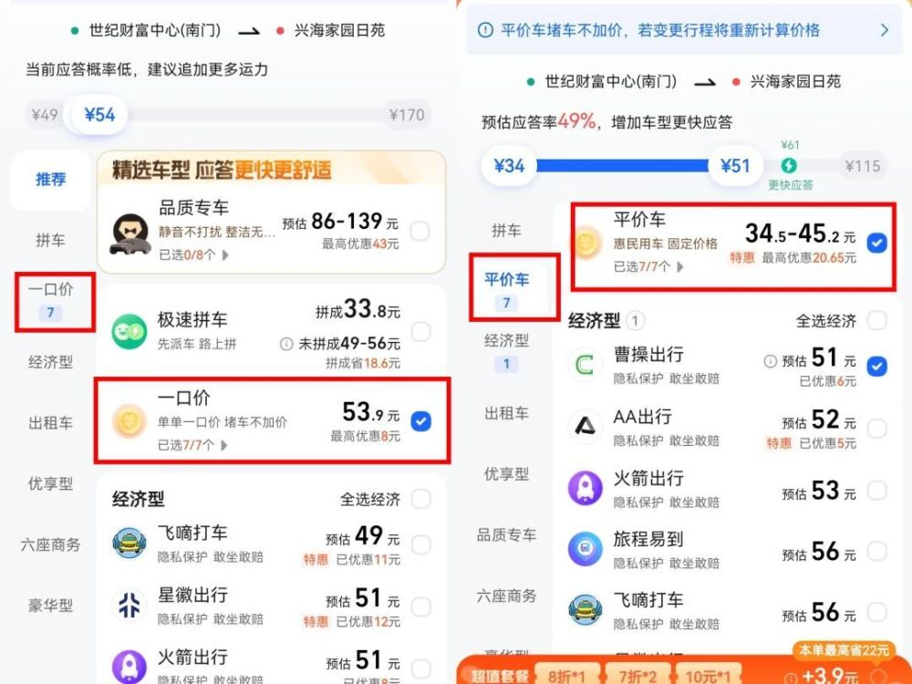
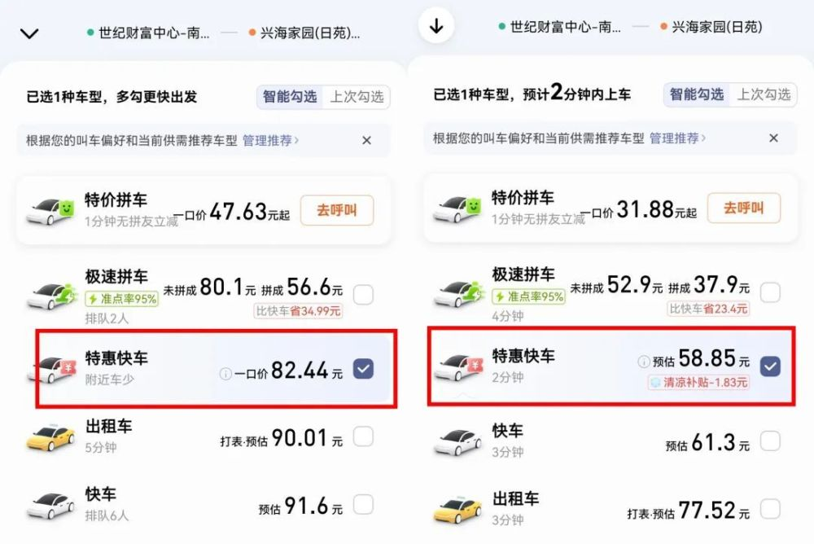
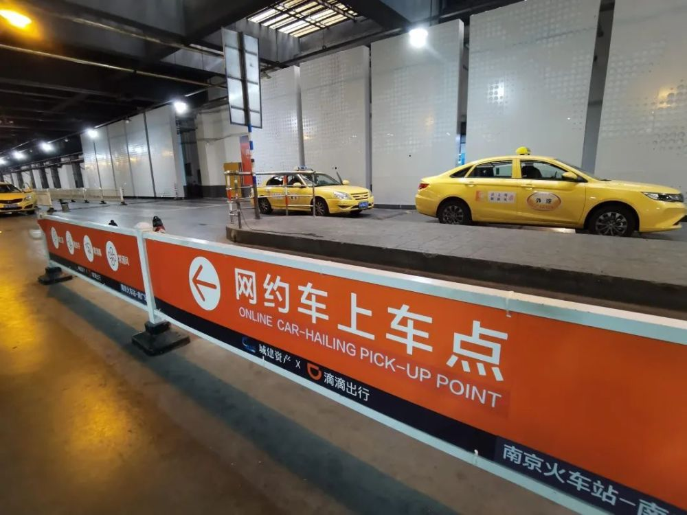

# 网约车司机，困在“一口价”里

司机苦“一口价”久矣

“抱歉啊，忘了关‘一口价’的接单功能了。麻烦您能不能取消？”网约车司机从后视镜看了看坐在后排的乘客周辉，略带歉意地说道。

两个月前的北京国贸，晚上8点，位于CBD中心的写字楼依旧灯火通明。周辉打开高德地图，叫了一辆“一口价”的网约车下班回家。

上车后，车已经开出了两公里，司机的手机后台突然响起接单提示音。周辉还没来得及反应，司机已经在路边停下了，用十分诚恳的语气要求周辉取消订单，因为他刚刚接到了一个更“肥”的专车单。“要不是太久没单，您这个‘一口价’我是不愿意接的，价格太低了，根本就不赚钱，相当于白跑。您能不能从手机上把这单取消了，我要是取消，会被处罚的。唉，现在这活太难干了，去掉油钱、饭钱，没啥利润了……”

周辉告诉「市界」，工作了一天，下班那一刻疲惫感达到了峰值，面对司机近乎无理的要求，他也懒得与其理论，便取消订单下了车。

网约车司机对周辉的态度还算好的。大厂青年张强有一次叫了一辆“一口价”的车，但司机疏忽，没意识到这是一口价订单，等乘客上车后他才反应过来，在随后的20分钟车程里，司机骂骂咧咧了一路，他也只能忍着听。

所谓“一口价”，在不同平台、地区也叫“平价车”“特惠快车”，但计价逻辑一致，都是固定价格，也就是服务商根据起终点信息，预估里程、时长、实时路况，综合报出价格，与乘客最终的付款金额一致。

在各种网约车平台里，能比它更低的，也只有拼车了。面对“一口价”订单，几乎所有网约车司机都抱有一种抵触情绪。

8月初，袁康要到广东出差，便叫滴滴出行的“特惠车”开到北京首都机场。他一上车，司机师傅就对其大倒苦水：“您这一单，我根本就没法挣钱，不亏都不错了。要不是我家住机场附近，顺路回家吃午饭，我都不会接。”

这位司机称，最近滴滴出行正在大力推“特惠快车”订单，给乘客发放大量优惠券，平台上“特惠车”订单越来越多，只要司机在后台没有关闭“特惠车”，系统就会一单接一单地给他派这不挣钱的活儿。

现在提起“一口价”，网约车司机李长蕙还心有余悸。因为忘记关闭后台选项，她有一天接了几十单的“一口价”。“我在二环路绕了一天，都是十几块的小单。跑得我都想发火了！这种单子根本就不赚钱。”

_▲（图源/小红书）_

当然，司机有拒绝接单的权利，但具体次数要看不同网约车平台的规定，有的可以无责取消，有的不可以。

“超出无责取消次数的，每一单取消都会走平台判责，看是司机、乘客、还是平台的责任。如果是司机责任，平台会根据其造成的不同后果，进行不同程度的处理。如果非司机责任，则不会有任何处罚。”一位网约车平台相关人士告诉「市界」，处理方式可能是罚钱，也可能是扣其信用分。

为了弥补“一口价”订单的利润，有些城市的网约车司机更为极端，在车内贴出提示，不给这类低价订单的乘客提供空调服务，如乘客要求开空调，需要单加钱。

“一口价”该不该取消？

面对网约车司机的吐槽，近期上海、武汉、合肥等多个城市对“一口价”模式提出新要求，前几日，市场又传来“杭州将责令网约车公司（平台）下线‘一口价’‘优惠价’等产品”的消息。

看着监管力度的变化，网友们关于“一口价，到底该不该取消？”的讨论甚嚣尘上。

支持取消的一方，以司机为代表，他们给出的理由是“一口价”订单的安全隐患太严重。

“开一个小时是这个钱，开半小时也是这个钱，这会导致司机想方设法尽快到达目的地、结束订单，会导致超速超车、抢黄灯等各种行为，发生交通事故的概率大大提升，这也是我自己亲身体验过的。”一位杭州司机表示。

但作为网约车市场另一群参与主体——乘客，与司机的悲喜并不相通。

有乘客表示，打“一口价”不只是因为价格低，而是因为这样可以避免司机绕路和随意加价；还有乘客对司机开车快不以为意，反倒觉得不用担心对方故意磨蹭，赚时长费。

8月初，玲珑在深圳打车，“一口价”订单刚发出，突然天降大雨。她等了5分钟仍没有司机接单，高德地图页面跳出弹窗，称附近2公里内有出租车司机可以调度，打表价格约为43元。

她想都没想就选择了拒绝，“‘一口价’只要二十几元，反正我也不赶时间，宁愿多等一会儿也不想多花20元。”

几分钟后，还是没有司机接单，平台再次跳出附近有出租车司机可调度的弹窗，价格还是四十多元，玲珑又一次拒绝了。又等了5分钟，玲珑终于等到了“一口价”司机，花了不到30元打车费顺利到达目的地。

抱着这种心态的乘客大有人在，虽然平台还提供了经济型、出租车、优享型等多个选项，但便宜的“一口价”才是不少乘客认可的王道。一位深圳的滴滴司机感叹：“很多乘客宁愿多等10分钟，也不愿多花打车钱。”

随着“一口价”该不该取消的讨论声增多，网约车平台压力也大。为减少舆论影响，「市界」注意到，高德地图已将原来“一口价”的位置改成了“平价车”，并在下方用“惠民用车，固定价格”加以说明。

_▲（左：8月3日，右：8月18日，不同时段，高德地图打车页面截图）_

8月上旬，滴滴打车也在特惠快车一栏里，取消了“一口价”的字样，改成了“预估价”。但计价规则显示，特惠快车的行程，仍采用固定价格的计价方式。

_▲（左：8月3日，右：8月18日，不同时段滴滴打车页面截图）_

其实，对于该不该取消“一口价”订单，网约车司机心里也很矛盾。

平台对司机是否接“一口价”订单没有强制要求，接与不接的选择权在司机手里，只要关闭后台功能就行了。但不同城市的多位网约车司机对「市界」反映，现在不接“一口价”的单，他们也几乎接不到别的生意。

因此看似司机有拒绝的权利，但现实逼着其不得不接受“苍蝇再小也是肉”的事实。这背后与网约车司机规模日趋饱和，乘客规模缩水，造成僧多粥少的局面不无关系。

“很多以前的白领、小老板、大学生，现在都开网约车了。”一位深圳滴滴的老司机无奈地说，网约车司机行业就业门槛较低，很多灵活就业人员都把其视为应急或者过渡的职业。

有数据统计，2023年4月，全国网约车司机数量达到了540.6万人，车辆数量达到了230万辆，分别比两年半前增长了一倍多。随着各个网约车平台司机数量增加，多地已经暂停办理网约车车辆运输证。

5月4日，三亚市交通运输局发布通告表示，三亚市网约车运力已趋于饱和，决定暂停受理网约车经营许可及运输证核发业务。7月21日，上海市道路运输管理局宣布，决定暂停受理网络预约出租汽车运输证相关业务。

此外，今年以来，珠海、济南、遂宁等城市也发布了网约车行业风险预警，提醒当地网约车数量已经饱和，行业景气情况逼近警戒红线。

与此同时，全国网约车用户规模不仅没有增长，反而有一定程度地缩水。《2022年度中国移动出行市场数据报告》显示，2022年，国内网约车用户规模为4.37亿人，比上一年减少约1500万人。

网约车平台，战火难休

关于“一口价”该不该取消，市场已经争论许久。在作出回答前，我们需要摸清问题的根源到底出在哪？

国家发展和改革委员会综合运输研究所李卫波博士在接受《中国经济时报》采访时表示，当前“一口价”模式之所以成为焦点，根源在于经济复苏面临压力的大环境下，网约车市场供需失衡导致平台间“以价换量”竞争加剧，政府部门出于维护市场秩序、保障从业人员权益的考虑而主动介入。

以前，因为“一口价”属于平台间竞争行为的一部分，监管部门并未过多干预。

一位网约车行业人士告诉「市界」，早年网约车司机收入高，是企业烧钱补贴的结果。企业一边给乘客发优惠券，使其形成平台打车比巡游车便宜的意识，养成平台打车习惯；一边慷慨地给司机补贴，吸引司机入驻，提高平台的响应效率。

但当网约车平台不再烧钱后，竞争格局趋于稳定，市场便回归到了选票经济的本质，消费者的选择决定了行业的走向。

“早期网约车司机收入高，享受到了初期的红利，但这不具有可持续性，如今收入降低，造成了心理落差，才对‘一口价’不满。”上述业内人士称，“一口价”的初衷是为乘客提供订单的透明性和确定性，没有“一口价”之前，平台因为司机和乘客价格的纠纷，产生过很多客诉。

面对市场争议，8月15日，杭州市市场监管局表示，杭州不会“一刀切”取缔网约车“一口价”，而是要取缔不合法、不合规的“一口价”。

一位网约车平台相关负责人表示，网约车实行市场调节价，需向交通主管部门备案，有关部门说要取缔的“一口价”，其实是指网约车公司（平台）未向交通主管部门进行价格备案。

日前，交通运输新业态协同监管部际联席会议办公室组织多家网约车平台、聚合平台公司开会。各企业纷纷表态，将立即组织排查整改，依法合规开展经营，全力保障乘客和从业人员合法权益，维护行业安全稳定，推动交通运输新业态规范健康持续发展。

在行业人士看来，如果“一刀切”下线网约车“一口价”，可能会引发订单量下滑的连锁反应，这样的风险也需考虑在内。

据「市界」了解，部分网约车平台已就“一口价”订单为司机提供了补偿办法。如“堵车宝”，即按照堵车时长给予司机相应的时长费补贴，在工作日早晚高峰、法定节假日降低抽成比例等等。

网约车行业经历了十多年的高速发展，但近年来却因为市场供需不平衡，平台之间战火不休。如今，行业内外关于“一口价”订单的争论，就是各方竞争带来的直接后果。

 _▲（图源/视觉中国）_

网约车行业的下一步该如何走？

前不久，南京成立了网约车自律工会，把滴滴、高德、享道、一喂等在南京运营的自营平台和聚合平台集中起来。随后在南京交通部门的指导下，各平台开展对严重违规司机的清理工作。

据了解，有900多名南京网约车司机因频繁取消乘客订单、绕路等违规，账号被封禁3到15天不等，同时接受平台的服务再培训。

今年以来，部分城市有关部门对想要入局网约车行业的司机进行风险提醒。8月3日，苏州市交通部门表示，因今年上半年苏州市网约车经营压力增大，提示审慎投资网约车，注意防控个人经营风险。

之后，南京市交通运输局也提示，网约车市场运行情况已经发生变化，市场竞争激烈，驾驶员收益低于预期，提醒拟从事网约车经营服务的企业和驾驶员积极关注市场动态，全面了解管理政策，客观评估经营收益预期，审慎做好投资和从业选择。

（文中受访乘客、司机为化名）

作者 | 刘冬雪

作者 | 田晏林

运营 | 刘 珊

