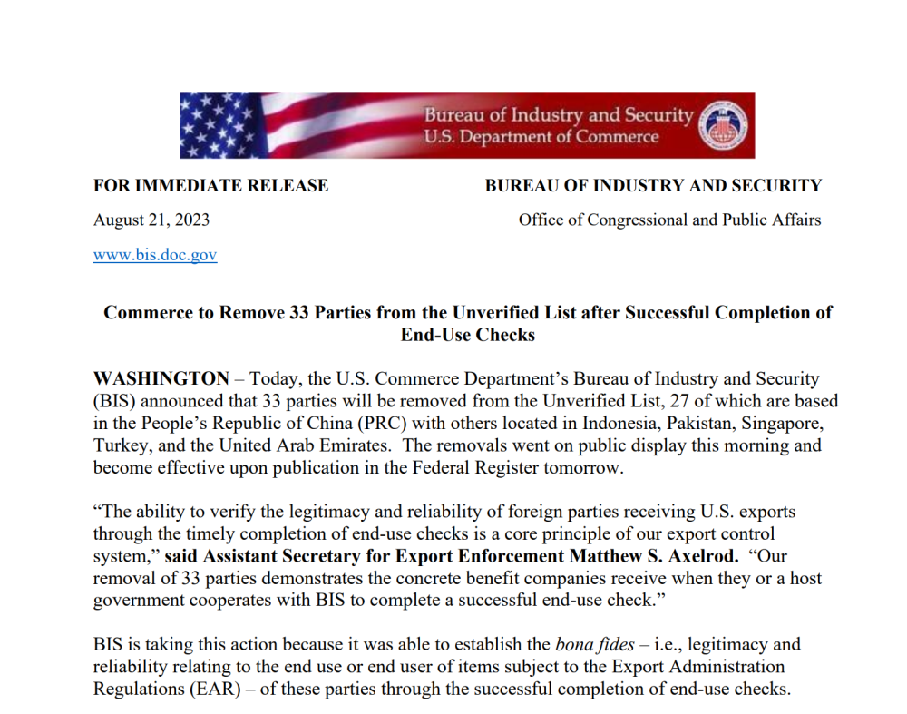

# 美国商务部清理出口管制“未经验证”名单，27个中国实体被剔除

**财联社8月22日讯（编辑 黄君芝）**
当地时间周一（21日），美国商务部发布最新声明称，工业和安全局（BIS）将33个实体从“未经验证清单”（Unverified
List，简称UVL）剔除，其中27个实体位于中国。

**具体名单如下：**

北京普科测控技术有限公司（Beijing PowerMac Company）

北京世维通科技股份有限公司（Beijing SWT Science）

北京众合航迅科技有限公司（Beijing Zhonghehangxun Technology）

重庆鑫钰航科技有限公司（Chongqing Xinyuhang Technology Co., Ltd.）

丹东市食品检验检测中心（Dandong Center for Food Control）

湖南大科激光有限公司（DK Laser Company Ltd.）

广东光华科技股份有限公司（Guangdong Guanghua Sci-Tech Co.）

广电计量检测（北京）有限公司（Guangzhou GRG Metrology & Test (Beijing) Co., Ltd.）

故城县锋鑫钛合金制品有限公司（Gucheng Xian Fengxin Titanium Alloy;Hunan University）

湖南大学（Hunan University）

嘉麟精密光学（上海）有限公司（Jialin Precision Optics (Shanghai) Co., Ltd.）

济南博多数控机床有限公司（Jinan Bodor CNC Machine Co., Ltd.）

丽水正阳电力建设有限公司（Lishui Zhengyang Electric Power Construction）

洛阳微米光电技术有限公司（Luoyang Weimi Optics）

南昌大学（Nanchang University）

南京高华科技股份有限公司（Nanjing Gova Technology Co. Ltd.）

青岛科创质量检测有限公司（Qingdao Sci-Tech Innovation Quality Testing Co. Ltd.）

双翔（福建）电子有限公司（Shuang Xiang (Fujian) Electronics）

Sino Superconductor Technology

苏州超微精纳光电有限公司（Suzhou Chaowei Jingna Optoelectric Co.）

苏州森川机械科技有限公司（Suzhou Sen-Chuan Machinery Technology Co., Ltd.）

天津光谷科技有限公司（Tianjin Optical Valley Technology Co., Ltd.）

TRI Microsystems

无锡恒领科技有限公司（Wuxi Hengling Technology Co., Ltd.）

Yunnan FS Optics Co., Ltd.

云南天合立光电技术有限公司（Yunnan Tianhe Optoelectronic Co., Ltd.）

株洲中车特种装备科技有限公司（Zhuzhou CRRC Special Equipment Technology Co.）

**何为UVL？**

2022年10月7日，BIS对UVL进行了修订，同时也修订了《出口管理条例》（EAR）中实体清单增列的相关规则。

在EAR的第744章第六补充案中，对UVL有着较为详实的规定。一言以蔽之，就是外国实体正在参与或已参与涉及出口、再出口或在国内转让任何受限于EAR的物品的交易，但BIS无法成功完成对这些外国实体的“最终用户核实”（End-
use check），从而无法核实该外国实体的“善意”（bona fides）。

更具体地说，被列入UVL的，都是BIS认定的在美国出口、再出口或在国内转让美国货物或技术交易的参与方，但因为种种原因，BIS无法对这些参与方进行许可前检查和装运后核查，当其他替代性措施也无法进一步进行的时候，BIS就会启动UVL程序。

据了解，UVL并不完全限制或禁止被列入该清单中的主体参与受EAR管辖物项的交易，但当交易中的买方、中间收货人、最终收货人或最终用户是被列入UVL中的主体时，增加了物项供应方（包括出口商和国内供应商）的尽职调查义务和交易负担。

**UVL对企业的影响**

需要注意的是，UVL是一种过渡性的“待观察清单”和“怀疑清单”，即美方怀疑相关实体的出口管制商品最终用途可能损害美国国家利益，但美方并没有充分的证据，因此将其纳入UVL。

因此，UVL并没有完全剥夺其在美国境内的贸易机会。不过一旦美方拥有充分的证据，相关实体也可能被列入实体清单、被拒绝人清单等“制裁清单”中。

不过，鉴于UVL本质上是一种“有罪推定”，被列入该名单的实体，将失去EAR豁免，难免会产生商誉受损，对上下游供应链造成不利影响。

具体而言，美国的出口商会更加严格地对待与这些企业的合作关系，甚至会选择拒绝与被列入UVL的企业合作以降低潜在的风险。企业被列入UVL后应积极采取行动，保障供应链正常运行，以减少经济损失并维护企业明星。

（财联社 黄君芝）

