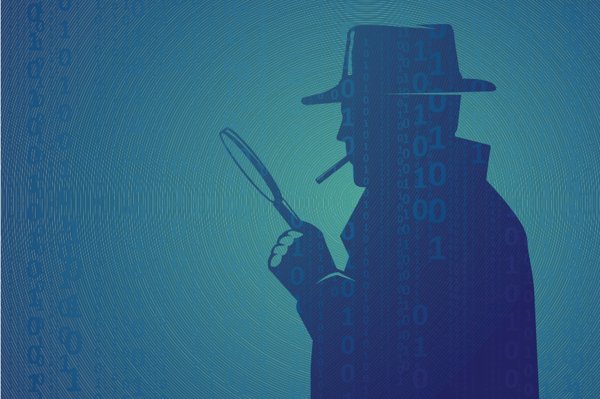

# 除了公职人员，还有谁是他们的“猎物”

请客吃饭、赠送礼品、支付“稿费”……我某国家部委干部，在日本留学期间被美国中央情报局东京站人员渗透，并被一步步拉拢成为间谍。

聚餐郊游、观赏歌剧、情感引诱……我某军工集团工作人员，在意大利留学进修期间被美国中央情报局罗马站人员渗透，对对方产生心理依赖，步步坠入间谍网。

近段时间，国家安全机关接连破获美国中央情报局间谍案，引发广泛关注。

（一）

细数起来，这样的案件并非孤例。

近些年，境外间谍情报机关尤其是美国中央情报局针对我国的情报渗透活动越来越猖獗，可谓无孔不入。有条件接触国家秘密的公职人员、退伍军人、国防科研单位人员、留学生，乃至普通的军事发烧友、军事基地周边居民都可能是他们的目标。

黄某是一个潜藏了长达17年的间谍，被抓获前，她是云南省某省直机关工程师。2002年，黄某赴境外留学攻读硕士学位期间，认识了一名看似风度翩翩、温文尔雅的男子。为了这一出轨对象，她还把在政府部门工作的丈夫也拉下了水。

2011年，某军工科研院网络管理员陈伟“偶遇”了一名自称彼得的外国人，在高额报酬的诱惑下，开始向对方提供情报信息。期间陈伟也曾心生退意，但彼得却以此前提供的情报为把柄对其进行恐吓要挟。被抓获时，陈伟已向对方泄露5000多份内部文件。

2020年4月，在辽宁大连务工的赵某找到了一份帮助规划设计师叶某拍摄城市风景照片的“兼职”，本以为是钱多活少的美差，结果对方布置的任务不断加码，要求其拍摄港口中停留军舰进行维护的照片。幸好赵某及早醒悟，才没犯下大错。

不难看出，在这场没有硝烟的暗战中，金钱、美色、威胁、恐吓，全部都是渗透、拉拢、引诱、策反的手段，直到把“猎物”拉进精心编织的罪恶之网。

（二）

“我们撒谎、我们欺骗、我们偷窃。”

多年来，美国情报部门一直是美式霸权背后的黑手。美国打压竞争对手，乃至策动一场又一场战争、政变、暗杀，都少不了他们的操作。

而就针对中国开展大规模情报活动，美国倒也毫不掩饰。2021年10月，美国中情局（CIA）局长伯恩斯对外宣称，他正在机构内部建立一个专注于中国的重要组织“中国任务中心”，以便“统一中情局的对华工作”。到了今年，美国中央情报局更是叫嚣，美在华情报网络重建已取得进展，正努力构建强劲的人力情报收集能力。

美国对华情报窃密无休无止、无孔不入，我们尤须提高警觉、保持清醒。尤其是随着科技的发展和新业态的不断出现，比起冷战期间“派间谍”的传统方式，现在刺探敏感信息的手段更便捷、更多元。

比如，由于成本小、收益大、无差别、全天候、更隐蔽等特点，网络正成为间谍活动新的主战场之一。

有报告显示，美国中央情报局长期在世界各地秘密实施“和平演变”和“颜色革命”，通过向冲突各方提供加密网络通信服务、断网通联服务、集会游行活动现场指挥工具，以及研发软件、“反审查”信息系统等方式，持续进行间谍窃密活动。

（三）

面对新情况新挑战，必须时刻绷紧国家安全这根弦。

就我国来说，从修订后的《反间谍法》正式施行，到呼吁反间防谍需要全社会动员，反间防谍的立体防护网正在越织越密。

不过面对中国的亮剑行动，有些人却坐不住了。一些外媒老调重弹，污蔑《反间谍法》对在华外国人、外企造成了所谓“不确定性”，并把“全社会动员”歪曲为“全民抓间谍”。美国国务院更是毫不避讳地出来站台，借机抹黑中国。

每个国家都有反间谍的法律和行动，为什么他们却对中国的做法如此“担忧”？光明正大到中国来、在中国做生意的境内外人士，谁会把自己跟《反间谍法》联系在一起？这时候急不可耐跳出来聒噪，又与自我举报何异？

“谍影重重”其实就在我们身边。

每个普通人都心中有数、擦亮双眼、提高警惕，那些别有用心者就没有空子可钻。

