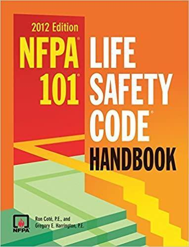
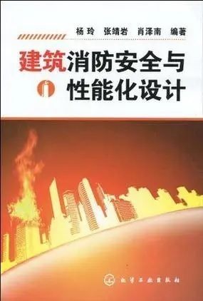
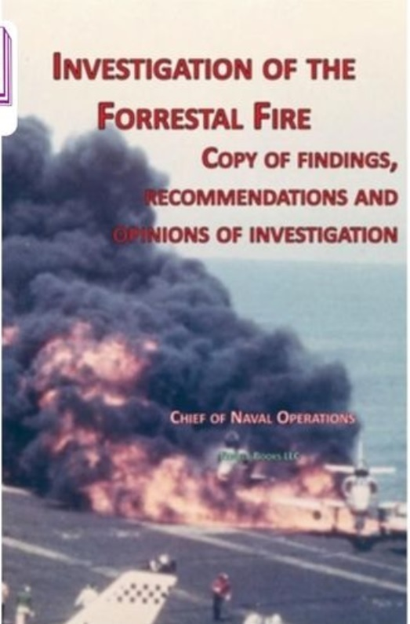

# 高层建筑火灾“零伤亡”背后的消防工程教育困境

几个小时之前，天津爆发了一次高层建筑火灾。有人立即告诉我，我上网一看，又是高层建筑外墙蔓延火灾，仅我知道的最近15年发生过30-50次高层建筑外墙火灾，总数很可能超过100次，上头都不希望宣传这种高层建筑火灾，所以你永远不可能看到一个专家出面公布调查结果。没有专业工作者出面解读，人人都满足于这种火灾较少伤亡的现状，根本想不到背后的消防困境，这里我来推测一下原因。

 _天津火灾_

一看这种建筑，就知道很可能是按照外国消防标准设计的。我国建规落后，缺乏这些针对高层建筑消防的设计细节，即使是依赖国内标准，仍然离不开国外标准提供的细节。你可以国产化消防材料，也可以国产化消防设计吗？不一定。在消防标准的国产化过程中，总有一些不能看懂的内容被忽略，造成了保温材料完整性的缺失。按照木桶的短板理论，系统的安全性是最短的那块木板决定的。每一个标准都有核心的思路，国外标准的思路是安全等价性（随时掌控不低于最低安全水平），国内标准的核心思路是合规（达到标准提供的最低安全水平即可），而为了合规，就需要大家都能看懂，意味着“合理”的简化。而这个“合理”简化过程是不容易把握的，因为你不知道原作者的意图。美国大部分消防从业者也经常看不懂标准的内容，所以在标准的修改过程中，还需要一个NFPA联络官来解读每一条标准的来源和因果。我国标准缺乏这个共建共识的标准制定过程，所以经常让人看不懂也是正常的。比如，那些消防水压，看上去莫名其妙，你把公制换成英制，就知道他们都是从英制的美国（地球上唯二的两个还在使用英制的国家之一）转嫁过来的。

_几千页的手册，在我国的建规中压缩成几页 ，1/1000的压缩比，要保真比登天还难_

标准是人来执行的。可是我国缺乏执行标准的消防工程师。自从2014年以来，我国的消防工程师的数量与日俱增，可是他们都没有学过消防工程核心四门课：火灾动力学、人群安全设计原理、物性测量和风险分析四门课的专业学习，充其量不过是“合规”的消防技术员，相当于美国的CFPS
(Certified Fire Protection
Specialist)。所以，当执行者看不懂设计意图的时候，执行效果必然会打折。注销考试是一个指挥棒和杠杆，当所有的教学资源都围绕这个杠杆进行投入的时候，中国永远也诞生不了真正的消防工程师。举一个例子，上海的英国公司奥雅纳是著名的消防设计和咨询公司，他们发现招聘一个懂得FDS的学生在国内基本招不到，只好从全球招募，最后从美国找到愿意归国的中国人。该软件是国内每一位消防毕业生都会使用的软件，但没有哪一家高校能够教出符合西方标准的Fire
Modeler。是中国人不聪明吗？非也，是指挥棒偏了，是不重视消防工程的后果。按照农耕文明的避免风险的教育思路，拿消防技术员当消防工程师用，结果必然会发生“一知半解”的结果。至少在消防工程领域，能够对接国外教材的教材，一本也没有。至少在消防教育领域，能够开出完整消防工程课程的高校，一家也没有。

 _性能化是个好东西，要求建筑设计施工管理等每个环节都懂性能，这个就难了_

性能化消防设计，也是一个被炒热的概念。性能化设计，来自土木专业，今天建筑的结构设计，都是性能化的，负荷多少，预先知道，才能量体裁衣。但消防设计过程的性能化，国内的大学消防专业很少能够涉及，因此达不到性能化的水平。性能化设计的优势在于，可以绕过那些标准的僵化要求，达到降低安全裕量（成本）而不减少安全水平的效果。所以，性能化设计的主要目的是为了省钱，节省业主的初投资（但通常会增加业主的管理费用）。性能化设计的理念是基于全周期的成本分析，对真正的火灾风险进行深度的量化，因此可以在设计目标内达到预期的安全水平。我国缺乏完整的设计理念，大部分从业者都是把消防当做一个不得不完成的任务，因此不愿意进行深度分析，不能进行风险的量化分析，结果导致各个环节的貌似合规，但不知深浅的偷工减料。在国外，偷工减料还能被监理发现，我国全面缺乏消防工程的合格人才，监理只能按照“简化”的标准进行解读，也没有对设计风险的把控能力，结果为了通过就只能妥协和折中，所以我国高层建筑火灾的调查结果是永远不能见光的，上头不能量化，下面不懂性能，公开了就暴露了中国缺乏消防工程设计人才的现状。这是我国消防工程师考试指挥棒降低带来的后果。很多人自称学过火灾，但光有几个名词，不能深度计算，达不到工程师的要求。解决本来没有路的问题，消防工程师就是开辟道路的人，而且是量化分析的结果，这个国内的高校都达不到这个培养目标，也就不要指责那些挂着“消防工程师”头衔的技术员了，他们距离改造标准的消防工程师水平，还有一套消防工程高等教育计划的完整距离。

_大炮一响重消防，只因无人要面子。_

很多人都对消防工作指手画脚，因为他们没有经历过真正的火灾，看不懂消防工程的内在价值。美国的《SFPE消防工程师手册》是休斯公司组织的，而休斯公司的主要业务来自海军，所以我们的消防理论大部分来自军方的减灾努力。对消防工程最大的推动来自军方，没有军方的减损努力，中国的消防理论永远也不会有突破。一场战争对消防的推动，是和平的中国难以想象的。仅从国内的消防事故就可以推断，中国还没有准备好一场全面的战争。那些纸上谈兵的爱国主义者，最不愿承认的是中国没有打过一场现代化的战争，在血淋淋的战场损失面前，我们终于会认识到自己的消防水平是多么的薄弱和落后。
**真理在大炮的射程之内，安全在大炮的推动之下**
，满足于火场没有伤亡，最后只能一遍遍接受重复不断的损失。我们都在耐心等待中国重视消防工程教育的那一天。和平的中国永远也不会重视消防（袁世凯之前中国600年无消防，消防工作不符合和谐社会的需要），大炮一响就会了，期待那一天早点到来。

