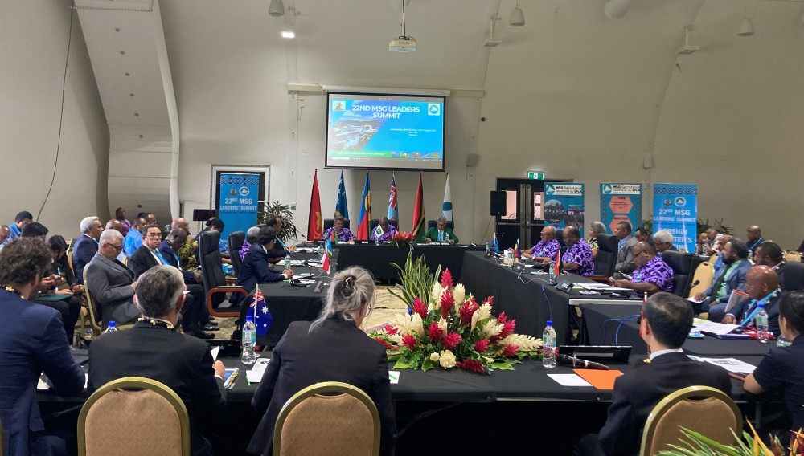
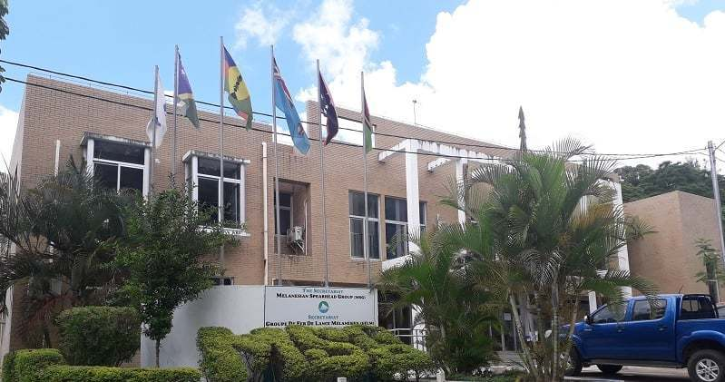

# “中美竞争日渐激烈”，南太岛国领导人计划宣布中立

（观察者网讯）据路透社8月22日报道，四位太平洋岛国领导人当天飞抵瓦努阿图首都维拉港，出席23日举行的第22届美拉尼西亚先锋集团（MSG）领导人峰会。作为东道主，瓦努阿图副总理马泰·塞里玛雅日前发表讲话称，MSG领导人正考虑建立一个“和平与中立地区”。

报道称，瓦努阿图、巴布亚新几内亚、所罗门群岛、斐济四国领导人以及新喀里多尼亚执政党“卡纳克社会主义民族解放阵线”（FLNKS）领导人将参加为期两天的会议。在中美之间愈发激烈的地缘政治竞争之中，这些南太平洋岛国领导人希望宣布“中立”立场。

瓦努阿图副总理塞里玛雅透露，与会各国领导人有意宣布建立一个“和平与中立地区”。他于22日在《瓦努阿图每日邮报》发文称，各国领导人将考虑“有关MSG地区和平与中立的拟议宣言，旨在推进MSG安全倡议的实施，以解决MSG地区国家的安全需求”。

一名瓦努阿图官员也告诉路透社，预计峰会将通过一份中立声明。

这五个太平洋岛国都位于南太平洋的战略要地，如今已经成为地缘政治竞争的中心之一。五国之中，所罗门群岛在去年4月与中国签署了安全合作框架协议，瓦努阿图在去年年底与澳大利亚签署安全协议，巴布亚新几内亚则在今年5月与美国签署了防务合作协议。

路透社提到，在愈发激烈的地缘政治竞争的影响下，作为峰会东道主的瓦努阿图刚刚经历了一次“政治危机”。该国反对党担心，中国是瓦努阿图的基础设施建设的主要贷款方，与澳大利亚签署安全协议可能损害瓦努阿图与中国关系。

在反对党领袖、前总理拉夫曼的领导下，瓦努阿图反对党在本月初向议会提交了不信任投票动议，寻求弹劾总理卡尔萨考。8月16日，动议在瓦努阿图议会获得26票赞成、23票反对，未能满足罢免总理所需的绝对多数同意（27票）。卡尔萨考以一票之差勉强挺过危机。

针对南太岛国面临的“站队”问题，MSG总干事伦纳德·洛马21日表示，地缘政治竞争正促使该地区国家“选边站”，但这种做法不能保护美拉尼西亚国家的利益。“有些人想要说服我们，在地缘政治竞争中站队有利于我们的利益。请允许我补充一下，我倾向于暂缓这一问题，因为站队其实并不符合我们的最佳利益。”

MSG于1986年在巴布亚新几内亚成立，旨在推动美拉尼西亚地区的去殖民化和独立运动，在美拉尼西亚人民和社区之间构建更强大的文化、政治、社会和经济联系。2007年，中国援建了MSG位于瓦努阿图的总部大楼，该大楼在2008年5月正式启用。

近年来，以美国为首的西方国家寻求加强对太平洋岛国的影响力，鼓吹“抗衡中国影响力”。7月26日，美国国务卿布林肯访问汤加，一边宣称美国不要求南太平洋岛国“选边站”，一边又以所谓的“经济胁迫”等说辞挑拨对华关系。

美国国防部长奥斯汀则在7月27日访问巴布亚新几内亚，重申美国政府对巴新主权和自治的承诺。他声称，美国不寻求在巴新建立永久军事基地，华盛顿的目标是要“提高巴新防卫和保护利益的能力”。

美国《华尔街日报》分析称，在中国与所罗门群岛达成安全协议之后，美国产生了“越来越强烈的紧迫感”，意识到需要尽快与太平洋岛国建立“更紧密的联盟关系”，“美国想通过加强与太平洋地区国家的接触，抗衡中国日益增长的影响力。”

《华盛顿邮报》也指出，美国在冷战结束后基本上放弃了南太平洋地区，但如今，“华盛顿担心北京哪怕在最微不足道的国家都能取得胜利”。

对于美国政客和媒体鼓吹“影响力竞争”，中国外交部发言人毛宁在7月27日的例行记者会上表示，太平洋岛国不是任何国家的“后院”，中国也没有兴趣跟任何国家比拼影响力，或者是谋求所谓的地缘存在或者势力范围。希望美方能够真心实意的帮助太平洋岛国发展，帮助有关国家实现发展和稳定。

**本文系观察者网独家稿件，未经授权，不得转载。**

