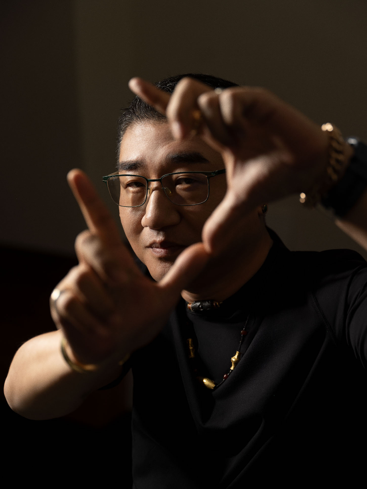
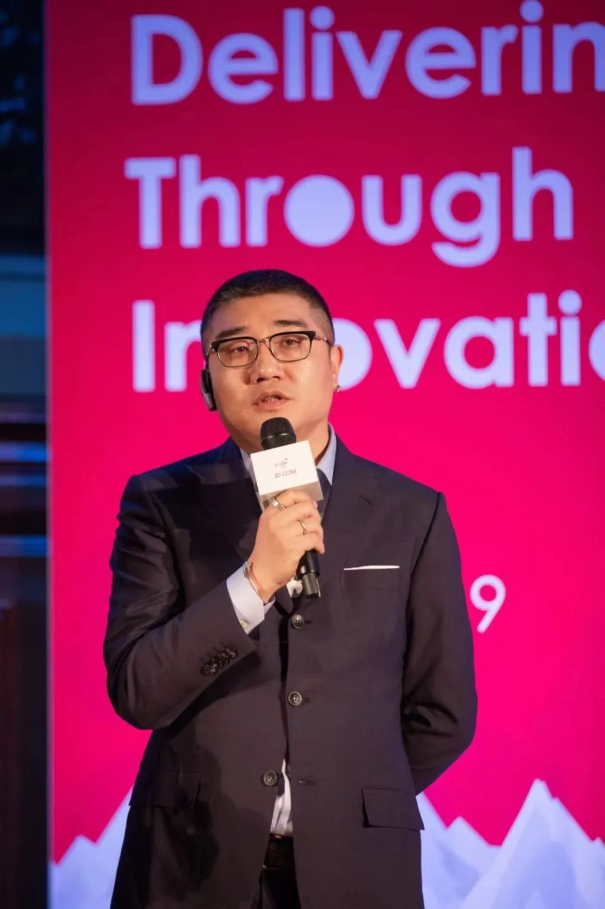
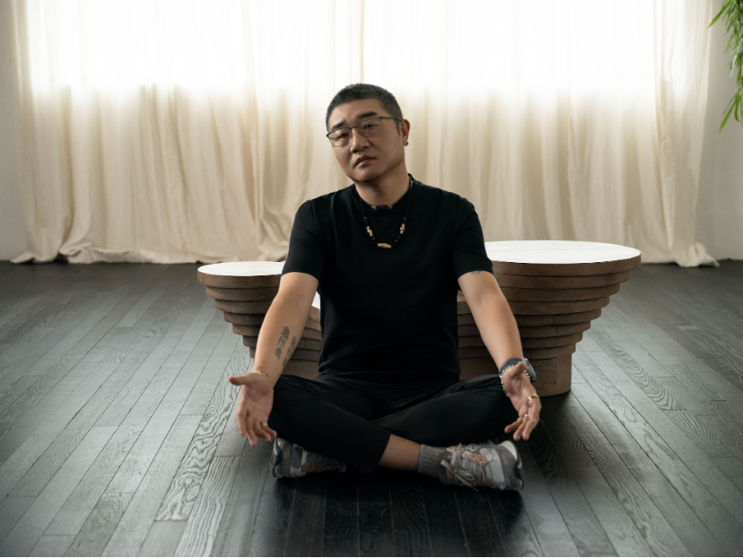
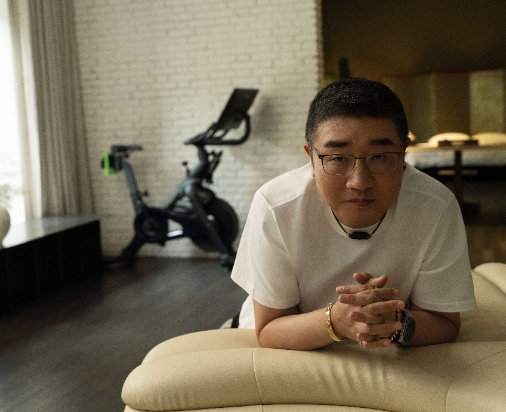
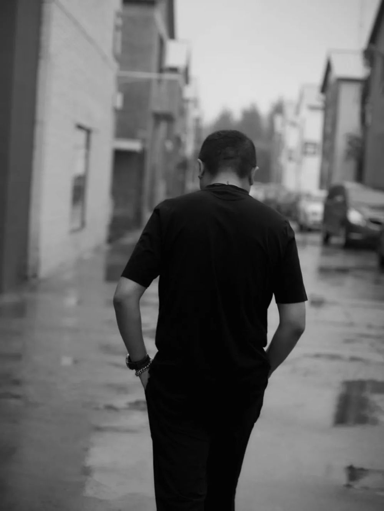
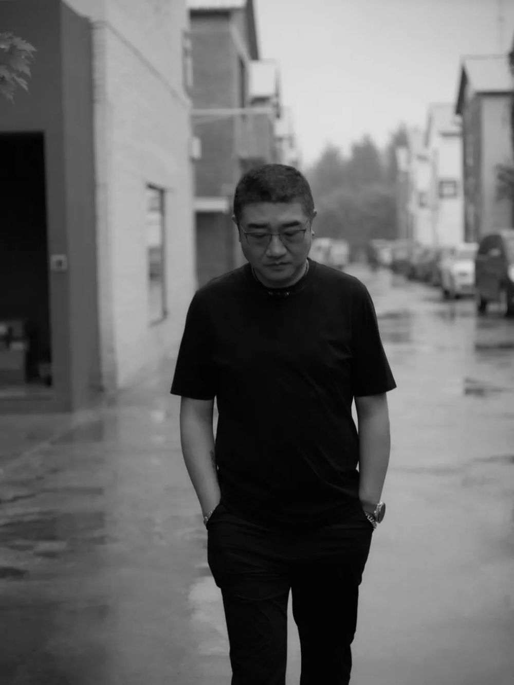

# 一个天蝎座的CEO决定退休

**划重点**

  * _1_ 40岁的时候我就已经想好了，如果有一天退休，我要去做那些曾经想干没有干，想学没有学的事情。第一个想学摩托车，第二个想系统性的学做饭，第三个想学吉他。
  * _2_ 我退休之后，第一不可能去任何公司打工，毕竟我对京东的感情太深了，而且也有诸多不便；第二我也不会去创业，要创业我早创业了，这个问题我在15年前就想明白了。
  * _3_ 我的时间观念非常强，特别不喜欢临时被安排事情，我希望把所有的东西都提前安排好，我把自己一天的24个小时拆成48个半小时，以半个小时为单位。马斯克说他是以5分钟为单位的，我确实做不到。
  * _4_ 这么多年下来，能让我找到平衡的，一个是音乐，一个是足球，还有就是看书，看剧，看电影。40岁后我才知道最难的是自处。
  * _5_ 三个纹身其实跨了十几年，第一个纹身是我的星座，第二个纹身是我家人的名字，第三个纹身是很多年前看到的两句话，“若无所畏，便无所谓，若无所具，便无所惧”，我特别喜欢。

京东前CEO徐雷退休两个月后，我们和他聊了聊退休后的生活状态、业余爱好，也回顾了他在京东的职业生涯。作为一个坚定的互联网原教旨主义者，这位从业20余年的互联网老兵如今选择淡出互联网。

今年5月11日，京东集团在港交所公告，徐雷因个人原因将退任公司首席执行官兼执行董事职务。在任职京东CEO一年零一个月后，外界认为京东即将迎来“徐雷时代”，这位“二号人物”却令人意外地退休了。当天，徐雷在朋友圈分享了一首Bon
Jovi的《It's My Life》，这首歌表达的是追求自我的勇气。他说：“谢谢大家，请祝福我，也祝福所有的人。”

京东是徐雷职业生涯最重要的舞台，也是他巨大声望的来源。他在2009年正式加入京东，负责市场营销。两年后出走，出走两年后又回归。在他的主张下，京东打造出了与“双11”分庭抗礼的消费符号“618”。那年徐雷40岁，收获了“618之父”的头衔。2018年京东股价大跌，经历了“至暗时刻”，作为“二号位”的徐雷扮演了救火队长的角色，为一艘巨轮重新校准了航向。

接手零售业务原本并不在徐雷的人生规划里。那会儿他的角色是京东集团CMO，徐雷心里清楚，再往上，他就很难做自己了。

最后为什么要接？故事是这样的：一天会议结束，刘强东找徐雷喝了顿酒，两人谈了好几个小时。最终，徐雷答应了兼任京东零售集团的轮值CEO，“因为组织需要你”，他平静地说。

在京东内部，徐雷是少有的可以和刘强东直接争论的高管。另一个故事是，2009年京东去北戴河团建，玩炸金花时，刘强东每一轮都押上所有的钱，把大家都吓跑了，只有徐雷陪他斗到了最后。徐雷升任京东集团总裁时，刘强东曾在内部放话“谁不服徐雷，就是不服我。”2022年4月，最后一次晋升，徐雷接替刘强东担任京东集团CEO。

这个职场打怪升级的故事在今年夏天戛然而止。

徐雷身上兼容了两个矛盾乃至相悖的特质。一方面，他是一个计划性很强的人，最讨厌别人迟到，不喜欢临时被安排，会提前一周确定时间，每天遵循严格的日程表，就算天上掉下来个大馅饼，他也体会不到那种“意外之喜”，因为那不在他的可控范围内。徐雷的一天不是24个小时，而是48个“半小时”。上班时是这样，退休了依然如此。

在与徐雷的谈话中，“组织”和“规则”是一个高频词。这与他的家庭背景有关，徐雷出生在一个军人家庭，从小生活在军队大院，他很早就知道服从组织的重要和必须。

另一个徐雷则是感性的，内省的，需要独处，更需要情感的释放。众所周知徐雷有两大爱好：摇滚乐、足球，这次，徐雷告诉我们，他还是个影迷，曾经在台北两天看了7部电影，也曾在《黑客帝国》第三部上映时在影院观看了三部连映，跟过节一样开心。

徐雷认为，军队大院出来的孩子会走两个极端，要么特别顺从，要么放飞自我。他可能两者兼而有之，但同时，军队大院的孩子底层重视的是规则，只是外面表象不同罢了。

这一点在徐雷的装扮上体现得十分明显。作为企业高管，他讨厌西装，热衷于潮流服饰，纹身，打耳洞，戴金属戒指和手串，穿带翅膀的潮鞋，被视为商业世界的另类。他参加瑞士的达沃斯会议，所有参会的人都不打领带，看见可口可乐的CEO带一串黑曜石手串，深感认同。

“退休”两个月后，我们在徐雷所住的小区见到了他。这是徐雷宣布退休之后首次接受媒体采访。

谈话在32层一间宽敞的会所内，面对一排明亮的落地窗，视野极佳。他整个人看起来很放松，穿了一件Pink
Floyd的文化衫，这类衣服他买了一大堆，上面印的都是他喜欢的摇滚乐队和电影剧照。左手手腕上叠戴着一块手表和一条金属手链，右手戴了一只金色手镯。这些饰品早都不是四五年前的了，“在不同阶段会根据心态的变化做些适配”。他说话时语速很快，条理清晰。

还要再过几个月，天蝎座的徐雷才会迎来自己的49岁生日，远未到退休年龄。但他的确不再年轻了。他不再穿潮鞋，舒适开始取代时髦，成为重要的消费决策因素。他也不再踢球了。以前他每周都会踢一场球，去年他把足跟腱踢断了，躺了一个半月，又坐了两个半月轮椅，之后每周都要进行规律性的康复运动。那是上海疫情最严重的时候，徐雷就在病床前带领团队做抗疫救援。

徐雷说，自己从来都不怕站在聚光灯下。他的座右铭是“若无所谓，便无所畏，若无所具，便无所惧”，很多年前他偶然看到这句话，特别喜欢，后来就纹在了手臂上，“无所畏，无所谓”，提醒自己做事情时不要束手束脚的，太在意。

但如果有选择，徐雷并不愿意出现在舞台中央，接受所有人的审视。能在台下，最好，必须在台上，那他更愿意站在舞台侧面。

以下是与徐雷的对话。

**“不可能去任何公司打工，**

**也不会去创业”**

**GQ报道** ：正式退休从哪一天开始？

**徐雷**
：5月12号香港开完董事会以后，工作上我就已经全都放掉了，后来我基本上没有去公司开任何会议了。但要从身份角度来说，真正不再是京东的员工了，6月30号是正式的last
day。

**GQ报道** ：退休是出于个人选择还是形势所迫？

**徐雷**
：原因其实无所谓，就我此时此刻的状态来说，我觉得挺好的，这么多年工作强度和压力都太大了，自己的身体确实需要休整，这个状态再持续下去的话对我的健康很不利，到这个岁数，还是要做一些取舍判断，想明白自己到底想要什么。

**GQ报道** ：你的身体还好吗？

**徐雷**
：我身体一般，2014年11月确诊了二型糖尿病，完了以后，2018年底开始，睡眠在高度压力的情况下，每天晚上都得吃褪黑素。现在网上流行的“减肥针（皮下注射的降糖药物）”，我都打了三年了。

最近通过休息调整，学习高尔夫以及在家进行一些居家运动，现在睡眠都好了，华为手表给我打90分，以前都是70多分，真的挺好的。

**GQ报道** ：最近这段时间是怎么过的，还有严格的时间表吗？

**徐雷**
：有非常严格的时间表，早上8点钟起床，晚上10点半上床，基本在11点到11点半之间就睡了。每天会安排一些事情，比如有不同的人约着见面、聊天，也有时间看书、看剧。

以前我比较排斥非必要工作性的社交，基本上一个月也就四到五天不在家吃晚饭，现在退休了，反而是能有四到五天在家吃晚饭就已经不错了。退休以后，很多人找我聊天，没有商业上的利益纠葛，我也希望去了解一下大家不同的模式和状态，挺放松的。

**GQ报道** ：突然没有工作了，你适应吗？

**徐雷**
：没有工作对我来说是适应的，但是变成个社会人，变成一个灵活就业人员（笑），这是我从22岁大学毕业以后没有经历过的事情，还要选择缴社保的基数。从生活状态、时间安排的角度，这有什么可不适应的？

**GQ报道** ：你对退休之后的生活有什么规划吗？

**徐雷**
：我很清楚，在一个关注度非常高的行业、企业和岗位上，你不可能待很长时间。40岁的时候我就已经想好了，如果有一天退休，我要去做那些曾经想干没有干，想学没有学的事情。

第一个我想学摩托车，我真的在七八年前的时候差点就去买哈雷摩托车了，如果当时买了的话，从投资角度会比较好，那个时候京A摩托车车牌才11万，现在据说超过40万了。我喜欢那种自由的感觉。但是有了孩子、家庭以后，再加上北京的交通管制，可能不太适合。而且我还没有考摩托车驾照，所以那个时候没有干。

第二个想干的事情是想系统性的学做饭，我从小就特别爱做饭，四岁半就会生火焖米饭了，小学二年级已经会炒菜了。我喜欢做菜，只不过都是野路子，我认为还是要学一些科班的技能。

第三个就是想学吉他，我喜欢音乐，很小的时候摸过吉他，简单地练了几个和弦，那个时候确实没有时间，没有老师。但是摇滚乐队里面我最喜欢的是吉他，身边有很多音乐人弹吉他，我特别羡慕，觉得如果你会弹吉他，自己一个人放松地扒拉两下，是一件特别舒服的事情。

我家里有好多朋友送的吉他，有一些是属于收藏型的吉他，但是我发现我想学吉他的时候这些人都挺忙的，现在都接活天天演出去了，我又不可能跟小学生一起上吉他班。

这都是自己曾经想干的事情，但是现在想起来呢还是有点难度的，至少到今天为止还没有去操作。短期来说就是调整一下自己的身体状况和心态。

**GQ报道** ：可以把这段时间看成是你职业生涯的缓冲期吗？

**徐雷** ：我更愿意理解为，从整体上来说是退休，但是不排除未来会去做一些适合自己做的，看得懂的，并且喜欢参与的事情。

为什么我现在特别愿意跟不同的人聊天？我是觉得现在整个经济的这种不确定性，市场和消费者已经发生变化了。跟不同行业的人聊他们行业的情况，能学到很多不同的东西，更清楚未来几年里，该用什么眼光去看不同的行业，自己有没有可能在这里面（找到）感兴趣的、好玩的事情。

**GQ报道** ：你可能会换一个赛道，还没选好哪个赛道。

**徐雷**
：此时此刻，我更愿意看看线下的、体验的、互动型的行业。疫情这三年，确实对我们的经济压力会比较大，大家因为对收入预期不足，所以消费信心不足，消费力不强。但是仔细看消费者，尤其是00后的消费者，很多人是不太愿意考虑买房甚至结婚这些事情的。他们没有存钱的习惯了，储蓄力比较低，同时他们的消费结构也发生了变化，把钱更多地花到了解决社交、避免孤独的互动型、体验型消费上。不能因为年轻人以前在一件事上愿意花很多钱，现在在这件事上不愿意花钱，就认为他不愿意花钱了，我觉得储蓄力说明了一切。至少目前看起来我不认为这是一个短期的变化，很可能是一个时代的趋势，八到十年吧。这么看市场的话，你会发现有些市场还挺有意思的。当然半年到一年半左右的时间我觉得还看不太清楚，还是要多看看。

**GQ报道** ：你会离开互联网行业吗？

**徐雷**
：我不知道，大概、可能跟互联网关系不会特别大。说起来有点伤感，我是一个互联网原教旨主义者。我总是想起20多年前刚刚放弃体制内的工作进入互联网的时候，是凭着对互联网那种自由、平等、分享的氛围的热爱。但是到今天，你会发现互联网上越来越不平等了，有的人是大V，有话语权，很多国内外的企业都会设置壁垒，还有真真假假的问题，充满了戾气。这个行业发生了巨大变化，已经不是我当年愿意抛开所有东西去加入时的样子了。今天作为一个已经退休的人，我更愿意关注一些非互联网的行业，看看他们的变化是什么，互联网以及数字化对这些行业的启发、改变。

所以我退休之后，第一不可能去任何公司打工，毕竟我对京东的感情太深了，而且也有诸多不便；第二我也不会去创业，要创业我早创业了，这个问题我在15年前就想明白了。如果你要做个创业者，有这么多兄弟愿意跟着你去干，你要为他们的生和死去负责。我可以把我的生和死放进去，但我不愿意为其他人的生和死去负责，所以这也是我尊敬面对九死一生依然前行的创业者和企业家的原因。

从我的性格来说，我觉得把自己照顾好，不给大家添麻烦，投入进去就已经可以了。但是我不排除会做一些自己感兴趣的，并且看得懂的事情。

**“从某种角度讲，我血液里的红色就是京东的红色”**

**GQ报道** ：最早加入京东时，你的心态是什么样子的？

**徐雷**
：2007年5月我开始做京东的顾问，每周去一次，一次两个小时，到年底大概7个月吧，帮老刘组建了市场部。2008年我就歇了一年，当时也有一些公司找我，但我觉得那些公司的工作是重复的，对我来说没有太多的挑战。因为在京东做顾问以后，也观察了一年，觉得这个事挺有意思的，尽管当时不大，非常小。公司不大，人就简单，全都是初始的、创业的一种状态，我觉得挺好，挺刺激的。年底找老刘聊天的时候，我说我想上班了，正在考虑选择哪家公司，他说那你就过来吧，非常简单。

**GQ报道** ：那时京东最吸引你的是什么？

**徐雷**
：京东并不是中国最早做电商的，我在广告公司的时候，当时国内最大的几家电商公司，当当、亚马逊、淘宝都是我服务的客户，但京东跟我以前所认知的中国电商不太一样，它没有用投广告的方式，而是聚焦在3C领域，把价格、服务做得特别好，跟我以前认知的增长方式不一样，我觉得挺有意思的。而且它的决策比较高效。做顾问的时候，经常我提的建议立刻就能落地实施，在我印象中至少得一个月，京东一个礼拜就能够实施，我觉得非常吃惊。

**GQ报道** ：中间有一段时间你离开了。

**徐雷** ：因为一些原因吧，我们选择了分手，后来又回去了，老刘觉得可能我做市场营销更好，后来慢慢不断加很多其他的业务。

我很庆幸，因为热爱加入这个行业，最后选择了这家公司，并没有其他的想法，比如上市。那时候公司很小，钱给得很少，就觉得这是自己喜欢干的事情，投入进去了，确实付出非常多，包括时间、家庭、健康。公司大了，我在这里面成长了，相互成就，没有太多可抱怨的。

但是个人跟公司不可能长长久久，永远都是阶段性的嘛。所以说告别一个阶段，我自己回到一个比较追求放松的状态，也挺好的。

**GQ报道** ：你在京东最满意的成绩是什么？

**徐雷**
：第一个，在京东做营销的时候，我自己还是挺满意的，包括做了大量的营销创新，体系化的建立了营销体系，将京东这个品牌打造出来。第二个，我接手京东零售，把最难的时候给坚持下去了，并且重回了相对比较好的正轨，这要特别感谢当时老板、公司同事的认可和支持。

**GQ报道** ：接手零售CEO的时候，你的第一反应是抗拒，那对你来说是计划之外的事情？

**徐雷**
：我的性格大家应该知道，我是一个挺放松的人。我知道越往上，要承担的东西越多，越来越难以轻松地表达自我，会受限了。最后为什么要接？因为你爱这家公司，同时组织需要你。但从我本人性格来说，我并不是希望不断地往上升，我觉得慢慢地它会让我受到禁锢。所以我连社交媒体都不玩了，我当年在网上评论这个，评论那个，怼天怼地，后来连朋友圈都不敢随便发了。

**GQ报道** ：它压抑了你的个性？

**徐雷**
：我觉得一定是这样的。其实包括所有公司的大老板也一样的，当大到一定程度的时候，他能展现出来的并不是他真正的100%的自我，因为他100%的自我大家是不可接受的。艺术家可能会好一点，但是企业家、商业家都得遵从一个大的逻辑框架和约定俗成的社会认知，最关键的，你很难向公众说清楚这件事你自己和背后的公司、组织是分离的，那件事是一体的。

**GQ报道** ：这是你做出退休决定的原因之一吗？

**徐雷** ：并不是。但这是我非常坦然并且愿意去做出退休决定的一个基础，但不是决定性因素。

**GQ报道** ：你愿意谈谈你跟刘强东的关系吗？

**徐雷**
：首先我很尊重老刘，他具有极强的学习能力，也是一个在当今社会商业价值观非常少坚持“正道成功“的企业家。在一个企业里，我比较尊重一个组织上的逻辑框架。比如我们在讨论一件事情的时候，讨论今天这个仗要往哪个方向去打的时候，我会畅所欲言，讲我的观点。如果大家观点一样是最好的，如果不一样我也会去表达，我要对这个组织负责，我并不会去看任何一个人的脸色去表达。但组织有一定的流程和规范，最终当公司决策下来，要照这个方向去打的时候，尽管那不是你的判断，你也要坚决去（执行）。我是军队大院出来的孩子，我觉得这是非常正常的一套逻辑，所以说并不会出现如果不是我想象的那样，我就不执行，闹情绪，那你干脆就别在这儿干了，对吧。

**GQ报道** : 这是规则的一部分。

**徐雷**
：我更愿意接受的是，平行开放讨论的时候，一定要去表达自己，这恰恰是尊重，是负责。但是一旦定下来走哪条路，不管是不是你的选择，你的职责就决定了你要去把它落地，这是一个成熟的管理者。

**GQ报道** ：你和刘强东之间会有争吵吗？

**徐雷**
：我们之间在工作上有明确分工，老刘是集团董事局主席，把控整体集团的战略和大方向，我还是以具体执行为主。如果说在某些具体事情上肯定也会有分歧，会有讨论，甚至有争执，这也很正常。但我和老刘都是直性子，喜欢畅所欲言，交流的时候都毫无保留。

**GQ报道** ：2018年是你压力最大的时候？

**徐雷**
：从2018年7月中旬接手整个京东零售业务及团队到年底开那三天三夜的会，中间那半年压力非常大，又不能急躁，我需要观察、思考，找到解决之道。因为你站在旁边看到的问题想到怎么解决与你真正做到决策的位置要考虑的资源、节奏、组织承受度、变革成功性是完全不一样的。我知道应该怎么做，我没有通过下命令的方式，而是通过开会的方式，不断地去引导，达成共识，最终大家觉得确实应该这么做。这种达成共识的方式是最难的，相对来说也是成功概率最高的。但在当时，我不知道是不是能够通过这个会，让大家认同，并且重拾信心。

开会前一夜之间我就开始失眠了。

_2020年1月，徐雷在瑞士达沃斯峰会_

**GQ报道** ：疫情对你的挑战大吗？

**徐雷**
：疫情最后的一年半，也是我调到集团的一年半，挑战非常大。那时候每天都有很多不确定的事情发生，今天库房有问题，明天销售受影响，东一榔头，西一棒子，预算怎么去调整，什么业务要继续做，什么业务可能要关停，你需要去做判断。对外还有企业社会责任，节奏和经营压力跟以前是不一样的。大家持续在一个压力特别大的情况下，不能够到公司上班，经常需要在家办公，生活上也会受影响。情绪方面我控制得还好，你会发现所有人都在看你，所以反而会冷静下来。你能判断出来不是就你一家公司，所有公司都会受影响，只不过能不能受影响面最小，并且通过自己的努力获得一些正面的东西。

**GQ报道** ：离开京东，你有遗憾吗？

**徐雷**
：遗憾肯定非常多。如果在某个时间段内，我要是做了这件事情会更好，或者说某个时间段内，如果能让我再继续干到什么时间点会更好，但是并不意味着无数个遗憾最后拼凑下来，你的人生整体是遗憾的。因为遗憾更多来自于事后的反思，因为遗憾的事情往往真的也不可能避免，毕竟还有受限因素。

**GQ报道** ：所以从京东退休，并不是说在这家公司所有想干的事都干完了？

**徐雷**
：那肯定。我换过太多的岗位了，12年，在一个岗位上最长的工作不超过2年半，从这个岗位换到另一个岗位上的时候，原来这个岗位我就已经全部都干完了？干好了？没有啊。每一次变动都会有遗憾。但是没办法，在组织里面，你必须接受组织的安排。

**GQ报道** ：京东在你身上留下了什么？

**徐雷** ：从某种角度讲，可能我血液里的红色就是京东的红色。

**GQ报道** ：怎么理解这句话？

**徐雷**
：京东是我职业生涯最长的一家公司，我付出了所有，包括个人、家庭、健康，我取得的所有成绩，我最大的圈子，最多的同事，都在京东。烙印很重。到现在我还是京东的重度用户，会提很多产品体验的问题给原来的同事。

实际上我升到集团领导才一年半时间，不是第一天就到这个位置的。在这个过程中，外面有很多诱惑，收入啊职务啊，让我离开京东，但我从来没有想过这个问题。这是我一直要去做，把它给做好，并且能实现我很多想法的一家公司。至于说有的时候能够施展，有的时候施展不了，这很正常，企业不是以个人意志为转移的。

**“我会告诉所有晚来的人，我非常不爽”**

**GQ报道** ：你的成长环境是什么样的？

**徐雷**
：我的成长环境比较复杂。很多人误以为我是北京人，按照祖籍，我其实是温州永嘉人，出生地在大西北，小学三年级才到的北京，生活在军队大院，它是一个独立于所在城市社会之外的物理空间，五湖四海的人全都有。

我的父母包括我哥哥曾经都是军人，父母在军校教书的，他们从小对我要求非常严格。军队大院的孩子会走两个极端，要么特别顺从，要么放飞自我。我可能两者兼而有之，但我始终认为，军队大院的孩子底层重视的是规则，只是外面表象不同罢了。

所以我一方面是一个规则的守护者，现有的法律法规，公司的规章制度，我都会遵守。我只看规则，这是家庭对我最大的影响，还有就是永远不依附于任何个人和组织，保持自己的人格独立性。

在规则之外，我不愿意墨守陈规，不愿意用世俗的标准眼光去做事。

**GQ报道** ：这样的家庭环境会对你的性格产生什么影响？

**徐雷**
：我有几个习惯可以跟你分享。第一个我不会因为场面上的情况说违心的话，但是事后做不到。我做不到的东西永远不承诺，我承诺了就一定要做到。在很多场合里面，为了避免尴尬追求和谐，很多人先承诺、默认，但是事后做不到，但我做不到或者不认可我就直接说出来。因为我的表达让你不开心或者对我产生看法，我觉得无所谓。

第二个，我的时间观念非常强，我特别不喜欢临时被安排事情，我希望把所有的东西都提前安排好，我把自己一天的24个小时拆成48个半小时，这不仅仅是工作，包括生活也一样的，我一定不允许周六周日早上醒的时候说今天干什么？在三四天之前我就定下来了。我不能允许说早上醒来以后再决定，走吧，咱们去干个什么事情。

以前在公司，约我基本提前至少一周时间，我的计划性非常强，比如说在公司开会，说咱们今天十点钟开会，我会盯着那个表，只要还有人没来齐，我都等，但是十点钟，秒针一刻不差，我说开始，人我都不等了。

所以我跟所有人约会，我都会问他半个小时、一个小时还是一个半小时、两个小时，以半个小时为单位。前两天我看马斯克的专访，当时就疯掉了，马斯克确实是非常厉害的人。马斯克说，我是以5分钟为单位的，我确实做不到。

还有包括我前面说的，当所有人都认为大家不应该这么做，但是法律法规并没有限制的时候，就我一个人这么做，我也觉得应该是这么做。我并不因为在人群当中我是反着走的时候，我会不舒服。

**GQ报道** ：比如说呢？

**徐雷**
：十几年前我第一次和娱乐圈、音乐圈的人一起吃饭，约好晚上六点半，除了我大家都迟到了，甚至迟到半个小时都算好的。我不会因为他们七点、七点半才来，就后悔自己也应该晚来，不，我认为我应该准时。但是我会告诉所有晚来的人，我非常不爽。但是从此就留下一个印象，大家会认为我脾气非常暴躁。

再举个例子，我纹身其实蛮早的，大概30多岁，但那时候也已经是VP了。我非常清楚，当我做了这件事情，包括打耳洞，可能会在社交网络上被大家评论。但法律和公司没有规定不能纹身，生活中我并不会因为别人的看法去改变，但是当我出席重要的会议，去录影的时候，我会有一个相对得体的装扮，我也会尊重这个场合以及自己背后所代表的公司，但除此之外，我就是我。

**GQ报道** ：过去几年，外部环境非常不确定，你怎么应对？

**徐雷**
：从我的个性来说，我希望所有的事情都在我的可控范围内。如果有不可控的事情突然出现，就算天上掉下来个大馅饼，我也不是特别开心，因为这不在我的计划、规划和想象范围内，心里会有不安。

但是企业经营的魅力就是在不确定性当中找到一条确定性的道路，而且没有任何上帝视角告诉你，这条路100%是对的。在这种情况下，你只能用自己的知识体系、能力、资源去汇总、梳理出一个框架性的逻辑，尽可能把不确定的东西框在自己的思考框架里，让它再往前走，可能又会出现不确定性，每一步都需要把不确定性转化成确定性和可控性的东西。

不可能说不确定就顺其自然，我不太接受这样的逻辑。

**GQ报道** ：你是一个情绪稳定的人吗？什么事会让你生气？

**徐雷**
：以前职位没那么高，我遇到一些事经常会暴躁。后来不知道是岁数的原因，还是身份发生变化以后，自己能慢慢地去控制了，不会立刻表达出这种暴躁。但我在职场里不太会看别人脸色去控制自个儿的情绪，我会把我鲜明的态度表达出来。

举个例子，我跟同事们说过，只要不违反公司的规章制度，在工作当中犯了错，第一次我都允许，有多大的事情我会替大家扛下来，但是同样的错误再犯第二次，我绝对不接受，而且会非常生气。我认为那不是没脑子，就是不在意。大家为什么愿意跟着我一起工作？因为我态度直接，不用猜，而且我会就事论事，跟着我工作几年以后，相信对他们自己的工作习惯有特别大的帮助。

**GQ报道** ：你的职业训练是怎么完成的？

**徐雷**
：2000年，我从烟草行业（体制内）出来，去了联想，在那待了两年半。那段经历对我的职业训练，到今天为止都特别重要。当时联想有16个字的企业文化，其中四个字是“精准求实”。到今天我做事是这样，与人交往也是如此。举个例子，问你还要多久到，咱们经常说还有两分钟，一般都会把这两分钟当作一个虚数，我会告诉你，还有七分钟或者六分钟，这个数字非常严谨。

**GQ报道** ：工作时你每天的安排是怎样的？

**徐雷**
：以前我经常开玩笑说，我是通过开会去挣钱的，我开会是算工分的。刚到京东的时候，每天8点20开早会，我基本6点半就得起床，那时侯我已经工作十多年了，比我工作第一天上班还要早。后来慢慢变成7点钟起床，7点半左右出门，8点半到公司，9点开始一天的会议。如果不出去谈事或者出差，基本就是在公司里开各种各样的会。

我经常会问大家一个问题，假如你今天要开八个小时的会，A是跟同样的人在一起开一个主题的会，B是跟不同的人开不同的会，这两种会，哪个更累？当你问完了以后，你其实就知道这个人的性格以及他是否经历过这种高强度的工作，很多人没法去想象。

**GQ报道** ：对你来说哪个更累？

**徐雷** ：这个答案我不给。

**“很多人有个特别大的误会，认为我特别喜欢说话”**

**GQ报道** ：你的业余时间都是怎么安排的？

**徐雷** ：我有一个说法是“狠狠地工作，狠狠地生活”，可能类似于硅谷他们讲的“work hard，play hard”。

当你在工作上高强度投入之后，也需要找到自己喜欢做的事情和爱好去释放。所谓爱好，一定要花时间或者金钱去投入，最终你一定会得到回报。因为人起起伏伏很正常，开心也好，不开心也好，最难的时候你会发现这些爱好能陪你度过。这么多年下来，能让我找到平衡的，一个是音乐，一个是足球，还有就是看书，看剧，看电影。

DVD时代，我基本上把欧洲艺术电影甚至很多小众电影都看遍了。当年国内有一本非常出色的电影杂志叫《看电影》，我每个月都订。一部电影在筹拍的时候，我就会去了解导演是谁、演员是谁，跟踪中间发生什么样的波折，什么时候定档，比如《指环王》和《黑客帝国》。

《黑客帝国》第三部上映的时候，北京只有一个Imax，人民大学对面的华星影院，华星当天把第一部、第二部和第三部连映，三部下来时间非常长，将近7个小时，每部中间可能有半个小时的休息时间。我从上午开始连看三部，对我来说一点压力没有，不会说坐电影院里边看那么长时间，疯了，对我来说太喜欢了，那就是个节日。还有一次去台北，有两个白天没有事情，正好酒店旁边是电影院，我两个白天看了七部电影，因为有很多电影大陆没法配额引入，那两天醒了以后就去，中午出去吃个卤肉饭，下午继续看，我觉得非常享受。

**GQ报道** ：你喜欢什么样的电影？

**徐雷**
：BBC和《帝国》杂志评选的全球百大电影应该基本上都看过，年轻时我会看很多晦涩难懂的片子，有的一个长镜头就是一部电影，看着看着自己都快睡着了。新浪潮电影，我全都看。我特别喜欢黑泽明，家里收了他自己画的非常小的一幅画。现在相对比较喜欢诺兰。

**GQ报道** ：这些爱好挺花时间的，尤其是在你退休之前。

**徐雷**
：如果我晚上9点到家，花两个小时看一部电影，11点睡觉是很正常的事情。只不过确实后来工作忙，看电影老会断断续续，一会来个信息，一会有个电话，沉浸感特别不好。最可怕的一次，一部电影我看了四个晚上。

时间太碎片了，我就看书。我从小看大量的书，小学一年级看的第一部小说《铁道游击队》，小学三年级看了世界科幻小说之父，儒勒凡尔纳的《神秘岛》，小学看完了人民文学出版社出版的竖版繁体中国四大名著的三本，除了《红楼梦》，《红楼梦》至今没有看，嘿嘿。比如初中某个暑假我特别喜欢日本的推理小说，就会去图书馆看十几本推理小说。到今天为止，我看的书非常杂，小说类的，经济类的，历史类的，人物传记类的，政治类的，甚至网络文学，但就一点，从不看每一年所谓的热门读物，坦率地说，这么多年高强度的工作，其实很容易浮躁，压力特别大，看书能让自己静下来。

**GQ报道** ：为什么会选择这些爱好？

**徐雷**
：我也不知道为什么会选择这些东西。我喜欢北京国安，从94年中国职业联赛第一年，大学一年级下半学期开始就看，三十年只拿过一次联赛冠军，但如果我有时间还是一定会去工体现场看球，经常会被身边的朋友嘲笑怎么现在还有人看中国足球，但我就是爱。我喜欢曼联，现在也踢得乱七八糟的。爱好带给你的并不一定永远是快乐的东西，而是情绪的起伏，失落、高兴、疯狂。

本身我是一个很理性的人，天蝎座，特别注重逻辑，这些爱好反而做了一个适配，所以这么多年下来，工作压力那么大，我还没有抑郁。比如踢球这件事，多巴胺的分泌，踢球的时候完全不用再想工作上的事，进球场一瞬间我还想着工作，想不明白或者觉得压力非常大，但是踢的时候，奔跑起来，喊起来，骂起来，特别舒服。

后来受伤后暂时没法踢球了，就改在家骑动感单车，也一样舒坦。在各类曲风的音乐下踩着鼓点和拍子骑行，能让你暂时屏蔽掉很多东西，沉浸在暴汗和内啡肽里，能把音乐和运动这两种爱好结合在一起的方式，就很适合我。

**GQ报道** ：会有两个你吗，工作中的你和生活中的你？

**徐雷**
：当然会。很多人有个特别大的误会，认为我特别喜欢说话。上EMBA的时候，跟组织行为课的老师交流，我说我不怕发言、说话、沟通，但是如果发言、说话、沟通时间较长，我会觉得能量消耗完了，需要找一个角落静静地待着，老师告诉我，有些人就是通过安静自处给自己充电，但同时有些人是通过群体生活或者讲话来给自己充电。其实我更喜欢静静地待着。

有时候开完一天会，对我来说是极大的消耗，我就想自己一个人听会儿音乐，看会儿书，或者是沉浸式骑行15分钟，就跟充电似的，我又把电给充满了。能量守恒嘛，你得找到一些能让自己平衡的工作方法和生活技巧。但我并不是刻意的，没想到这么多年慢慢就形成了一套相对还能够自处的方式。40岁后我才知道最难的是自处。

**GQ报道** ：穿衣风格也是平衡方式吗？

**徐雷**
：刚进入职场的时候，我也穿西装，当年在联想，肯定要穿西装。后来去广告公司也穿了一段，时间非常短，之后很多年我都不穿西装了。我觉得那个东西像盔甲一样，包上就不是本来的自己了。再后来因为当集团领导，要接触很多大公司的老板，参加政府会议，但我穿西装几乎不打领带，不穿衬衣，里面就是黑T。

以前我参加瑞士的达沃斯会议，一个全球企业高管的峰会，所有参会的人是不穿西装的，我清晰地记着国际五百强的CEO们也有纹身的，可口可乐全球CEO，你能想象吗，他戴一手串！黑曜石的，挺漂亮。如果按照我们的说法，你怎么能当五百强CEO呢，这跟你的工作有什么实质性关系吗？

如果有一天告诉我说，老徐，如果你干了这件事情以后，你就坐不了这个位置，那我宁可不坐。

**GQ报道** ：你的纹身都是什么意思？

**徐雷**
：三个纹身其实跨了十几年，第一个纹身是我的星座。第二个纹身是我家人的名字，包括我老婆和俩孩子。因为孩子出生的时间不一样，跨了很多年，现在看起来像是一体的。第三个纹身是很多年前看到的两句话，“若无所畏，便无所谓，若无所具，便无所惧”，我特别喜欢。有一天我想，那我再纹一个，跟纹身师沟通，他说这话太长了，不好看，最后选择的就是“无所畏，无所谓”，这是我的座右铭。我不想做事情的时候束手束脚的，太在意。

**GQ报道** : 你如何看待公司管理者所处的位置以及它的权威性？

**徐雷** ：是因为你的工作职责导致了你跟别人有职级差，工作之外的时候你就是一个人，是一个个体，这个时候再端着，活到80多岁，你自己都不适应了。

但是如果涉及到公司的时候，比如说对外我代表京东，你侮辱我，你是侮辱京东，比如我要表达好好合作的意向，我的原则是站着做人，跪着做事。做事的时候我可以跪下来，把地把鞋擦干净了，做人的时候，我就是个独立的个体，你跟人家是一样的，别人不能侮辱我，我也不能侮辱别人。

**GQ报道** ：作为一个领导者树立权威是否必要？

**徐雷** ：我觉得权威是来自于你对事情的分析、讲解、逻辑判断和决策上一次次的成功，让大家认可你，而不是因为我在这个职位上。

为什么有的人职场往上走到一定程度就成瓶颈了，他自认为自己跟这个职务高度挂钩了，高度挂钩有好的地方，也有不好的地方，这个不好的地方会把他给吞噬掉。真的很多人是被这个职位给吞噬掉的。

**GQ报道** ：你很警惕这一点？

**徐雷**
：从性格角度我就不可能去发生这件事情。做CEO，做VP，那只是个工作，工作之外我就是一个人啊，我为什么要那样呢？假装自己把自己端着，我觉得太他妈累了。夏天我也会穿着大裤衩、短袖走在马路上，怎么舒服怎么来，当然还是要有一些着装品质品味要求，不讲究、不将就。

后来做集团领导，电梯里碰到很多同事我们都嘻嘻哈哈，开玩笑，很正常，以前都是直接向我汇报，现在可能中间隔了两三个级别，我们见面还一样，依然嘻嘻哈哈，谁还不知道是谁吗（笑），何必端着。

现在我退休了，头上也不再有什么光环了，我就是个灵活就业人员（笑）。以前我的头上有一个大企业的光环，但那不是我个人的光环，今天没有了，我没觉得怎么了，挺好的。

大家想到光环，想的都是亮的东西，但亮的背面是黑暗，太在意那个亮的东西会把内心很多东西给吞噬或者遮挡了。

**GQ报道** ：你没有过所谓的膨胀期吗？

**徐雷**
：特别奇怪的是，我在京东的发展是被推着走的，不是我追逐的，我为什么要膨胀呢。对我来说我一步步基本是被动的，真的是被动的，我做无线业务是被动的，当时公司没有人，老板说那你来做，后来做零售CEO以及集团CEO，都是被动的。

**GQ报道** ：有什么是你特别渴望想做的？

**徐雷** ：如果能让我去做一个偏专业性的东西，不要这么多职务的光环，只是像手艺人，能凭我的专业性去吃饭，我就特别喜欢。

**GQ报道** ：你会重新回归社交网络吗？

**徐雷** ：唉，可能有一天吧。我曾经表达过，公司是公司，个人是个人。尽管我只是想表达个人的观点，人家也会说他是京东的CEO。

现在退了呢，大家会用京东前CEO的方式看我，这个如果不改变，坦率地说，我不想对京东产生任何不好的影响，毕竟我在这个公司里干了那么多年，还是挺爱这家公司的，还有很多的同事在里边。摆脱不了，也没必要去摆脱，幸福的烦恼吧。有时候你希望做自己，但是在社会里没法真正地做自己。但我希望接下来的人生可以做我自己。我在雨中行走，从不打伞；我有自己的天空，它从不下雨。我是徐雷，谢谢。

本文转载自：GQ报道

采访、撰文：杨溪

编辑：李纯

图片由受访者提供

运营编辑：温温

