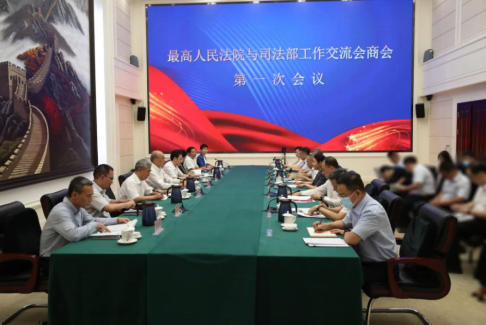
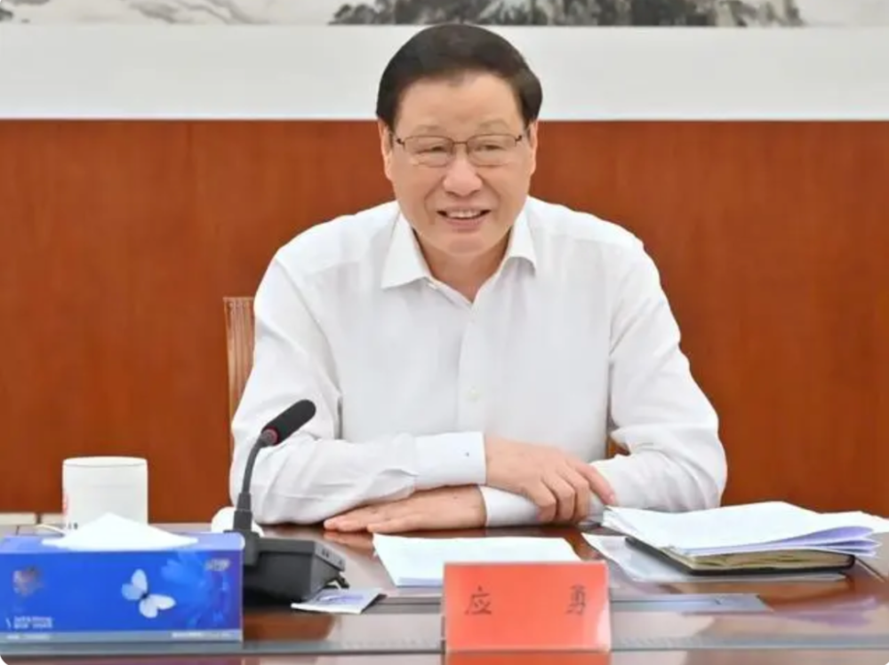
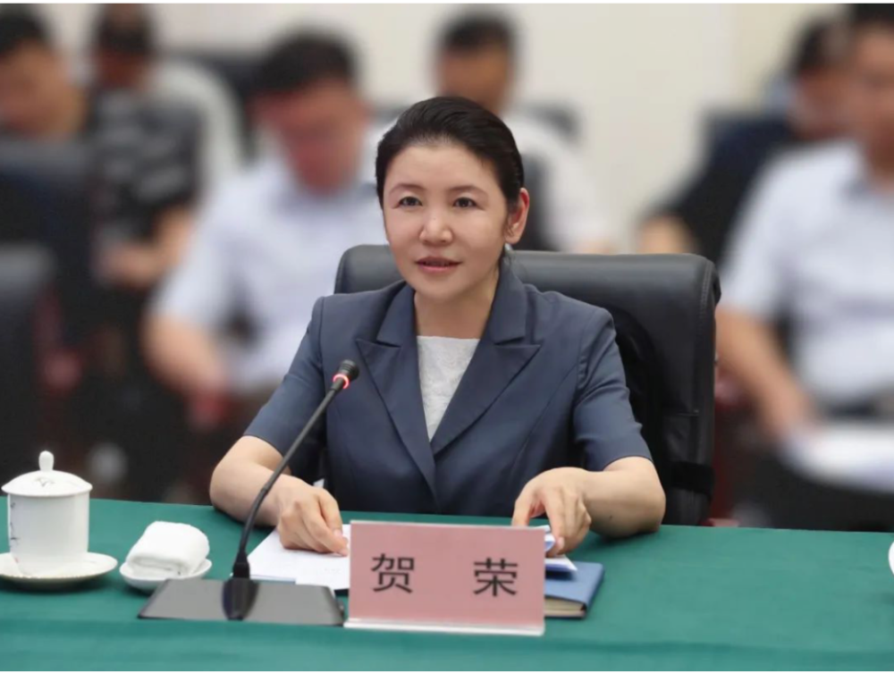

# 中央决策部署后新机制建立，张军、应勇、贺荣先后提要求

**撰文 | 高语阳**

8月22日，最高人民法院、司法部召开工作交流会商会第一次会议。最高人民法院党组书记、院长张军，司法部党组书记、部长贺荣出席会议并讲话。

会议达成一系列共识，形成了责任明确的会议纪要，下一步双方将做好落地见效工作。

张军指出， **坚持刀刃向内，对于落实中的不同意见，要主动担当、主动从自身找原因。**

政知君注意到，为落实中央决策部署，一段时间以来，政法单位正在探索建立工作交流会商机制。最高人民法院已经分别与最高人民检察院、司法部召开交流会商会。

**中央决策部署**

二十大报告指出，坚持全面依法治国，推进法治中国建设。

其中， **要规范司法权力运行，健全公安机关、检察机关、审判机关、司法行政机关各司其职、相互配合、相互制约的体制机制。**

为落实中央决策部署，政法单位之间正在探索建立工作交流会商机制。

**6月12日，最高人民法院、最高人民检察院联合召开“两院”工作交流会商会第一次会议。最高人民法院党组书记、院长张军，最高人民检察院党组书记、检察长应勇出席会议并讲话。**

时隔2个月，最高人民法院、司法部召开工作交流会商会第一次会议。

两次工作交流会商会议的官方报道，披露了工作交流会商机制建立的背景和目的：

6月12日的报道称，为了最大程度发挥党的领导的制度优势，最大限度凝聚推进法治中国建设的工作合力，最大力度解决制约司法工作的重点难点堵点问题，
**今年全国两会后，最高法党组和最高检党组研究探索建立工作交流会商机制，每年开展一次面对面交流会商**
，落实分工负责、互相配合、互相制约的要求，在司法工作的重大问题上凝聚共识、共商解决之道。

8月22日会议报道显示， **会议旨在探索建立最高人民法院、司法部工作交流会商机制，聚焦重点难点问题，有效凝聚工作合力**
，更好发挥司法审判和司法行政职能作用，服务保障更高水平的法治中国建设。

**“开展会商不是装点门面”**

在6月12日的会议上， **张军表示：“开展会商不是装点门面，而是要以上率下，推动各级法检建立相应层级的协调机制。”**

报道显示，“两院”为这次会商会做了精心准备，在多层面深入沟通的基础上，研究确定了提交会议讨论的13个问题。

会上，最高检党组副书记、常务副检察长童建明，最高法党组成员、副院长杨万明分别介绍了拟交流会商的问题。

双方围绕共同深化落实认罪认罚从宽制度、共同推动涉案企业合规改革、共同提升案件办理质效等问题沟通交流，形成了明确分工、牵头落实的会议纪要。

张军表示，要坚持交流会商的理念，以此次会议成果为基础，
**推动解决涉及法检两家共同关注的互相配合、互相制约方面其他难点、堵点问题，在更广范围内形成共识、汇聚合力。**

应勇则指出，要进一步加强协作配合，完善交流会商工作机制，共同研究解决制约当前司法工作高质量发展的问题，在共商中达成共识，在共识中推动共治，更好凝聚法治合力。

**“刀刃向内”**

8月22日，最高人民法院、司法部召开工作交流会商会第一次会议。

**政知君注意到，张军、贺荣都有最高法院、司法部任职经历。**

张军曾于2017年至2018年担任司法部部长，此后出任最高检检察长、党组书记，今年3月出任最高法院院长、党组书记。

贺荣曾任最高法院党组副书记、分管日常工作的副院长（正部长级），今年2月出任司法部党组书记、部长。

会前，最高人民法院和司法部在沟通协商基础上，研究确定了提交会议讨论的9个方面28项具体问题。会上，最高人民法院党组副书记邓修明，司法部党组成员、副部长王振江分别就会商的问题作说明。

会议就进一步强化律师执业权利保障、提升仲裁公信力、规范司法鉴定等工作达成一系列共识，形成了责任明确的会议纪要。

张军说，下一步关键是做好请示报告、做实工作衔接，狠抓会商成果落地见效的“后半篇文章”。

要加强沟通协调，围绕会议纪要确定的框架和重点，密切具体职能部门之间积极、顺畅、务实的沟通；

**坚持刀刃向内，对于落实中的不同意见，要主动担当、主动从自身找原因** ，善于运用政治智慧找到“双赢多赢共赢”的解决办法；

**不能因循，对于落实中出现的新情况新问题，要及时调整抓落实的思路和举措，** 努力取得更优更实的会商成果。

贺荣则表示，健全完善最高人民法院和司法部交流会商机制，对于落实审判机关、司法行政机关各司其职、相互配合、相互制约要求，促进司法公正、维护社会公平正义，具有重要意义。

**要进一步完善会商机制，在更广范围、更深层次凝聚共识、商解难题、汇聚合力，共同推进更高水平的法治中国建设。**

**资料 ｜ 最高人民法院 最高检察院 司法部等官网**

**【版权声明】本文著作权归政知新媒体独家所有，未经授权，不得转载。**

