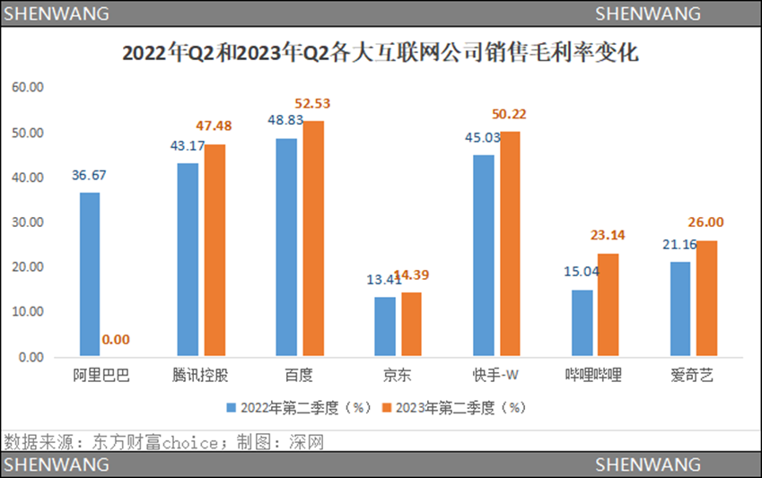
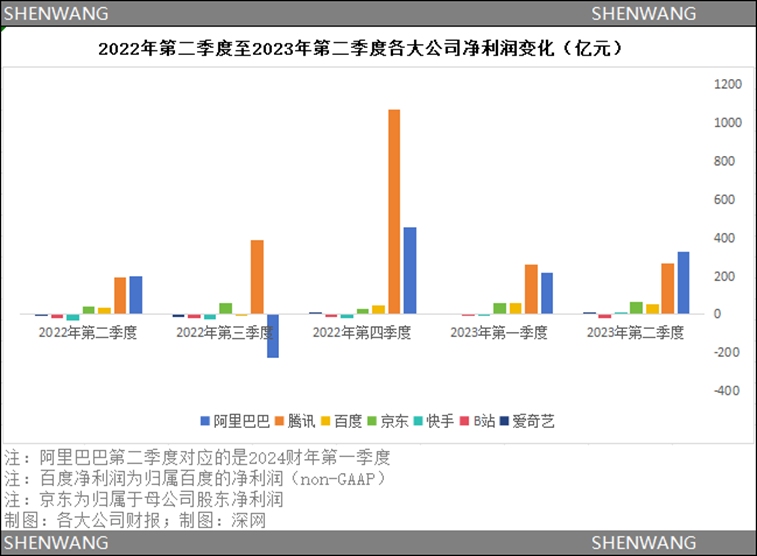

# 国内互联网大厂纷纷利润大增：降本裁员见效了？

 _来源：视觉中国_

作者 | 张睿

编辑 | 康熙

出品 | 深网·腾讯小满工作室

经历过去一年的降本增效，互联网大厂纷纷交出了一份靓眼的财报。

最近半个多月，阿里巴巴、腾讯、百度、京东、快手、B站、爱奇艺等互联网大厂相继发布了截至2023年6月30日的二季度财报。总体来看，降本增效战略已经初现成效，具体表现为以下三方面：

**1、受周期性业务人员缩减和成本开支缩减的影响，大部分公司的净利润增速明显高于营收增速；**

**2、与2022年Q2相比，这一季度互联网大厂的毛利率明显提升；**

**3、爱奇艺、快手等曾经大幅亏损的公司开始赚钱了，B站的亏损也大幅收窄。**

**“省”出来的净利润增长**

纵观过去5个季度营收和净利润的同比增速发现，各大公司的净利润增速明显高于营收增速。

2023年第二季度，阿里巴巴、腾讯、百度、京东、快手、B站、爱奇艺的营收增速分别为13.91%、11.32%、14.87%、7.6%、27.88%、8.05%、17.21%，而对应他们的净利润同比增速分别为62.58%、40.53%、44%、50.39%、146.63%、23%、282.65%，净利润增速明显高于营收增速。

**各大公司的净利润增速明显高于营收增速主要受成本控制、周期性裁员及业务调整所致。**

**从去年开始，受高增长红利期退去及监管政策加速落地等影响，大部分互联网大厂纷纷开启降本增效模式，节省成本、关停或缩减试错成本太高的创新项目。**

互联网大厂降本增效最直观的表现是周期性员工调整。从去年年初开始，头部几家互联网公司已经多次对员工总数进行动态调整。

以在此次财报中公布雇员数量的阿里和腾讯为例。截至2023
年6月30日，阿里巴巴和腾讯拥有的员工人数分别为228675名及104503名，而去年同期二者员工人数为245700名和110715名，一年间员工人数分别减少了17025名及6212名。

**互联网大厂持续的降本增效直接影响毛利率。对比2022年第二季度，这一季度各大互联网公司的毛利率明显提升。**

其中，腾讯的总体毛利率从去年二季度的43%提升至今年二季度的47%；百度的毛利率从去年Q2的49%提升至今年Q2的53%；京东的毛利率从去年Q2的13%提升至今年Q2的14%；快手的毛利率从去年Q2的45%提升至今年Q2的50%；B站的毛利率从去年Q2的15%提升至今年Q2的23%；爱奇艺的毛利率从去年Q2的121%提升至今年Q2的26%。

随着毛利率的逐步提升，几家长期亏损的互联网大厂开始扭亏，甚至实现整体盈利。

**亏损的企业开始盈利了**

**虽然互联网公司有广告、佣金、增值服务、金融服务、企业服务等多种变现方式，但广告一直是互联网公司收入的大头。在政策收紧、资本退潮、广告收入承压的大背景下，能否自我造血和盈利就成为一家公司对抗不确定性的保障。**

在降本增效主基调的推动下，爱奇艺、快手、B站等此前一直烧钱、亏损的公司开始盈利了。在这三家公司中，首先实现真正盈利的是爱奇艺。

**经营活动现金流转正是判断一家企业能否拥有自主造血能力的重要标准。**
在降本增效的推动下，爱奇艺于2022年第一季呈现出“赚钱”的迹象，当季度运营利润（non-
GAAP）为3.3亿元，首次实现季度运营利润转正。但爱奇艺真正实现盈利始于2022年第四季度，这一季度，爱奇艺的净利润为3.05亿元，结束了长期亏损的窘境。

**快手由亏转盈的路径和爱奇艺相似，先实现经营利润转正，在持续降本增效的推动下，最终实现公司整体盈利。**

从2021年第三季度起，程一笑为一直亏损的快手定下“降本增效”主基调。在人员优化方面，快手裁员覆盖了电商、算法、国际化、商业化、游戏、A站等多个业务部门。在节省雇员福利开支方面，快手于2021年年底调整了租房补贴、免费下午茶及免费三餐等福利。

“快手过去在人员构成上本来就虚胖，即使裁员30%也不会影响业务的运转”，当时有接近快手的行业人士对《深网》分析。

在持续的“降本”下，2023年第一季度，在非国际财务报告准则计量下，快手就实现上市后首次整体盈利，经调整净利润为4200万元。

**不过快手这一季度的首次盈利有技巧性，因为这是在未分摊股权激励费用及投资公允价值变动净额的基础上达到的。股权激励是互联网公司经营中的刚性人力成本，虽然不直接与经营活动相关，但会影响公司的净利润。**

快手真正实现盈利在2023年第二季度。这一季度，快手营收277.4亿元，集团期内盈利14.8亿元，经调整净利润26.9亿元，这是快手上市后首次录得集团层面国际会计准则净利润。

爱奇艺和快手已经靠持续的降本增效实现了公司整体盈利，而B站依然在亏损的泥潭里挣扎。不过，在持续降本增效下，B站的亏损已经大幅收窄。

2023年第二季度，B站营收53.04亿元，同比增长8%；净亏损15.48亿元，与去年同期亏损20.1亿元相比，B站调整后净亏损同比大幅收窄51%。

为实现2024年盈亏平衡的目标，B站持续推进降本增效。2023年第二季度B站总运营费用同比下降14%，其中营销费用同比下降22%，管理费用同比下降14%。

