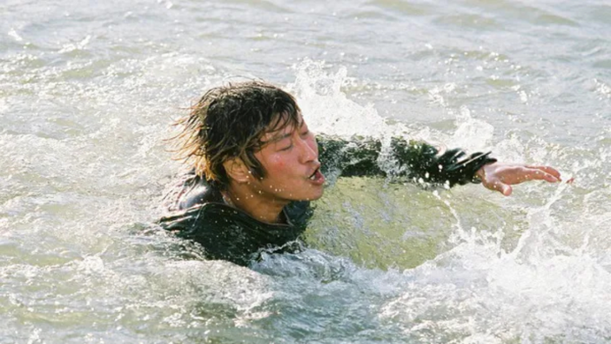
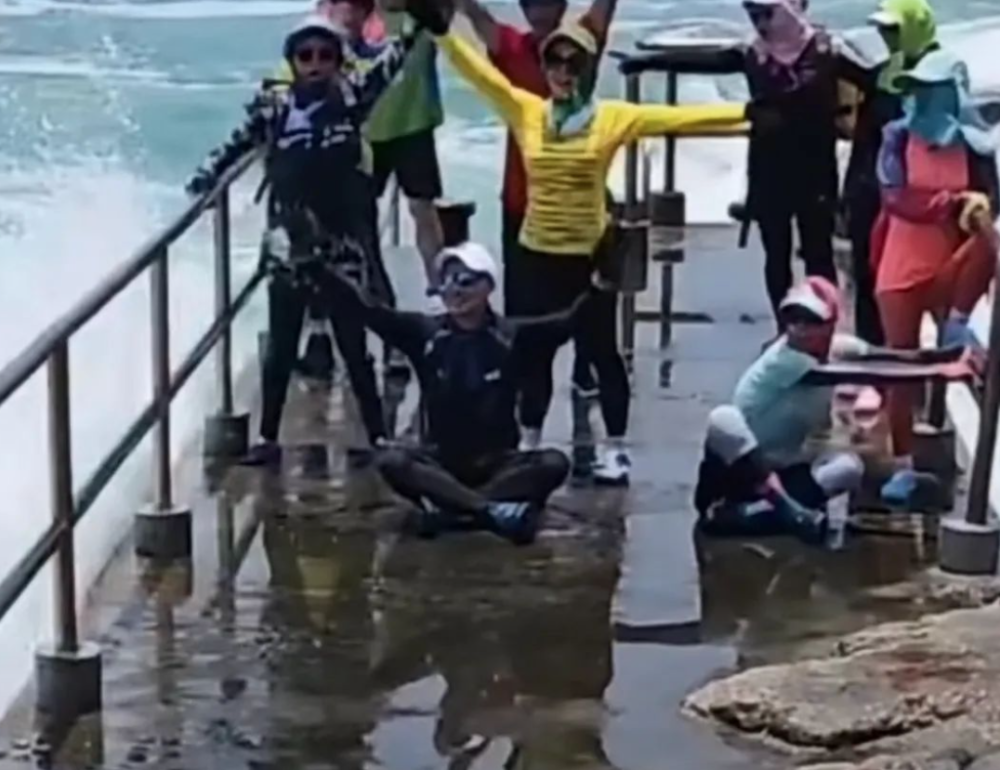

# 城市人为何轻易死在山沟里

城市生活使得人们感知危险的能力退化。因此，轻易丢掉性命。

11名中老年女子手牵手，在四川雅安鱼鳞坝上合影。穿着花花绿绿的裙子，她们脖子上系着丝巾，头戴各式帽子，时尚显眼。好几个人刚退休，住在同一社区，结伴出游。

鱼鳞坝只是一座水利设施，还在施工中，但因其独特的鱼鳞造型，成为“网红打卡点”，每日许多人聚集在没有护栏的平台上拍照。

意外并非毫无预告。这天是8月9日，因台风登陆，暴雨倾洒全国，鱼鳞坝上游黄龙水库泄洪，下游水位猛涨，当地在早间发布了山洪气象灾害风险预警。

河道开始涨水时，水坝工作人员登上坝来高声劝阻，但半个多小时的漫长时间里，几位年老的女士仍旧牢牢踏在坝上，摆出各种姿势，调动起不同的笑容，拍各式合照，对劝阻充耳不闻。

山洪从岸那边奔涌至脚跟，只用了短短几分钟，女士们逃生不及，最终7人丧命。

地形、强降雨、大型工程建设，都是山洪爆发的主要原因，除了这些，危险来临时，城市人退化的感知力，也是悲剧发生的重要因素。

一条看似千回百转、温婉可人的小溪流，在游客看来是自然界赐予的雅致景观，是逃离干燥的城市生活的应许之地。但往往只需要一瞬，山洪就撕咬上来，化身夺命的猛兽。

夺命山洪事件不断发生。去年8月13日，成都彭州龙漕沟突发山洪，带走了数名游客。龙漕沟被称为“网红小众耍水地”，在多个社交平台上都能查到打卡攻略。但实际上，龙漕沟是承担泄洪任务的沟渠，事发地并非是对公众开放的景区，应急部门在河边劝返游客，也在部分区域设有铁丝网和“禁止下河戏水”的标识，但这都没能熄灭游客蜂拥探险的热情。

不少人翻越铁丝网进龙漕沟戏水、露营、拍视频，有人在水里冰镇西瓜，还有人在水中打麻将。无疑，这里有得天独厚的自然环境，因为在城市里，人只能吃冰箱里的冰镇西瓜，在家打麻将似乎也已烦腻寡淡。

夏季是山洪爆发的高峰期，对生活在山附近的居民来说，这是常识，但城里来的游客并不熟知这点，警示牌在侥幸心理的驱使下仿若隐形。

出事那天的下午3点，豆大的雨点开始砸下。当时在附近的刘先生回忆，原本水流很小，不过一二十秒的时间，水量突然变大，几分钟后水浪已呈奔腾之势。“大家都在叫喊，也有人被水冲走，得有五六个人，其中有小孩。”另一位跟公司过来团建的余先生说，洪水来得很急，只有三秒的反应时间。

短短几秒，洪水就冲垮了临时搭建的休闲生活设施，天幕、桌椅、帐篷都被滔滔洪水吞没。这个残酷景象隐喻着一种现实——人类脱离既有的城市文明生活后，在野外变得脆弱不堪。

城市象征着人类文明的最高阶段，水、电、火、气等生活设施都被驯服，人们世代安然地活在低风险中。但这也让城市人丧失生活的真实感，面对山洪这样的自然力量，已经忘记本能的避险动作。

比如，孩童被锁在汽车后座死亡事件频繁发生。2021年中秋节当天，深圳一对父母因打牌，忘记3岁女童在车上睡着，直到下午4点多，父母才想起女童还在车上。当天气温高达33度，要知道，密闭车暴晒等于高温大烤箱。

_视频截图 | 困在车里的孩子伸出手臂哭喊_

孩子被锁在车里足足3个小时，父母打开车门时，她已经脸色苍白，车上的三瓶水全被喝完。等送到医院，孩子已没有生命体征。

同样的事情还发生在2018年的湖南湘潭，一个孩子被遗忘在车里6小时后死去，发现时，车窗玻璃上印满手指印。家长离开前，对锁在车上的孩子往往说着类似的话：“我去去就回，就一小会儿，拿个东西马上回来，不会有事。”这种大意和侥幸心理，是悲剧发生的原因。

饶是如此，一些家长根本不认为把孩子锁在车内有任何问题。去年一位河南网友称，有一次她和老公逛街，在商场门口看到一个小姑娘被锁在车里，正拍打车窗。她通过商场的广播喊车主，喊了20分钟无人回应，为了尽快把孩子救出来，她老公只好将车窗打碎。没想到，车主回来后，责骂他们为何打碎车窗，最后不得不赔了车主300块钱。

这类人为灾害背后，是城市化极速推进过程中，人们知觉的退化和危险意识的削弱。当意识跟不上行为动作，更跟不上城市文明的发展，悲剧便一次次发生。

尤其是，城市化的推进还伴随着互联网的渗透。城市人长期依赖于网络，短视频刺激的多巴胺成了生活必备，许多人轻信手机屏幕里的“二手生活”。

周末想要选择一家好吃又便宜的餐厅，第一反应就是打开美食推荐app，找到评分最高的那家。而看书、看电影的习惯，正在被碎片化的短视频讲解替代——别人把重点都总结好了，无需再自己思考分析，一点点吞咽。甚至养宠物，也可以通过“云养”的形式，隔着屏幕观赏，仿佛自己也养了一只。

各种测评、买家秀、博主、人工智能，帮我们筛选出了一个简洁、美好、虚幻的二手世界，人们迷失在其中，并未意识到躲在虚幻背后的危险。

法国作家居伊·德波在《景观社会》一书中，把二手生活称之为一种带有主体性的、有意识的表演和作秀的景观，“少数人演出，多数人默默观赏的某种表演。”人们沉迷于这种景观，就逐渐丧失了对本真生活的渴求。

“我们的时代偏爱图像而不信实物，偏爱复制本而忽视原稿，偏爱表现而不顾现实，喜欢表象甚于存在。”居伊·德波写道。

到野外网红地打卡，追求一种户外探险，或许也是对回归本真世界的尝试。一些被户外探险博主种草的人，不甘只是被投喂，参与博主的二手生活，而是选择走出去，走出封闭的、确定的、枯燥的城市生活，与自然界真实的植物、天空、山峰、河流、大地产生连接。

但问题是，在城市生活太久的人，已经不懂得与自然相处。山洪，隔着手机屏幕看，只是大自然打的一个喷嚏，但身临其境后，却发现这喷嚏就能淹死人。城市人知觉本已退化，再通过手机屏幕去观看一些景观，双重虚幻的生命体验，便时常被真实的自然力量迎头痛击。

玩得快乐，死得随便。洪水、海水、河水，都是险情的频发地，几十年的城市化进程，愈加文明进步的我们，一些行为动作是滞后乃至退化的，忘记了要如何警惕水这个古老的生命之源。

今年5月，一名43岁的钟姓女子与12名登山爱好者一起，到香港鸭脷洲旅游，他们临时在鸭脷排灯塔附近石涧打卡拍照，钟姓女子不幸被海浪卷走。

 _视频截图 | 钟姓女子与旅友合影_

鸭脷洲全岛面积不逾一平方公里，岛上只剩下一座灯塔及呈半荒废状态的码头，但这里却是看日落的好地方，吸引很多人来玩。从沙洲的最低点（沙滩）走到鸭脷排灯塔，需时约三十分钟，除沿路危险外，鸭脷排沿岸一带风高浪急，也存在不少隐患。

女子被海浪卷走后，其中两位同行男子曾跳入海中打算救人，并未成功，只能打电话报警。警察救起钟姓女子时，人已经陷入昏迷，后经医院抢救无效去世。

野外游玩，本是城市古板生活的一次松动，人们在户外探险中，淬炼自己的精神和体格，以完成某个目标而兴奋，大脑因此产生多巴胺。还有什么能比多巴胺更会营造虚幻呢。

今年春节，一些追求快乐的人被水浪拍熄了生命。事发地位于黄河三门峡大坝下游的河滩上，忙碌了一年的人聚集于此放松休闲。意外就发生在一瞬间，下午4点左右，刚刚还潺缓的河水骤然生变，几分钟时间水位突然上涨。

据亲历者叙述：“下午4时10分左右，河水突然上涨，河道里的人就开始往岸边跑，有人被水冲到岸边，岸边的人用树枝拉起了一些落水者。差不多6分钟左右，河水上涨到了大约1.8米。”

一些原本在中间地带的市民来不及反应，就被河水冲走。最终7人失联，2人溺亡。冰冷的死亡，将充斥春节的欢乐泡沫彻底戳破。

这类事件基本聚集在网红打卡地，它们是被流量托举出来的小众游玩地。在社交媒体的带动下，一张张图片，一条条视频，将这里连接到更多的人。各类APP上写着推荐标签，诸如网红打卡圣地、最美山峰、最美湖泊、小西藏、小斐济等，一些人留下美化过的游记和旅游攻略，并用大量PS过的图片吸引人气。

可以看出，短视频的滤镜，无形中给人们带来了危险，本想过来喘口气，却被要了命。

本质上，人类是从自然里孕育而来，基因里有向往自然、接触自然的本能，但因为知觉退化，我们与自然已经产生巨大的隔膜，难以把握自然界的不可抗力。不难判断，在城市化仍高速推进的当下，还会有各类虚幻的不真实的事物被制造出来。

我们唯一的出路是，把握真实的生活，敬畏自然，尊重自己的生命。努力做一棵不被山洪冲走的芦苇。

\- END -

撰文｜吴 寻

编辑｜苑苏文

**相关报道：**

[7人丧生鱼鳞坝，网红景点打卡很危险](https://new.qq.com/rain/a/20230814A04RKK00)

[广东莲花山涨水冲走多人致4死 副县长：事发地禁止下河 多次劝阻未果
](https://new.qq.com/rain/a/20230803V04BT000)

