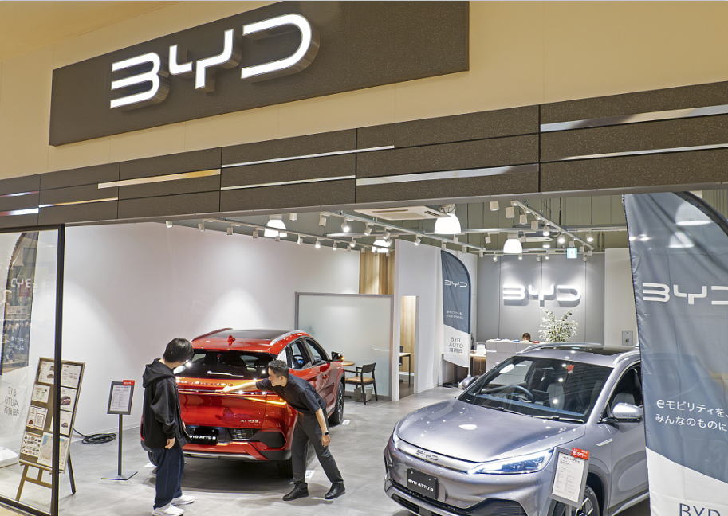

# 比亚迪印度往事：苦心经营16年，精心布局的市场撞上南墙

_​图源：视觉中国_

特约作者 | 张蔚婷

编辑 | 陈弗也

出品 | 棱镜·腾讯小满工作室

8月9日，比亚迪迎来了高光时刻，它的第500万辆新能源汽车下线，成为了全球首家达到这一成就的车企。

在下线发布会上，57岁的王传福数次哽咽，一句“14亿中国人在情感上需要自己的世界级汽车品牌”更是引起广泛讨论。

在打造“世界级汽车品牌”的道路上，比亚迪已经走了很长的路。早在1998年，他们便远征海外，不过，当时比亚迪尚未开始造车，出海的业务是电池和电子产品加工，业务范围遍布欧洲、美国、日本等。

此后，他们将目标瞄准了东南亚和南亚——这是一个与中国改革开放初期相似的新兴市场，拥有大量劳动力资源和工业原材料，但又尚未开发。

印度，便是他们选中的市场中心。

2007年，在印度南部港口城市的钦奈（Chennai），比亚迪印度私人有限公司（以下简称比亚迪印度公司）成立，当年是比亚迪造车的第四年，在国内尚未站稳脚跟，一年后，他们才造出自己的第一辆新能源车。

电池、电子产品组装则是这家印度公司的主业，他们为诺基亚、摩托罗拉等手机制造商提供这些服务。

直到6年后，他们才将汽车业务发展到印度，当时，充当先锋官的还是纯电公交车。

对于中国车企来说，比亚迪算是进军印度市场的老兵，但如今，他们发展得并不顺利。今年7月22日，印度监管部门以“投资安全”为由，拒绝了比亚迪合资建厂的申请；11天后，比亚迪又因“少缴税款”被开出天价罚单。

已颇有国产汽车“带头大哥”风范的比亚迪，在其精心布局的印度市场撞上了南墙，这令不少人感到意外，对于比亚迪来说，它是止步于此，抑或绕道前行？

比亚迪在印度的发展轨迹，也是中国车企出海南亚的一个研究样本。

**用公交车打开市场**

2013年8月20日，对于比亚迪来说，是一个特殊的日子。

一辆比亚迪K9抵达印度钦奈港，这是一款纯电公交车，也是印度汽车工业史上第一辆纯电公交车。

半年后，一辆车头挂有花球、车身被鲜花和丝带包围、贴有醒目的标识语zero
emission（零排放）的蓝橙色比亚迪K9，作为335E号公交，在班加罗尔市开始了为期88天的试运营。随后继续在新德里、拉杰果德、海得拉巴等其他主要城市进行试运营。

在试运行过程中，比亚迪印度的工程师记录了车队的重要数据，并对其运行性能进行评估。根据公开资料，印度官方对试运营的结果很是满意。

印度一度被视为世界上污染最严重的国家，解决环境污染的问题迫在眉睫。

2017年，著名医学杂志《柳叶刀》（The
Lancet）一项研究显示，2015年，在印度，因环境污染造成的死亡和伤残人数占全球总数的50%。据统计，该年离世的印度人中，12.5%人死于空气污染。

2018年，芝加哥大学能源政策研究所(EPIC)的一项研究则显示，如果印度符合世界卫生组织的指导标准，印度人的寿命将延长 4.3 年。

很多国家都将发展新能源车视为降低环境污染的一项策略，印度也不例外。2015年，印度政府开始推行促进电动汽车的计划（全称为“更快采用和制造混合动力和电动汽车（FAME）”计划，以下简称“FAME计划”）。

根据FAME计划，第一阶段的重点领域是技术开发、激发需求、试点项目和充电基础设施组件。政府将向有兴趣购买电动巴士的公司和州政府提供高达60%的补贴，预算支出为895亿卢比（约为77.9亿人民币）。

去年12月，印度重工业部批准向11个邦拨款44亿卢比，用于在FAME计划试点项目下，采购电动巴士、电动出租车和电动汽车。

该部门制定的FAME的第二阶段计划，总预算支持为1000亿卢比，将于2024年3月31日结束，重点支持公共交通和共享交通电动化。其中，86%的资金将用于创造印度人对电动汽车的需求，包括支持7090辆电动公交车和5.5万辆乘用车的生产投入等。此外，该计划还将支持电动车充电基础设施的建设。

2021年，印度政府还公布“2070年实现碳中和”的目标，并表示，2030年电动车的市场占有率提至30%。

这一系列的利好政策，让比亚迪看到了机会。2015年，他们与印度本土企业Olectra Greentech合资成立Olectra-
BYD公司，合作生产电动巴士，希望双方充分发挥各自优势，降低成本，提高收益。

在具体合作上，零件以半散状态自国内运往印度，Olectra则在其制造厂组装比亚迪供应的电池和客车底盘，比亚迪为后者提供技术支持，委派技术团队协助组装，并监督质量和其他技术细节。

尤其是涉及到安全性能等核心问题的电池、电动机和控制器方面，比亚迪会严格把关。

**乘用车乏善可陈**

与Olectra Greentech的合作，让比亚迪迅速在印度站稳了脚跟。

2016年11月11日，这家合资公司就中标了孟买纯电动公交车的招标项目，涉及6辆K7，这是印度首个电动巴士的批量订单。三个月后，再次中标喜马歇尔邦25台电动巴士，比亚迪组成了印度当时最大的商业化电动巴士车队。

2018年，第一辆印度制造的电动巴士eBuzz K6下线，开始在印度各州市运营，并出口到了尼泊尔，这辆车正是由Olectra-BYD生产。

根据印度道路运输和公路部（Vahan）数据，在货车和公共汽车这个市场，比亚迪占有的市场份额位列第二，仅次于当地的最大的汽车制造商塔塔汽车公司（Tata
Motors，以下简称塔塔汽车）。

塔塔汽车是印度少数拥有汽油、柴油、压缩天然气和电动多种动力系统的汽车制造商之一，该公司于2020年1月率先推出乘用电动车，抢占市场份额。对于比亚迪来说，要想打造成世界级的汽车品牌，进军乘用车市场也是一场无法回避的战争。

目前，印度电动乘用车的普及率较低，但是市场的发展潜力已经初现。Vahan数据显示，截至8月2日晚上9点，2023年7月，各类电动汽车的零售量总计115836辆，连续10个月突破10万辆。

其中，乘用车的销量已创新高，累计销售46163 辆，同比增长166%，超过了2022年的38215辆，月均销量也达到6594辆。

比亚迪印度乘用车电动汽车业务高级副总裁Sanjay
Gopalakrishnan曾经乐观预测，到2030年，印度电动乘用车市场规模将占总量的30%，即550万至600万辆。

目前，比亚迪印度公司位于钦奈的工厂每年可组装约15000辆汽车。Sanjay
Gopalakrishnan表示，到2030年，该公司目标占据该国乘用电动汽车市场40%的份额。同时，其工厂的组装能力也会应需求增加而提高。

不过，在乘用车市场，比亚迪一直未能建立起绝对优势。

Vahan数据显示，2023年1-7月，塔塔汽车售出34908辆电动汽车，占据市场份额76%。比亚迪则被雪铁龙赶超，排名降至第五位，销量为1280辆，市场份额仅为3%。

2022年10月11日，时任比亚迪印度公司执行董事Ketsu
Zhang宣称，他们计划2023年在印度销售15000辆Atto3。目前看来，若想实现目标，接下来五个月内，比亚迪印度每月至少售出2744辆车，这几乎是一项不可能完成的任务。

除了在汽车市场上的布局外，比亚迪也将电池业务渗透到印度市场。

印度另一家本土制造商马恒达（Mahindra &
Mahindra）正在为电池供应苦苦挣扎，他们制定了未来三年内推出5款电动车型的计划，但由于电池依赖于进口，已无法完成计划。

“Born
Electric”系列采用两种尺寸的电池，即60kWh和80kWh电池组，均采用LFP技术。这家印度本土制造商最先合作的供应商是大众，但后者无法提供80kWh的电池组，这给了比亚迪机会。

根据协议，自2023年8月起，比亚迪向马恒达提供60kWh和80kWh电池组，直到大众研发出新的电池技术——统一标准尺寸的电芯（Unified Cell）。

**本土化，参考小米模式**

在汽车市场之外，过去几年，中国的智能手机品牌统治了印度市场。

Oppo和Vivo等公司于2014年进入印度，并迅速超越竞争对手，使印度成为仅次于中国的全球第二大智能手机市场。截至目前，除三星以外，印度前五的智能手机制造商均为中国公司。中国品牌占据了70%的市场份额，而印度品牌仅占1%。

如今，不少中国车企也瞄准了印度市场，曾有媒体这样形容：“中国电动车旨在印度复制中国智能手机的成功”。

手机公司的发展轨迹——从出口到在印度组装，再到本地制造——为中国电动汽车制造商提供了榜样。

小米是这一模式的代表，进入印度伊始，小米选择印度本土人士担任高管，全面负责印度业务。这种员工本地化，糅合了印度人在本土管理上的优势和中方团队在产品上的优势，既保证了对方的施展空间，又保证了自身的掌控力。次年，小米在印度开设第一个工厂，联合富士康共同生产“印度制造”的手机。

比亚迪正是这条路径的亲历者，早些年，它在印度的主业便是电子产品的组装，他们深谙其道。

比如，在经销网络的建设上，经销门店由经销商运营和管理，为消费者提供销售和售后服务。他们计划到2023年底，在印度21个城市开设至少53个展厅，据作者统计，截至目前，展厅仅有24个。

而在经销商选用上，他们的标准是：本地化、有经验、业务覆盖范围以邦为单位。

在融资网络上，比亚迪印度公司也分别与3家银行、2家金融机构协议，为其经销商和客户提供汽车融资贷款。

比亚迪曾经对印度市场寄予厚望，2021年11月1日，比亚迪印度官方新闻稿首次出现这样的描述：公司战略上瞄准印度乃至南亚，已逐步发展成为南亚地区总部，实现了集团在该地区的本土化战略。

四个月后，为庆祝成功运营15周年，时任比亚迪印度私人有限公司执行董事Ketsu Zhang也强调：“印度已成为我们的战略中心服务南亚市场。”

但是，好景不长，比亚迪在印度的发展很快便引来了非议，上述将成为南亚地区总部的描述也被官网删除。

比如，2018年3月23日，印度当地媒体《经济时报》就报道，由于比亚迪在“印度制造”（Made in
India）项目中竞标成功，有业内高管认为，像比亚迪这么大的外企参与，违背了“印度制造”使命，也不会有助于印度创造更多就业机会。

另一家汽车高管则质疑比亚迪低价竞标的可操作性与其实际生产能力，他认为，比亚迪在印仅进行组装车辆，并无实际生产制造基地，也无车辆报修系统网络。

今年4月起，印度政府再提高进口汽车关税10个点至70%，以促进本土汽车工业的发展。目前，印度最大的汽车生产商塔塔汽车已经牢牢地占据了行业的龙头地位，印度政府也有意让该公司建立更强大供应链。

**绕道泰国、越南**

更为严峻的形势发生在最近，根据外媒报道，比亚迪正在接受税务情报局 (DRI)
的调查，原因是其在该国销售的组装汽车中使用的进口零部件被指控少缴税款，涉及金额为900万美元。

比亚迪在初步调查后已存入这笔款项，但调查仍在进行中，并且可能会征收额外的税费和罚款。比亚迪和印度当局尚未作出任何官方回应。

依据印度法律，成品电动汽车和进口用于本地组装电动汽车的汽车零部件被征收不同的税率：进口但未安装在车辆底盘上的零部件可按15%或35%的税率征税，成品电动汽车根据车辆价值则需缴纳70%或100%的税。

《经济时报》报道称，比亚迪尚未满足享受较低税率的必要条件，因此有责任根据汽车价值支付70%或100%的税款。

一位在印度从商多年的华人向作者解释，印度的法律体系比国内严格，尤其针对外商投资格外谨慎。深耕在印度的外企，多是聘请当地人出任企业高管，同时把能交的钱全交，不打擦边球。

祸不单行。今年7月，印度又拒绝了比亚迪与当地公司Megha合作投资10亿美元建设电动汽车工厂的提议。知情人士透露，驳回理由是出于国家安全考虑。

早在2020年1月，另一家中国民营车企长城汽车也曾想在印度建厂。当时，他们与通用汽车签订协议，计划以10亿美元收购后者印度塔里冈工厂，并于年底完成接管，以在当地生产旗下品牌产品。

约仪式完成后，双方向印度方递交投资申请书，根据印度《外商直接投资法案》，外国企业提交外国投资建议书后，需经过多个部门审核：先是印度工业和内部贸易促进部（DPIIT）分发提案给其它相关部门征求意见，这个程序一般在两到三个月内完成。

其中，涉及外国直接投资超过 500 亿印度卢比（约 7.75 亿美元）的提案应提交内阁经济事务委员会。走完所有流程后，投资申请将在8-10周内获得批准。

受疫情和其他因素影响，长城和通用的协议三度延期。收购期限自2020年底延至2022年6月30日，到达协议延期次数上限，却始终未等来官方审批结果。最终，长城放弃了印度工厂计划。

与长城汽车的遭遇相比，比亚迪或许要幸运很多，他们直接收到了明确的拒绝。

如今，比亚迪将目光放在了泰国和越南。2022年8月8日，比亚迪与泰国合作方召开发布会，宣布进入泰国乘用车市场。两个月后，比亚迪与泰国工业园区开发商WHA公司签署土地购置和工厂建设合同，他们将建设一座新的右舵汽车工厂。

这一工厂是比亚迪首家全资拥有的海外乘用车工厂，预计2024年开始运营，年产能约15万辆，生产的汽车将投放到泰国当地市场，同时辐射周边东盟国家和地区。

今年3月10日，该生产基地的奠基仪式完成。

今年5月5日，王传福与越南副总理陈红河会面。12天后，比亚迪证实，将在越南建厂。若建设成功，越南厂将成为比亚迪在东南亚市场继泰国工厂后的第二间工厂。

相比泰国和越南，比亚迪在印度显然已经走了很长一段路。他们先以电池、组装业务入驻，再谨慎地投放纯电公交车，此后又提供技术支持，与本土企业合作生产研发，再提出合作建厂，公司高管也由当地人担任。

即便是在生产-经营-销售-服务-融资等环节，比亚迪似乎都在释放友好态度，但最终还是在临门一脚时踢上门框。

对于全球化布局，比亚迪执行副总裁李柯曾说道：“你不需要去每个市场——你只需要去你认为已经准备好的市场。”

那么，印度还是比亚迪已经准备好了的市场吗？

