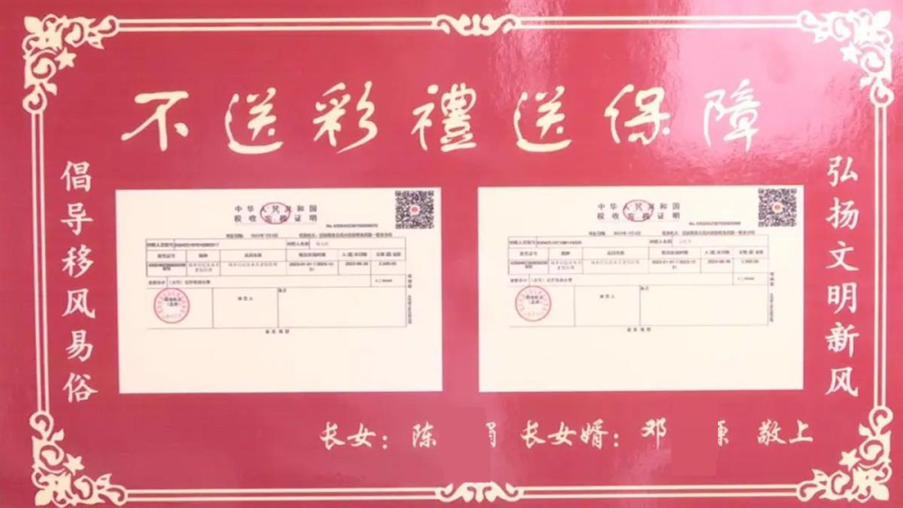
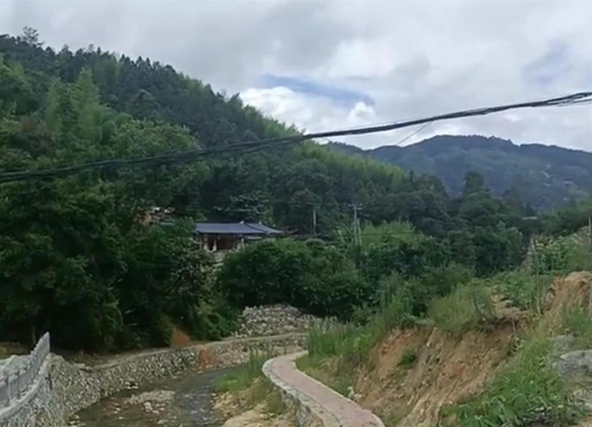

# 福建大田“保险代彩礼”背后：有人吐槽彩礼高达60万，不下于房子首付

极目新闻记者 满达

因一曲《大田后生仔》闻名的福建三明大田县，最近凭“倡议买养老保险代替彩礼”上了热搜。

据当地媒体报道，大田县文江镇一对新人订婚时，女方只收8.8万元彩礼，并且会在陪嫁时返还，新女婿还给岳父岳母交了养老保险，两人60岁以后就可以领钱。当地提倡以“城乡居民养老保险”“企业职工养老保险”替代部分彩礼的方式，引发网友热议。

早在今年1月，就有网友在人民网地方领导留言板发文，吐槽大田县彩礼太高，甚至高达五六十万元。当地村民告诉极目新闻记者，大田县的彩礼是近五六年才涨起来的，甚至还形成了互相攀比的现象，这股歪风确实该杀一杀。

2019年，大田县就曾发文，在全县开展“农村嫁女聘金高昂问题”专项整治行动，提倡党员干部将聘金控制在10万元以内，企业家将聘金控制在15万元以内，群众将聘金控制在20万元以内。近来，当地整治高价彩礼的报道频频见诸媒体。

**“不送彩礼送保障”**

文江镇位于大田县东北角。

大田县融媒体中心于8月18日发布的一篇报道，近日引发热议。

_陈某媚父母收到“不送彩礼送保障”牌子（图源：大田融媒）_

报道称，8月17日，文江镇的镇村干部来到该镇的联盟村，将“不送彩礼送保障”的牌子送到新人陈某媚父母家中。文章配发的照片中，陈某媚的父母捧着印有两张养老保险缴费单的牌子合影，底下的落款为长女陈某媚和长女婿邓某塬的名字。

陈某媚的母亲吴女士称，彩礼她收了8.8万元，陪嫁的时候再还给女儿。大女儿和大女婿为她交了养老保险，她60岁以后就可以领钱。

 _不送彩礼送保障牌子（图源：大田融媒）_

报道还称，文江镇党委政府积极开展高价彩礼调研，与村民面对面交谈、心贴心沟通，制定印发《高价彩礼等移风易俗治理“一对一”实施方案》，实行网格化管理，掌握适婚女青年工作、生活及婚育状况，主动服务。

 _镇村干部在陈某媚娘家（图源：大田融媒）_

文江镇党委副书记郑成寨介绍，该镇党委政府对全镇未婚适龄女青年进行梳理，共梳理了475位未婚女青年，要求各村的氏大人、村两委干部以及党员、村民代表进行一对一的挂包帮扶。鼓励通过交保险、送保障的形式，让女方的父母没有后顾之忧。

《三明日报》也于8月23日报道了此事。报道称，近两年，文江镇小伙子结婚的彩礼大都在20万元至40万元，致使部分男青年家庭背上沉重的彩礼负担。陈某媚的公公老邓是文江镇温厝村人，他在接受采访时表示，乡镇领导提前做通了亲家的思想工作，亲自到他家“做媒”，让他们每年从彩礼中拿出5000元，给亲家缴纳养老保险。这个办法帮助解决高价彩礼，减轻了家庭经济负担。

极目新闻记者注意到，今年3月27日，大田县融媒体中心曾发布“不送彩礼送保障”倡议书，称拒绝彩礼旧俗，用养老保障代替彩礼表达缔结连理的诚意，用养老的长效保单保障父母安度晚年。针对不同对象，政府部门推出“城乡居民养老保险”“企业职工养老保险”两类养老保险。其中，城乡居民养老保险，每人每年缴纳保费5000元，缴满15年，未满15年可一次性补缴，满60周岁后每月可领取养老金730多元。

**“彩礼不下于凑房子首付”**

大田推广“不送彩礼送保障”背后，是当地存在的高价彩礼现象。

今年1月，在人民网地方领导留言板上，有网友给三明市市长留言称，自己到了适婚年龄，但迟迟不敢结婚，因为家庭经济没那么富裕。“而我们大田的彩礼，有的高达五六十万，低的也要三四十万。我出社会打拼多年，彩礼高涨，对于普通的打工家庭来讲，不下于在三明凑个房子首付。”该网友称，大田的高价彩礼由来已久，甚至整个三明多数县都是高价彩礼。他恳请政府能对高价彩礼进行整治。

澎湃新闻今年6月也报道称，在大田县建设镇街道经营兽药店铺的陈某地介绍，当地有的彩礼高达近50万元，确实很高，给不少家庭造成压力。

_联盟村风景（图源：大田通）_

“大田的彩礼，就是这五六年涨起来的，有的人家确实收得很高。”联盟村村民陈先生告诉极目新闻记者。

陈先生年近60岁，目前在泉州做点生意。据他所知，老家的彩礼一般在二三十万元的水平。“没有统一标准，也有的女方家里比较随意，只收三四万，或者十来万的。”陈先生说，但有的女方家长对钱财看得比较重，对彩礼金额要求比较高，甚至还互相攀比，好像很光荣一样，这种风气很不好。

“我个人的看法不一样。”陈先生介绍，他于1986年结婚，当年彩礼是2000元。10多年前，陈先生的儿子从邻村迎娶儿媳时，彩礼是6万元。“那时大田的彩礼一般是10多万元，但我儿子和儿媳是自由恋爱，儿媳读大学时，儿子还赚钱供她，所以娘家就少收了一些彩礼。”陈先生说。

陈先生的女儿10多年前嫁在泉州，他也只收了女婿家2万元彩礼。“泉州的风俗习惯和我们大田不一样，这边的彩礼很低，还有女方家里倒贴的。”陈先生表示，当时大田那边的行情是在10万元左右，而泉州则只要1万至2万元。“我就跟我女婿讲，既不能按大田的行情来，也不能按泉州的行情来，折中要了2万元。”陈先生称，不过，他也没有给女儿陪嫁礼金。

陈先生说，一直以来，大田的彩礼都要比泉州这边高，近五六年来更是涨了不少。

温厝村党支部张书记告诉极目新闻记者，当地女方收彩礼也没有统一标准，有收10多万元的，也有的不要彩礼，还有的女方陪嫁10多万元。据他所知，彩礼收得高的，也有近20万元的。张书记称，和大田县的其他地方相比，温厝村一带的彩礼还不算很高。

**“是该整治这股歪风了”**

“是该整治这股歪风了。”联盟村村民陈先生说，他目前主要在泉州生活，泉州的经济水平要比大田高，但这边的彩礼普遍来说要低一些。陈先生虽然人不在老家，但村里的姑娘陈某媚订婚后，镇上干部去送牌子的事情，他早就知道了。“镇上和村里的干部都去她家了。”陈先生说。

联盟村另一村民介绍，陈某媚的父母有两个女儿和一个儿子。按照当地的风俗，一般是儿子赡养父母，女儿出嫁给父母买份养老保险，也相当于给老人一份保障。当地也有的女方父母不要彩礼，只要求女儿女婿帮他们养老就可以了。该村民向极目新闻记者表示，自己女儿尚未出嫁，如果将来女儿女婿用养老保险来替代彩礼，也挺不错，他表示欢迎。

极目新闻记者注意到，除了提倡用养老保险代替彩礼，大田县还采取过多种手段来整治高价彩礼现象。

_大田县“农村嫁女聘金高昂问题”专项整治行动方案（图源：海西大田）_

2019年5月，大田县委办公室就印发《关于在全县开展“农村嫁女聘金高昂问题”专项整治的行动方案》的通知。方案内容有，针对该县乡风民俗中存在的突出问题，以治理“高价聘金”为重点，反对盲目攀比、铺张浪费，突出党员干部以身作则（提倡聘金在10万元以内），企业家示范带头（提倡聘金在15万元以内），群众自觉参与（提倡聘金在20万元以内），力争在2019年12月底前，结婚聘礼费用等明显下降。

据《福建日报》报道，大田县还采取了为“低彩礼”“零彩礼”新人提供婚后就业、创业定额低息贷款，女方父母在本乡镇卫生院每年享受免费体检一次等优惠政策；将拒绝高价彩礼纳入村规民约，加入乡村“积分超市”正面清单；评选“零彩礼”“低彩礼”“返彩礼”先进家庭典型；组建宣讲队，借助庙会等民间活动，发挥乡贤的影响力引导群众抵制高价彩礼；建立未婚青年台账，开展一对一“挂包”……通过这些方式来整治高价彩礼。

今年7月6日，大田县妇联、县农业农村局还联合召集民间红娘代表、外地嫁入大田的媳妇召开工作座谈会，抵制高价彩礼。

**“保险替代彩礼值得提倡”**

提倡用养老保险来代替部分彩礼，大田县整治高价彩礼的特殊方式，经媒体报道后引发热议。

不少网友表示，这个既解决了老人养老问题，实际上也是给女儿减轻了养老负担，也让年轻人也不因一时拿不出那么多钱而苦恼，结得起婚。但也有网友算了一笔账，每年缴5000元，缴满15年那就是7.5万元，两位老人一共要15万元，也不是一笔小数目。一般来说，女方父母可能都50多岁了，并不能按15年来逐年缴纳，可能需要一次性缴纳数万元。还有网友误会，这是在推广商业保险。还有网友担心，万一有的夫妻中途离婚了，这保险还缴不缴？

8月23日，极目新闻记者致电大田县农村社会保险管理中心咨询。工作人员介绍，当地自去年开始提倡用养老保险代替部分彩礼以来，就有很多新人来咨询，为父母办理养老保险的也不少，而且这是社会基本养老保险，并非商业保险。当地的养老保险有很多个档次，最低档是每年缴200元，最高档是每年缴5000元，可根据自己的实际情况选择，都是累计缴满15年。

“选择2000元到3000元每年的比较多，选5000元每年的会少一些，除非是老人快要满60岁了。”该工作人员介绍，从前，大田县不少村民都是购买200元一年的养老保险，缴满15年，满60岁以后每月能领191元。如果此前购买过低档的，后面想买高档的，则不能补前面那几年的差价。“前面几年按低档计算，后面几年按高档计算，加起来缴满15年即可，再根据个人的社保余额来计算每月可领取的养老金。”她称，如果此前没购买过养老保险，按5000元每年累计缴满15年，满60岁后每月就能领取730多元，“如果老人是农村的，家里之前有被征地，每月还能多领249元，加起来就有1000多元了。”

 _文江镇风景（图源：网络）_

联盟村村民陈先生告诉极目新闻记者，村里的乡邻普遍都买过养老保险了，大多数选择的都是200元一年的。据他所知，陈某媚的母亲年龄在54岁到55岁之间。该村另一村民介绍，陈某媚的母亲此前自己买过低档的养老保险，这次女儿女婿给她买的是5000元每年那一档的。根据上述信息可知，陈某媚夫妇最后为母亲缴纳的总金额，可能并没有7.5万元那么多。

陈先生称，据他所知，在村里，新人用养老保险代替部分彩礼的还很少。他个人觉得，还是直接降低彩礼金额比较好。“如果购买养老保险，缴多少钱，满60岁后拿多少钱，对于我们农村人来说，都不太懂这个计算方法，不一定都能接受。”陈先生说。

温厝村张书记也坦言，用养老保险代替部分彩礼，还是个新事物，况且村里适婚的年轻人不多，就他所知，为女方父母购买养老保险的新人暂时还不多。不过，因为村民们此前缴纳的养老保险大多是200元每年那一档，如果女儿女婿能帮忙提高档次，父母满60岁后能多拿一些养老金，相当于多了一重保障，也是不错的。他还介绍，村里如果有快要结婚的年轻人，镇里的干部都会主动上门做工作，进行宣传推广。

湖北省婚姻家庭研究会副会长刘明炎认为，在我国很多农村地区，包括部分城镇，都存在攀比彩礼的现象，这种现象对广大的农村青年和城镇的部分工薪阶层来说，都成了一个负担。大田县当地通过提倡用养老保险来代替彩礼，是非常具有积极意义的。倡导新人为女方父母购买养老保险来替代彩礼，一方面减轻了不少年轻人的经济负担，遏制了高价彩礼风气；另一方面这是孝敬父母的一种体现，这是中华民族的传统美德，值得各地借鉴推广。不过，各地在推广时，要根据当地的风俗习惯、收入情况等，进行适当的本土化操作，这样才能够更好地推广下去。比如在城镇，如女方父母所在单位已购买养老保险，女婿可以考虑赠送其他险种。彩礼是从农耕时代流传下来的封建习俗，要真正杜绝这种现象，必须经过高度的物质文明和精神文明协调作用，在过渡阶段，提倡用养老保险来代替彩礼，可能更具操作性。相比于提倡直接降低彩礼，通过购买养老保险来代替彩礼，多了一层孝敬父母的意义。“从整个社会文化层面来讲，我觉得更值得提倡。”刘明炎说。

（来源：极目新闻）

