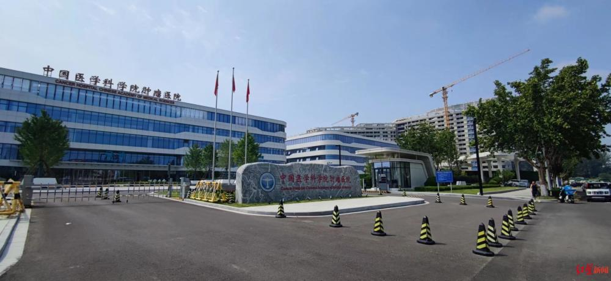
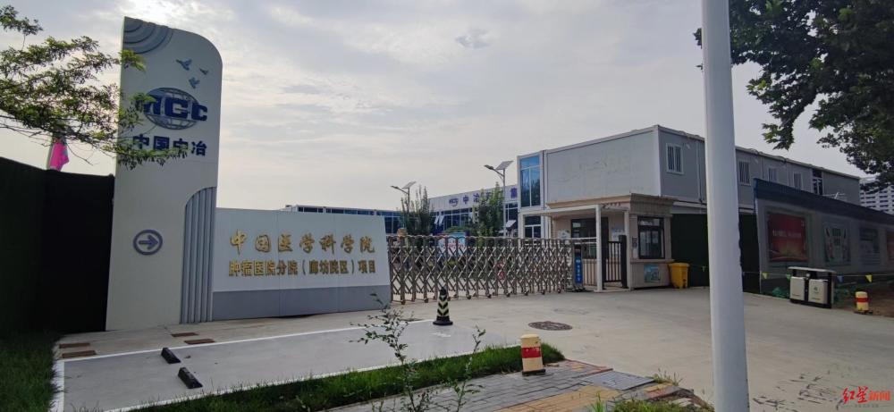
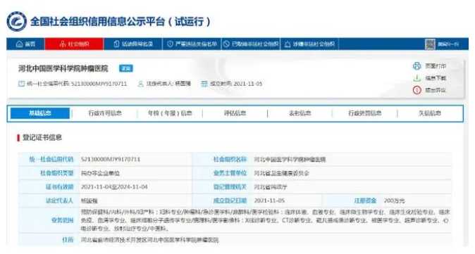
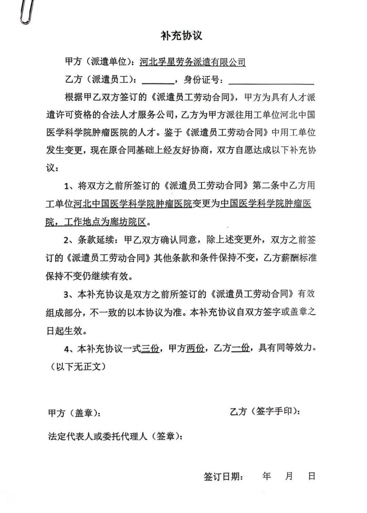

# 红星深度丨“风暴眼”中的河北中国医学科学院肿瘤医院

注册登记不足两年的民办非企业河北中国医学科学院肿瘤医院（下称“河北医院”）申请注销，让这家号称总投资超90亿元的肿瘤医院和中国医学科学院肿瘤医院处在了舆论风暴之中。

中国医学科学院肿瘤医院公众号发布的文章显示，7月27日，国家癌症中心中国医学科学院肿瘤医院第一届职代会一届二次工代会召开，会上医院廊坊院区资产并购等事项获表决通过。

**这场注销风波背后，则是一封长达19页的公开《举报信》。据媒体此前报道，这封《举报信》细数了河北医院在建设过程当中存在的“设立民办医院逃避政府监管”“国有资产流失”等六大问题。**

_↑网上流传的《举报信》（部分）_

8月17日，红星新闻记者实地探访河北医院发现，与网络上的巨大舆论风波形成鲜明对比的是，现实中河北医院的建设除了门诊楼上的医院名称拿掉了“河北”两字之外，一切都看似在有条不紊地进行。

与此同时，廊坊官方对于这场舆论风波看起来也比较平静。红星新闻记者致电廊坊开发区投资促进和招商合作局，一位工作人员告诉记者，当地政府在这个投资项目中只是一个服务的角色，不划拨土地和资金。

中国医学科学院肿瘤医院为什么选择与企业合办民办医院？一位当地政府人士告诉红星新闻记者，设立“民非”（民办非企业单位）的原因之一是廊坊没有设置公立医院的资金和编制。但对于此说法，撰写上述《举报信》的举报人提出了不同意见。

而根据《举报信》，回购金额约为23亿元，回购转公成功后，河北医院将设置成为肿瘤医院的跨省非独立法人院区。

河北省卫健委副主任范素文向红星新闻记者表示，河北医院是中国医学科学院肿瘤医院和中冶吉信合办的一个非政府办的医院，相关事宜应向中国医学科学院肿瘤医院问询。关于医院设立的背后真实情况，红星新闻记者多次拨打河北省卫健委多个部门电话，也多次联系中国医学科学院肿瘤医院，但均未获得回复。

**实地探访：现场施工仍正常进行，**

**开工日期显示早于卫健委正式批复**

全国社会组织信用信息公示平台显示，河北医院为民办非企业单位。

红星新闻记者实地探访发现，该医院位于廊坊开发区花园道与桐西路交叉口西南侧，紧邻道路。与登记证书显示的“河北中国医学科学院肿瘤医院”的名称不同，现场工程状况牌以及施工大门张贴的项目名称都为“中国医学科学院肿瘤医院分院（廊坊院区）”。

但根据《民办非企业单位名称管理暂行规定》，民办非企业单位名称不得冠以“中国”“全国”“中华”等字样，不得含有事业单位名称。

_↑河北医院门诊楼已经建好，尚有楼体正在施工_

工程状况牌显示，该项目1期工程建设单位为中冶吉信健康产业有限责任公司，EPC总承包为中冶长天国际工程有限责任公司，施工总承包为中冶天工集团有限公司，开工日期为2020年5月20日。

根据河北省人民政府的政务信息公开，2020年1月21日，中国医学科学院肿瘤医院廊坊院区项目正式开工，报道称该项目定位为三级甲等肿瘤医院，项目总投资94.6亿元，其中肿瘤医院廊坊院区投资87.6亿元，国家癌症中心投资7亿元。共设计2600张床位。

_↑河北省卫健委批复_

而根据河北省卫健委的官方批复，2020年11月24日，正式同意设置中国医学科学院肿瘤医院河北医院，设置医院的级别类别为三级专科医院，经营性质为非政府办非营利性，服务对象为社会。

也就是说，不管是以政府信息公开中的2020年1月21日，还是工程状况牌显示的2020年5月20日，都是在河北省卫健委的官方批复之前。

_↑现场工程状况牌_

红星新闻记者在现场探访时发现，现场的施工建设仍旧在有条不紊地进行。

在已经建设完成的门诊楼正门处，也不时有工作人员进入，门口还有保安值守。门诊楼上方“河北中国医学科学院肿瘤医院”的字样被拿掉了“河北”两字。

红星新闻记者在招标网站上看到，这几天，廊坊院区相关建设项目依然在进行招标或询价。

**平静的廊坊：**

**当地政府是服务角色，对项目本身基本没参与**

“这么大一个项目，所有的事情基本都是上报到省里和北京，廊坊当地政府基本没怎么参与项目本身。”廊坊当地一位接近官方的人士向红星新闻记者表示。

红星新闻记者致电廊坊开发区投资促进和招商合作局，一位工作人员告诉记者，医院建设还在进行中。一期已经完成，二期主体建完，正在进行内外装修，三期正在办理开工证。该工作人员同时表示，当地政府在这个投资项目中只是一个服务的角色，包括配套的水、暖、电公共服务，以及手续办理，不划拨土地和资金。

_↑河北医院建设项目部_

根据公开报道，中国医学科学院肿瘤医院在2019年2月与廊坊市人民政府签约，在2019年5月与廊坊经济技术开发区管委会及中国冶金科工股份有限公司签署了项目《三方合作框架协议》。

但在河北省卫健委前述官方批复中，河北医院由中国医学科学院肿瘤医院、中冶吉信健康产业有限责任公司（以下简称“中冶吉信”）共同设置，廊坊经济技术开发区管理委员会并未出现在其中。

《民办非企业单位登记管理暂行条例》第二条明确，民办非企业单位是指企业事业单位、社会团体和其他社会力量以及公民个人利用非国有资产举办的，从事非营利性社会服务活动的社会组织。

《河北日报》曾报道，按照上述《三方合作框架协议》，廊坊经济技术开发区管委会作为廊坊市政府指定的具体实施服务主体，与中国医学科学院肿瘤医院和中国冶金科工股份有限公司紧密合作，中国医学科学院肿瘤医院负责按照三级甲等医院标准提供本项目规划设计建设需求方案及医院运营，中国冶金科工股份有限公司负责组建项目公司，并以项目公司作为项目投资建设主体，负责公益及非公益性医疗院区全部资金投入、工程建设。

国家企业信用信息公示系统显示，项目公司中冶吉信2019年9月23日成立，其控股股东为康和信（大连市）健康医疗管理有限责任公司，注资47700万元，持股99.58%；而康和信是吉林信托的100%持股子公司。该工商登记在媒体报道中引起了中冶吉信假国企的广泛质疑。据中新网报道，吉林信托官方资料中查不到康和信的身影，吉林信托工作人员表示“没听说过”这一子公司。

但在一位当地政府人士看来，中冶吉信就是中冶和吉林信托合作成立的。

中国中冶的全资子公司中冶国际在中冶吉信持股仅0.42%，但中冶始终深度参与该项目。2019年的三方合作框架协议签约的通稿称，该项目由中冶长天负责具体执行、中冶国际协助执行。中冶集团2020年发布的消息显示，廊坊肿瘤医院项目是中冶集团投融资建设的。中冶长天、中冶天工也一直在发布项目进度新闻。

红星新闻记者以投资者的身份向中冶集团投资者关系热线求证是否投融资河北医院，得到的回复是“没有投资吧”“应该没有”。中冶国际和中冶天工宣传部门的电话则无人接听。截至发稿，红星新闻记者采访请求未获得吉林信托回复。

对于这些协议以及廊坊当地政府为何实际中“存在感不强”，廊坊一名官方人士表示：“不清楚。”

“这些协议中，廊坊方面实际上只负责市政管道、道路交通、人才公寓、幼儿学、学校等配套措施，对于项目本身基本上没有参与，因此在此次舆论事件中，廊坊当地的态度是比较超脱的，甚至有人直到记者打电话希望了解此事的情况，才关注到这件事。”前述接近官方人士表示。

**医院性质为何是“民办”？**

**或因当地政府拿不出资金和编制**

一家国家卫健委所管三级甲等肿瘤专科医院，一家从工商信息看实际控制人为吉林省财政厅、应为国企的两家国有单位共同举办的医院，性质为何成了“民办医院”，一直是此次风波被质疑和关注的焦点问题。

对此，上述当地政府人士告诉红星新闻记者，从一开始廊坊院区就不是按照公立医院的模式来设置的，原因之一是公立医院的设置需要政府投资和事业单位的编制。土地也不是当地划拨，完全是以市场行为出让的。“它这是一个新建的医院，（中国医学科学院）肿瘤医院的深圳医院是深圳把一个既有的公立医院送给他们了，廊坊也没有深圳那样的实力。”

_↑河北医院社会组织类型属于“民办非企业单位”_

据了解，公立医院建分院区有多种模式，异地办院的基本都注册了独立法人，多以“某某医院+地名+医院”命名，如中国医学科学院肿瘤医院辽宁医院，其与山西医院、河南医院、深圳医院都是公立医院，已获批复成为国家区域医疗中心，但河北医院还不是。从办院模式来看，上述辽宁医院、山西医院、河南医院都选择了当地一家依托医院，深圳医院则是与深圳市政府合作共建，深圳市政府投资建设，引进中国医学科学院肿瘤医院合作运营。

“廊坊比较小，我们（大）的公立医院就市医院和中医院，都是综合性医院，它们都要为市民要提供基本医疗服务的，没办法建成一个肿瘤专科医院。”对于为什么不能利用既有医院，上述当地政府人士这样解释。

对于这样的说法，举报人却提出异议：“当时中央编办和河北省编办都实地到过河北院区，明确说可以建成事业单位。况且，可以建成三类事业单位，即自收自支的非财政补助的事业单位。但是最终，河北医院还是成为了民办。”

而对于两种说法，暂无法进行其他层面的更多核实。

万商天勤律师事务所合伙人高磊接受红星新闻记者采访时解读称，医疗机构的开办模式有很多种，政府可以公办，也可以采用跟社会资本合作的PPP（公私合作）模式，可以办成民非或其他多种形式。要设立公立医院，政府要有相应的预算、规划，审批程序也相对复杂。在某些PPP模式如LOT（租赁-
运营-移交）中，社会资本进行投融资，但公共资产所有权均由政府方保留，公立医院向投资方缴纳使用费。

红星新闻记者了解到一家注册成民非的实质为政府办的教育机构。当地政府为该机构划拨了资产，以私人名义出资，并找编外人员做法定代表人，但一切都在各部门监管下进行。当地政府人员告诉记者，注册成民非的原因之一就是因为要注册成事业单位的话，拿不出编制，手续复杂。

高磊也坦承，PPP是创新的模式，社会资本参与公立医院建设，在产权、公益性等方面容易引起争议。

**天价放射治疗系统为何放在民办医院？**

此前，诸多介绍河北医院的报道都提到该项目建设的一大“亮点”是配置了质子放疗系统。据悉，质子治疗属于放疗的一种，被视为放疗的升级版，质子重离子放疗设备被称为“最贵医疗器械”。国家卫健委2018—2020年大型医用设备配置规划了16套质子放射治疗系统。

在国家卫健委网站公布的质子放射治疗系统准予许可名单中，包括中国医学科学院肿瘤医院1套和中国医学科学院肿瘤医院深圳医院1套，前者是16家中唯一一个地处北京的医院。中国医学科学院肿瘤医院内部刊物提及，项目建成后，中国医学科学院肿瘤医院将成为国际上唯一同时配置两套大型质子放疗系统的医疗机构。

但中国医学科学院肿瘤医院将质子放疗设备配置到河北，而这家医院的性质为民办，由此引发了质疑。

对于质子放疗设备，上述当地政府人士表示，设备“不能算是这个项目的”，产权是中国医学科学院肿瘤医院的，相当于借地方。他还透露，在设计上，包括质子放疗设备、病人缴费是走的北京的收费系统，是交给北京的。

根据中新网此前报道，财政部相关司局人士曾透露，“他们（中国医学科学院肿瘤医院）所有报的材料里面没有体现安排在哪里”，如果确实配置到民办的河北医院“肯定不合理”。

举报信提到的中国医学科学院肿瘤医院2018年向国家卫健委的请示表示，建立分院区的目的是“为尽快解决癌症中心科研业务用房不足及质子重离子治疗中心用地问题”。

资深行业人士、中国医疗器械行业协会肿瘤粒子治疗器械与技术专业委员会常委毕先生（化姓）告诉红星新闻记者，质子放射治疗设备需要专门场地，大部分医院为其修建了专门的中心，多位于远郊。例如，武汉协和医院修建质子医学中心，坐落于该院金银湖院区。上海交通大学医学院附属瑞金医院专门修建了位于嘉定的肿瘤质子中心。

其中最大的原因，毕先生表示，是其对场地有极高的要求，几乎不可能使用旧楼改造，例如环保对放射设备离居民区的距离有要求，建筑混凝土也必须达到一定厚度。从各地质子中心建设的报道来看，建筑施工的确工艺复杂，施工难度大。

而对于至今没有质子放射治疗设备落地的北京，毕先生指出，其环评要求十分严格，质子设备极难获批。

北京有医院曾尝试过引入质子放疗设备。中日友好医院的质子中心早在2002年就于国内首家拿到了原卫生部的批文，引入了民企共建，但多年延宕至今仍未落地。

据悉，中国医学科学院肿瘤医院引入资本还有一个很现实的因素。面对动辄几亿的单台设备采购成本，中央财政不会为公立医院全部买单。

“质子（设备）很贵，一般财政没有那么多钱。”一位卫健系统官方人士向红星新闻记者指出，质子放疗设备一般财政只会补贴一部分，大部分是医院自筹，可以引入国企等，但产权认定会比较复杂。

毕先生也认可这个说法。“项目整体投资可达二三十亿，财政哪有那么多钱，都要引入资本，包括政府基金会、民营资本。但当资本发现收益不如预期的时候，资本退出，项目歇菜。现在批了这么多，真正有民企参与的落地运行的没有几家。”

为了核实文中所涉及问题，红星新闻记者联系了中国医学科学院肿瘤医院，但截至发稿未获回复。

**质疑声中仍在继续招聘**

**补充协议中用工单位变更**

2021年2月，中国医学科学院肿瘤医院曾发布河北医院招聘公告，称预计2021年底开业，用工形式为派遣制，记者统计人数近600人。2022年3月，其又宣称河北医院开业在即，发布招聘公告，此次招聘规模超过了600人。

_↑河北医院招聘公告_

河北医院至今仍在持续招聘。今年6月，中国医学科学院肿瘤医院发布了招聘公告，公告显示工作地点为北京/廊坊。红星新闻记者以应聘者身份致电咨询时，工作人员表示招聘仍然有效。

公开《举报信》中以及相关媒体报道提到过一个重要内容，就是用“中国医学科学院肿瘤医院的钱免费给河北医院支付医务人员费用”。《举报信》显示：中国医学科学院肿瘤医院为河北医院招聘了接近800名医务人员，至今全部费用由中国医学科学院肿瘤医院支付，大体上每年金额约2亿，累计造成超过3个亿的国有资产流失。

前述接近官方人士表示：“当时仅仅在廊坊当地的医院就挖了不少医生，虽然医生都知道河北医院是民营的，但是给出的薪资待遇都比原来医院高不少，所以有一批医生离开了，当时是先到中国医学科学院肿瘤医院培训，然后等河北医院开业。”

红星新闻记者联系到的举报人则表示：“医护职工和一家叫孚星公司的签订的派遣协议，由劳务公司支付工资，用工单位为河北医院，而中国医学科学院肿瘤医院则与劳务公司签订协议，把钱支付给劳务公司，换句话说，河北医院的用人成本都是中国医学科学院肿瘤医院承担的，3个亿的数字，因为我们拿不到具体数据，而且这些人员都是分批招的，所以只是一个估算。”

此前，中国医学科学院肿瘤医院2021年3月和2022年12月都在官网发布过河北医院劳务派遣服务采购项目公告。

对于工资是如何支付、由谁支付，红星新闻记者通过中间人士联系到的两位医生并未告知，不过，记者通过中间人了解到，两位医生表示：“当时招聘的时候说很快河北医院就会正式开业，但是开业时间一拖再拖，没有准确通知。目前都还在北京（中国医学科学院肿瘤医院），只发个基本生活费，下一步怎么安排还不知道。”

此外，此次的举报人表示，对于这些医护职工的安置，最新动作就是让这些医院人员签订补充协议，将用工单位由河北医院改为中国医学科学院肿瘤医院。

红星新闻记者获取的一份补充协议显示，该协议的甲方为河北孚星劳务派遣有限公司，乙方为派遣员工，该协议的主要内容为将用工单位由河北医院变更为中国医学科学院肿瘤医院，工作地点为廊坊院区，其他条款不变。

_↑劳务派遣补充协议_

红星新闻记者就此致电河北孚星公司了解核实相关事项，该公司工作人员在记者表明身份后未进行回复。

**申请注销后，河北医院将走向何方？**

红星新闻记者注意到，2020年疫情后，许多高水平公立医院开始大力发展多院区。为了规范发展、避免无序扩张，2022年1月，国家卫生健康委印发《医疗机构设置规划指导原则（2021-2025年）》，规定公立医院“分院区”是指公立医院在原有院区（主院区）以外的其他地址，以新设或者并购等方式设立的，具有一定床位规模的院区。分院区属于非独立法人，其人、财、物等资产全部归主院区所有。原则上，除国家医学中心、国家区域医疗中心以及国家区域医疗中心建设项目单位、承担北京医疗卫生非首都功能疏解任务的项目单位外，不跨省设立分院区。

2022年2月，国家卫健委印发《关于规范公立医院分院区管理的通知》。设置审批方面，该通知规定，国家区域医疗中心等特定项目确需跨省设置分院区，由主院区、分院区所在省级卫生健康行政部门统筹协调，签订合作协议。

该通知还对命名提出了明确要求，从规范命名的层面，区分公立医院分院区和其他合作形式：除符合条件的分院区和国家层面推动的区域医疗中心建设项目单位外，其他医联体、医院托管、对口支援等合作模式的成员单位不得以“某某医院+识别名+院区/分院/医院”形式命名。

同年12月，国家卫健委又专门印发《国家卫生健康委属（管）医院分院区建设管理办法（试行）》，严禁未批先建（办），边批边建（办），坚决避免无序扩张。

而对于河北医院来说，申请注销并不意味着结束，如此巨额的投入之后，登记程序上的注销也并不能解决现实层面的问题。施工和招聘还在继续，河北医院将走向何方？

中国医学科学院肿瘤医院公众号发布的文章显示，7月27日，国家癌症中心中国医学科学院肿瘤医院第一届职代会一届二次工代会召开，会上医院廊坊院区资产并购等事项获表决通过。而根据《举报信》，回购金额约为23亿元，回购转公成功后，河北医院将设置成为肿瘤医院的跨省非独立法人院区。

回购方案能否落地，能否成为这起事件的最优解决方案，还需拭目以待。

红星新闻记者 祁彪 胡伊文 吴阳 河北报道

编辑 张寻 责任编辑 魏孔明

