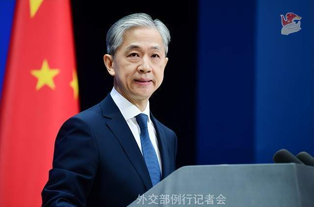

# 美方借涉藏问题对中国官员实施非法制裁，外交部：坚决反对、强烈谴责

8月23日，外交部发言人汪文斌主持例行记者会。

彭博社记者提问，美国22日宣布将对一些中国官员实施签证限制，称这些官员涉嫌将西藏地区的儿童送入寄宿学校，进行“强制同化”。发言人对此有何评论？

 _汪文斌 资料图 图源：外交部网站_

汪文斌表示，美方罔顾事实，借涉藏问题对中国官员实施非法制裁，严重干涉中国内政，严重损害中方利益，严重违反国际关系基本准则。中方对此坚决反对，强烈谴责。

汪文斌指出，西藏人权处于历史最好时期，国际社会对此有目共睹。长期以来，西藏经济蓬勃发展，社会和谐稳定，文化传统得到保护和弘扬，各族人民包括宗教信仰自由、使用和发展本民族语言文字的自由在内的各项权利和自由得到充分保障。

汪文斌说，与国际通行做法一样，中国的寄宿制学校根据当地学生需求设置，在中国各省区都有。在中国西藏，一些地区由于海拔很高，人口居住极为分散，特别是牧民孩子上下学路途遥远十分普遍，分散办学难以保证老师的数量和教学质量，为保障所有儿童平等享受教育的权利，根据实际需要设置了寄宿制学校。寄宿学校完全看学生和家长的意愿和需求，寄宿学生在每个周末和节假日，包括藏历新年、雪顿节等西藏传统节日以及寒暑假都可以选择回家，父母可以随时到校看望子女，也可以根据需要随时接子女回家。同时，有关学校普遍开设了藏语文、民族舞蹈等传统文化课程，提供高原传统食品，学生在校期间也可以穿戴民族服饰。

“西藏寄宿制学校恰恰是保护西藏人权和文化传统的生动案例，所谓‘强制同化’纯属子虚乌有。”汪文斌说。

汪文斌指出，反观美国，历史上470多万印第安土著居民惨遭屠杀，非洲裔、亚裔等少数族裔深受种族歧视之害。近年来，美国武装侵略造成了阿富汗、伊拉克、利比亚、叙利亚数百万人死亡，美方应该切实反躬自省，而不是自封判官，挥舞人权大棒，肆意干涉他国内政。

汪文斌强调，西藏事务纯属中国内政，不容任何外部势力干涉，美方应当尊重事实，恪守在涉藏问题上的承诺，停止利用涉藏问题干涉中国内政、损害中方利益，立即撤销错误决定，否则中方必将作出坚决有力回应。

来源 北京日报客户端记者 刘柳

编辑 周经纬

流程编辑 严圣淼

