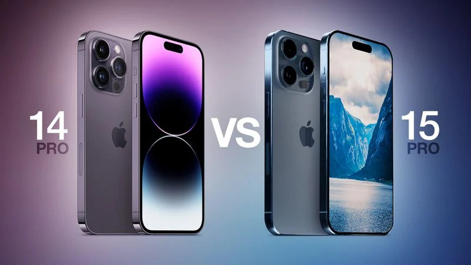

# 苹果iPhone 15 Pro系列21项变化汇总：边框更窄，最大存储有2TB版

IT之家 8 月 23 日消息，国外科技媒体 MacRumors 近日基于彭博社的马克・古尔曼、DSCC 的 Rose
Young、天风证券的郭明錤等诸多可靠信息源， **汇总了苹果 iPhone 15 Pro 机型会带来的 20 多项关键性改变。**

IT之家根据该媒体报道，通过表格形式，对比苹果前后两代产品的关键性差异如下：

最新消息称苹果将于 9 月 12 日星期二举办秋季特别活动，预估将于 9 月 22 日星期五开始正式发售 iPhone 15 系列。

