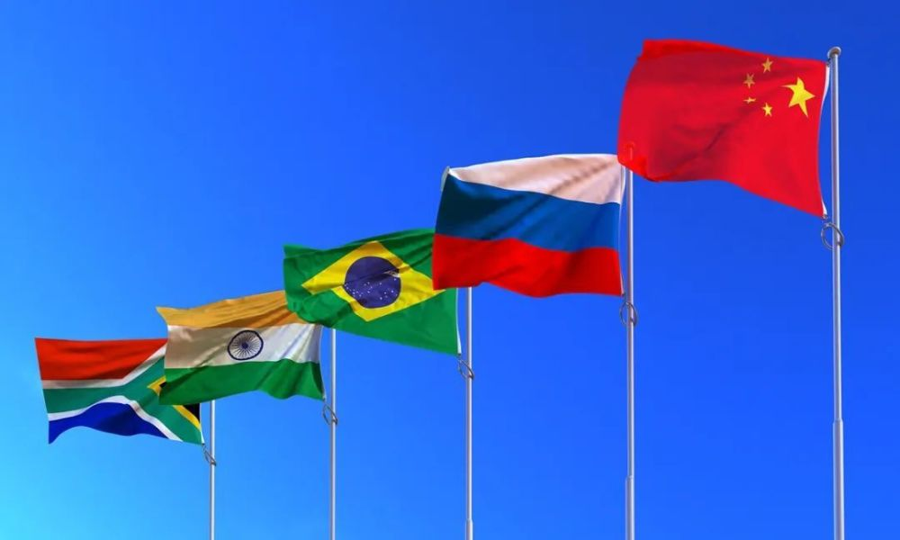
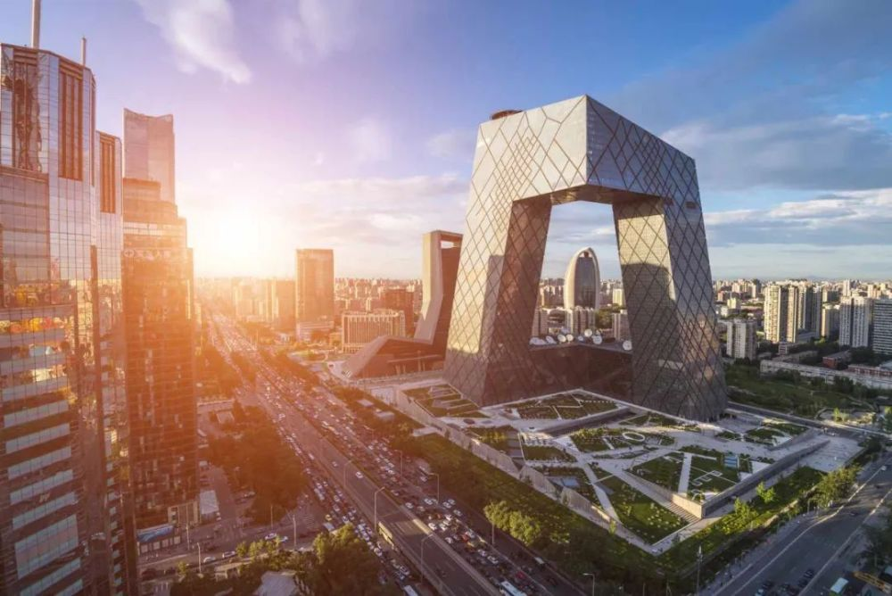

# 金砖国家扩容，将会如何影响世界？

**直新闻：在百年变局之下，金砖国家扩容，展现出在全球治理上怎样的发展新方向？**

**特约评论员 庚欣** ：这届金砖峰会格外引人注目，因为它不仅会商讨新时代金砖国家团结发展大计，而且还会推动全球治理朝着更加公正合理的新方向发展。

要朝着全球治理的新方向发展，就要建立正确的世界观、历史观和大局观。中国有一句老话：“不谋全局者，不足以谋一域，不谋万世者，不足以谋一时”。在百年变局叠加世纪疫情等剧烈变动之下，整个世界正在呈现一个全新的发展格局。有人在炒作“新冷战”，希望“塑造”一个新的“两大阵营”结构，重构世界版图，也有人提出了“冷和平”、“温战”等概念。

其实，我认为，今天世界的新格局似乎还是当年“三个世界”的升级版。

首先，美俄依然是“第一世界”，因为这是两个最大的军事大国与核大国，虽然综合实力已经今非昔比，但依然最具有进攻及焦虑的性格，依然“衰而不弱”，依然是新的“战争风险策源地”。

欧洲、日本等发达国家依然是“第二世界”，依然是集自主性与摇摆性于一身，时常偏于依靠美国霸权但又同床异梦，都与发展中国家过往甚密但又难改当年“列强”的痼疾旧习，比过去更加摇摆不定。

“新第三世界”是以中国等金砖国家为代表的发展中国家和新兴经济体，这是一个发展最快、活力最强的世界最大板块，它不仅是领土占世界26.5%，人口占42%，经济总量已经占全球1/4，贸易额占1/5，而且对世界经济增长的贡献率超过了50%。有人说“新第三世界”依然是“大而不强”，但它是世界发展的主要牵引机，是新的全球化的主要代表。综合实力的迅速增长，政治自主性的不断增强，开放合作、包容发展的自觉性，构建公平合理新国际秩序的主导性等，都越发引起全球关注，成为全球治理新方向的主要引领力量。所谓百年变局，最主要的标志就是这个以金砖国家为代表的“新第三世界”的快速成长和构建人类命运共同体的力量。

正像习近平主席所说，金砖国家这支积极、稳定、向善的力量蓬勃发展，正在从根本上改变世界版图。当今世界是一荣俱荣、一损俱损的命运共同体。各国人民企盼的，不是“新冷战”，不是“小圈子”，而是一个持久和平、普遍安全的世界，一个共同繁荣、开放包容、清洁美丽的世界。这是历史前进的大逻辑、时代发展的新方向。

**直新闻：中国作为最大的发展中国家，在金砖合作中发挥着怎样的作用？**

**特约评论员 庚欣** ：中国在金砖合作中的作用是显而易见的。

首先是“引领”作用，中国是金砖国家中最大的政治经济体，是联合国安理会目前唯一一个没有战争纠纷缠身的常任理事国，换言之，中国是世界真正的和平大国。同时，中国作为世界第二大经济体，中国的发展道路和经验对于绝大多数发展中国家和地区，都具有重要的意义。中国具有中国式现代化的体制优势、超大规模市场的需求优势、产业体系配套完整的供给优势、大量高素质劳动者和企业家的人才优势。中国经济韧性强、潜力大、活力足，长期向好的基本面不会改变。中国将始终是世界发展特别是金砖合作的重要机遇。而且，中国最近适时地提出全球安全倡议、发展倡议等，一直在世界安全、发展以及解决热点纠纷等一系列问题上，也发挥着重要的作用。

其次是桥梁作用。这个桥梁有两个概念，第一个概念是与金砖各国的桥梁关系。中国一直强调，发展中国家首先要把自己的事情办好，努力实现自身国家的社会转型和稳定繁荣。要做到这一点，就需要发展中大国做出表率并穿针引线，将大家团结起来，实现合作共赢。2022年中国的GDP已接近金砖五国总量的3/4
，而且保持着较高的发展速度。金砖其他四个国家以及很多发展中国家，大都以中国作为最大贸易伙伴，贸易额也在快速攀升。中国不仅做出表率，而且通过“一带一路”等各种“桥梁”、“纽带”性举措，努力把每一个金砖国家和发展中国家，都变成一个个货真价实的珍珠，并使大家团结合作，互补发展，结合成符合时代发展方向的“精美项链”。

第二个概念是中国作为发展中经济体与发达经济体的重要桥梁作用。今天世界上，只有中国，既是最大的发展中经济体，同时又是主要发达经济体的最大经济贸易伙伴，例如美国、欧洲、日本，还包括韩国、澳大利亚等。这样的桥梁作用，把“三个世界”都联系在一起，具有着一种真正构建人类命运共同体的价值，这是人类历史上没有过的创举。只有这样的合作，才能使发展中国家不断“补短板”，发展、升级、壮大。也能使发达国家在与发展中国家的合作共赢中，摒弃过去的负面遗产，培养“相互尊重，和平共处，共同进步”的崭新国际环境。构建人类命运共同体，一定需要中国所提倡的这种“金砖精神”和实践的引领。

**直新闻：最近有些西方媒体炒作金砖峰会可能走向“去美元化”或“去美国化”，有些国家也希望反制美国对发展中国家的打压，您怎么看？**

**特约评论员 庚欣**
：确实有这种“去美元化”的声音。比如俄罗斯和巴西还提出了具体的建议。美元的“过度特权”和“武器化”确实加剧了很多国家的不满情绪。这里姑且不论“去美元化”的具体条件及利弊得失，我认为金砖国家需要在整体上建立一种成熟、有效的对美相处之道。一直以来，面对美国等发达国家的打压排挤，特别是最近美国利用政经及金融霸权，不断构筑“小院高墙”，挤压金砖国家等发展中国家的发展空间和机会。作为金砖国家，我们应该采取两种对策。一种对策是“以其人之道，还治其人之身”。这主要是指在重大政治原则问题上，例如主权、领土完整的维护、核心利益的维护等，我们要坚持原则，寸步不让。

还有一种更主要的对策是“反其道而行之”，习近平主席多次明确指出，金砖合作要超越政治和军事结盟的老套路，建立结伴不结盟的新关系；超越以意识形态划线的老思维，走出相互尊重、共同进步的新思路、新道路；超越你输我赢、赢者通吃的老观念，实践互惠互利、合作共赢的新理念。这是中国在金砖合作实践中要坚持、提倡的基本方针。

换言之，我们手中的“金砖”要敲开的，是全球和平发展合作的“大门”，我们要用金砖精神和实践，来反制美国要搞的“新冷战”、“小院高墙”、“脱钩断链”，美国要搞“脱钩断链”，我们就更要搞合作发展，美国搞“小院高墙”，我们就更要构建人类命运共同体。金砖国家为代表的“第三世界”本来就是一个“百花齐放”的大花园。我们各国有不同的民族、人种，有不同的宗教文明背景，有不同的发展水平、政治制度、意识形态、国情特征，我们就是要这样“和而不同”又“休戚与共”地在一起，走向共同发展、稳定、繁荣的未来，今后的人类命运共同体，一定是一个百花齐放春满园的景象。

金砖国家不会搞什么“去美国化”，相反，我们要把美国拉回到全世界人民和平发展合作的时代潮流之中，美国至今依然是金砖各国特别是中国的重要贸易伙伴，中国也正在通过构建中美正确相处之道，团结所有可以团结的力量，包括所有发达国家和发展中国家，促成包容合作共赢的新格局，以此为构建人类命运共同体、真正实践金砖精神做出努力。

作者丨庚欣，深圳卫视《直播港澳台》特约评论员

