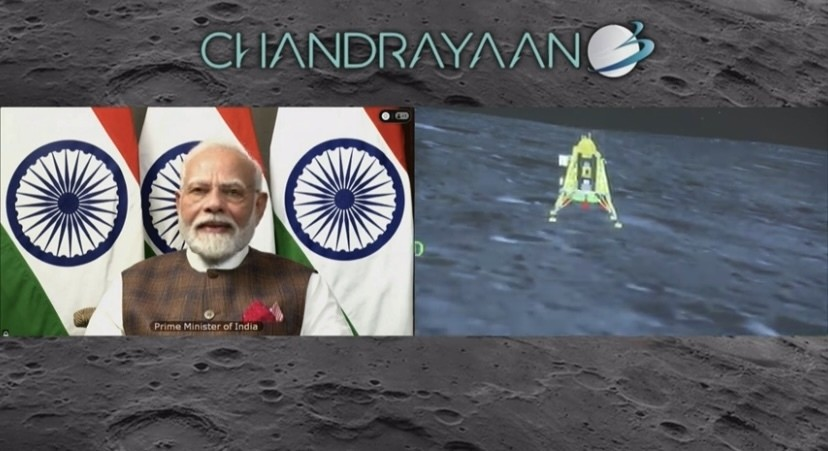
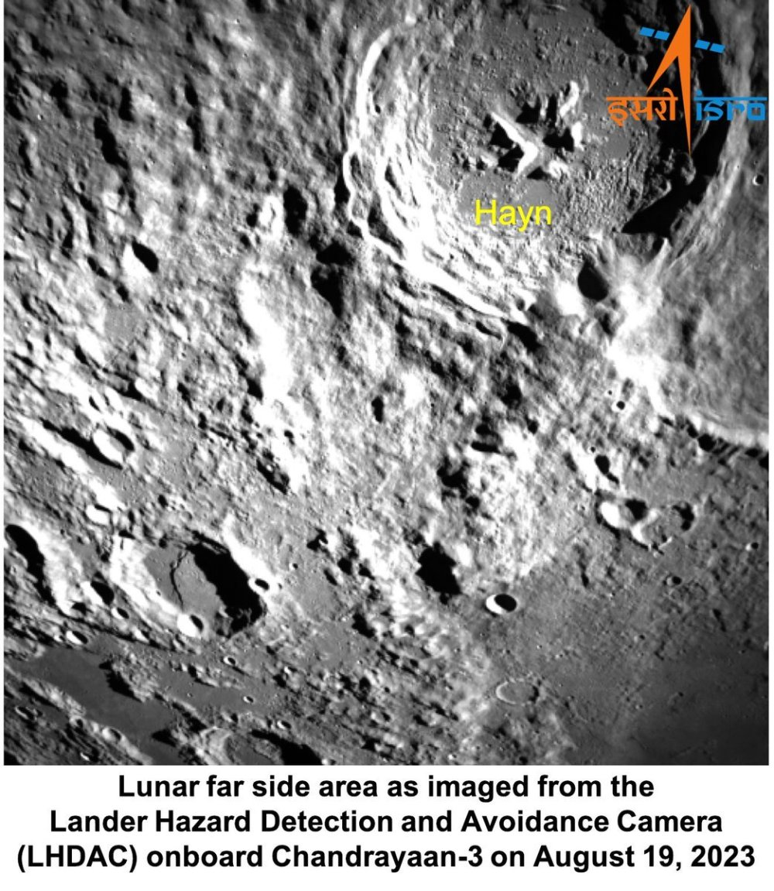
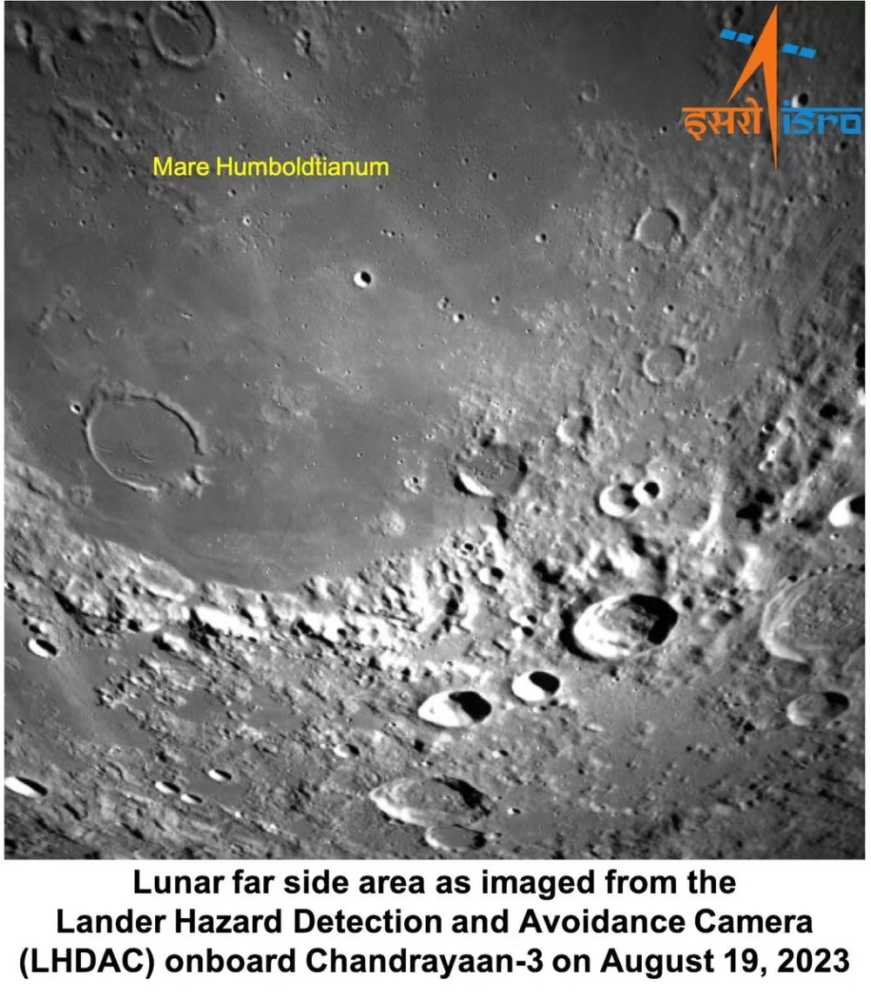

# 首次着陆月球南极！印度成全球第四个着陆月表的国家

北京时间8月23日20时33分，印度第三次探月任务“月船3号”成功着陆月球南极。印度成为继美国、苏联和中国之后第四个在月球表面软着陆的国家，这也是全球第一个登陆月球南极的探测器，推进印度的太空雄心。分析人士预计，如果登月成功，这个南亚国家新生的航天工业将立即得到提振。“月船3号”
预算不到7500万美元，未来印度可以通过复制和改造现有太空技术来保持低成本。

“印度在月球上了！”印度总理莫迪在“月船3号”着陆后发表讲话时如此说道。

 _印度“月船3号”成功着陆月球南极。_

登月提振印度航天工业

在万众期待的登月前夕，印度举国上下兴奋不已，人们为登月成功祈祷，学校组织学生观看登月直播，太空爱好者组织派对庆祝。据路透社报道，在印度北部的北方邦，政府命令所有学校特别放映，鼓励好奇心，向年轻人灌输探索的激情。在印度总理莫迪的家乡古吉拉特邦，科学技术委员会邀请了2000多名学生在大屏幕上“见证这一历史性时刻”。印度孟买和瓦拉纳西8月22日举行了印度教祈祷仪式，庆祝任务成功。

_印度各地民众祈祷“月船3号”成功登月。图片来自印度媒体mid-day。_

印度对探月锲而不舍。在“月船3号”之前，印度第一个月球探测任务“月船1号”于2008年10月发射升空，轨道器携带11件科学仪器，分别来自印度、英国和美国等。基于“月船1号”上一台来自NASA的矿物学绘图仪收集的数据，2018年科学家证实月球上存在水冰。

11年后，印度第二个月球探测任务“月船2号”于2019年7月22日发射，计划让月球车登陆月球南极。但在2019年9月7日，“月船2号”的着陆器在预计软着陆前几分钟坠毁于月球表面，印度首次探测器登月尝试失败。

_8月19日，“月船3号”着陆器的“危险探测和避免相机（LHDAC）”拍摄的月球远侧区域图像。_

“月船3号”是印度第三次探月任务，也是印度第二次尝试将探测器送上月球，7月14日发射升空，计划着陆后在月球表面开展14天科学活动。“月船3号”的着陆器携带了4个有效载荷，用于研究月震、月球表面如何允许热量通过、等离子环境，以及更准确地测量地月距离。月球车上的两个载荷将使用X射线和激光研究月球表面的成分。

在莫迪的推动下，印度将太空发射私有化，并寻求向外国投资开放该行业，目标是未来10年内印度在全球发射市场的份额增加5倍。据路透社报道，分析人士预计，如果登月成功，这个南亚国家新生的航天工业将立即得到提振。

要知道，“月船3号”
预算不到7500万美元。如果任务成功，印度航天部门将利用这种成本竞争力。据《卫报》报道，此次任务价格为7460万美元，远低于其他国家的价格，有专家认为，印度可以通过复制和改造现有太空技术来保持低成本，这要归功于大量高技能工程师，他们的工资只是外国同行的一小部分。

月球南极水冰支撑月球殖民

“月船3号”成功着陆月球，这是全球第一个登陆月球南极的探测器。

日前已坠毁的俄罗斯“月球-25”号探测器本来有望超过印度“月船3号”先行登陆月球南极找冰，但最终失败。美国在阿波罗登月50多年后不仅要重返月球，还要送宇航员登陆月球南极，称这里“为长期的深空科学和探索提供了新的机会”。为何全球都把目光投向月球南极？

_印度“月船3号”成功着陆月球南极，现场工作人员欢呼。_

水是长期探索的关键资源。实际上，早在20世纪60年代，科学家们就推测月球上可能存在水。但美国阿波罗任务的宇航员在20世纪60年代末和70年代初带回用于分析的样本是干燥的。直到2008年，美国布朗大学的研究人员用新技术重新审视了这些月球样本，并在火山玻璃（一种玻璃质结构岩石）微珠里发现了氢。而印度“月船1号”搭载的NASA仪器采集到了数据，2018年科学家证实月球上存在水冰。

NASA月球勘探者号（Lunar
Prospector）任务发现，水冰浓度最高的地方是月球南极的阴影环形山。这里处于永久阴影中，数十亿年来不见阳光，非常寒冷，温度低至零下200多摄氏度。科学家对这些远古的水冰感兴趣。南极的水冰可以追溯到数十亿年前，它们没有受到太阳辐射的污染，也没有受到地质过程的影响，为人类提供了解早期太阳系的窗口，可提供月球火山、彗星和小行星带到地球的物质、海洋起源的线索。

约翰霍普金斯大学应用物理实验室的行星科学家布雷特·德内维（Brett
Denevi）说，从科学的角度来看，这些水很有趣，因为它可以提供线索，解释这种赋予生命的化合物是如何来到太阳系的。它也是一种宝贵资源，任何国家只要掌握了这些水，就可以用来做各种各样的事，例如可以制造火箭燃料，或者为宇航员制造可呼吸的空气。

俄罗斯天文学家、莫斯科大学施特恩贝格国家天文学研究所高级研究员弗拉基米尔∙苏尔金同样表示，月球上的水可以供给宇航员自身、技术装备以及制备火箭燃料使用。

如果存在足够数量的水冰，就可能成为月球探测的饮用水来源，也有助于冷却设备。它可以分解产生氢气用作燃料，产生氧气用于呼吸，支持火星或月球采矿任务。

月球“吞噬”多国探测器

但登月并非易事。2019年，“月船2号”在预计软着陆前几分钟坠毁。今年4月，日本商业航天企业ispace开发的月球表面探测项目“HAKUTO-R”的着陆器在执行着陆进程后，地面团队无法确认着陆情况。后根据数据分析的结果，着陆器撞击到月球表面的可能性较大，探月计划未能达成。8月份，俄罗斯“月球-25”号探测器在试图进入着陆前轨道时，发动机点火运转127秒，比预定的84秒多出43秒，最后导致探测器撞向月球表面。

为何月球软着陆如此艰难？原因之一在于月球几乎没有大气。宇宙飞船着陆地球是利用大气层来减速的，但月球大气层极其稀薄，着陆前的减速下降取决于点燃发动机的大量推进剂。美国佛罗里达理工学院航空航天、物理和空间科学系空间科学项目主席Csaba
Palotai表示，除了发动机，没有什么能帮助减速。尽管可以提供足够燃料来处理意想不到的事情，比如关键的飞行修正，但总体来讲，推进剂是有限的，月球着陆承受不起任何意外。“实际上只有一次机会。”Palotai表示。

月球南极到处是陨石坑和深沟，即使使用先进的传感器，但由于地形和照明条件，也很难从降落到月球南极的探测器上辨别月球表面的样子，一些系统可能还会受到温度上升和急剧下降的影响。

月球上也没有导航定位系统。美国国家航空航天局马歇尔太空飞行中心人类着陆系统首席工程师Tom
Percy表示，导航定位系统在月球上不起作用。所以NASA仍然必须像50多年前阿波罗任务那样进行导航。他们将依靠月球着陆器的计算机来计算航天器必须如何启动推进器，以保持运行在月球特定着陆点的轨道上。

_8月19日，“月船3号”着陆器的“危险探测和避免相机（LHDAC）”拍摄的月球远侧区域图像。_

但今天的月球着陆会得到更多帮助，借助“地形相对导航”这种现代技术，在下降过程中使用相机绘制地面地图，确保前往正确地点，避开陨石坑或巨石。此次“月船3号”着陆器上的“危险探测和避免相机”，就可以帮助“月船3号”在下降过程中定位一个安全的着陆区域。

