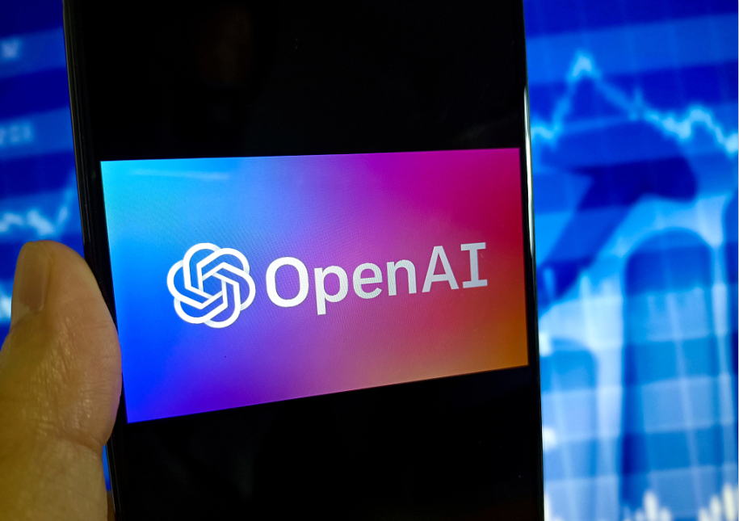
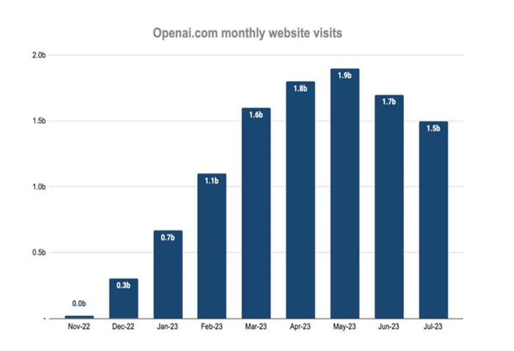

# OpenAI向中东寻求千亿美元融资，创始人：超级智能一个月可攻克癌症

_来源：视觉中国_

作者 | 叶蓁

编辑 | 康晓

出品 | 深网·腾讯小满工作室

多少资金，才能撑起OpenAI未来的野心？

一位中东创投圈知情人士向腾讯新闻《深网》透露，OpenAI首席执行官山姆·奥特曼下半年奔赴阿联酋首都阿布扎比等地寻求融资，此次融资的规模巨大，不低于1000亿美元。

如何打动中东财团？山姆奥特曼讲的故事不仅仅是AGI通用人工智能，他描述OpenAI的目标是要实现Super
intelligence（超级智能），比人类智能要更高级。

“尽管他现在还不知道Super intelligence怎么去实现，他连AGI怎么去实现可能都不知道。”上述知情人士告诉《深网》。

在阿布扎比，有投资人问山姆奥特曼，“如果Super
intelligence（超级智能）实现了，你觉得人类可以多久治愈癌症？”山姆奥特曼的回答是，可能只需要一个月的时间就可以。

但目前离Super intelligence（超级智能）还非常遥远，要实现这一目标，OpenAI需要的资金规模不可想象。

即便仅仅维持目前的运营，OpenAI也将很快遭遇资金困境。ChatGPT今年火遍全球，被誉为人工智能的iPhone时刻，但8月10日，印度媒体Analytics
India Megazine发布报道称，如果山姆奥特曼以目前的速度继续烧钱，OpenAI或将在2024年底被迫申请破产。

OpenAI今年已完成一轮百亿美金融资，估值近300亿美金。据美国科技媒体4月份报道，OpenAI已完成103亿美元的新一轮融资，估值达到270亿-290亿美元。参与本轮融资的风投公司包括老虎全球管理、红杉资本、加州Andreessen
Horowitz、纽约Thrive和K2 Global。

据了解，本轮投资与早先微软入股属于同一轮。今年1月中旬，微软对OpenAI投资100亿美元，占股达到49%。微软与OpenAI的合作始于2019年7月，当时微软宣布向OpenAI提供10亿美元的投资，并与其建立独家云计算合作关系。

**昂贵的烧钱游戏，成全英伟达**

众所周知，OpenAI最大的一项成本在于算力投入。

OpenAI资料显示，ChatGPT训练一次13亿参数的GPT-3
XL模型每天需要的全部算力约为27.5PFlop/s，而训练一次1746亿参数的GPT-3模型每天需要的算力约为3640PFlop/s。光是维持运行ChatGPT，OpenAI每天就要投入大约70万美元，还不算日常费用。

百川智能创始人、CEO王小川在参加《中国企业家》活动时分享了他与OpenAI沟通的经历，其中有一个细节，就是OpenAI做GPT-3时，需要4000张卡做训练，GPT-4需要2万张卡做训练，现在是把1000万颗GPU连在一起训练新的模型。

以英伟达上一款旗舰GPU A100来粗略估算，目前一张A100
40G的售价为6.3万元，排除近期GPU价格大涨的情况，OpenAI三个阶段光是GPU方面的训练成本，分别需要2.52亿元、12.6亿元和6300亿元。

**英伟达在上一财季的财报中曾指出，对用于训练大型语言模型的处理器的需求，将推动公司营收同比增长近三分之二，并帮助其在截至7月底的财季让每股收益实现同比三倍以上的增长。英伟达提到的大型语言模型，就包括了OpenAI的ChatGPT等。**

美东时间8月23日周三美股盘后，英伟达公布，在截至公历2023年7月30日的2024财年第二财季，营业收入和每股收益（EPS）均翻倍暴增，不但一扫一季度两位数下滑的颓势，而且分别较华尔街预期水平高22%和29%以上。

二季度营收135.07亿美元，同比增长101%，远超英伟达此前就高于市场预期的指引区间107.8亿到112.2亿美元
。二季度非GAAP口径下调整后毛利率为71.2%，分析师预期70.1%。

业绩指引方面，英伟达预计，下季度营业收入为160亿美元，将同比增长170%，连续两个季度翻倍增长，而此前分析师预计三季度营收为125亿美元。

OpenAI无疑是英伟达业绩飙升最重要的贡献者，“但这仅仅是算力部分，还没算另外两个很花钱的部分，一个是数据，一个是人力成本，现在全球大模型领域的人才，是非常稀缺的。”将门创投创始合伙人、前微软创投大中华区负责人杜枫博士告诉《深网》。

根据 LinkedIn 的一份报告，人工智能专家职位是最热门的新兴职位之一，在美国每年的平均基本工资为 13.6
万美元。同一份报告还发现，过去四年对人工智能专家的需求每年增长 74%。

据美媒报道，因开发ChatGPT，OpenAI
2022年的亏损大约翻了一番，达到5.4亿美元，收入却只有300万美元。OpenAI首席执行官山姆·奥特曼，定下了今年营收2亿美元、明年营收10亿美元的目标。

Analytics India Megazine指出：OpenAI
之所以眼下还在正常运转，得益于上一轮103亿美元的融资。因此“破产”的预测对于OpenAI
来说，显然有点危言耸听，因此该文的作者也在文末指出，破产的前提是“OpenAI不能尽快获得更多资金”。

OpenAI 和当下许多AI公司有共同痛点：未能收支平衡。

ChatGPT推出几个月后，OpenAI首席执行官山姆·奥特曼曾公开承认经营AI公司和ChatGPT的成本非常高，因此选择了商业化。

OpenAI在商业化方面的尝试，但收效甚微。今年2月份，OpenAI推出了一项每月19.99美元的付费订阅计划。但目前ChatGPT用户数也已过峰值并且在下滑。Similarweb数据显示，6月ChatGPT网站全球流量下降9.7%，访问者在网站上花费的时间也下降了8.5%。

**美国大模型竞争格局已生变**

预测OpenAI破产的言论一石激起千层浪，盖瑞·马库斯(GaryMarcus),新硅谷机器人创业公司Robust.AI首席执行官兼创始人在推特上表示，“这一预测既没有考虑到软件有可能变得更加高效，也没有考虑到微软可能会以获得控制权为交换，向OpenAI提供更多资金。”

资料显示：2018年微软向OpenAI投资10亿美元，买断GPT-3基础技术独家许可起，微软成OpenAI的独家云供应商，OpenAI大部分技术优先授权给微软产品。去年ChatGPT的爆火后，微软向OpenAI追投数十亿美元后，ChatGPT被接入微软云服务、新版Bing
AI搜索引擎、GPT-4、GPT-4版Office全家桶等。

微软在某种程度上，一直是OpenAI公司的白衣骑士。但现在这种情况正在发生发生微妙的变化。

今年7月中旬微软作为首发合作伙伴，微软CEO萨提亚·纳德拉（Satya Nadella）出现在Meta下一代开源大语言模型Llama
2的发布会现场，震惊了许多业内人士。

从去年12月ChatGPT诞生后，今年2 月份 Meta 发布的 Llama，3月份斯坦福大学微调 Llama 后发布的 Alpaca，5月份出现的
Falcon，世界各地的开源模型在中快速进步。LLaMA2的诞生无异于在大模型战场投下了一发重磅炸弹，为美国的大模型之战增添了变数。

毋庸置疑，OpenAI的优势正在丧失。尽管GPT-4依然稳居各种大模型评测榜单的榜首，但其他大模型与GPT-4之间的差距正在以惊人的速度缩小。GPT-4依然是最强，但已经不是当下业界的唯一首选。

“Llama2的出现，对ChatGPT而言，整个大模型领域的竞争格局已经清晰，就像iOS和安卓之争，目前是并驾齐驱的。”中科智深创始人成维忠告诉《深网》。很明显，在大模型领域，ChatGPT不再是唯一的选择。

就连OpenAI公司曾经的白衣骑士微软，也开始积极拥抱第三方大模型。微软宣布与Meta官宣合作，此外，微软也找到了新的盟友——Databricks。其实微软和OpenAI公司关系的微妙变化，或许可以在其最近刚刚发布的财报里找到注脚。

从微软刚刚公布的2023财年第四季度（自然年2023年第二季度）财报来看，GPT似乎并没有带飞微软。微软搜索和新闻广告收入、个人计算业务部门都没有因为接入GPT出现明显增长。

毫无疑问，绝对足够的资金，才能为OpenAI建立安全感。

如此一来，或许就能理解OpenAI首席执行官山姆·奥特曼为何远赴中东融资。

近期，中东资本在国内频频刷屏。

8月14日，恒大汽车获得总部位于阿联酋迪拜的纽顿集团（Nasdaq:NWTN）约5亿美元战略投资，另有6亿元人民币过渡资金将自公告后5个工作日开始陆续到账。

而此前的7月12日，蔚来汽车公告，已完成了来自CYVN Investments RSC Ltd的7.385亿美元战略股权投资，该公司是CYVN
Holdings L.L.C.的子公司，该公司为阿布扎比政府持有多数股权的投资工具。

标普全球援引的全球主权财富基金数据平台Global
SWF的数据显示，中东六国主权财富基金规模达到4万亿美元，超过全球总量1/3。而在2022年的全球十大主权财富基金中，有5个来自海合会国家——其中包括阿联酋的3只主权财富基金，分别是主要投向北美的阿布扎比投资局（ADIA）、主要投向欧洲的穆巴达拉投资公司（MIC）和青睐于新兴市场国家的阿布扎比主权财富基金（ADQ）。

据悉，阿布扎比主权基金是全球最大的主权财富基金之一，目前规模近9000亿美元，成立于1976年，由阿布扎比酋长国拥有，资金主要来源于阿布扎比的石油收益。

