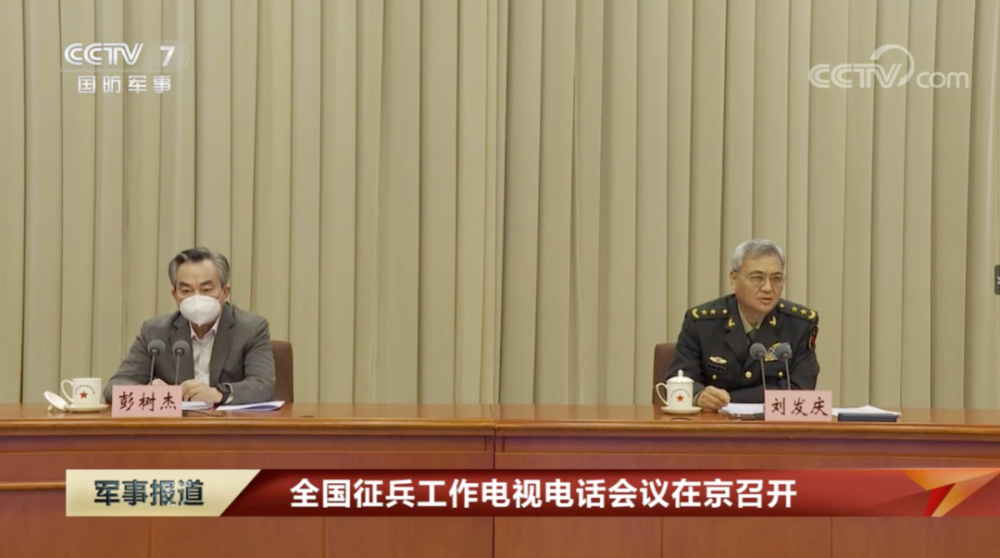

# “打仗需要什么兵就征什么兵”！中央军委国防动员部部长发声，有重要信息

**撰文 | 余晖**

8月23日，中央军委国防动员部部长刘发庆在《中国国防报》发表了署名文章，文章的标题是《为备战打仗提供高质量“源头活水”》。

文中提到，坚持战斗力这个唯一的根本的标准，推进征兵由偏重平时向平战一体转型；突出一线急用、岗位急缺，做到打仗需要什么兵就征集什么兵。

一个背景是，目前，下半年征兵工作已经开始。根据安排，今年下半年征兵从8月15日开始，至9月30日结束。

**军委国防动员部第二任部长**

中央军委国防动员部是军改后设立的新部门，主要职责为在精简常备军的同时，加强国防动员建设，是增强国防实力、保卫国家安全的需要。

2016年，国防部新闻发言人吴谦曾介绍，“组建军委国防动员部， **履行组织指导国防动员和后备力量建设职能，领导管理省军区**
，有利于从战略层面加强对国防动员和后备力量建设的组织领导，是构建中国特色国防动员体系的一个重要举措。”

盛斌是军委国防动员部的首任部长。

盛斌曾任第40集团军参谋长、副军长，第39集团军副军长，黑龙江省军区司令员等职，后任原沈阳军区副司令员，2016年出任军委国防动员部部长。

2022年，刘发庆接替盛斌任军委国防动员部部长，在履新前，刘发庆为陆军副司令员。

今年1月18日，2023年全国征兵工作电视电话会议召开，对今年两次征兵工作进行安排部署。新闻画面显示，刘发庆出席。

那次会议强调，要“聚焦建成世界一流军队征集更多优质兵员”。

**时隔20余年，征兵条例再修订**

**征兵工作是国防和军队建设的源头工程、基础工程，直接关系部队战斗力** 。

二十大报告强调“如期实现建军一百年奋斗目标，加快把人民军队建成世界一流军队”，明确要求“ **加强国防动员和后备力量建设** ”。

随着经济社会快速发展，国防和军队改革深入推进，征兵工作环境发生深刻变化。

今年4月1日，中央军委主席习近平、国务院总理李强签署命令，公布了修订后的《征兵工作条例》，自2023年5月1日起施行。

这是《征兵工作条例》的第二次修订。该《条例》1985年10月24日发布，2001年9月5日进行了第一次修订。

最新修订的《条例》明确，全国的征兵工作，在国务院、中央军事委员会领导下，由国防部负责，具体工作由国防部征兵办公室承办。
**国务院、中央军事委员会建立全国征兵工作部际联席会议制度，统筹协调全国征兵工作** 。

《条例》还明确以大学生为重点征集对象，优先保证高校毕业生和对政治、身体条件或者专业技能有特别要求的兵员征集；符合条件的退役士兵可以再次入伍，并优先安排到原部队或同类型岗位。

**“打仗需要什么兵就征集什么兵”**

目前，下半年征兵工作已经开始。

多说几句。

自2020年起，我国由一年一次征兵一次退役，调整为一年两次征兵两次退役。

实行一年两次征兵两次退役后，征兵时间区分为上半年和下半年两次。

根据安排， **今年上半年征兵从2月15日开始，至3月31日结束；下半年征兵从8月15日开始，至9月30日结束。**

8月23日，刘发庆在《中国国防报》发表了《为备战打仗提供高质量“源头活水”》的署名文章。

他提到，坚持向胜征兵、精准征兵、依法征兵、阳光征兵。

坚持战斗力这个唯一的根本的标准，推进征兵由偏重平时 **向平战一体转型** ，优化完善优质兵员征集制度机制，
**突出一线急用、岗位急缺，做到打仗需要什么兵就征集什么兵** ，确保征兵工作准星对准制胜打赢靶心。

推动征兵由数量规模向质量效能提升，突出各级各类学校毕业生征集， **优先批准理工类大学生和备战打仗所需技能人才入伍** 。

**抓紧制定完善地方性法规及相关配套政策** ，全面加强执法检查，不断提升依法征兵能力。

他还提到，廉洁征兵事关国防和军队建设根基，事关党、国家和军队形象，涉及人民群众切身利益。

要“强化红线底线高压线意识， **严禁借征兵之机吃拿卡要，严禁利用征兵进行任何形式的商业操作牟利** ，持续释放高压严治强烈信号”。

**多位地方政府一把手就征兵工作发声**

政知君注意到，山西省省长、省征兵工作领导小组组长金湘军，上海市市长、市征兵工作领导小组组长龚正，福建省省长、省征兵工作领导小组组长赵龙等也在《中国国防报》上发声。

金湘军提到，山西将退役大学毕业生纳入全省干部人才培养体系，提高公务员、国企定向招录比例。将高级技能人才与大学毕业生同等对待，对退役复学人员在学历升级、对口升学、计划单招等方面给予优待。

龚正提到，上海完善针对大学毕业生和高技能人才的优待政策，建立健全阶梯式优待优抚机制，在免试专升本、复学转专业、个人就业创业等政策执行上优先考虑在役时间较长人员，鲜明树立起重点对象优先征集、服役越长待遇越好的政策导向。

赵龙提到，福建持续完善“吸引入伍、激励在伍、服务退伍”的政策体系，从经济补助、就业安置、创业帮扶等方面加大入伍优待力度，充分激发有志青年参军入伍积极性。

**资料 ｜ 新华社 人民网 央视 中国国防报 军网等**

**【版权声明】本文著作权归政知新媒体独家所有，未经授权，不得转载。**

