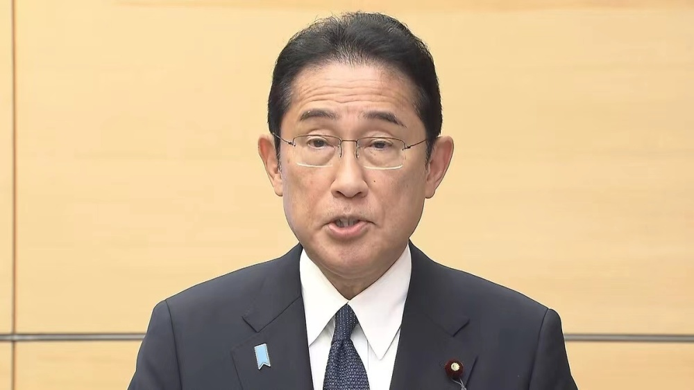

# 中方宣布全面暂停进口日本水产品后，岸田急忙回应，中国大使回击

【环球网报道】日本政府24日不顾多方反对执意启动福岛第一核电站核污染水排海工作，晚些时候，中国海关总署宣布，全面暂停进口日本水产品。据日本东京广播公司报道，日本首相岸田文雄声称，“已通过外交渠道向中方提出交涉，要求立即撤销”上述措施。

关于日方启动福岛核污染水排海，中国驻日本大使吴江浩24日向日本政府提出严正抗议。吴江浩指出，中国政府宣布全面暂停进口原产地为日本的水产品，是理所当然的，也是完全必要的。造成这一局面的责任完全在日方，日方应该反躬自省。

_岸田文雄24日发表言论，日媒报道配图_

据中国海关总署早些时候发布的消息，为全面防范日本福岛核污染水排海对食品安全造成的放射性污染风险，保护中国消费者健康，确保进口食品安全，依据《中华人民共和国食品安全法》及其实施条例、《中华人民共和国进出口食品安全管理办法》有关规定，以及世界贸易组织《实施卫生与植物卫生措施协定》有关规定，海关总署决定自2023年8月24日（含）起全面暂停进口原产地为日本的水产品（含食用水生动物）。

当天，中国外交部发言人就日本政府启动福岛核污染水排海发表谈话：8月24日，日本政府无视国际社会的强烈质疑和反对，单方面强行启动福岛核事故污染水排海，中方对此表示坚决反对和强烈谴责，已向日方提出严正交涉，要求日方停止这一错误行为。

日本福岛核污染水处置是重大的核安全问题，具有跨国界影响，绝不是日本一家的私事。自人类和平利用核能以来，人为向海洋排放核事故污染水没有先例，也没有公认的处置标准。12年前发生的福岛核事故已经造成严重灾难，向海洋释放了大量的放射性物质。日方不应出于一己之私利，给当地民众乃至世界人民造成二次伤害。

日本政府没有证明排海决定的正当合法性，没有证明核污染水净化装置的长期可靠性，没有证明核污染水数据的真实准确性，没有证明排海对海洋环境和人类健康安全无害，没有证明监测方案的完善性和有效性，也没有同利益攸关方充分协商。海洋是全人类的共同财产，强行启动向海洋排放福岛核污染水，属无视国际公共利益的极端自私和不负责任之举。日方所作所为是将风险转嫁给全世界，将伤痛延续给人类的子孙后代，成为生态环境破坏者和全球海洋污染者，侵犯各国人民健康权、发展权和环境权，违背自身道义责任和国际法义务。日方将核污染水一排了之，同时也将自己置于国际被告席，必将长期受到国际社会谴责。

中国政府一贯坚持人民至上，将采取一切必要措施，维护食品安全和中国人民的身体健康。

