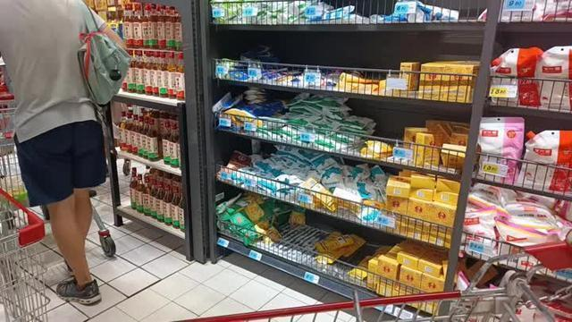
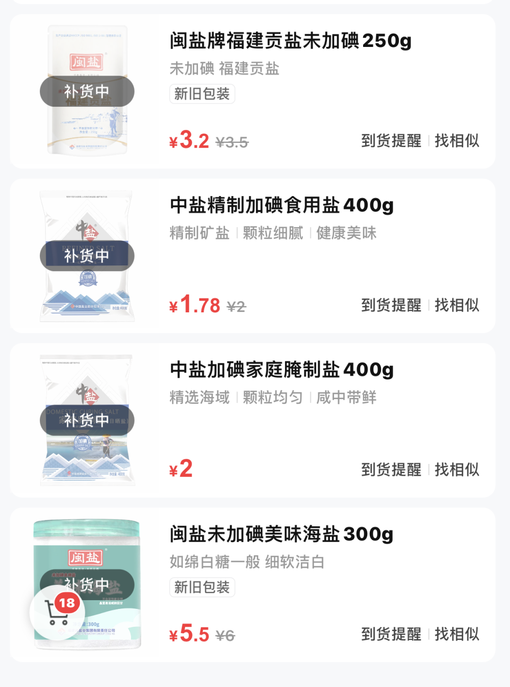
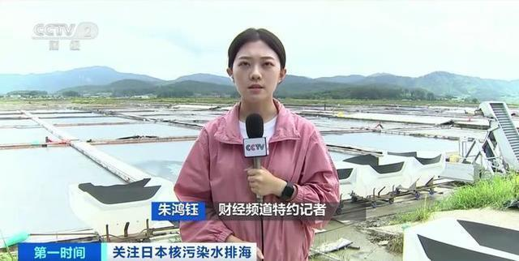
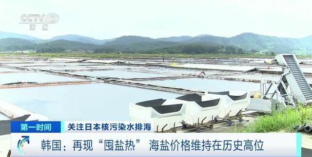

# 国内多地市民抢盐，有超市货架被搬空，官方和专家回应

日本于8月24日下午启动福岛核污染水排海，我国沿海部分地区居民出现抢购食用盐现象，部分商超生活食盐卖断货。对此，多地官方部门做出回应，食用盐充足供应，呼吁市民不必恐慌，更不必效仿“囤盐”。专家则表示，国内的产盐量也满足需求，不用恐慌，不用过度囤盐。

**扬州：一些微信社群刮起囤盐潮**

据扬州新闻广播报道，24日早上，在大润发等超市购买食盐的市民明显增多。不少购买食盐的市民表示，虽然知道食盐保质期只有3年，但是看到其他人买了，也就“跟风”囤一些。

市民的恐慌一部分是来自微信群，一些微信群已经开始分享“囤盐”信息。而在一些团购群，一些“团长”已经开始推销起食盐。

扬州市盐业有限公司市场运营部部长李桐林介绍，今天上午，该公司已经走访了部分乡镇和大型商超，在市场上发现有少部分地区存在群众囤盐现象。他表示，盐业公司对食盐有常规的储备，正常情况下的库存都能满足市区两个月的供应，所以保供是不存在问题的。“在经历过2021年的扬州疫情和2011年的日本海啸情况，我们都能安然的保障食盐的供应。所以这一次这个情况，保供是没有问题的。”

李桐林建议市民，没有必要囤积食盐，购买时按照自己的需求采购即可。“建议我们群众根据正常的消费购买食盐，完全没有必要受日本排放核污水的影响，到市场上进行抢购、囤积食盐。我们江苏现在的食盐产品大部分都是淮安地区产的井矿盐，大家在选购的时候可以根据自己的需求进行选择。”

**福州：部分商超生活食盐卖断货**

福州有些市民抢购食用盐，目前永辉部分门店出现食盐抢购情况，朴朴、永辉生活食盐卖断货。对此，福州市商务局提醒，将继续全力做好保供稳价工作，食用盐货源充足，市民按需理性购买，不信谣、不传谣。

24日上午，在永辉奥体店货架上食用盐货源充足。“昨天晚上接到妈妈电话，说核污染水排放入海，担心食用盐也被污染，让我囤些盐。”现场顾客李女士说，她多买了2包盐，“整箱囤没有必要。”

“最近几天购买食用盐的市民有增加。”该店店长陈冰云说，这几天食用盐销量有升，但是没有出现外地出现的“食用盐整箱买”抢购的情况。

了解到，福州市民平时吃的盐，基本上有这几种：中盐食用盐，400克售价约2元；闽盐福建原盐，350克售价约2元；闽盐牌福建贡盐，250克售价大约3.5元。

登录朴朴以及永辉生活APP，发现朴朴销售的5款食用盐有4款处于“补货中”状态；永辉生活APP中食用盐也出现断货状态。

“近日，我们部分门店出现食品盐抢购现象，我们将全力做好保供稳价工作，充足备货，同时呼吁市民理性购买，不要过度囤积食用盐，不信谣、不传谣。”福建永辉超市有关负责人表示，永辉将及时了解市民需求，多措并举，确保市民能够得到足够的食用盐。

对此，福州市商务局提醒，将继续全力做好保供稳价工作，食用盐货源充足，市民按需理性购买，不信谣、不传谣。

**广东：食盐供应安全充足，储备量达10.8万吨**

针对市民担忧食盐安全问题、开启抢盐模式，广东盐业集团负责人介绍，目前，省、市两级食盐政府储备量和企业社会责任储备共10.8万吨，百分百覆盖全省各市县行政区域，能迅速及时响应，保障广东人民食盐充足供应，呼吁市民不必恐慌，更不必效仿“囤盐”。

“自日本宣布试运行排放核污染水后，我们已对广东省主要海盐生产工区的海域海水及生态海盐进行了α、β放射性项目的第三方送样检测，结果显示目前的广东海盐是安全的。所以，大家保持警惕的同时也不必过度担忧。”该负责人介绍，凡是通过正规渠道购买的粤盐产品，均符合国家标准，可放心食用。

“我们会持续密切关注国家及广东省环保部门公布的海水水质信息，对广东海水定期进行放射性元素送检，并严密监控盐产品是否受污染的情况，保障广东盐业食盐产品的质量安全及供应安全。”该负责人表示。

**专家：不建议过度囤盐**

中国的盐是否会面临核污染水排海计划的影响？我们需不需要囤盐？

中国盐业协会会长表示，我们国家有严格的食品安全规定，国内的产盐量也满足需求。

大连海事大学法学院教授、博士生导师张晏瑲表示，我国食用盐与韩国不同，主要来自井盐，不会涉及污染区域，居民不用过度囤盐。

据扬州新闻广播，囤盐行为可能带来一些潜在的危害和负面影响，包括：

1\. 资源浪费：囤盐会导致不必要的资源浪费，因为大量囤积的盐可能无法被充分利用，过期或者变质。

2\. 价格上涨：囤盐行为可能导致供应紧张，进而推高市场价格。如果大量人群囤积盐，会造成需求激增，对供应链产生压力，可能导致物价上涨。

3\. 社会恐慌：囤盐行为会引发社会恐慌。当人们看到他人囤积日常生活必需品，会产生恐慌心理，进而引发类似抢购的行为，加剧市场紧张程度。

4\. 食品浪费：过度囤积可能导致食品浪费，特别是当囤积的食用盐过期或变质时，不但导致经济浪费，还增加了环境负担。

因此，我们应该遵循实际需要购买和使用食品，包括盐，合理规划消费，避免恶性囤积现象产生的不必要负面影响。同时，政府也会采取相应的措施来维护市场秩序，保障民众的正常生活需求。

此前，相关报道称，因核污染水排海，韩国盐价大涨，民众疯狂“囤盐”。

核污染水排海，使整个韩国社会都笼罩在紧张的气氛中，消费者对于海盐和水产品安全性的担忧不断加剧，韩国民众再现“囤盐热”。

财经频道特约记者
朱鸿钰：在韩国西南部全罗北道的高敞郡，这里盛产高品质的海盐，工人们把海水引入盐田后，通过风吹日晒后结晶出盐。日本敲定24日启动排海的消息传出后，曾一度趋于缓和的“囤盐热”再次成为韩国国内热议的话题。很多消费者担忧，排海将使海盐和水产品都遭受污染，尤其是入秋后用海盐腌制泡菜的时节越来越近，必须抓紧最后的时机买盐。目前，韩国的海盐价格仍维持在历史高位，本周5公斤的袋装盐售价约合人民币66元，相比往年高出了五成左右。

韩国的零售业也进入了紧急状态，因担心排海后水产品销售额锐减，已开始预售中秋礼盒的连锁超市强调，冷冻黄花鱼和带鱼都是提前储备好的货源。百货商店表示，连明年春季期间的水产类干货也完成了备货，并推出原产地远离日本的鱼贝类作为新商品。很多餐厅在门口挂上“不使用日本水产品”的字样，水产养殖户也担心已走到破产的边缘。据估算，排海后仅济州岛一地的水产品消费支出，每年就将减少约合人民币24亿元，旅游消费年支出也将较之前下滑约三成。

来源 | 羊城晚报•羊城派综合扬州新闻广播、掌上福州、央视新闻等

责编 | 梁泽铭

