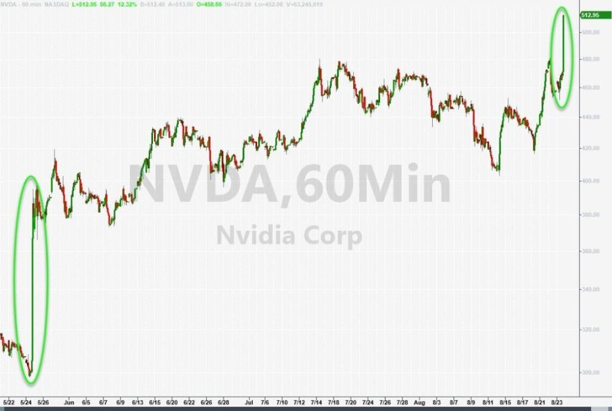
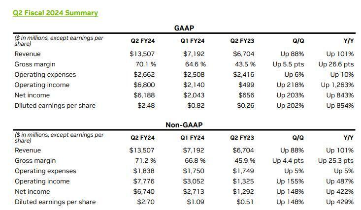

# 碾压预期！英伟达第二季度收入、利润翻倍，盘后一度涨10%

本轮人工智能（AI）热潮的大赢家再次经受住了考验，AI底层算力龙头、芯片巨头英伟达今年内每个季度的已公布业绩都优于预期，最近一个季度的收入比之前就让华尔街惊喜的指引还高，而且本季度的指引继续高于预期。

英伟达披露，本周一，公司董事会批准新增回购股票250亿美元的计划，没有到期时间，公司计划本财年继续回购股票。

英伟达的财报显示，即使分析师报以很高期望，英伟达也不孚众望，在AI热潮激发的需求带动下，利润继续爆表，并且游戏业务重回增长。

财报公布后，收涨近3.2%的英伟达股价迅速拉升，盘后涨幅一度约10%，后回落到7%左右。若保持周四这一涨势，将刷新一个多月前所创的收盘历史高位。在今年二季度成为全球首家市值突破1万亿美元大关的芯片公司后，周四市值有望突破1.2万亿美元。

英伟达提供可以帮助AI产品训练大量文本、图像和视频的图形处理单元（GPU），在AI大模型竞赛中掌握着供应算力的“命门”，由此成为今年AI概念热潮中的一大赢家。截至本周三收盘，股价年初以来累涨超220%。

财报公布前，大部分分析师都看好英伟达股价和业绩。据FactSet数据，覆盖该个股的50位分析师大多看涨，平均目标价约为537美元，比周二收盘价高18%，最高目标价甚至达到1000美元。

ChatGPT引爆今年市场对AI技术的狂热，是年内美股上涨的核心逻辑之一。英伟达目前在标普500指数中的权重接近3.1%，其股价高涨成为将美股一大推手。媒体估算，在今年纳斯达克100指数30%以上的累计涨幅中，英伟达贡献最大，有将近7个百分点的涨幅都来自英伟达。

二季度营收较预期高22% 盈利同比增超四倍 较预期高近30%

美东时间8月23日周三美股盘后，英伟达公布，在截至公历2023年7月30日的2024财年第二财季（下称“二季度”），营业收入和每股收益（EPS）均翻倍暴增，不但一扫一季度两位数下滑的颓势，而且分别较华尔街预期水平高22%和29%以上。

二季度营收135.07亿美元，同比增长101%，结束连续三个季度下降之势，远超英伟达此前就高于市场预期的指引区间107.8亿到112.2亿美元
，分析师预期同比增长约65%至110.4亿美元，
一季度同比下降13%。二季度非GAAP口径下调整后毛利率为71.2%，同比提升25.3个基点，也高于公司指引70%（上下浮动50个基点），分析师预期70.1%，一季度同比下降30个基点至66.8%。二季度非GAAP口径下调整后EPS为2.70美元，同比增长429%，分析师预期同比增约310%至2.09%，一季度同比下降20%。

AI芯片所在数据中心业务同环比均翻倍激增 较预期高近30% 游戏业务同比重回增长

分业务看，AI对英伟达业绩的贡献突出。包括AI显卡在内的英伟达核心业务数据中心同样收入翻倍激增，增速远超一季度，并且刷新一季度所创的单季最高纪录。另一大业务游戏的收入扭转前一季度两位数同比下降之势，也优于预期。

二季度数据中心营收为103.2亿美元，同比增长171%，环比增长141%，较分析师预期79.8亿美元高逾29%，一季度同比和环比分别增长14%和18%。二季度游戏营收24.9亿美元，同比增长22%，环比增长11%，较分析师预期收入23.8亿美元高4.6%，
一季度同比下降38%、环比增长22%。

英伟达称，数据中心收入主要来自云服务商和大型消费类互联网公司。基于Hopper和Ampere
架构GPU的英伟达HGX平台之所以强劲需求，主要源于开发生成式AI和大语言模型的推动。

英伟达表示，游戏业务的收入重回增势主要反映了，在渠道去库存后，市场对英伟达GeForce RTX
40系列GPU的需求。业绩电话会上，英伟达管理层称，游戏GPU的需求已经重拾增长。笔记本显卡需求强劲。需求相当不错。可以预见到今后直至明年的需求前景。

此外，英伟达二季度的专业可视化业务收入3.79亿美元，同比下降24%，环比增长28%。英伟达认为，这块业务的同比下滑继续反映了渠道去库存影响，环比增长受到企业工作站和英伟达RTX产品的强劲需求增长推动。

汽车业务二季度收入2.53亿美元，同比增长15%，环比下降15%。英伟达称，同比增长主要源于自动驾驶平台的销售这个因子，环比下降反映出汽车总体需求下降，尤其是在华需求。

三季度营收指引同比增170% 较预期高28%

业绩指引方面，英伟达预计，本季度、即2024财年第三财季（“三季度”），营业收入为160亿美元，正负浮动2%，相当于指引范围在156.8亿到163.2亿美元之间。这将是连续三个季度同比下降后连续两个季度增长。

以160亿美元计算，英伟达预期三季度营收将同比增长170%，连续两个季度翻倍增长，较分析师预期高28%。分析师预计三季度营收为125亿美元，同比增长近111%。

英伟达还预计，三季度非GAAP口径下的调整后毛利率为72.5%、上下浮动50个基点，即72%到73%之间，较一年前同比提高16.4个百分点；三季度的营业费用料将为20亿美元，同比增长11.5%。

黄仁勋：计算的新时代开启 价值数万亿美元数据中心在转变为加速计算和生成式AI

在二季度财报中，英伟达CEO黄仁勋表示，

“一个计算的新时代已经开启。世界各地的公司正在从通用计算向加速计算和生成式AI转型。”

黄仁勋称，二季度，一些大型云服务供应商都宣布，计划在其数据中心采用英伟达的H100 AI 芯片。同时，全球领先的企业 IT
系统和软件提供商也宣布和英伟达建立合作伙伴关系，将英伟达的AI引入各个行业。“应用生成式AI的竞赛已经开始。”

在业绩电话会上，黄仁勋表示，全球在云上安装的数据中心价值已约有1万亿美元。价值数万亿美元的数据中心正在进行加速计算和生成式AI的转变。
我们看到两种平台的转变同时发生。

黄仁勋说，加速计算是目前成本效率最高、最节能、最高效的计算方式。现在又出现了生成式AI支持的计算已经出现。生成式AI让人们有理由将传统的通用计算转变为新型的加速计算。

