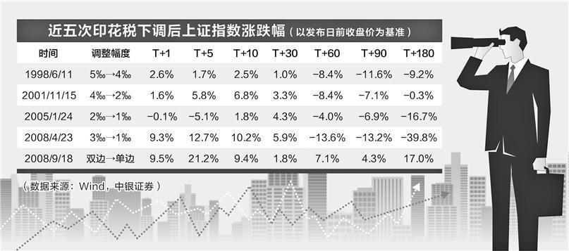

# 证券时报：调降印花税呼声再起，提振市场信心更需综合发力

证券时报 | 作者 郭博昊

_图虫创意/供图 郭博昊/制表 周靖宇/制图_

近期，关于调整证券交易印花税的讨论甚多。

自7月24日中央政治局会议提出“要活跃资本市场，提振投资者信心”以来，减免证券交易印花税的呼声渐高。8月18日，证监会有关负责人回应，从历史情况看，调整证券交易印花税对于降低交易成本、活跃市场交易、体现普惠效应发挥过积极作用。

在目前情况下，证券交易印花税是否具备减免可能？多位受访专家表示，证券印花税具备调整可行性和空间。

**调降印花税象征意义大于实际**

我国的证券交易印花税始于1990年，由深圳证券交易所和上海证券交易所先后开征。1990年至今，A股证券交易印花税经历2次上调，7次下调，目前按股票交易成交金额的1‰对卖方单边征收。

“从短期看，证券交易印花税调整往往对资本市场和投资者信心产生立竿见影的影响。”中央财经大学财政税务学院副教授孙鲲鹏在接受证券时报采访时指出，下调证券交易印花税将降低交易成本，有助于更多特质信息融入股价，有利于提升资本市场定价效率。

在最近四次印花税调降之后，上证综指成交量分别在当周最高上升71%、98%、114%以及139%。独立财经撰稿人曹中铭认为，证券交易印花税的下调或取消，毫无疑问能够为市场带来一定的正面效应，能够进一步降低投资者的交易成本，更利于向市场释放流动性。

对于调整证券交易印花税对市场的影响，亦有专家持不同观点。“复盘7次印花税税率下调可以发现，在印花税政策调整的当天，股市反应往往较为强烈；但从中长期看，其所带来的政策效应对股市的走势没有决定性的影响。”上海财经大学公共政策与治理研究院副院长田志伟向记者表示。

中国宏观经济研究院副研究员徐鹏也认为，调降印花税对市场的长期健康成长起到的作用可能有限。相比调降印花税，如何引入更多增量资金尤其是中长期资金，节制过度融资、减持等“吸血现象”，切实提升上市公司业绩更好回报投资者更为重要。

**调整方式各方观点不一**

财政部数据显示，2023年1~7月，证券交易印花税收入1280亿元，占同期税收收入1.09%，占同期财政收入0.92%。从最近十年（2013年~2022年）的情况来看，证券交易印花税收入占税收收入比例仅为1.06%，占财政收入比例更是仅有0.89%。

“证券交易印花税占我国税收收入的比重并不大，适当调整证券交易印花税税率对财政收入的影响在我国财政的可承受范围之内。”田志伟指出。

招商证券研报指出，纵观全球，许多国家地区都征收过证券交易税，但主要证券交易市场最终都趋于取消该税种，1966年美国停止征收证券交易印花税，1991年德国也停征该税，其后数国陆续停征该税。近期，香港证券及期货专业总会亦表示要求港府撤销股票交易印花税。

近日，中国国际经济交流中心副理事长黄奇帆在题为《关于进一步改进资本市场基础性制度的若干思考》的演讲中也提出，建议取消印花税，以降低交易成本，激励资本市场增强活力、健康发展。

“然而，需要考虑到证券交易印花税属于中央税，因此其占中央税收收入的比重更高，达到约3%；同时，需要考虑到当前正处于财政紧平衡时期，取消或下调证券交易印花税将产生更加直接的感知度。”孙鲲鹏指出。

孙鲲鹏认为，尽管不少国家都已取消证券交易印花税，但该税种仍然是一个调整资本市场的有效政策工具，因此不宜轻易取消。如为进一步活跃资本市场、降低证券交易成本，可以在保留该税种的前提下，推动进一步降低税率。

徐鹏表示，一年2000多亿元的证券交易印花税收入虽然在全部财政收入中占比不大，但绝对值还是很可观的。建议税率由现行的千分之一调降为万分之五，降幅太小市场看不到诚意，降幅太大则对财政收入产生影响。

田志伟亦指出，对证券交易印花税的调整，应该兼顾对投机交易的抑制与对正常股市投资活动的激励作用。当期证券交易印花税的单一税率有失公平与合理。未来，可以实行差别化比例税率。“如规定更多的减免情形，根据交易频次、持股时长、持股主体等要素来进行区分，从而起到精准调控的效果。”

**政策组合拳有望提振市场信心**

8月18日，证监会有关负责人就活跃资本市场、提振投资者信心答记者问时表示，市场对调降证券交易印花税税率的呼吁和关切。从历史情况看，调整证券交易印花税对于降低交易成本、活跃市场交易、体现普惠效应发挥过积极作用。

尽管暂未明确对证券交易印花税作出调整，但调降的证券交易经手费也能在一定程度上提振投资者信心。证监会明确，8月28日起，沪深A股、B股证券交易经手费从按成交金额的0.00487%双向收取下调为按成交金额的0.00341%双向收取，降幅30%，北交所由按成交金额的0.025%双边收取下调至按成交金额的0.0125%双边收取，降幅50%。

中银证券研报认为，沪深两市分别于2012年6月、2012年9月、2015年8月共计3次同步调降证券交易经手费率，3次均伴随中国结算调降股票交易过户费等政策，组合降费更有利于提升让利投资者的实质效果，提高交投活跃。

此外，8月22日，财政部、税务总局、证监会印发《关于继续实施创新企业境内发行存托凭证试点阶段有关税收政策的公告》、《关于延续实施创业投资企业个人合伙人所得税政策的公告》等多项政策。

孙鲲鹏认为，资本市场“减税降费”政策体现出政府对于市场的信心与呵护，对于提升投资者信心有着重要的作用。从长远来看，要提升投资信心，除了出台“减税降费”外，还需要加强制度的稳定性和确定性，形成投资者对交易成本的稳定预期。

