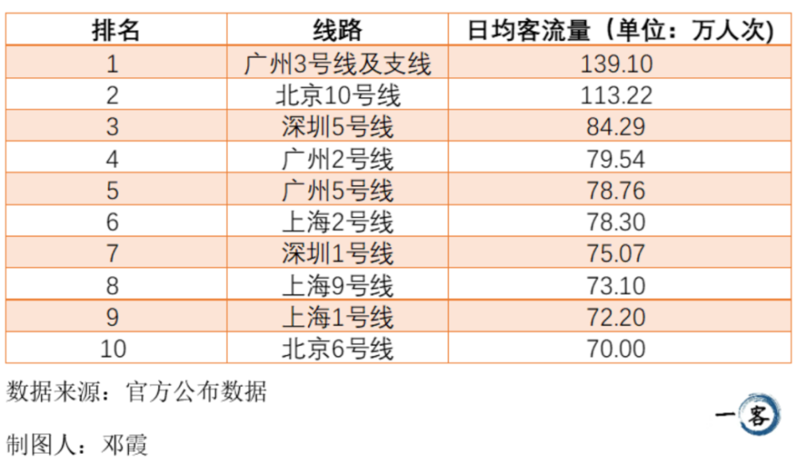
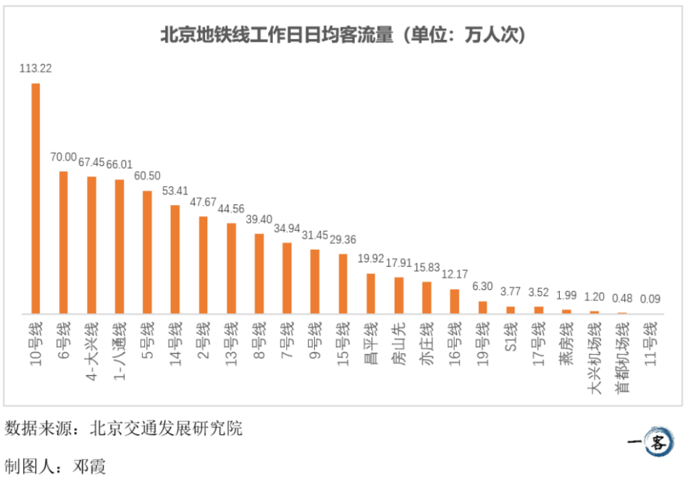
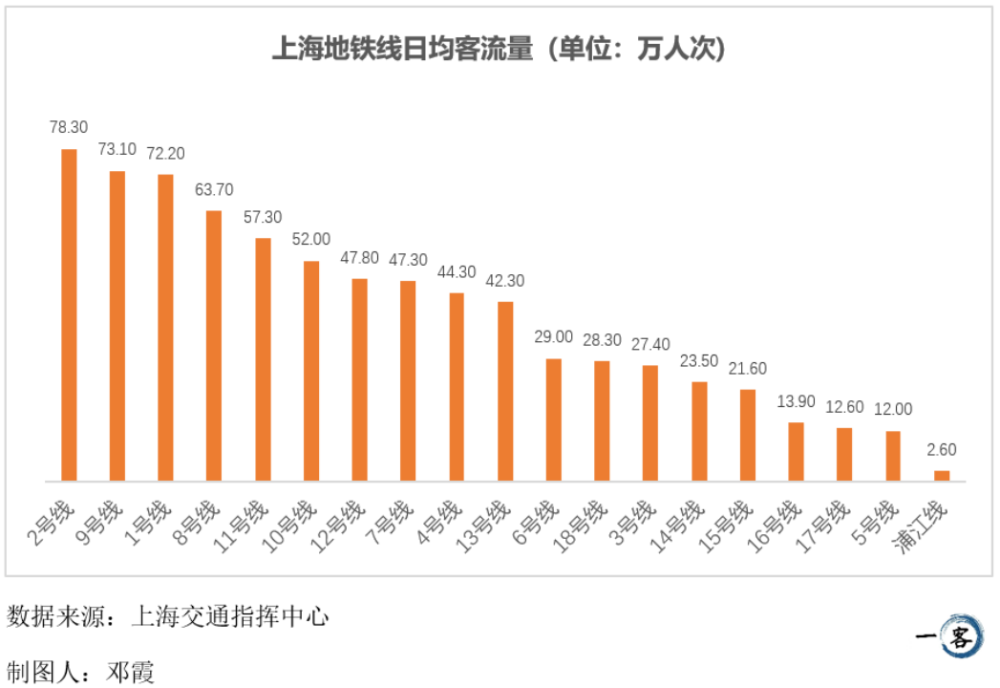
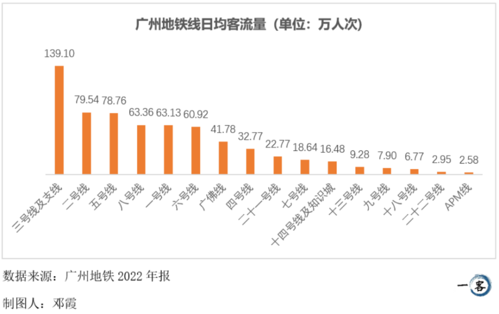
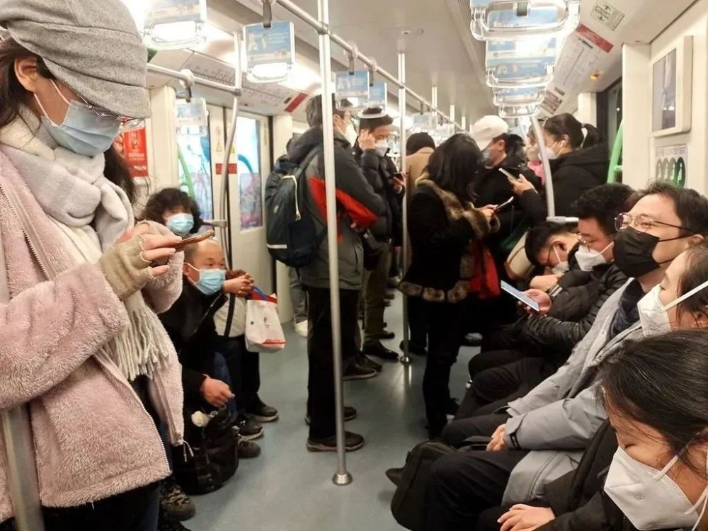

# 北上广深，哪条地铁线最挤？广州3号线日均客流量遥遥领先第二名

_广州3号线及支线，2022年日均客流量达到了139万人次，遥遥领先第二名的北京10号线和第三名深圳5号线_

文 | 《财经》实习生 邓霞

编辑 | 王静仪

地铁，一种更适合打工人体质的交通工具。在北上广深这四个打工人最多的一线城市，地铁承载的客流压力也非其他城市可比。

**广州的地铁客流量最大。**
数据显示，2022年城市轨交客运量排名前四的城市为：广州、上海、北京和深圳。其中，广州全年完成客运量23.61亿人次、上海完成客运量22.88亿人次，北京完成客运量22.63亿人次，深圳完成客运量17.50亿人次。

**广州3号线及支线也是最“挤”的地铁线。**
《财经》观察到，在这四大城市的地铁线路中，客流量最大的地铁线路为广州3号线及支线，日均客流量达到了139万人次。其次是北京10号线，日均客运量达113.22万人次；第三为深圳5号线，日均客流量为84.29万人次。

在2022年最繁忙的5条地铁线路中，广州占了3条——分别是第一名的3号线、第四名的2号线和第五名的5号线。而受疫情影响，上海地铁线路没有进入前五，2号线作为最繁忙的上海地铁线路，2022年日均客流量为78.3万人次，排名第六。

但有时候，同一城市线与线、站与站之间的客流量差距，可能比不同城市之间的差距还要大。以广州为例，3号线的客流量约是22号线的50倍。
**当3号线的乘客还在想如何护住自己的早餐不被挤坏时，22号线的乘客甚至可以在车厢内摆张桌子。**

各位大城市尤其广州的打工人们，实在是辛苦了。

四大城市的最挤地铁线

《财经》以2022年的日均客流量为依据，盘点了各城市最“拥挤”的线路。其中，深圳地铁的日均客流量实际为月度数据换算所得，北京地铁日均客流量则以官方统计的进站量与换乘量加总所得。各条线日均客流量的具体数值可能存在偏差，但同比仍具参考意义。

根据《北京市交通发展2023年度报告》的数据， **北京10号线工作日日均客流量最大，为113.22万人次，6号线次之，日均客流量为70万人次。**

作为北京运营长度最长，车站数和换乘站数都是最多的一个大环线，10号线全长57公里，共设45座车站，说是北京的“地下大动脉”都不为过。其中双井-
国贸区间更是人挤人，早高峰期间满载率一度达到了100%。

根据上海交通指挥中心发布的《2022年上海市交通运行年度报告》，
**上海地铁最为繁忙的是2号线，2022年的日均客流量在78.3万人次，其次为9号线与1号线，日均客流量分别为73.1与72.2万人次。**

能拿下“冠军”，不仅在于2号线具有从浦东到浦西的超长运营长度（64公里），还在于它集齐了高铁站、机场、CBD、热门商圈等多个“流量担当”，想不挤都不行。

提起最挤地铁线，广州的3号线早已名声在外。根据广州地铁2022年报，
**3号线及支线以日均139.1万人次的客流量遥遥领先，比排名第二的二号线客流量多了将近一倍。**

与上海2号线一样，广州3号线及支线全长也有64公里，设有车站30座。2022年，广州客流量最大的四个地铁站（体育西路、珠江新城、嘉禾望岗、客村）都在这条线上。

与广州3号线的日均139.1万人次相比，深圳日均客流量最大的5号线（港铁集团运营的深圳4号线未纳入统计）都显得有点“友好”。根据深圳地铁官网公布的数据，5号线日均客流量大约在84.29万人次。紧随其后的是1号线与3号线，日均客运量大约在75.07与60.38万人次。

作为深圳最繁忙的地铁线路，深圳5号线全长47公里，共设34个车站，途经罗湖区、龙岗区等5个区。今年以来，5号线工作日单日客运量接近120万人次，最高超过130万人次，高居全网第一。

《财经》发现，2022年客流量最大的地铁线路为广州3号线及支线，日均客流量达到了139万人次，遥遥领先第二名的北京10号线（日均客运量达113.22万人次），以及第三名的深圳5号线（日均客流量为84.29万人次）。

客流量不均衡？各地已采取措施

从数据可以发现，在同一城市，不同线路之间的客流量并不统一，甚至天差地别。即使是同一线路，也存在区间与时段不同的情况下客流量不均衡的情况。

北京地铁公司运营服务管理部高级工程师蔡宇就曾指出，
**路网客流并不是均衡的，从线路远端到近端，有一个客流积累的过程，到城市中心区边缘时往往形成客流大断面。**

因此，地铁公司也正在“绞尽脑汁”，不断调整地铁的运力供给来与乘客的出行需求相匹配。

_图/IC_

**例如，不少城市的地铁开始采用“大小交路”的运行模式**
。所谓“大小交路”，通俗来讲，就是在同一条地铁线路客流量不均衡的情况下，将客流量较大的那一站作为临时终点。通过这种方式，地铁可以有效缓解拥挤区段的客流运载压力，给乘客带来更好的乘坐体验。

据了解，目前上海轨道交通14条运营线路中，有10条线路在不同时段采用了“大小交路”的开行方案。乘车堪比“地狱难度”的广州三号线也已“安排”，目前既有从番禺广场到机场北/天河客运站的“大交路”，也有只开到“体育西路”就往回开的“小交路”。

此外，各地地铁都重点对高峰时段的行车时间与效率进行了优化。今年5月，京港地铁14号线采用新版运行图，表示将通过延长早高峰运营时间、增加车次、缩短行车间隔、末班车延后等多种方式，提升14号线工作日及双休日运力。

深圳5号线也在前不久换新了工作运行图，进行自2011年开通以来的第23次运能提升。为此，深铁集团负责人表示，受限于现阶段5号线配属车辆数和停车列位的不足，虽然已经从2号线“借”了8辆地铁列车，但还无法完全支持早高峰全时段的高密度行车。

目前，深圳地铁正在全力推进5号线列车增购工作，随着增购列车的到位，早高峰高密度行车时段将进一步延长，满足市民乘客的出行需求。

责编 | 张雨菲

题图 | 视觉中国

