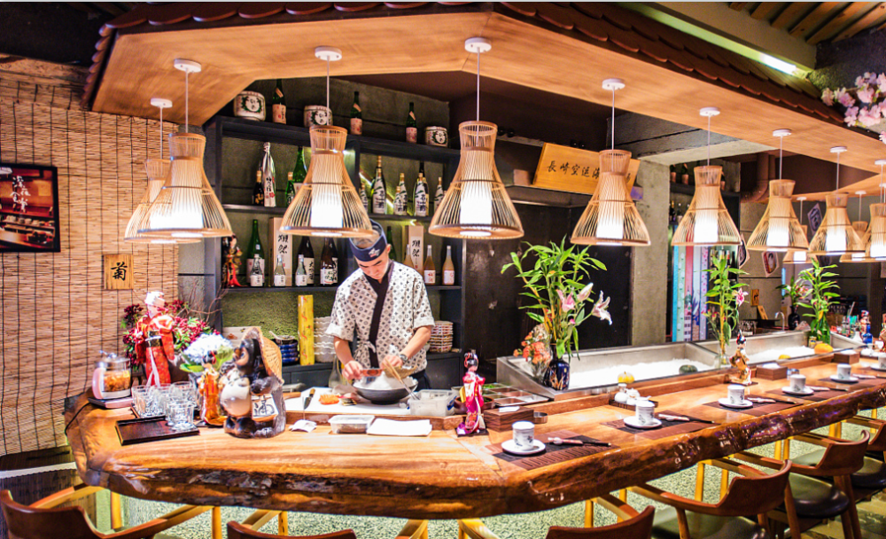

# 多家日料店澄清食材不来自日本，业内称对日本食材依赖度很低

 _图源：视觉中国_

作者 | 陈弗也 实习生 | 冯晔

编辑 | 王波

出品 | 棱镜·腾讯小满工作室

“日料店主要是指用日本料理方式来制作菜品，装修方式是日式风格，并不是指食材也来自日本。”陈燕（化名）向作者表示。

陈燕是佛山顺德区某商业中心一家连锁日料店的负责人，其日料店主打平价，人均消费约100元。

当地时间8月24日13时，日本正式启动福岛第一核电站核污水的排海计划，根据日本东电公司发布的消息，当天的核污染水排放量预计为200吨至210吨，每天的排放情况将在次日公布，核污水将经由1公里的海底隧道流向太平洋。

随后，中国海关总署发布公告，自8月24日（含）起，全面暂停进口原产地为日本的水产品（含食用水生动物）。

其实，早在2011年，中国就开始禁止日本福岛县、群马县等地的乳品、水果、水产品等。今年7月，中国海关总署再次表示，为了防范受到放射性污染的日本食品输华，禁止进口日本福岛等10个县（都）的水产品，对日本其他地区的食品，特别是水产品进行严格审核，实施100%查验。

据大众点评今年6月的数据统计，中国内地共有79324家日本料理店，日料是排名第六的菜系，也是前六名里的唯一一个海外菜系。

此次进口禁令范围进一步扩大，对近八万家日料店会产生什么影响？

**多家日料店澄清食材不来自日本**

8月24日下午4点，即便不是饭点，位于广州丽影广场的寿司郎日料店依然有不少食客。

寿司郎是一家来自日本的回转寿司连锁品牌，资料显示，目前，他们在亚洲开设了超过700家门店，在中国则约有70家门店，人均消费118元。在此前的报道中，“原装进口”曾是寿司郎的一个主打招牌。

根据丽影广场寿司郎工作人员的介绍，目前，有部分产品来自日本，这些食材会在包装袋上明确表明，并且有相关检验报告和证书，可以安全食用。

受核污水排放事件的影响，部分前来就餐的食客会特意询问食材的来源，工作人员则会告知哪些食材来自日本，并表示，如果介意可以不选用这些食材。

对于日料店来说，未来一段时间，食材来源将会成为消费者就餐时的必答题。近日，大雄寿司、摩打食堂、岚山日料、元气寿司等日料店纷纷对外表示，他们并未使用来自日本的食材，尤其是福岛等10县的食材。

根据澎湃新闻报道，当天，上海徐汇区市场监管局对港汇恒隆广场内一家超市、两家日料店进行突击检查，其中一家名为鮨政的日料店因为无法证明食材原产地而被约谈。

一些日料店也开始寻找食材的替代品，美心集团旗下的元气寿司就对外表示，今年3月，日本公布核污水排海计划后，就开始逐步替换掉日本食材，从7月开始，所有门店就已经没有使用日本海产了。

根据作者走访，绝大部分的平价日料店食材来自欧洲、南美或者国内，只有部分高端日料店的食材会依赖日本进口。

红餐品牌研究院发布的《中国日料品类发展报告2022》显示，截至2022年11月24日，人均消费在50-100元及100-200元的品牌分别占比28.2%、28.9%，人均在500元以上的中高端日料仅占比4.6%。

日本进口食材一直是这些高端日料店的招牌，如今，这块招牌可能变成了风险。

广州某高端日料门店工作人员告诉作者，他们目前为客人提供两个套餐，一个套餐的售价为2380元/人，一个套餐的售价为1280元/人，每个套餐都要加收10%的服务费。2380元套餐的主要食材来自于日本，1280元套餐的主要食材则来自国内和国外其他地区。

该工作人员介绍，如果介意日本食材，可以选用1280元的国际套餐。

“我们8月23日晚上和第二天早上来了一批日本进口的食材，过几天就吃不到日本食材了。”上述店员告诉作者。

8月24日下午，作者还联系了广州两家高端日料店，均表示当天已经满座，不再接受预定。其中一家日料店工作人员向作者表示，最近几天的生意格外好，部分原因可能是一些客人担心吃不到正宗的日料，特意在这几天前来就餐。

**日料店对日本食材依赖度低**

此次核污水排放事件，让不少中国的食客，对日料店有了重新的认识。

陈燕向作者表示，很多人一提到三文鱼，就会想到日本，但实际上，日本并不是三文鱼的主产区，挪威、智利和法罗群岛才是，国内很多日料店的三文鱼都是从这些地方进口，中国北部的一些海域也出产三文鱼。

“日本的三文鱼都大量依靠进口。”陈燕说道。

作者从日本政府综合统计窗口查阅了解到，近年来，日本三文鱼的产量大幅度下滑，2020年，日本三文鱼的产量仅是2011年的1/10。

据陈燕介绍，众多日料店备受欢迎的鳗鱼饭、烤鳗鱼，食材也不是来自日本。鳗鱼是一种在海水中繁殖，但要在淡水中生长的鱼类，日本国内淡水不多，鳗鱼产量少，日本的鳗鱼还要依靠中国进口，国内日料店的鳗鱼更不可能来自日本。

陈燕所在的日料店是一家小型、平价连锁品牌，他们偶尔会从日本进口一些高端食材，比如海胆、池鱼王等，这些食材的售价往往很高，但保质期又很短，一旦销售不出去，就可能会造成损失，平时也不会备太多的货。

据陈燕介绍，核污水排放风波发生后，这些高端食材的进货渠道受到冲击。日本进口池鱼王曾是他们的主打高端菜品，但从一个月前开始，供应商便告诉他们没货了。

“其实对于国内大多数的平价日料店来说，禁止进口日本水产的影响很小。如果说影响大，就是食客对日料店的认识，之前很多人都不知道日料店的食材不是来自日本。”陈燕向作者调侃道。

而在另一方面，一些日料店用“以次充好”的乱象会受到遏制。一位熟知日料店经营模式的人向作者表示，在此前，一些日料店往往会宣称食材来自日本，但实际上并不是，这里面往往会充斥着暴利。

比如，日本生蚝的拿货价约80元/个，卖给客人要150元，但如果门店拿国产生蚝或其他国家的生蚝来充当日本生蚝，就会大赚一笔。再比如，日本赤胆被称为海胆贵族，拿货价约1000元/盒，零售价则可以翻倍，但是，我国大连的一些赤胆口味与日本赤胆相差无几，但拿货价只要两三百元一盒。

**国产水产股异动**

A股的水产公司应声而动。8月22日，多只水产股异常活跃，并大幅拉升。

国联水产（300094.SZ）是一家水产食品公司，近3日一度累计大涨超过50%。该公司称，日本核废水排海对他们暂未产生影响，他们采购的原料主要以南美白对虾为主，采购地区主要以南亚、中东地区为主。

百洋股份（002696.SZ）、大湖股份（600257.SH）连续3日涨停，这两家公司均与水产有关。

8月24日，百洋股份在投资者互动平台上表示，他们的主营业务为饲料及饲料原料业务、水产加工及生物制品业务、远洋捕捞业务三部分。其中远洋捕捞业务位于西非的毛里塔尼亚，产品主要为鱼粉、鱼油和其他经济鱼。

獐子岛（002069.SZ）、好当家（600467.SH）等水产股也接连两天大涨，不过8月25日下午开始冲高回落。

好当家表示，该事件对公司没有影响，他们的海参均产自山东威海，是海参全产业链企业。獐子岛则表示，他们会严格执行国家关于水产品进口的相关要求，加强出厂产品的质量检测，保证产品符合国家标准。

（特约作者胡世鑫，对本文亦有贡献）

