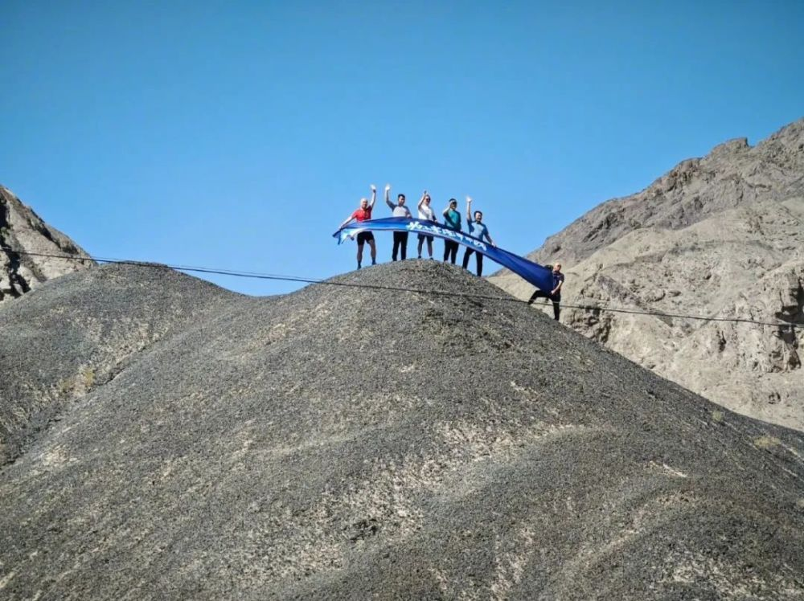
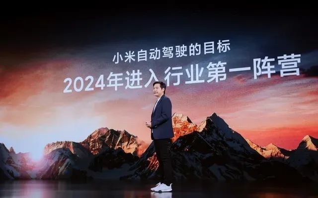

# 小米汽车亦庄工厂已有整车下线 暂无法满足大规模的生产需求

一周前，雷军在长达三小时的2023年度演讲中，令人意外的未提及小米汽车进度。同样让外界没想到的是，一周后，从拿下“资质”到新疆路测，关于小米汽车的各种消息扑面而来。

汽车像素(ID:autopix)从小米汽车亦庄工厂了解到，最晚于本月初开始，该工厂已有整车下线，而到本周，8月小规模的“试装车”产量任务已经提前完成。

与此同时，工厂的建设也在同步进行。多个车间仍在调试中，产线上的小修小补预计将持续到今年底。此外，厂区内综合楼、内部道路等配套设施还没有完工，预计施工会持续到明年4月。

但总的来说，工厂内进展一切顺利。小米官方不提造车的背后，对于这位迟到的造车“明星”来说，制造端的进度，或许并不是小米造车道路上最关键的环节。

**文|** 章洺辉

**编辑|** 冒诗阳

汽车像素(ID:autopix) **原创**

**01.已有整车下线**

随着建设进度的推进，小米位于北京亦庄辛房路西侧的整车工厂逐渐热闹了起来。

汽车像素(ID:autopix)从接近小米汽车的知情人士处了解到，8月23日，小米汽车工厂刚刚完成了一次“重要接待”；上一次大型接待是在一周前的8月16日，“来的都是领导。”

值得注意的是，就在8月23日那场接待的同一天，有外媒援引两位知情人士的消息称，小米公司在本月初已获得国家发改委关于生产电动汽车(EV）的批准。

按照汽车行业的相关规定，一家新汽车公司在走向量产销售之前，需获得两项关键许可，一是国家发改委地方部门的备案批准，汽车整车投资项目由省级发展改革部门备案；二是需获得工信部的准入许可。

对于资质突破的消息，小米汽车官方保持了缄默。但有接近小米亦庄工厂的负责人向AutoPix透露，最晚于本月中旬开始，小米亦庄汽车工厂中已开始有少量整车下线。

其中，8月初总装车间下线的整车数量为个位数，到8月15日前后，累计下线的新车数量已经达到两位数。工厂的进度都在计划之中，上述负责人透露，8月的产量任务已经在本周提前完成。

即便如此，工厂目前的进度距离大规模的生产仍有距离。

上述接近小米汽车的知情人士告诉AutoPix，总装车间目前仍在调试中，除了工人外，车间产线上还有数十名参与工厂建设的外包团队驻厂“陪线”，“随时出问题随时调整”，整个修补的过程，预计将持续到今年年底。

此外，工厂内的其他部分也在加紧建设中。一位施工单位的负责人告诉AutoPix，小米工厂的综合办公楼、道路、路灯等配套设施还未完工。根据工期计划，配套设施部分将在8个月后建成，也就是2024年的4月。按照整车工厂的一般施工经验，道路等基础设施的完工时间，将与工厂的投产时间相邻。

根据小米此前公布的规划，小米汽车计划在2024年上半年开始量产，此后鲜少提及造车进度。直到今年7月，《北京日报》披露消息称，小米亦庄电动汽车工厂已经竣工，交付工厂开始建设，预计年产能20万辆。

随后，据新浪科技等媒体报道，今年8月起小米已开始开放亦庄汽车工厂的普工招聘，开放的岗位包括涂装操作工、电池车间操作工、焊装车间设备维修工、涂装车间设备维修、电池车间维修工等，目前缺口超过100人。

与此同时，小米工厂内生产出的首批产品或已经开始道路测试。

_▍雷军微博照片_

8月19日，雷军在新疆发布一组照片，图中六人站在山巅一字排开，举起一条写着“为小米汽车而战”的横幅。同一天，有网友晒出在乌鲁木齐到昌吉的城市快速路上，四辆伪装的小米汽车疾驰的照片。小米集团总裁卢伟冰、小米汽车副总裁李肖爽、顺为资本投资合伙人胡峥楠等均出现在新疆。

外界猜测，这是雷军等一众高管亲自来到新疆，参与小米汽车的路测。

**02.最重要的拼图**

12年前小米进入手机行业时，将智能手机的价格压到1999元，随后小米维持姿态，在多个领域复制了相似的产品和价格策略，构筑了如今的小米生态。但跨入汽车界后，小米的首款汽车可能不会如外界预期的那样，再次成为行业中的“价格屠夫”。

“现在下线的是一款轿车，从尺寸来看，至少在A＋或B级以上。”接近小米亦庄工厂的负责人告诉汽车像素(ID:autopix)。

这与外界的期待相悖。2022年4月，雷军在“米粉Open
Day”上透露，他曾在微博端发起关于小米汽车价格的投票，1.7万参与投票的网友中，期待小米首款车定价在15万元以下的人占比近七成。

从目前的消息来看，小米首款车售价的上限将超过投票者的预期。

站在2022年的时间点上，15万元区间的确是蓝海，这一年，零跑、哪吒凭借两款低价产品成为新造车中最大的两匹黑马。

但小米进入造车的时间并不早，几乎是国内最后一家下定决心造车的科技巨头，从2021年3月公布造车计划开始计算，小米为造车计划准备了三年时间。

因此，目标三年后投产的小米，需要预判2024年智能电动车市场的竞争格局，而小米的结论，很可能与参与投票的网友相悖。

2023年之前的爆款产品，大多来自产品定义。从30万元至50万元价格带上的理想，到8万元价格带上的哪吒V，再到3万元价格带上的五菱宏光mini
EV，以及纯电车中唯一主打操控及性能的猎装车极氪001，这些产品在量产时未必囊括了前沿的先进技术，但却都在发布之初，用一款拳头产品击穿了一个细分市场的需求。

_▍雷军于8月11日_

但到了今年，智能电动车行业中，新品牌通过产品定义获得成功的路径已无法复制。新能源领域的各个细分市场中，均云集了多款优秀产品。

今年初，有头部新造车品牌的产品一把手告诉AutoPix，逐渐内卷的行业中，上游供应链所能提供的产品没有本质突破，因此新的整车产品开发越来越像是“为赋新词强说愁”。而在今年之前，该品牌曾通过产品定义，打造出了新造车中唯一连续月销量超过3万辆的爆款产品。

在部分行业人士看来，2023年现象级产品的代表更像是小鹏G6，需要在硬件上做到完整的同时，承载成熟的智能配置。

事实上，今年开始，新造车领域中，即便是最保守的车企，也开始了智能驾驶等领域的竞逐。理想计划今年内将在多个城市完成城市NoA的落地，比亚迪开始大规模投入智能驾驶研发，试图短时间成为行业头部。

这与小米的预判相符。

至今在小米汽车主页上，依然印着“自动驾驶是智能电动汽车决胜的关键点”。但从现实情况来看，15万元区间的产品，几乎没有自动驾驶或高阶智能驾驶所需硬件的搭载空间。

对于小米而言，在造车这件事上，智能驾驶的研发进度或许先于制造本身，比起生产资质，智能化是小米造车最重要的一块拼图。

**03.**

**后来者的挑战**

8月11日，先于小米的造车进度，小米官方公布了旗下自动驾驶技术的研发进展。根据雷军的介绍，小米自动驾驶项目第一期投入33亿研发费用，研发团队已超过500人。到今年年底，该研发团队规模预计将突破600人。

相比于头部的新造车品牌，这一研发团队规模并不算大。

一位同样来自国内科技公司背景的自动驾驶从业者告诉AutoPix，根据该公司的经验来看，小米现阶段的投入规模可能低估了量产级别高阶智能驾驶方案研发所需要的成本。

2022年3月，小米宣布造车时，雷军曾承诺在未来10年内向汽车业务投资100亿美元（约合人民币729亿元）

在一些汽车业内的从业者看来，如果小米希望在汽车业务上做到头部，10年100亿美元的投入计划，很可能低估了所需要的资金规模。

_▍雷军宣布小米造车_

此外，根据界面新闻此前的报道，在汽车业务上，小米希望降低硬件利润的比重，未来盈利将主要依靠软件服务及生态服务等。

该消息并未得到小米官方的证实，但仅就消息本身而言，硬件“不盈利”或几乎不盈利的做法，在汽车业内还没有成功的先例。

目前汽车软件付费已知的尝试有三类，智能座舱的软件付费、智能驾驶服务付费，以及基础功能的付费。

其中，智能座舱软件的付费被认为前景广阔，但截至目前市场尚未打开。与此相对应的，智能驾驶升级的付费空间也有下降的趋势，包括蔚来等车企在内，均调整或下调了该项目的服务价格。

在智能化领域之外，此前不乏车企尝试降低车价，而后在一些基础功能上要求付费，比如某主流汽车品牌尝试推出“2000元购买座椅加热功能”等。但目前看来，这将对消费者的口碑带来较大的挑战，一些消费者觉得在承担硬件成本之后，还需要软件来解锁功能是一种“强迫”。

总而言之，即便智能座舱和智能驾驶方向上的付费是未来趋势，但目前市场并不成熟。对于2024年投产的小米而言，用软件来覆盖硬件成本的做法颇具挑战性。

此外，小米的智能驾驶服务是否“能打”，目前还很难判断。理想、小鹏、百度、华为等智驾领域的主要参与者均在推动城市NoA方案，在行业人士看来，这是目前法规框架下，达到量产级别最高阶的智能驾驶方案，小米很难在这一领域与竞争者拉开差距，构建有效的竞争护城河。

本文为汽车像素（autopix）原创内容

