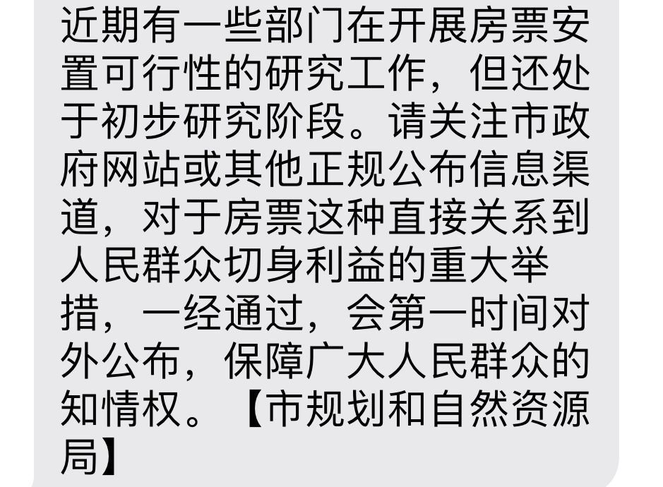

# 广州将推行房票安置？规自局：正进行可行性研究

日前，关于广州将用“房票安置”替代“回迁房安置”的消息在网络上流传开来，一个名为《广州市城中村改造房票安置实施办法(建议稿)》（下称“《建议稿》”）的文件甚至具体描述了“房票安置”的细节。

对此，第一财经向广州12345便民热线进行了求证，广州市规划和自然资源局未对上述文件的真实性进行确认，不过，其回复称：“近期一些部门在开展房票安置可行性研究工作，但还处于初步研究阶段。”另外，该局还表示，对于房票这种直接关系到人民群众切身利益的重大举措，一经通过，会第一时间对外公布。

对于上述流传的文件，一名与政策研究相关的人士对第一财经表示，“行文很规范”。也有媒体报道称，目前该文件已经下发至广州各区，目前处于讨论阶段，最后是否实施尚未可知。

“房票”指的是被征收人的房屋安置补偿权益进行货币量化后，征收人出具给被征收人购置房屋的结算凭证。被征收人可自行向参与房票安置工作的房企购买商品房，直接用房票结算。值得一提的是，“房票安置”与2015年那一轮推行的棚改货币化安置有异曲同工之妙，即都能让被拆迁者在短时间内拥有购房的资金实力，从而推动楼市去化。

具体来看，上述《建议稿》内容显示，“房票安置”适用于广州市行政区内各类城中村改造项目的拆迁安置工作，包括政府收储、统筹做地和“三旧”改造等不同模式下的城中村改造项目。原则上各区发放的房票优先在本辖区内统筹兑换安置，对本辖区范围内房票房源不足以满足安置需求的，报市政府研究同意后，可在广州市内其他区统筹存量房源。

《建议稿》内容显示，房票票面金额包括基础补偿金额、政策性奖励等，基础补偿金额是房屋价值的等价转换，中心城区给予2%的政策性奖励，外围城区给予5%的政策性奖励，同时以现金方式奖励被征收人3个月的临迁费。

被征收人使用房票所购买的商品住房，不计入家庭限购套数。被征收人家庭在满足每户拥有一套住房的前提下，可使用房票购买非住宅房源（商业、商办、工业和车位）。房票面值不足以支付购房款的，不足部分可按现行规定办理商业性个人住房贷款或公积金个人住房贷款。

另外，房票使用有一定的期限，即自房票核发之日起计算，最长不超过24个月。房票使用期限内未使用的，扣除房票奖励后，兑换成现金。同时，《建议稿》也表示，在满足每户拥有一套住房的前提下，允许被征收人将房票转让给第三人使用（不含境外人员），已转让的房票，不得再次转让，通过转让形式获得房票的受让人需具备广州购房资格，并满足广州限购要求。

在房票资金结算方面，《建议稿》提及，政府部门以分期支付的方式与地产开发商结算房票资金，被征收人完成房票购房后支付票面金额的10%，城中村土地拆迁平整后支付票面金额的20%，城中村土地出让（划拨）后支付票面金额的70%。参与房票安置工作的房地产开发企业，按照企业自愿参与原则公开进行征集，鼓励央企、国企和有实力的民企积极参与房票安置工作。

“相比2016年前后的棚改，尽管目前新房库存整体不算大，但结构性问题严重，即外围库存大，二手房挂牌量大、供大于求的问题比较明显。”广东省规划院住房政策研究中心首席研究员李宇嘉对第一财经表示，“房票安置”对推动城中村改造是有帮助的，主要解决了城中村前期投入资金规模较大的问题，另外，也缩短了城中村改造的周期，另外，还能降低广州楼市的库存压力，特别是外围区域。与此同时，李宇嘉还建议，将二手房也纳入“房票安置”的范畴，“如果二手房不纳入其中，房票安置的房源选择非常有限，很难达到政策效果。二手房纳入房票安置范畴，更有助于促进房屋交易的良性循环，盘活存量”。

合一城市更新集团总经理罗宇对第一财经表示，广州研究制定的城中村改造“房票安置”政策本质上是将旧改期房补偿安置转换为准现房补偿安置，以此将搬迁需求对接商品房市场供给的去化，对广州房地产市场去库存有帮助。

与此同时，罗宇还表示，“房票安置”降低了大量新建安置房后续入市的供应冲击、有助于稳定广州房地产市场；村民通过房票安置，能更快换到商品房安置，有助于推进城中村改造拆迁实施进度；另外，对于广州城中村改造而言，“房票安置”后，承担城市更新项目建设的开发商所需要的拆迁过渡费将减少，其现金流压力将降低，一定程度上也能降低其拆迁难度。此外，销售端回暖，也将有利于激活当前市场投资热情，促进城中村改造投融资市场的回暖。

克而瑞数据显示，今年7月，广州商品房合计供应54.69万平方米，环比下降39%，同比下降40%；网签成交75.83万平方米，环比下降29.9%，同比下降15.9%。整体来看，今年前7个月，广州商品房面积合计网签成交679.93万平方米，同比微跌2%。

实际上，去年以来，已经有厦门、贵阳、无锡、郑州等近30省市（县）陆续推行“房票安置”政策，不过，对于当前“房票安置”政策的效果，有观点认为，很难达到过去货币化安置对楼市去化的巨大带动作用。

例如，2022年6月，郑州发布大棚户区改造项目房票安置实施办法，据中指院统计，2022年7月4日-7月31日期间，郑州商品住宅周均销售由6月前三周的1191套降至1016套，市场在6月传统旺季销售短暂回升后再次下滑，房票安置政策对成交无明显拉动效果。

