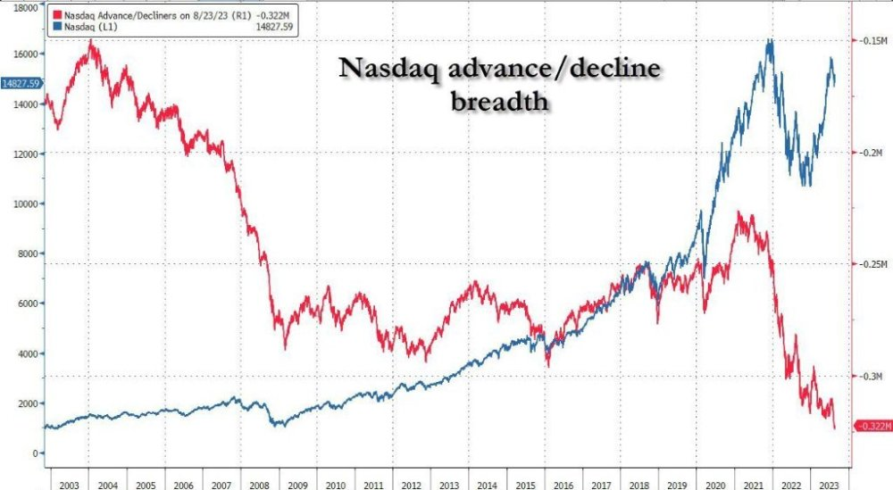
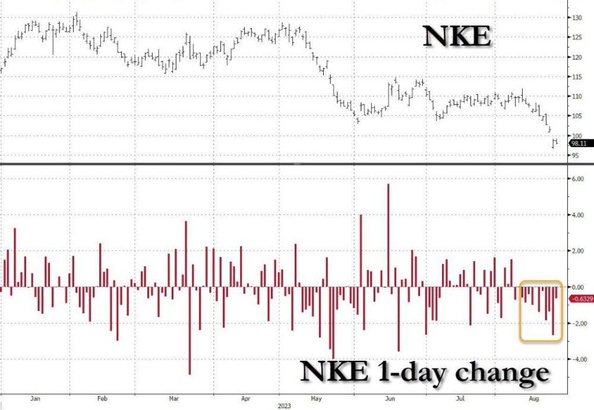
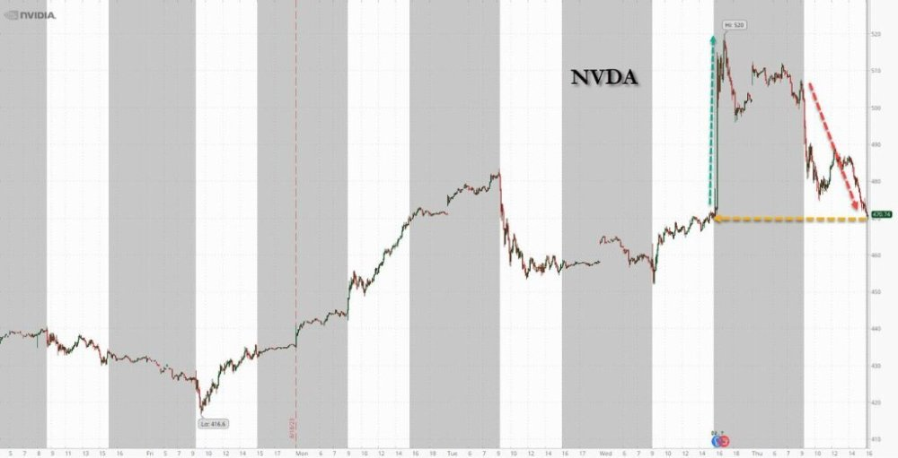
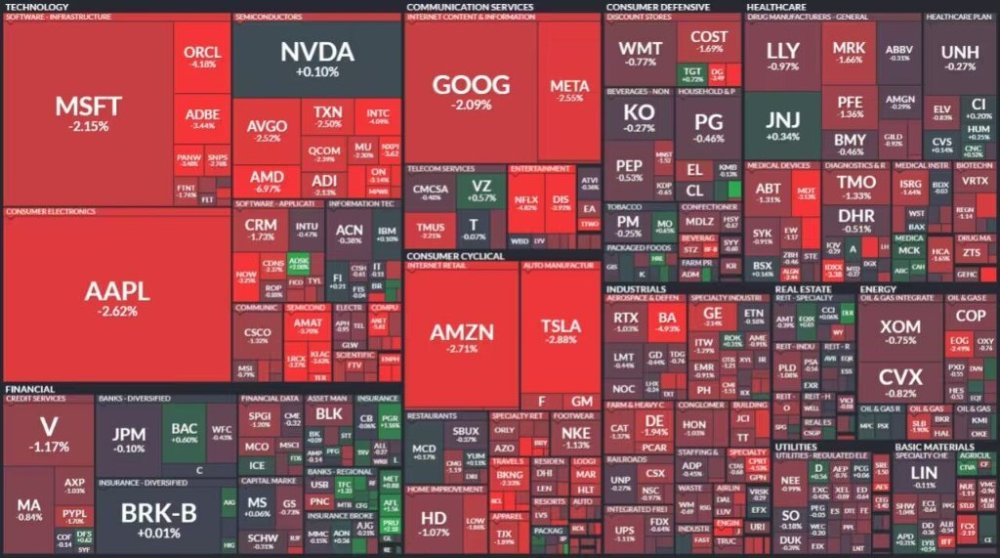
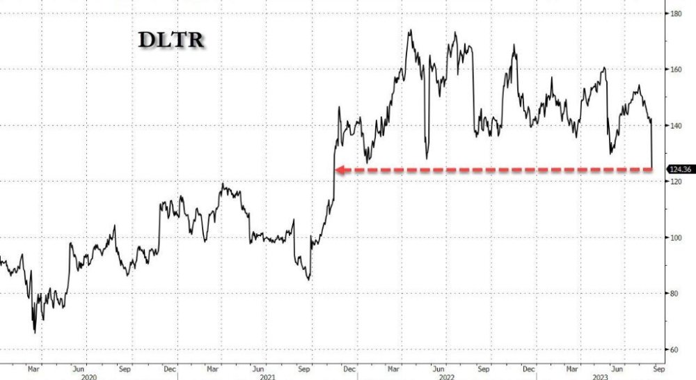
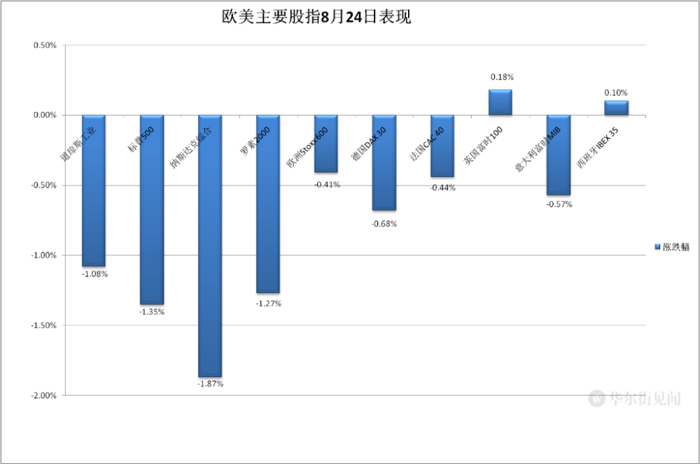
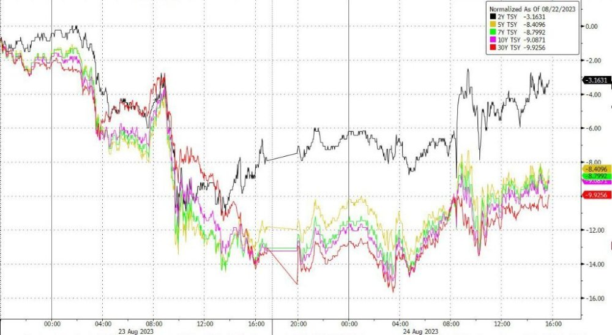
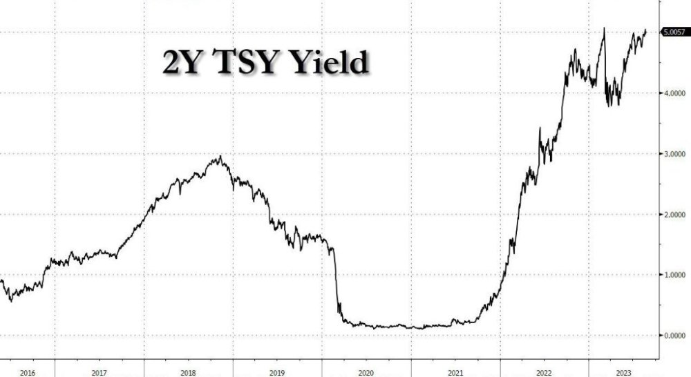
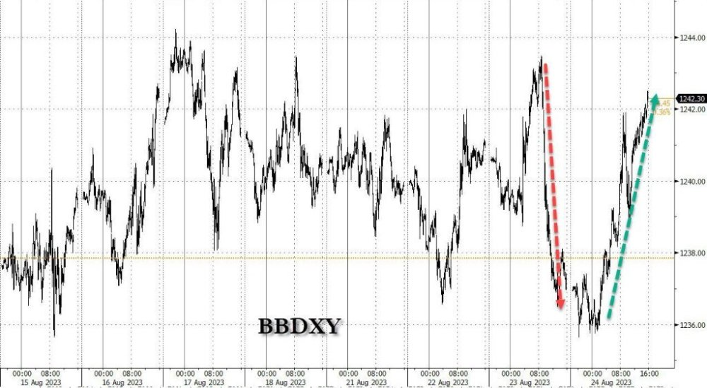
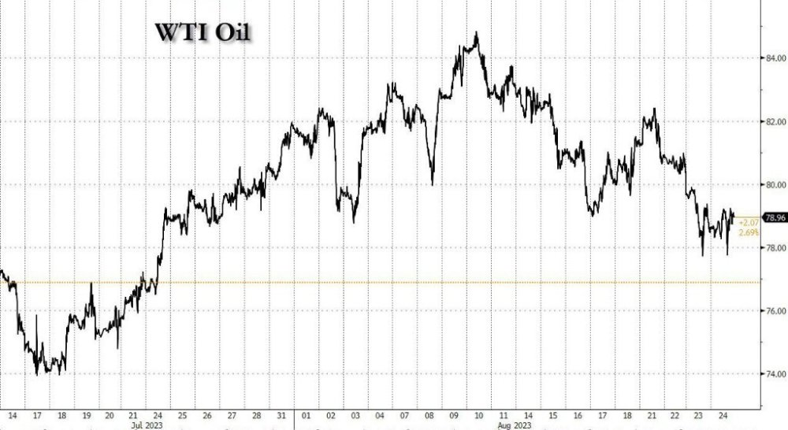

# 美股全线收跌，纳指高开低走跌1.87%，英伟达几回吐全部涨幅

今年美股走高的最大动力人工智能（AI）热潮暂时熄火。AI标杆英伟达超预期强劲的业绩和指引未能持续提振美股，主要股指盘中齐跌，标普和纳指均创三周前惠誉下调美国主权评级以来最差单日表现。

本周五美联储主席鲍威尔在杰克逊霍尔央行年会发表重磅讲话前，美股未能保住反弹势头。评论称，美债收益率上行仍在施压美股；英伟达是优秀的公司，但现在俨然又一个特斯拉，市场盲目给出不切实际的估值，其估值已经高得离谱。周四科技股遭抛售有点像买消息、卖事实的反应，英伟达发布财报前，市场的定价已体现向好业绩的预期，在鲍威尔讲话前，投资者可能觉得，已经有过大涨，趁美联储可能泼冷水前，可以适当获利回吐

周三反弹的美国国债价格回落，收益率回升。周四公布的上周美国首次申请失业救济人数意外并未回升，反而回落到三周低位，体现劳动力市场仍紧张，有利于美联储加息前景。美联储官员表态信号并不统一，2025年有FOMC会议投票权的波士顿联储主席柯林斯称可能需要进一步加息，她并未准备释放利率达到巅峰的信号；今年FOMC票委费、城联储主席哈克预计，今年剩余时间可能保持利率不变，可能已有足够紧缩。此外，前圣路易斯联储主席、大鹰派布拉德称，今夏经济再度加快增长可能促使美联储推迟结束加息。

公布失业数据和柯林斯等官员讲话后，美债收益率刷新日高，号称“全球资产定价之锚”的基准十年期美债收益率脱离一周低位，还未收复周三超过10个基点的降幅，对利率更敏感的两年期美债收益率重上5.0%关口，逼近本周稍早所创的一个多月来高位；美元加速反弹，美元指数两个多月来首度盘中涨破104.00。

评论称，失业数据可能给予了美元部分支撑。不过，部分非美货币顶住了美元走强的压力：离岸人民币虽然跌落日内稍早涨破7.29刷新的一周多来高位，但盘中转涨；步入紧缩周期的土耳其央行超预期加息750基点，本币里拉兑美元盘中一度暴拉7%，创一年多来最大涨幅。

大宗商品中，欧洲天然气是周四最大输家。澳大利亚能源公司Woodside
Energy在澳最大液化天然气（LNG）出口厂同工会达成协议，避免该工厂罢工，欧洲大陆基准荷兰天然气盘中一度跌超20%，连续两日收跌超过10%，全数回吐本周前两日因罢工担忧而大反弹的涨幅。

黄金扛住美元反弹的压力，小幅收跌，仍接近两周来高位，评论称，若鲍威尔暗示，即便薪资压力消退，利率仍将在长时间内保持高位，黄金可能受打击，若他认为中短期内经济前景更好，金价可能因未来降息的信号走高。盘中几度转跌的原油惊险反弹。媒体周四援引花旗分析称，OPEC+可能需要考虑进一步减产，因为过去产油缺失的部分OPEC+成员国已经变成产量增长的来源。还有评论称，费城联储主席哈克偏鸽派的讲话部分缓和了加息的担忧。

标普纳指创惠誉降美国评级以来最大跌幅 芯片股指跌超3% AI概念股大跌

三大美国股指盘中均转跌。纳斯达克综合指数盘初曾涨超0.8%，开盘不到一小时转跌，尾盘跌近1.9%。低开逾30点的道琼斯工业平均指数盘初转涨，早盘曾涨超220点、涨逾0.6%，高开的标普500指数早盘曾涨约0.5%，纳指转跌后，和道指均转跌且持续下行，午盘标普跌超1%，尾盘道指也跌超1%。最终，三大指数一周来首次集体收跌，自惠誉下调美国主权评级后的8月2日“黑色星期三”以来，首度均跌超1%。

连涨三日的纳指收跌1.87%，报13463.97点，跌落周三刷新的8月14日以来高位，尽管周一涨近1.6%创7月28日以来最大涨幅，本周仍可能累计下跌。周三涨1.1%创6月30日以来最大涨幅的标普收跌1.35%，和纳指均创8月2日以来最大跌幅，报4376.31点，逼近上周五所创的6月26日以来低位。周三结束两连跌的道指收跌373.56点，跌幅1.08%，创5月2日以来最大百分比跌幅、以及3月22日以来最大点数跌幅，报34099.42点，刷新7月10日以来低位。

价值股为主的小盘股指罗素2000收跌1.27%，抹平周三反弹的涨幅，刷新周二所创的7月6日以来低位
。科技股为重的纳斯达克100指数收跌2.19%，创8月2日以来最大跌幅，继8月2日之后本月再度一日跌超2%。

_纳指此前上涨的同时，宽度已创新低_

标普500各大板块周四全军覆没，跌超2%的芯片股所在板块IT领跌，谷歌和Meta所在通信服务、特斯拉所在的非必需消费品均跌约2%，材料跌超1%，其他板块跌不足0.8%，跌逾0.4%的材料跌幅最小。

道指成份股中，宣布推迟737
Max飞机交付的波音周四领跌，英特尔跌幅居前，迪士尼跌近4%，创2014年5月以来新低，耐克收跌超1%，创去年11月以来新低，连跌11日，刷新最长连跌日纪录。

_耐克史上首次连跌11日_

周三反弹的芯片股总体盘中转跌、跑输大盘。费城半导体指数和半导体行业ETF
SOXX盘初曾分别涨逾1.7%和1.9%，均收跌逾3%。个股中，周三盘后公布的二季度收入超预期翻倍暴增、三季度指引同样碾压预期的英伟达盘初一度涨近7%，股价涨至502美元上方，创盘中历史新高，后持续回吐涨幅，收涨0.1%；收盘时，AMD跌约7%，为纳斯达克100成份股中表现最差的芯片股，迈威尔科技跌超6%，英特尔、格罗方德跌超4%，应用材料、安森美、微芯科技跌超3%，高通、博通、美光科技跌超2%。

 _英伟达盘初大涨后持续回落_

AI概念股全线回落，多只大跌。截至收盘，C3.ai（AI）跌11.6%，
Palantir（PLTR）跌超7%，SoundHound.ai（SOUN）跌近7%，BigBear.ai（BBAI）跌超6%，Adobe（ADBE）跌超3%。

龙头科技股早盘齐转跌。连涨三日、一再刷新8月14日以来高位的特斯拉盘初即转跌，收跌近2.9%。FAANMG六大科技股中，连涨四日至8月4日以来高位的奈飞收跌4.8%，
周三反弹至8月15日以来高位的亚马逊收跌2.7%，连涨四日至8月4日以来高位的苹果收跌2.6%，周三反弹至8月16日以来高位的Facebook母公司Meta收跌近2.6%，连涨三日至8月7日以来高位的微软收跌近2.2%，连涨三日至7月31日以来高位的谷歌母公司Alphabet收跌近2%。

多只热门中概股追随大盘转跌，部分逆市收涨。纳斯达克金龙中国指数（HXC）早盘曾涨超1%，早盘尾声时转跌，收跌近0.7%。中概ETF
KWEB和CQQQ分别收涨0.4%和0.9%，收盘时，金山云跌超5%，晶科能源跌超4%，二季度营收低于预期的网易跌近4%，京东、老虎证券跌超2%，蔚来汽车跌超1%，理想汽车跌近0.3%，而爱奇艺和微博涨超3%，百度和公布二季度业绩优于预期、净利润猛增近75%的富途控股涨超1%，小鹏汽车涨1%，拼多多涨近0.5%，腾讯粉单涨0.2%。

周二在标普下调五家美国银行评级后大跌的银行股指数连续两日反弹。 周二连跌七日至6月28日以来低位的整体银行业指标KBW银行指数（BKX）收涨0.1%；
周二连跌七日至7月14日以来低位的地区银行指数KBW Nasdaq Regional Banking Index（KRX）收涨近0.3%，
周二连跌三日至7月14日以来低位的 地区银行股ETF SPDR标普地区银行ETF（KRE）收涨近0.5%。

大银行表现不一，收盘时高盛跌超0.7%，富国银行跌0.4%，摩根大通微跌，而美国银行涨0.6%，摩根士丹利微涨，花旗收平。地区银行中，西太平洋合众银行（PACW）、Keycorp（KEY）、Zions
Bancorporation（ZION）涨超1%，阿莱恩斯西部银行（WAL）涨0.7%。

公布财报的个股中，三季度指引低于预期的折扣零售商、一元店Dollar
Tree（DLTR）收跌12.9%，领跌纳斯达克100成份股；尽管季度盈利和收入高于预期，云计算数据平台Snowflake（SNOW）仍盘初转跌，收跌5.2%；而季度收入和盈利高于预期的服装公司Guess（GES）收涨25.7%；公布二季度盈利优于预期且上调指引后，被美国银行重申买入评级且纳入优选之列的云软件公司Splunk（SPLK）收涨12.9%；二季度收入和三季度指引均高于预期的设计、工程等行业软件公司Autodesk（ADSK）收涨近2.1%。

 _一元店Dollar Tree（DLTR）创2021年12月以来新低_

波动较大的个股中，波音宣布因发现机身后压力舱壁上钻孔不当而推迟737 Max交付后，机身制造商Spirit
AeroSystems（SPR）收跌12.6%，波音（BA）收跌4.9%；而“越南特斯拉”VinFast（VFS）早盘涨幅曾达56%，收涨32.3%。

欧股方面，英伟达财报也未能带动欧洲科技股，连涨三日的泛欧股指回落。欧洲斯托克600指数跌落周三刷新的一周来高位。主要欧洲国家股指周四多数下跌，德法意股止步三日连涨，而英股和西股连涨三日，因英镑走软利好出口企业，英股表现最好。

各板块中，科技盘中曾涨近2%创两周新高，但此后转跌，收跌2.4%，拖累大盘。芯片股普遍收跌，荷兰上市的ASM
International跌超6%、ASML跌约3.5%、BE
Semiconductor跌超3%，德国英飞凌跌约2.5%，VAT跌约2%，Siltronic和Temenos跌超1%。

英债收益率三日降30个基点 美债收益率回升 两年期收益率重上5.0%

欧洲国债价格大多继续上涨，但收益率降势明显缓和、盘中收窄降幅，远不及周三公布欧洲PMI逊色当天超过10个基点的降幅。到债市尾盘，英国10年期基准国债收益率收报4.42%，日内降4个基点，欧股盘初曾降至4.39%，连续两日刷新8月11日以来低位，最近三日累计降约30个基点；基准10年期德国国债收益率收报2.51%，日内降1个基点，欧股盘初曾下破2.45，刷新8月9日以来低位。

美国国债收益率回升，在不升反降的美国上周首次申请失业救济人数公布后、美联储官员讲话后，刷新日高。

周三大幅回落超过10个基点后，美国10年期基准国债收益率在周四欧股盘初曾下破4.18%，连续两日刷新8月16日上周三以来低位，日内降约2个基点，欧股盘中转升，美股盘前接近4.24%，午盘曾升破4.24%刷新日高，和周二盘中升破4.36%所创的2007年11月以来高位仍有距离，美股早盘曾回吐几乎所有升幅，到债市尾盘时约为4.24%，日内升近5个基点，扭转两日连降之势。

_各期限美债收益率周四总体回升_

对利率前景更敏感的2年期美债收益率在欧股早盘曾下测4.96%刷新日低，日内降约1个基点，后持续回升，美股盘前重上5.0%，盘前和午盘都曾升破5.02%，美股收盘后再度升破5.02%，逼近本周稍早所创的7月6日以来高位，开始靠近7月6日接近5.12%所创的2007年年中以来高位，到债市尾盘时约为5.02%，日内升约5个基点，在周三止步三日连升后反弹。

_2年期美债收益率周四重上5.0%_

美元指数再创两月新高 离岸人民币创逾一周新高后一度转跌 土耳其里拉盘中飙涨7%

追踪美元兑欧元等六种主要货币一篮子汇价的ICE美元指数（DXY）在亚市早盘曾跌破103.30刷新日低，日内跌超0.1%，欧股盘初转涨后保持涨势，美股盘前美国失业数据公布后，曾涨破103.90，午盘一度突破104.00，在连续两日创6月12日以来新高后，又连续两日刷新6月8日以来盘中高位。

到周四美股收盘时，美元指数略高于104.00，日内涨近0.6%；追踪美元兑其他十种货币汇率的彭博美元现货指数涨0.4%，反弹至8月16日以来高位，继周二之后本周第二日上涨。

 _彭博美元现货指数周三回落，周四反弹_

非美货币中，土耳其央行超预期暴力加息后，土耳其里拉盘中飙涨，美元兑里拉在美股盘前曾跌破25.29，日内跌约7%，到美股盘中，日内跌幅仍有6%左右；连涨两日的日元盘中转跌，美元兑日元在美股盘前曾逼近146.00，向周一涨破146.40后所创的去年11月以来高位靠近，日内涨近0.8%；欧元兑美元在美股尾盘跌破1.0810，逼近周三接近1.0800刷新的两个多月来低位，日内跌近0.5%；英镑兑美元在美股尾盘跌破1.2600，连续两日刷新6月末以来低位，日内跌约1%。

离岸人民币（CNH）兑美元不止一次转跌，但跌幅较小，即使在亚市早盘刷新日低至7.2948时，日内也仅跌71点，亚市盘中刷新日高至7.2679，日内涨198点，刷新周二所创的8月14日以来盘中高位，美股盘前转跌后曾再度失守7.29，美股早盘又转涨。北京时间8月25日4点59分，离岸人民币兑美元报7.2806元，较周三纽约尾盘涨71点，连涨两日，继周一大反弹后本周第三日上涨。

高风险的加密货币追随美股回落。比特币（BTC）在美股午盘曾下测2.59万美元，较亚市早盘2.67万美元上方的日内高位跌超800美元、跌超3%，开始靠近上周五部分平台跌穿2.5万美元所创的两个月来低位，美股收盘时徘徊2.61万美元一线，最近24小时跌超2%。

欧洲天然气两日均跌超10% 创近两周新低 原油止住三连跌 美油暂别四周低位

欧洲天然气连续两日两位数大跌，回吐周一和周二的所有涨幅，回落到两周多来低位。英国天然气期货连续第二日收跌约13%，报80.32便士/千卡，刷新8月8日以来低位，远离周二涨破106便士刷新的6月15日以来收盘高位；周三收跌14.3%的欧洲大陆TTF基准荷兰天然气期货收跌13.18%，报31.938欧元/兆瓦时，刷新8月8日以来低位，远离周二涨破42欧元刷新的4月12日以来收盘高位，周四刷新日低时盘中跌幅达21%。

国际原油期货在欧股盘初转涨，美股盘前、美国失业数据公布后又转跌。美股早盘刷新日低时，美国WTI原油跌至77.59美元，日内跌超1.6%，布伦特原油跌至81.61美元，日内跌逾1.9%，美股午盘均转涨后还曾转跌。最终小幅收涨，勉强止住三日连跌势头。

WTI
10月原油期货收涨0.16美元，涨幅0.20%，报79.05美元/桶，暂别周三刷新的7月26日以来收盘低位。布伦特10月原油期货收涨0.15美元，涨幅0.18%，报83.36美元/桶，还接近周三刷新的8月2日以来低位。

尽管周四反弹，原油仍势将在上周终结七周连涨后继续累跌。

 _上周终结七周连涨后，美国WTI原油本周仍可能累跌_

伦铜结束五连阳 黄金止步四连涨 仍接近两周高位

伦敦基本金属期货周四多数下跌。领跌的伦锡跌近1%，和伦铝都结束三连涨，分别跌落逾一周和近两周来高位。连涨五日的伦铜和连涨两日的伦镍也回落，均告别逾两周低位。周三反弹至1月末以来高位的伦铅小幅回落。而伦锌连涨六日，将近两周来首次收盘逼近2400美元。

连涨四日的纽约黄金期货回落，在美股盘前美国失业数据公布后刷新日低至1939.2美元，日内跌近0.5%，美股早盘转涨后午盘又转跌。

最终，周三收涨近1.2%创7月31日以来最大涨幅的COMEX
12月黄金期货收跌0.05%，报1947.10美元/盎司，仍接近周三所创的8月10日以来收盘高位。

纽约期银止步五连涨，周三收涨4%创7月12日以来最大涨幅的COMEX
9月白银期货收跌0.66%，报24.23美元/盎司，跌离周四报24.392美元刷新的7月31日报24.972美元以来高位。

_金银周四回落，但因周三大涨，本周仍有望累计上涨_

