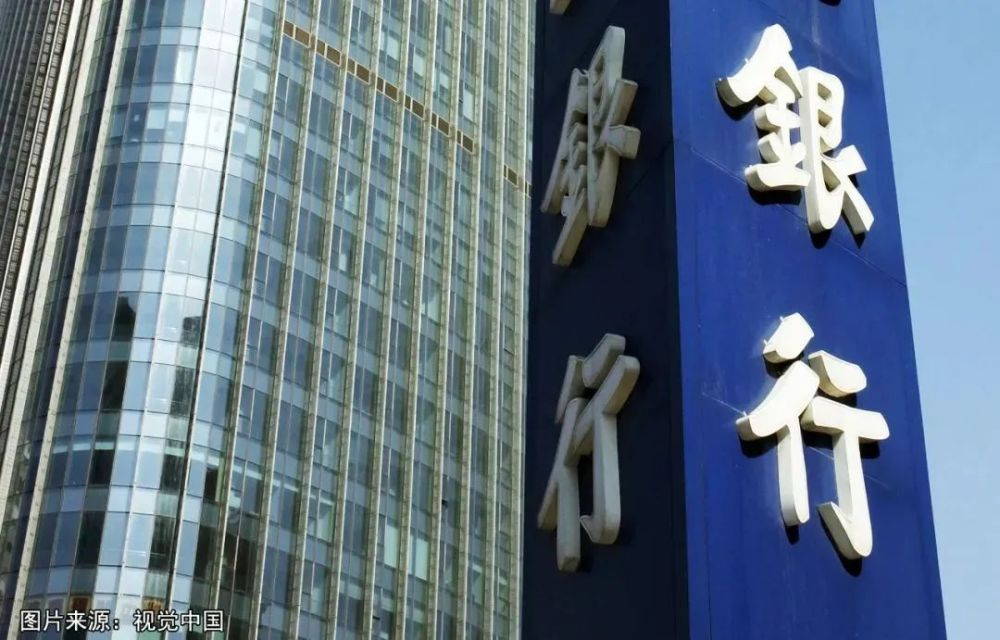

# 500亿元“补血计划”破灭，民生银行深陷地产“危机”

 _民生银行距离转折点还有多远？这是留给行长郑万春的问题。_

**中房报记者 苗野丨北京报道**

8月，民生银行遭遇“多事之秋”。

刚被国家金融监管总局开出4780万元的大罚单，又被交易商协会点名警告。

8月24日，交易商协会官网公布一份自律处分信息显示，民生银行作为债务融资工具的主承销商，存在多项违反银行间债券市场相关自律管理规则的行为。对此，交易商协会对民生银行予以警告，责令其针对本次事件中暴露出的问题进行全面深入的整改。

这或许与近期民生银行主承销的债券不断曝出违约有关。

中国房地产报记者查询企业预警通APP数据显示，民生银行主承销的债券有30只发生违约，累计违约金额245亿元，涉及16家企业，其主承销的房企债券违约金额达58亿元，违约主体包括金科地产、荣盛发展、新华联、佳源创盛等。

实际上，坊间关于民生银行很有可能成为本轮房地产债务危机最大受害者之一的讨论甚嚣尘上。就在近日民生银行主动终止的500亿元可转债募资计划的两轮问询中，上交所都重点提到了有关民生银行涉房业务的安全合规问题。

“现综合考虑资本市场环境，经审慎分析与论证后决定终止本次向不特定对象发行可转换公司债券事项，并向上海证券交易所申请撤回相关申请文件。”8月12日，民生银行公告称，该次拟发行A股可转债总额为不超过人民币500亿元，用于补充发行人核心一级资本。

历经6年，多轮问询，民生银行主动放弃这轮自2017年就开始筹备的巨额融资，这是继与“泛海系”纠葛之后，民生银行的又一举动引发市场关注。

“究竟是谁拖累了民生银行？”“叫停500亿元可转债后，民生银行测算的2025年493.39亿元的核心一级资本缺口后续如何补充？”“民生银行对高风险房地产开发商的风险敞口到底有多大？”“民生银行房地产贷款的总体风险是否可控？”……投资者和股民们纷纷抛出了疑问。

针对此相关问题，中国房地产报记者联系民生银行投资者关系部并发送邮件，其工作人员以只向投资者披露为由拒绝了采访，并表示不会就记者的采访需求与相关部门进行协调和转达。截至发稿，未收到民生银行的相关回复。

头顶“全国第一民营银行”的光环，在经历资产规模膨胀后陷入内外交困的尬境中，资本隐患、业务合规、处于上市股份银行尾部的营收净利增速等多方面的危机，无疑给现任行长郑万春带来不小的压力。面对承销债券与对公贷款不断发生房企暴雷的情况，民生银行又将如何出清风险？这也需要郑万春给出答案。

**叫停500亿元可转债，涉房问题成重点**

这份“补血计划”，民生银行筹备了6年。

早在2017年3月，民生银行首次公告提出公开发行A股可转换公司债券，先后收到并回复了证监会的两次反馈意见，2020年8月，民生银行收到中国证监会出具的《中国证监会行政许可申请受理单》，之后发行申请平移到交易所。2023年3月，民生银行收到上交所出具的《关于受理中国民生银行股份有限公司沪市主板上市公司发行证券申请的通知》，此后，上交所对其进行两轮问询。

最终，民生银行还是没能成功闯关。

“一是此次融资规模较大，当前二级市场承受能力有限；二是该再融资方案推出时间较长，放在当下有些不完善之处。”民生银行相关工作人员表示，通过可转债补充资本有利于民生银行更快速进行规模扩张，但撤回申请不会给银行的正常经营带来影响。

从上交所的两轮问询函来看，问题细致且尖锐。

3月，上交所对民生银行的首轮问询中，问题聚焦在房地产贷款、大额融资必要性、经营情况、合规情况、媒体质疑五大方面。7月的第二轮问询在融资必要性基础上问及融资规模合理性、发行方案合理性，以及监管处罚等合规问题、房地产客户具体情况等。

上交所向民生银行下发第一份审核问询函之后，民生银行以公告的形式披露了一份长达48页、近3万字的回复。

对于房地产贷款问题，上交所重点问及该行对公房地产不良余额和不良率问题，尤其关注对出险房企的敞口覆盖情况。

民生银行在回复中提到，截至2022年12月31日，该行对公房地产业贷款余额为3633.44亿元，占贷款总额的8.77%。房地产贷款余额（含对公房地产贷款和个人住房贷款）集中度占比为26.32%，低于27.5%的监管要求。同期，该行对公房地产业不良贷款余额为155.45亿元，不良贷款率为4.28%，占比和不良率均高于同行业可比公司平均值（5.64%、3.23%）。

对于出现风险的房地产客户，民生银行表示，截至2022年末，所有集团减值计提金额对缺口覆盖率均在100%以上，合计计提减值准备对总缺口的覆盖率为237.03%。

不过，在7月第二轮问询中，上交所进一步要求民生银行以表格列示报告期各期末全部房地产客户情况，列示在全部客户中出现债务违约、信用评级下调、无法及时兑付债务等风险事项的房地产客户具体名单、应收金额、账龄、是否逾期及逾期时间、减值计提金额、计提依据等。

截至目前，民生银行对第二份问询函的回复尚未公布。

“500亿元融资计划叫停后，民生银行或将面临较大的资本充足压力。如果不提高盈利能力，只依靠留存利润补充资本会后继乏力。”一位不愿署名的银行业分析人士表示，民生银行是多家出险房企的主要债权人，不良贷款率的飙升及内控失调都会使得民生银行面临更大的再融资挑战。

**房地产风险滋生**

民生银行与地产圈关系匪浅，房地产业务曾是拉动民生银行资产规模扩增的一大引擎。

1996年，民生银行成为中国第一家主要由民营企业发起设立的全国性股份制商业银行，起家于房地产的泛海控股是民生银行的发起人之一。在民生银行登陆A股那年，其第一大股东新希望，并列第二大股东泛海控股与东方集团皆有房企背景。

2008年，民生银行地产金融事业部成立，乃四大事业部之一；2014年，民生银行地产金融事业部提出地产金融的“投行化”；2015年，民生银行开始和房企频繁合作，包括正荣、阳光城、金科、佳兆业、蓝光、宝能、泰禾、恒大等。2017年，连续举办10年中国不动产金融年会的民生银行，请来了融创、旭辉、泰禾、易居等数十位地产圈大咖，那时候他们之间聊的最多的话题是“房地产的新时代”。

之后两年间，民生银行先后和18家房企签订了战略合作协议，从中可窥见房地产对民生银行的分量之重。

2019年，民生银行资产规模首度突破6万亿元，由上年末的5.99万亿元增至6.68亿元，增幅11.46%。其中，发放贷款和垫款总额占比上升，由上年末的50.99%升至52.2%，在对公贷款和个人贷款中房地产业务均表现强劲。从贷款行业集中度来看，民生银行房地产业贷款占比在2018年和2019年连续两年居首位，且呈走高趋势，依次为12.69%和13.66%。个人住房贷款所占比重亦从27.26%上升至29.72%。

不过，随着房地产行业前期累积的风险开始显现，民生银行房地产相关贷款风险膨胀。民生银行副行长石杰曾坦言：“我行房地产业务资产质量承压。”

从2021年开始，民生银行房地产业务的不良贷款率飙升。当年在房地产业贷款同比下降17.95%的同时，该行房地产业不良贷款却骤增214.93%至95.74亿元，不良贷款率由年初的0.69%攀升1.97个百分点至2.66%。到了2022年，民生银行对公房地产业不良贷款余额155.45亿元，不良贷款率升至4.28%。

值得一提的是，恒大“暴雷”，民生银行作为恒大最大的银行债主，对其债务规模高达293亿元。同样深陷房地产困局和巨额亏损中的泛海控股，民生银行对其贷款余额也有212亿元。

尽管民生银行多次向投资者表示“房地产项目总体风险可控”，但自恒大、泰禾、蓝光、阳光城等战略合作伙伴纷纷“暴雷”以来，民生银行的股价一度暴跌超过30%，对冲基金和其他卖空机构对它的看跌程度也一度超过国际上任何一家银行。

此外，监管部门和投资者对民生银行涉房业务风险敞口的忧虑也没有停止过，至今这个问题的答案依然是未知数。不过据花旗此前研报显示，民生银行对高风险开发商的风险敞口约1300亿元，占一级资本的27%，在国内大型银行中占比最高。

香颂资本董事沈萌亦表示，随着民营开发商风险升温，民生银行至少需要3年才能完成坏账清理。对高增长和股东回报的追求，促使该行进行了许多高风险的投资。

值得警惕的是，民生银行的拨备覆盖率较低，2022年时仅有141.06%，较2021年末下降了4.24%。截至2023年一季度末，民生银行的拨备覆盖率仅为144.11%，在42家A股上市银行中，民生银行排名倒数第一。

“房地产相关业务是拖累民生银行的一大包袱，这个问题不解决，将会为其未来发展留下一定的隐患。”某券商分析师认为，除了承销债券多次“踩雷”违约房企外，民生银行的贷款质量也饱受房企暴雷拖累。当下民生银行最棘手的就是要在自身不陷入流动性危机的前提下度过房地产行业的寒冬。

民生银行距离转折点还有多远？这是留给行长郑万春的问题。

**值班编委：李红梅**

**责任编辑：马琳 温红妹**

**审读：戴士潮**

**中国房地产报版权所有**

**未经授权不得转载以及任何形式使用**

