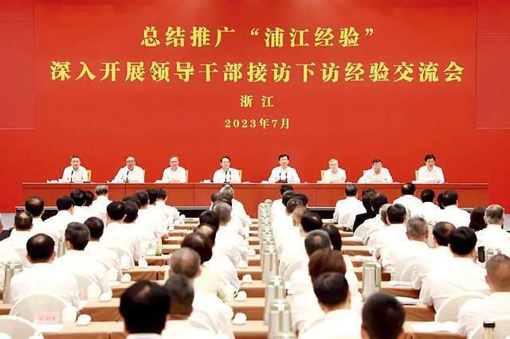

# 中央社会工作部组建，有何深意

近日，新组建的中央社会工作部不断有新消息释出。

7月21日，中央社会工作部、国家信访局与浙江省委在浦江县召开总结推广“浦江经验”深入开展领导干部接访下访经验交流会，这是中央社会工作部组建以来首次召开全国性会议。

自新一轮党和国家机构改革方案揭晓，中央社会工作部的组建就格外引发外界关注。前不久，中央社会工作部领导班子已经陆续公布，部长吴汉圣和副部长李文章、赵世堂、柳拯4位部领导相继在不同场合公开亮相。

北京师范大学中国教育与社会发展研究院教授宋贵伦曾担任北京市委社会工作委员会书记、北京市社会建设工作办公室主任11年，他对《中国新闻周刊》指出，中央社会工作部的组建是中国社会建设史上的一个重要里程碑，也是全面推动中国式现代化建设的重大战略举措。

**对社会发展领域进行整体研判 确定顶层设计和整体规划**

在中央社会工作部组建之前，许多人从专业技术概念上理解“社会工作” （Social
Work），即社会工作是一种职业化的助人活动，其特征是向有需要的人特别是困难群体提供科学有效的服务。

在中国人民大学公共管理学院教授何艳玲看来，中央社会工作部作为党中央的职能部门，其名称中的“社会工作”不应以上述定义去理解，而应理解为“关于社会发展的工作”（Social
Development），中央社会工作部也是一个关于社会发展有关工作的部门。

“‘社会发展’是一个区别于‘经济发展’的概念。过去的几十年，中国的改革是经济发展先行，到了现在这个阶段，我们发现社会发展也需要规划、研判，需要整体协调，也需要专业化和现代化。”何艳玲指出，中央社会工作部将对社会发展领域进行整体研判，确定顶层设计和整体规划。

宋贵伦也对《中国新闻周刊》指出，不太赞成把中央社会工作部简称为“社工部”，因为可能引发歧义，被认为是只抓社工队伍工作的部门。他建议，应把中央社会工作部简称为“中社部”，地方设立的社会工作部门称为“社会部”，这样更能概括中央社会工作部的工作职能。

根据《党和国家机构改革方案》，中央社会工作部负责统筹指导人民信访工作，指导人民建议征集工作，统筹推进党建引领基层治理和基层政权建设，统一领导全国性行业协会商会党的工作，协调推动行业协会商会深化改革和转型发展，指导混合所有制企业、非公有制企业和新经济组织、新社会组织、新就业群体党建工作，指导社会工作人才队伍建设等。

蒋敏娟是中国社会科学院大学政府管理学院教授、公共政策研究中心副主任，她对《中国新闻周刊》总结说，中央社会工作部的职能主要有三个方面，分别是统筹指导信访、基层治理和社会领域党建。

社邻家创始人闫加伟曾任共青团上海市委员会社会组织工作部部长，他认为，中央社会工作部将成为一个离群众最近的党中央职能部门，其统筹领导的工作无论是信访、基层治理还是社会领域党建，都是离老百姓特别近的事。

7月21日上午，中央社会工作部、国家信访局与浙江省委在浦江县召开总结推广“浦江经验”深入开展领导干部接访下访经验交流会。

截至目前，中央社会工作部已经公布4位部领导：

中央社会工作部部长由吴汉圣担任。吴汉圣生于1963年，二十届中央委员。出任中央社会工作部部长前，吴汉圣任中央和国家机关工委分管日常工作的副书记。

《中国新闻周刊》此前曾报道，吴汉圣兼具部委、地方工作经历，曾在中央和国家机关工委工作多年，也曾主政地市，还担任过协调能力要求较高的省委秘书长一职，也熟悉纪检监察工作。

中央社会工作部公布的3位副部长分别为李文章、赵世堂、柳拯。

李文章生于1963年，曾长期在宁夏任职，2020年任国务院副秘书长、机关党组成员，国家信访局党组书记、局长。李文章现任中央社会工作部副部长，中央信访工作联席会议办公室主任，国家信访局局长、党组书记。

赵世堂生于1967年，曾担任国务院国资委副秘书长、新闻发言人，国务院国资委总会计师、财务监管与运行评价局局长等职，2022年任国务院国资委副主任。

柳拯生于1966年，长期在民政部工作，曾担任民政部社会工作司司长、部管社会组织综合党委书记、社会组织管理局（社会组织执法监督局）局长等职，去年12月升任民政部副部长。

根据《党和国家机构改革方案》，中央社会工作部统一领导国家信访局。国家信访局由国务院办公厅管理的国家局调整为国务院直属机构。此外，中央社会工作部划入民政部的指导城乡社区治理体系和治理能力建设、拟订社会工作政策等职责，统筹推进党建引领基层治理和基层政权建设。划入中央和国家机关工作委员会、国务院国有资产监督管理委员会党委归口承担的全国性行业协会商会党的建设职责，划入中央精神文明建设指导委员会办公室的全国志愿服务工作的统筹规划、协调指导、督促检查等职责。

舆论认为，中央社会工作部一正三副共4位部领导中，吴汉圣在党建、组织、人事、纪检监察等方面经验对他执掌中央社会工作部大有裨益；此外，李文章、赵世堂和柳拯在国家信访局、国资委和民政部的历练有益于中央社会工作部未来的工作开展。

**顺应我国现阶段社会发展趋势**

多位受访专家对《中国新闻周刊》指出，中央社会工作部的组建是适应我国现阶段社会发展趋势的应时之举。

蒋敏娟在《组建中央社会工作部与社会治理现代化》一文中梳理了组建中央社会工作部的历史逻辑：从新中国成立到改革开放之前的30年时间里，我国实行的是计划经济体制，采取的是“单元分割式”的社会管理模式，以人民公社体制和单位制将全体社会成员纳入统一的管理体制中。随着改革开放的日益深化及市场经济的发展，社会结构发生了剧烈的变化，我国的社会治理环境发生了根本性的变革，原本依靠封闭的单位制实现社会融合的社会基础不复存在。

蒋敏娟指出，面对中国社会结构深刻转型的背景，中央需要遵循现代社会发展的逻辑和现代化建设的内在需求，在与外部新型环境的复杂互动中作出深层次的结构性调整，构建一种与新型社会形态相契合的社会治理新格局。中央社会工作部就是在这样的背景下组建的。

2004年，党的十六届四中全会首次提出“社会建设”的概念。2007年，党的十七大把中国特色社会主义事业的总体布局由经济、政治、文化建设“三位一体”拓展为经济、政治、文化、社会“四位一体”建设。2012年，党的十八大首次提出中国特色社会主义事业总布局是“五位一体”，即经济建设、政治建设、文化建设、社会建设、生态文明建设。

宋贵伦说，过去，在“五位一体”总体布局中，唯独没有综合部门来抓社会建设协调工作，而社会建设是五大建设中最基础、最综合的一项工作，恰恰需要一个综合的部门，“中央社会工作部的组建，补上了这个短板”。

“以往在社会工作领域，如何整合资源是一个难点和痛点，因为到了基层，各种相关职责都是碎片化地分散在不同部门。”闫加伟告诉《中国新闻周刊》，社会的复杂性越来越突出，任何与社会治理相关的事情，都不可能只涉及一个部门，因此就需要协作，需要整合资源，如果有一个部门统一领导和协调统筹各项社会工作，更有利于各项问题的解决。

何艳玲指出，社会的复杂性以及社会工作的专业性和系统性超出人们的想象，这些年的一些重大社会工作，例如征地拆迁和农民集中居住，都堪称巨型工程，需要系统谋划，“只有党委有这种权威性、这种资源的调动能力以及广大的群众基础来做这件事”。

实际上，中央社会工作部组建之前，地方上已经有了先行先试的经验。2003年起，上海市、北京市、广东省等地先后设立地方社会工作委员会，加强党对社会领域工作的集中统一领导。宋贵伦认为，中央社会工作部也是在对过去这些年地方经验的总结上组建的。

在蒋敏娟看来，新组建的中央社会工作部，充分吸收整体性治理的理念，重塑社会治理格局，将相近或者类似的社会工作职责从中央机构及国务院相关组成部门集中到中央社会工作部，并且随着社会工作的相关职责集中到中央社会工作部，原先民政部等机构负责相关职责的部门将被撤销或者合并。

“这种组建方式将原来需要在多个部门之间流转的事务集中到一个部门，可以大大提高决策和办事的效率，机构设置更加科学，职能更加优化，权责更加协同，运行更加高效。”蒋敏娟说。

宋贵伦指出，中央社会工作部的组建是面对现实社会工作中的突出问题，适应当前推进中国式社会建设现代化的迫切需求，围绕着中国式现代化的目标，来推动体制的改革，最终目标是提升社会建设的效能，或者说是把中国特色社会主义制度的显著优势更好转化为社会建设的效能。

**“解决中间环节脱节”**

7月21日，总结推广“浦江经验”深入开展领导干部接访下访经验交流会在浙江浦江召开，浙江省委书记易炼红，中央社会工作部副部长、国家信访局局长李文章出席会议并讲话。

李文章在会议讲话中指出，要坚持和发展“浦江经验”，全面推动新时代信访工作高质量发展，扎实开展领导干部接访下访，大力推进源头治理和积案化解，深入推进信访工作法治化，着力夯实信访工作基层基础。

2003年，时任浙江省委书记的习近平把浦江县作为首次下访接访群众的第一站，此后带头坚持每年下访，开创了省级领导干部下访接访的先河，“浦江经验”由此逐步形成。中央社会工作部组建后，首次高规格会议以“浦江经验”作为关键词，足以看出中央社会工作部对于信访工作的重视。

多位受访专家表示，中央社会工作部统一领导国家信访局、统筹指导信访工作，将使信访工作的工作方式发生重大变化。

宋贵伦认为，以往信访部门像一个传达室，能够收集人民群众的意见，了解群众的呼声，但是其没有解决问题的能力，且与社会建设工作不在一个闭环系统。各级社会工作部门组建以后，信访工作由社会工作部统筹领导，社会工作部作为一个和组织部、宣传部、统战部平列的综合协调部门，可以出面协调、牵头解决一些问题，就可以形成一个收集群众意见、反映群众呼声、解决突出问题、反馈办理结果的一个闭环系统。

“随着中央社会工作部统筹指导信访工作，未来信访工作思路有望实现由‘堵’到‘疏’，由被动应付到主动下访。”蒋敏娟表示，中央社会工作部把统筹领导信访工作纳入工作职能，这个改变非常巨大，也非常有必要。这一设置的目的是为了更好解决群众的问题，对于群众的信访，会更多通过基层组织体系来解决，而不是单纯用各种行政程序来应对，回归信访部门联系群众的本质属性。

宋贵伦指出，从制度体系上来说，在我国这样一个大国，抓宏观顶层设计和微观基层实践很重要，但中程运行机制也非常关键，“光是宏观有政策，微观抓落实，但是中间不畅，渠道不通，会有问题。信访工作作为社会工作和群众工作的一个重要环节，应当纳入这个体系，否则就会造成中间的环节脱节”。

他认为，把信访工作纳入中央社会工作部是解决中间环节脱节的一个重要的体制改革创新，使制度可以落到基层，也可以使基层群众的呼声诉求很好地反映上去，打通中间环节，落实全过程人民民主。

**“不能站位太低，不能工作面太窄”**

中央社会工作部的组建是党和国家机构职能体系的重大变革，而在其实际运行过程中，仍有一些值得注意的问题。

中共中央党校（国家行政学院）公共管理教研部副教授张克在《从地方社工委到中央社会工作部：党的社会工作机构职能体系重塑》一文中指出，新一轮机构改革后，党和国家机构中直接冠以“社会”相关名称的机构有中央社会工作部、人力资源和社会保障部、全国人大社会建设委员会、全国政协社会和法制委员会。相比于社会建设、社会保障、社会治理等概念，社会工作的内涵和外延仍不够清晰明确，容易导致社会工作机构职责边界模糊化。

他认为，唯有科学地厘清社会建设、社会工作、党的社会工作、社会保障等重要概念之间的逻辑关系，才能明确新时代党的社会工作机构的职能边界和工作对象。

何艳玲也指出，中央社会工作部要注重对社会动态的研判和研究；另外，作为一个新设的部门，也要把自己研究清楚，与其他部门的职责分工要厘清。

蒋敏娟告诉《中国新闻周刊》，中央社会工作部组建之后，要着力推动机构职责体系的优化，要参照大部制改革机构合并的相关经验，注意理顺新组建机构内部的职责分工；要科学合理地设计省、市、县不同层级社会工作部的工作目标，实现职能的合理分解与整合。

“按照机构设置的管理，纵向上，省、市、县的社会工作部门的职责和中央社会工作部的职责是对应的，区别可能体现在，中央层面或省级层面侧重政策的制定、协调，重大决策的督办等，市、县社会工作部门更加重视市区的治理、基层政权的建设、人民意见的反馈和收集等。”蒋敏娟说。

宋贵伦强调，中央社会工作部将要站在“五位一体”整体布局和推动中国式现代化的高度，全面统筹、整体协调社会建设工作，不能站位太低，防止与具体部门工作重复。

宋贵伦还表示，中央社会工作部也不能工作面太窄，不能仅做职能整合进来的工作，“在推进‘五位一体’工作中，经济、政治、文化、生态之外的事情，原则上都是社会工作，社会工作部实际上是一个兜底的部门”。此外，中央社会工作部也不能满足于抓具体工作，“要抓一个面，而不仅仅抓一条线，更不仅仅是抓一个点”。

发于2023.8.28总第1106期《中国新闻周刊》杂志

杂志标题：中央社会工作部组建背后

记者：张馨予

