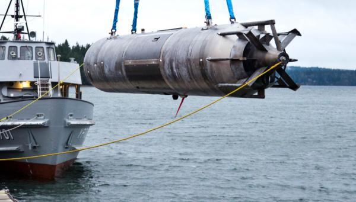
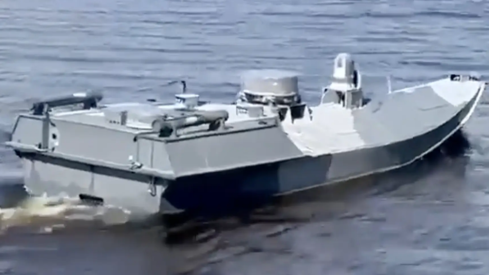

# 乌克兰开始测试无人潜航器，专家：俄或将迎来更难对付的自杀式攻击

继公开自杀式水上无人艇之后，乌克兰开始测试可携带大量炸药的自杀式无人潜航器。

近日，乌克兰开始测试名为“Marichka”的无人潜航器。在获得初步作战能力后，无人潜航器将对包括黑海舰队海军基地在内的俄黑海关键基础设施展开自杀式攻击行动。

_准备接受测试的“Marichka”的无人潜航器。_

**“比无人艇更难对付”**

据报道，“Marichka”是一艘黑色无人潜航器，长6米，航程约1000千米，可以执行攻击、运输或侦察任务，但该潜航器的有效载荷能力和其他技术细节尚不清楚。“Marichka”是一个由志愿者工程师（称为AMMO
UKRAINE）在捐款下自行设计和制造的系统，估计成本约为1600万格里夫纳（约合43.3万美元）。

无人潜航器（Unmanned Underwater
Vehicle，简称UUV）是一种能够在水下自主执行任务的无人系统。由于具有高自主性、低风险性、强隐蔽性以及灵活部署性等特点，被认为是未来海战最有效的作战手段，具有重要的军事价值。美军认为，水下无人潜航器技术的进步将给美国海上作战带来革命性变化，极大地增强美海军的水下行动能力，并将其列为美国“第三次抵消战略”的重要装备之一。

分析认为，目前还不知道“Marichka”可携带多少炸药，但预计会有大量炸药。在乌军组织的第一次袭击后，乌克兰增加了海上无人系统的航程，并袭击了俄军关键基地。俄罗斯已经制定了一些针对海上自杀式袭击的措施，如改进侦察和硬杀伤措施，但最近俄罗斯登陆舰和后勤油轮被袭击证明这些措施不足以确保俄罗斯资产的安全。无人潜航器对俄罗斯黑海舰队来说更加危险，因为俄罗斯的探测系统很难探测到这些武器。此外，“Marichka”会撞击舰船的水下部分可能更具破坏性。

海军专家李杰接受澎湃新闻（www.thepaper.cn）采访时指出，相对于航行在水面的无人艇，水下潜航器更难探测，只能依靠声呐，雷达或光电系统基本没用，而水下环境非常复杂，声呐有时候也无法发现水下潜航器，这也是为什么潜艇依然是一个很不好对付的水下兵器。

 _美国非常重视无人潜航器技术的发展，图为美国研制的 “蛇头”大型无人潜航器。_

“无人潜航器尺寸比潜艇更小，隐蔽性更强，而且造价低很多，多个潜航器一起出动的话，更难对付。”李杰补充说。

“Marichka”并非乌克兰公布的首个无人潜航器，今年5月，据报道，乌克兰政府成立的Brave1小组推出了名为Toloka
TLK-150新型无人潜航器，目标是支援黑海北部地区的作战。TLK-150是首个公开的乌克兰自主研发的无人潜航器，长2.5米，采用非常规设计，较同尺寸无人潜航器具有更大的稳定器和更宽的双推进器构型，设有独立的方向舵。

与众多同类无人潜航器不同的是，TLK-150配备一根高耸桅杆，依靠龙骨稳定平衡，桅杆上装有摄像头和通讯设备，推测可用作潜望镜，能在靠近敌方海岸处执行情报收集任务。该潜航器支持“人在回路”控制方式，也可自主导航和执行作战任务。Brave1小组还透露了两型更大尺寸的无人潜航器设计：长4-6米的TLK-400，直径也较TLK-150更大，应具备更大的航程和负载能力；TLK-1000长度则达到12米，配备四个推进器。

当时，Brave1小组推出的TLK无人潜航器只是概念设计图，并非实物，目前还未有测试或实战使用的消息，可能还处于研制之中。

“对于防御的一方来说，要有效应对无人潜航器对港口或跨海大桥的攻击，需要布设高精度水下固定声呐阵列、反潜拦截网以及增加巡逻的舰艇数量，此外，还可以打击生产和部署无人潜航器的设施，从源头上进行反制。”李杰介绍说。

_乌克兰公布的“Sea Baby”新型自杀式无人艇采用低能见度的灰色涂装。_

**适合用于攻击军港和跨海大桥**

“Marichka”无人潜航器一旦列装，乌军海上自杀式攻击手段将更加丰富。

8月15日，乌克兰承认对7月17日克里米亚大桥袭击事件负责，并在此次事件中使用试验性新型自杀式无人艇“sea
baby”。乌克兰国家安全局局长瓦西尔·马柳克8月15日表示，乌克兰方面袭击克里米亚大桥时采用的无人艇是由乌克兰自主研发。

媒体刊文称，“sea
baby”是乌克兰军队武器装备中出现的最新自杀式无人艇，携带有多达850千克重的炸药。这些载有炸药的无人艇成为乌军在黑海周围复杂战役中越来越受欢迎的武器。

从乌克兰公布的图像来看，新型自杀式无人艇“Sea
Baby”沿袭了早期乌克兰自杀式无人艇的设计，采用低能见度的灰色涂装，配有光学传感器和卫星通信设备，能够远程控制，航速达到每小时80千米左右，具有较好的机动性。

乌克兰国家安全局发布的相关视频展示了“sea
baby”无人艇在撞击桥梁的一个混凝土桥墩前的瞬间。报告称，这艘无人机船携带了“多达850千克的炸药”，这比任何其他已知的乌克兰无人艇的有效载荷都大。

瓦西尔·马柳克表示，无人艇是在乌克兰当地制造的，没有西方的参与，该武器是乌克兰安全部门的独特发明，也没有任何私营公司参与其中。马柳克表示，“我们最近使用这些无人艇成功击中了克里米亚大桥、登陆舰‘奥伦戈尔斯基·戈尔尼亚克’号和‘西格’号油轮。”

目前，登陆舰‘奥伦戈尔斯基·戈尔尼亚克’号和‘西格’号油轮正在造船厂的船坞内接受维修，照片显示，两艘舰船被炸出一个大洞。

_乌克兰去年使用的自杀式无人艇。_

报道称，乌克兰将越来越多地使用这种无人艇打击俄罗斯战略目标。乌克兰官员越来越公开地表示，他们参与了针对俄罗斯目标的不同类型的无人艇袭击。

“为了保证远航程，无人潜航器的速度比较慢，更适合攻击港口、锚泊的军舰以及跨海大桥等固定目标，如果攻击航行中的水面舰艇需要配备声呐以及自动化作战系统，技术最先进的美国都还没有正式列装，乌克兰的无人潜航器应该不具备这种能力。”军事专家韩东分析认为。

“对于俄罗斯军队来说，自杀式无人潜航器若在无人机、无人水面艇配合作战将是一个很大威胁，因为要同时应对来自空中、水面和水下的攻击，容易应接不暇，顾此失彼。”韩东表示。

去年10月，乌克兰使用无人机和无人艇对塞瓦斯托波尔海军基地发动了密集突击。此次乌共出动9架无人机、7艘自杀式无人艇，攻击目标不仅是海军主基地的码头，还有在港外停泊锚地担负战斗值班的舰艇。

