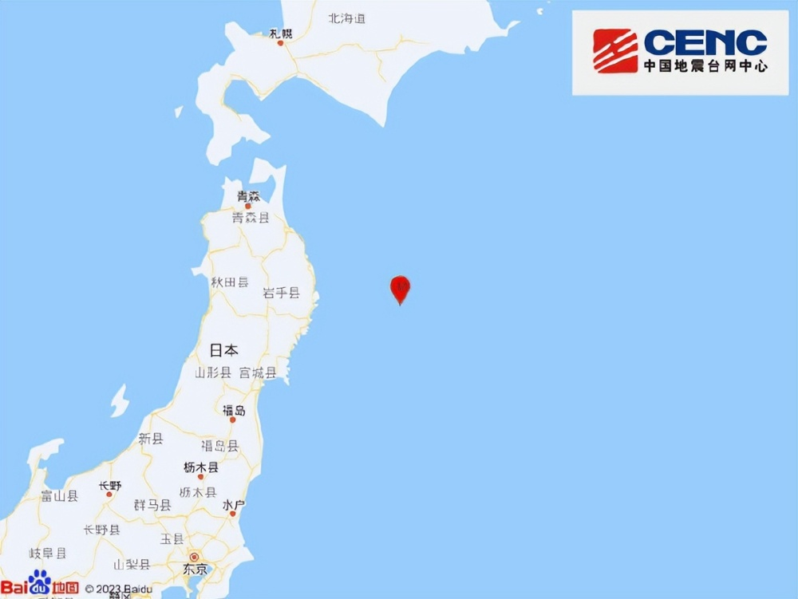
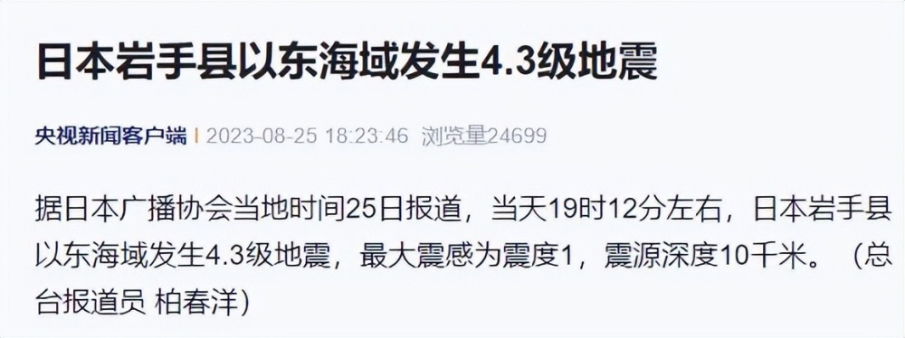
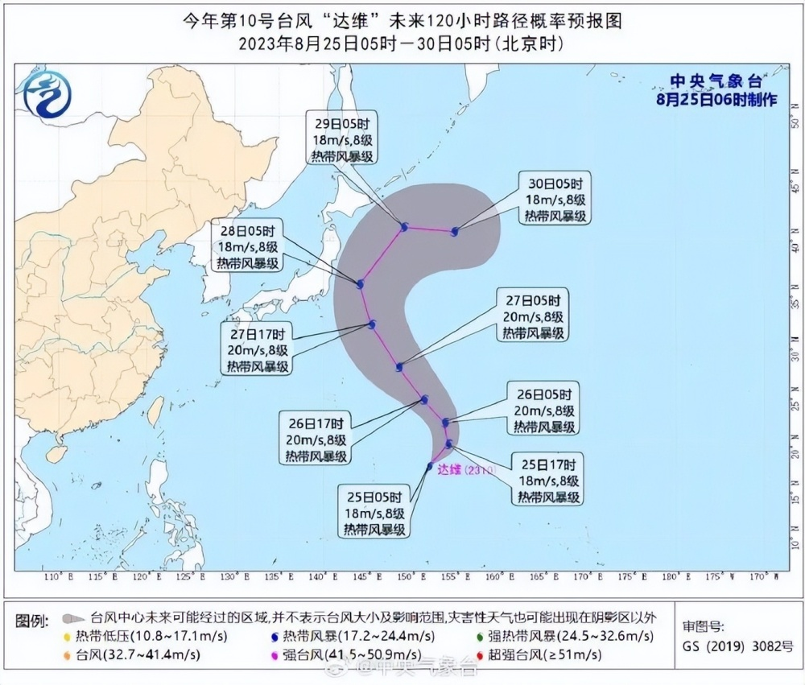
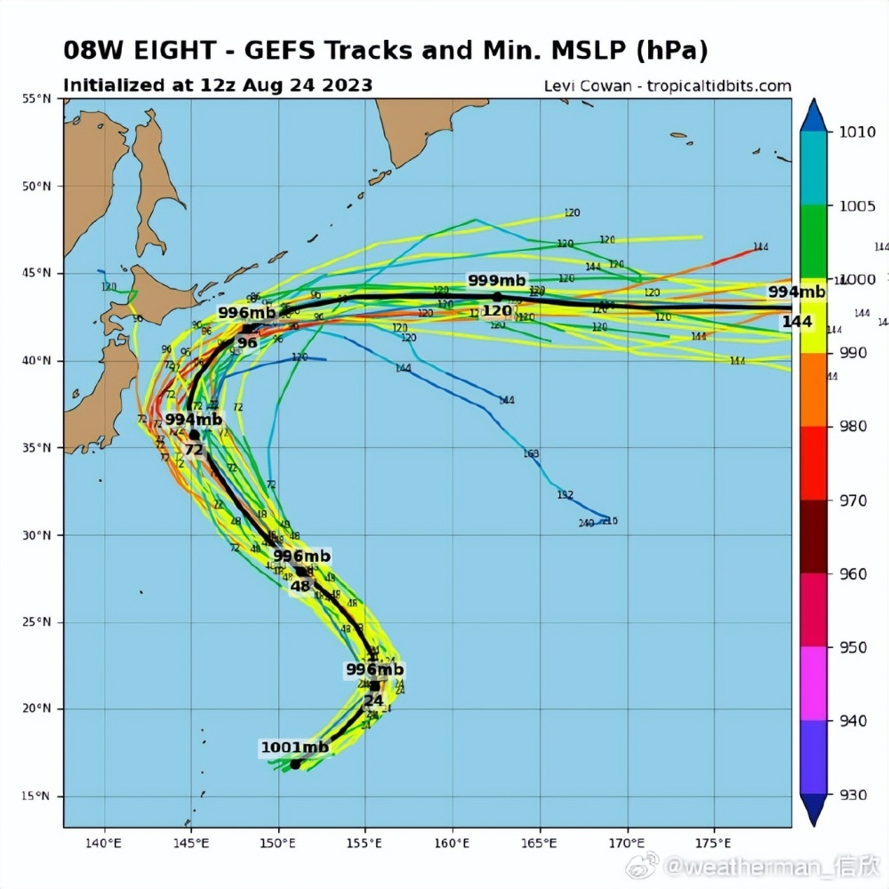

# 台风“达维”预计影响福岛附近海域，专家：可能利于核污染水向东传

据央视新闻援引日本TBS电视台消息，当地时间 **8月26日7时2分左右** ，日本茨城县北部发生里氏 **4.0级地震**
，最大震感为震度2，震源深度60千米。

此前一天，“日本一天两次地震”话题曾登上热搜第一，引发关注。

据中国地震台网正式测定： **08月25日06时48分** 在日本本州东海岸远海（北纬39.50度，东经143.55度）发生 **5.8级地震**
，震源深度10千米。

据日本广播协会当地时间25日报道， **当天19时12分左右，** 日本岩手县以东海域发生 **4.3级地震** ，最大震感为震度1，震源深度10千米。

与此同时，今年第10号台风“达维”已生成，预计将影响日本东部沿海地区。

据中央气象台8月25日消息，25日5时，今年第10号台风“达维”生成于关岛东偏北方向约920公里的洋面上。

从路径来看，预计28日至29日，台风“达维”将抵达日本东北地区及北海道以东海域，随后转为向东移动。 **而日本福岛县正位于日本东北地区。**

台风“达维”是否会影响日本福岛核电站的核污染水排放计划，尚未有相关方回应。

中国气象频道气象分析师信欣表示，这个台风将北上，对我国无直接影响。考虑台风卷起的风浪，可能利于日本核污染水向东传。 ​​​

**【来源：九派新闻综合央视新闻、中国地震台网、中央气象台等】**

