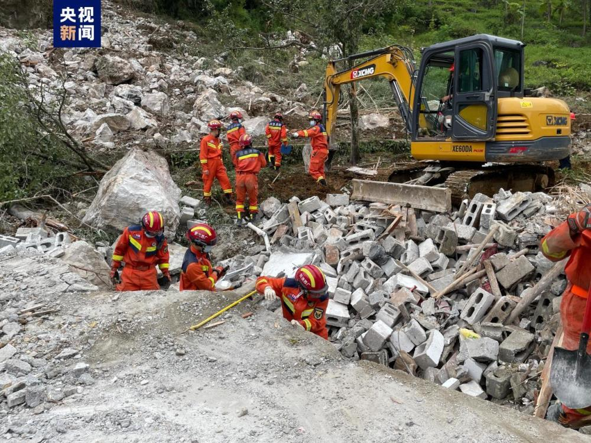
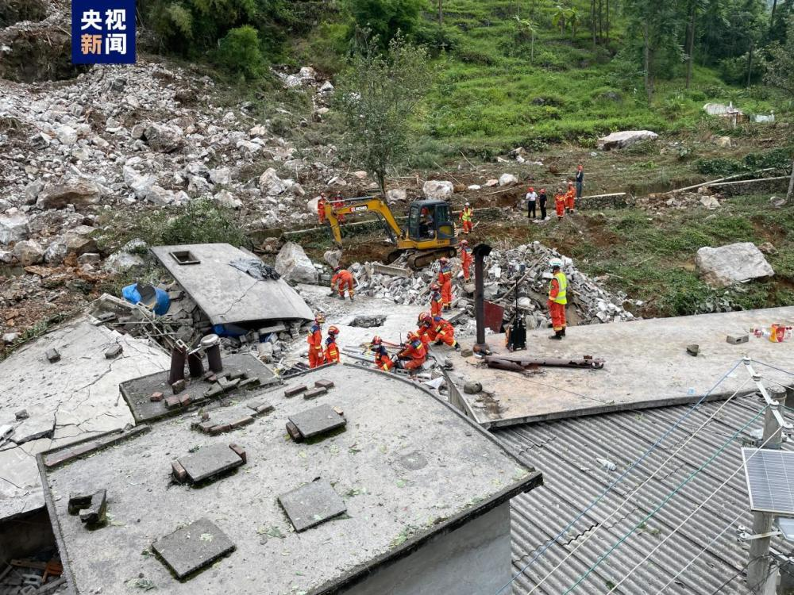

# 广西德保县敬德镇发生山石滚落致2人遇难

来源：央视新闻客户端

8月26日00时37分，广西德保县敬德镇暮洞村坡女屯突发山石滚落，造成5户民房受损，3人被困。截至当日10时40分，被困人员已经全部救出，其中1人生命体征正常，2人经县人民医院抢救无效死亡。

灾害发生后，德保县迅速启动突发灾害应急预案。立即组织应急救援队伍赶赴现场。百色市委、市人民政府第一时间派出应急、消防、自然等部门专业力量驰援德保开展救援处置工作，尽全力抢救被困人员，疏散和安置处在危险区域的群众。

截至8月26日8时，成功转移危险区域内群众24户55人。目前，遇难者家属抚慰和善后处置工作仍在紧张有序进行中。（总台记者 王洁）

