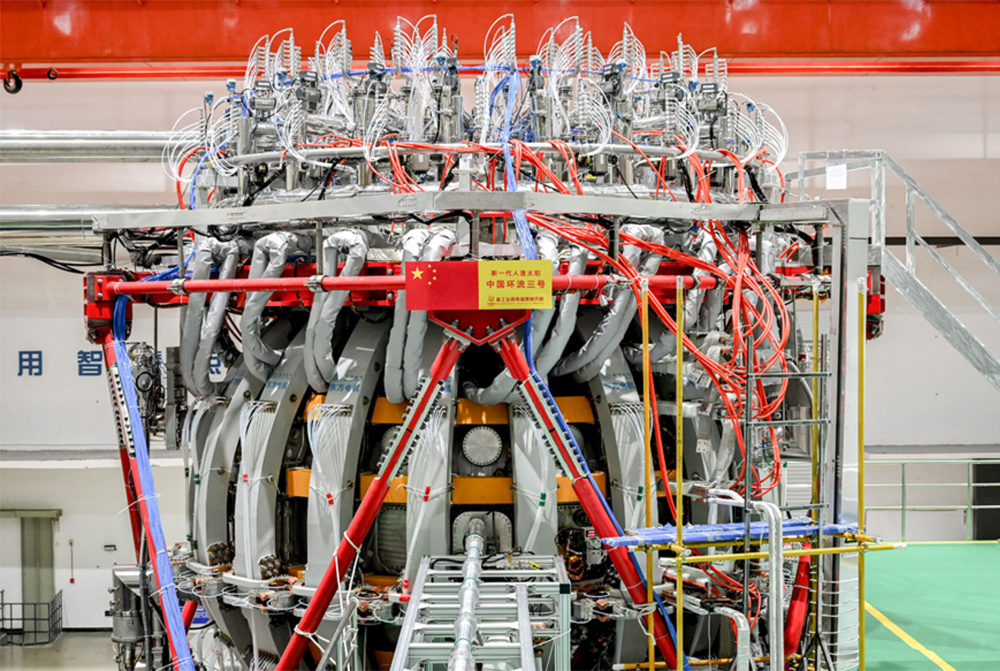
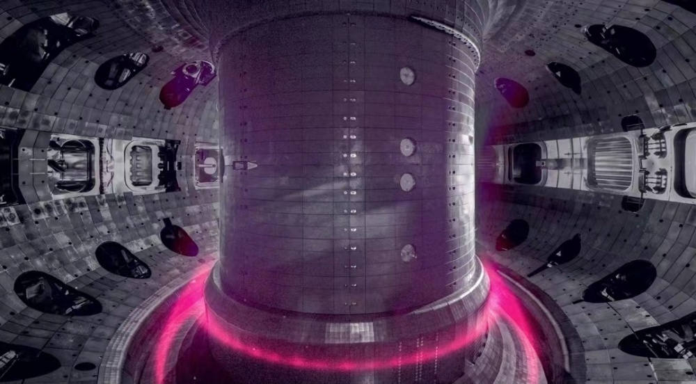

# 新一代人造太阳取得重大进展：我国掌握可控核聚变高约束先进控制技术

据中核集团消息，8月25日下午，新一代人造太阳“ **中国环流三号**
”取得重大科研进展，首次实现100万安培等离子体电流下的高约束模式运行，再次刷新我国磁约束聚变装置运行纪录，突破了等离子体大电流高约束模式运行控制、高功率加热系统注入耦合、先进偏滤器位形控制等关键技术难题，是我国核聚变能开发进程中的重要里程碑，标志着我国磁约束核聚变研究向高性能聚变等离子体运行迈出重要一步。

_新一代人造太阳“中国环流三号”。_

为实现聚变能源，需要提升等离子体综合参数至聚变点火条件。磁约束核聚变中的高约束模式（H模）是一种典型的先进运行模式，被选为正在建造的国际热核聚变试验堆（ITER）的标准运行模式，能够有效提升等离子体整体约束性能，提升未来聚变堆的经济性，相较于普通的运行模式，其等离子体综合参数可提升数倍。

_“中国环流三号”首次实现100万安培等离子体电流下的高约束模式运行，再次刷新我国磁约束聚变装置运行纪录。_

可控核聚变作为面向国家重大需求的前沿颠覆性技术，具有资源丰富、环境友好、固有安全等突出优势，是目前认识到的能够最终解决人类能源问题的重要途径之一，对我国经济社会发展、国防工业建设具有重要战略意义。可控核聚变是我国核能发展“热堆—快堆—聚变堆”三步走战略体系的重要组成部分，是解决国家能源需求、助推“双碳”目标实现、促进能源新体系构建和保障国家能源安全的关键科技变量。

在实现百万安培等离子体电流高约束模式运行的基础上，新一代人造太阳“中国环流三号”团队，将进一步发展高功率加热和电流驱动、等离子体先进运行控制等核心技术，实现堆芯级等离子体运行，研究前沿聚变物理，为我国开展聚变燃烧实验、自主建造聚变堆奠定坚实基础。

