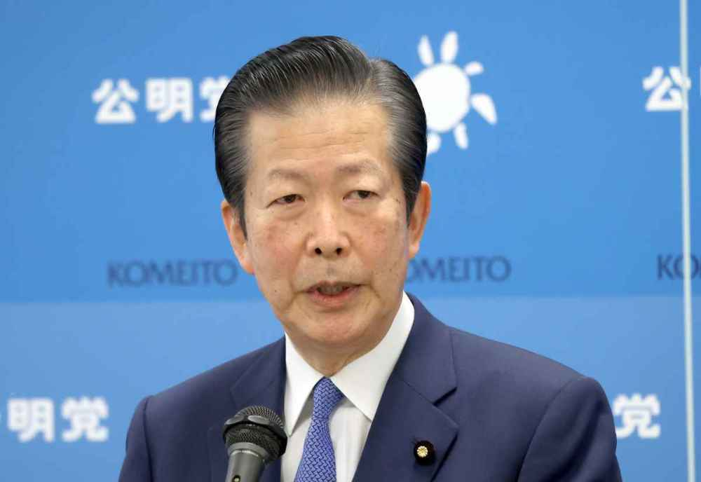

# 日本公明党党首推迟访华：被中方告知当前不是访华“适当时机”

（观察者网讯）当地时间8月26日，日本公明党发布消息称，党首山口那津男原定28至30日访问中国的行程延期。据日本共同社和NHK电视台报道，公明党方面称，他们被中方告知当前不是访华“适当时机”，因此认为日本核污染水排海一事对访华产生影响，对此“感到遗憾”。

据公明党透露，中国方面告知，“鉴于当前中日关系的状况，现在不是合适时机”。

公明党方面称，双方商议后，决定将党首山口那津男访华行程延期。同时中方也表示，“非常重视公明党长期以来的交流，并高度评价公明党为访华做出的积极努力”，今后将重新考虑适当时机。

在当天接受媒体采访时，公明党党首山口那津男表示：“非常遗憾。不能否认核污染水排海一事（对访华行程）造成了影响，从中方严厉反应来看，目前的环境很难冷静地进行对话。”他还说：“因为多次摸索访华，持续展开了协调，（对于延期）我很遗憾。我将努力争取能再次敲定日程。”

_日本公明党党首山口那津男，图自日媒_

日本共同社8月3日报道，日本公明党党首山口那津男“基本决定于8月28至30日对中国进行访问”。

共同社称，山口那津男已提出希望与中国领导人举行会谈，而此行旨在促进日中关系改善，此前因钓鱼岛争端、日本强推核污染水排海等问题两国关系有所恶化。

据称，这将是山口在2019年8月之后再次访华。公明党长期被视为日本政坛的友华力量，山口那津男本人也一直积极推进中日友好。

当地时间8月24日13时，日本政府无视国际社会的强烈质疑和反对，单方面强行启动福岛核事故污染水排海。东京电力公司就此事在临时记者会上宣布，今天的核污染水排放量预计为200到210吨，每天的排放情况将在次日公布。首次排海每天将排放约460吨，持续17天，合计排放约7800立方米核污染水。

我外交部发言人24日就日本政府启动福岛核污染水排海发表谈话称，中方对此表示坚决反对和强烈谴责，已向日方提出严正交涉，要求日方停止这一错误行为。同日，中方宣布全面暂停进口日本水产品。

NHK提到，在日本启动核污染水排海后，24日下午，公明党党首山口那津男曾与日本首相岸田文雄进行了约1小时的会晤。会后，山口那津男表示将按时于下周访华，并计划向中方“礼貌地解释”日本核污染水排海的决定。“我们将立足大局，为建立建设性、稳定的日中关系尽最大努力。”

**本文系观察者网独家稿件，未经授权，不得转载。**

