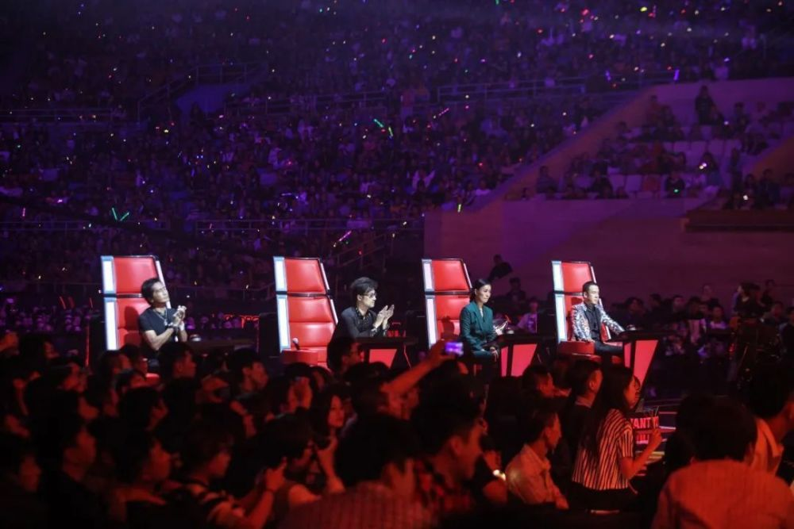
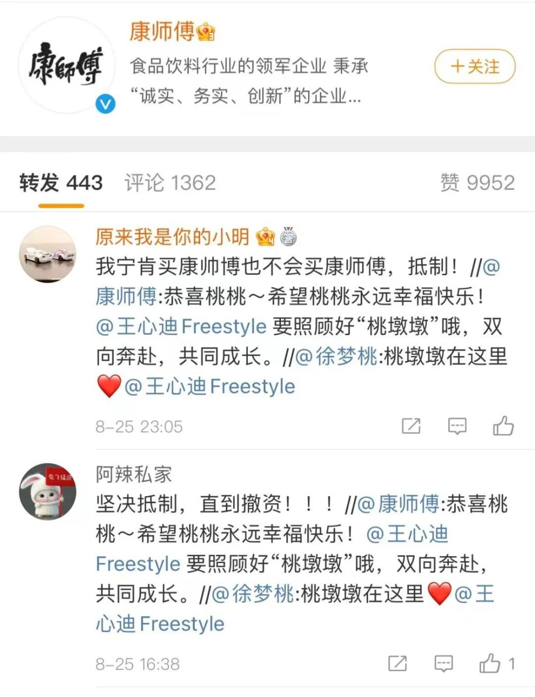
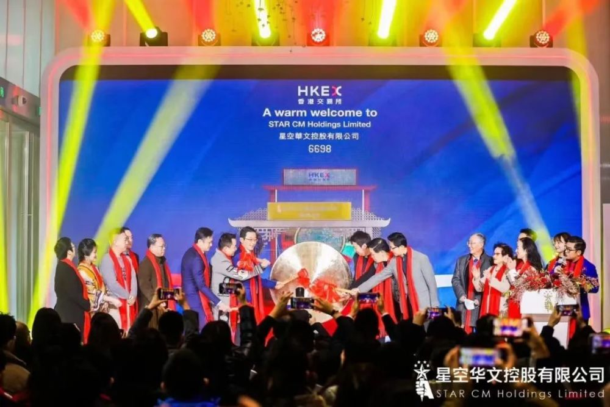
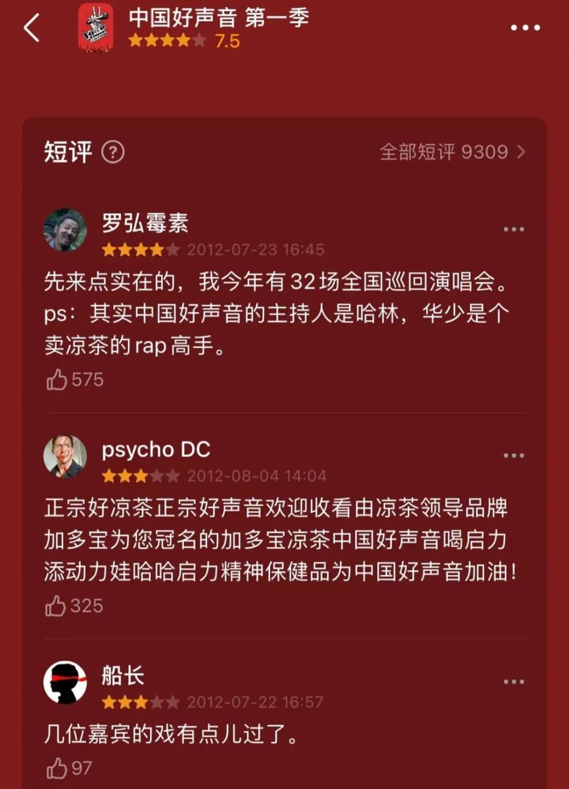
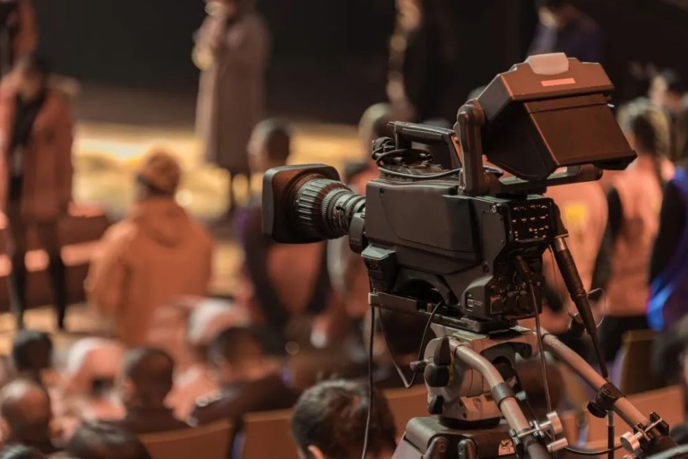
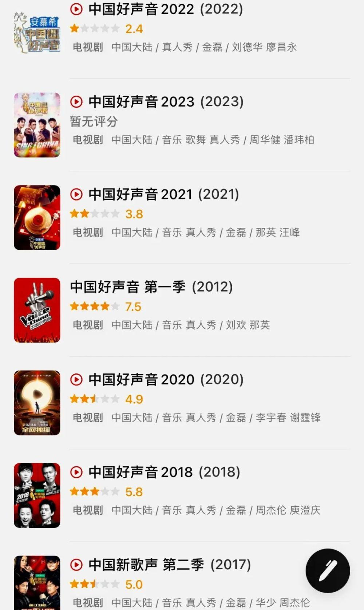
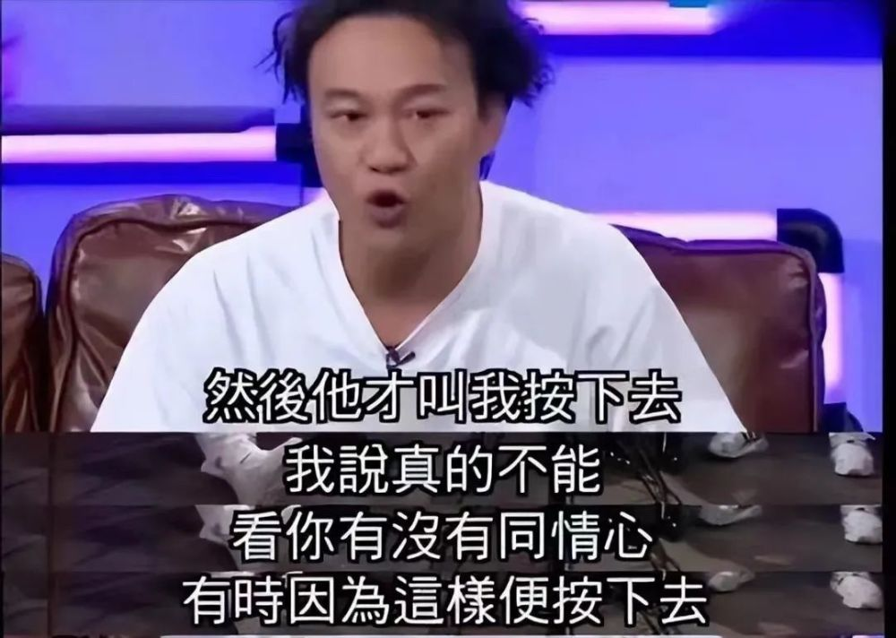

# 李玟录音引发停播风暴：《中国好声音》12年，到底卷了多少钱

**如果不是李玟录音的曝光，很多人或许不会注意到，《中国好声音》已经播到第12季了。这档曾经备受瞩目的国民级综艺，在变得“查无此综”的同时，评分和口碑也滑向“崩塌”。然而，作为吸引过无数热钱的巨型IP，在这场暴风般的喧嚣里，消失的财富仍然是个天文数字。**

**文 |** 饶桐语 常芳菲

**编辑 |** 辛野

**运营 |** 栗子

**“摇钱树”，摇摇欲坠**

在《中国好声音》宣布停播之后，一家名为星空华文的传媒类公司，成为最先直面经济损失的风暴眼。

曾经，大众对于《好声音》的认知，更多地停留在浙江卫视，随着各方媒体的起底，灿星文化和其背后的母公司星空华文，作为隐藏在《好声音》背后的真正制作方，逐渐浮出水面。2011年，一位名叫田明的省级卫视综艺总监跳出体制，成为了星空华文传媒CEO兼灿星文化总裁，一年后，《中国好声音》被制作出来，并在浙江卫视播出。此后十年间，星空华文多次冲击IPO，最终在2022年得以上市。

在李玟录音被曝光后的10天时间里，星空华文股价连连下跌，从8月17日的收盘价124港元/股，腰斩至25日收盘时的54.6港元/股——短短八天内，超过260亿的市值迅速蒸发。

《好声音》曾经给星空华文创造过多大的财富，如今就带来了多大的反噬。

完全可以用“摇钱树”来形容这个巨型IP。自2012年开播以来，它就以超过3个亿的广告收入，占据综艺广告的吸金榜首，这个数字很长一段时间还在持续攀升。有媒体做过计算，在2015年到2017年，《好声音》为当时还未上市的灿星文化（下称“灿星”）创造了28个亿的财富，占三年收入的接近40%。

独家冠名费，成为摇钱的大头——第一年的独家冠名，加多宝靠6000万拿下，而从第二年开始，这项费用直接跃升至以“亿”为单位计算，第二年是2个亿，第三年是3个亿，涨到第六年，冠名费已经跃升到5个亿。还有一些拿不出夸张预算的品牌方，则把目光盯上了总决赛现场，2015年，优信二手车花了3000万，买下了决赛宣布冠军前的60秒单条广告。

到了今年，广告商们的赞助费大概率是打水漂了。一波接一波的怒气里，网友们把这一届《好声音》的植入广告翻了个底朝天——康师傅是独家冠名，京都念慈菴是独家特约，君乐宝的头衔是战略合作伙伴，其余还有播出赞助商胡姬花，和首席合作伙伴上海贵酒等。这些企业到底花了多少钱才斩获赞助身份，并未在公开渠道公布，但往年的数据显示，大约也并非小数目。根据上海贵酒在2022年对上交所的一则官方回复，赞助《中国好声音》花了1044万元。

在各个赞助商的微博、直播间里，抵制的评论一条接着一条蹦出来。康师傅的官方微博里，不过3万的粉丝数量，评论转发却纷纷过千。直播间里，主播们长久无言，背景音乐换成了李玟的《想你的365天》，但愤怒的网友很难买账，“不撤掉赞助就不买”。或许是对这场合作还抱有希望，直到现在，也没有赞助商对此事做出回应——就在两年前，康师傅还因为代言人顶流吴亦凡的翻车，被推上风口浪尖，但那一回，康师傅在短短两天时间里，火速选择了宣布和吴亦凡解约。

 _▲ 在康师傅最新发布的微博下方，出现了抵制的声音。图 /
微博_

受伤的不仅仅是广告商。人人都想从《好声音》这个大IP身上，摇下一把热钱。2016年，一家名为腾扬广告的公司，以每年6000万的价格买下了海选授权，这意味着，得到授权的公司们可以在各地承办赛事时，独立招商。但在遭受争议之后，下沉市场还有多少人买单，依旧是个谜团。

星空华文旗下的子公司和签约艺人们，多少也会受到波及。2012年，《中国好声音》成立了一家名为梦响强音的经纪文化公司，此后从节目里走出来的冠军们，基本全员都签约到了其门下。值得注意的是，这家经纪公司有着极高的商誉价值，据媒体报道，截至去年年中，梦响强音的商誉净值依然高达12个亿，这个代表着市场认可度的品牌价值，此后或许还会大幅蒸发，到那时，星空华文的亏损就会更大。

在此次舆论危机之前，这档开播了11年的节目已经显现出颓势。尽管有着各式各样的盈利途径，《好声音》带来的毛利率却一路下滑。2021年，这档节目给背后制作公司带来的毛利只剩560万元。

但它依旧承载着星空华文最后的希望。就在几天前，灿星内部人士还曾在接受橡果商业评论采访时表示，节目不会停播。

_▲ 星空华文于2022年上市。图 / 网络_

**“好生意，好故事”**

对于不少品牌来说，《中国好声音》的确有着致命的吸引力。

独家冠名权的激烈争夺战，就可以证明这一点。一个广为流传的故事是，为了拿下第二季《中国好声音》的冠名权，加多宝和数个品牌同台竞拍，在广告招标会现场，其品牌管理部负责人一次又一次地举牌加价，最终经过长达50多个回合的较量之后，加多宝才以2亿的价格脱颖而出，这个数字远远高于9000万的竞拍底价。

在这场堪称惊心动魄的抬价厮杀里，加多宝最大的对手是郎酒。此后，郎酒虽然没有拿下独家冠名权，却还是愿意以广告形式参与到节目中。后来的数十年时间里，双方合作都没断过。

到了第三年，加多宝再次在竞拍中胜出，这一回，独家冠名的头衔价值攀升到3个亿。此时，正值国内自制综艺大爆发时期，但《好声音》显然更受广告商们青睐，作为对比，《奔跑吧！兄弟》在这一年的冠名费为2.16亿，比前者少了接近9000万。这样的赚钱势头，让《中国好声音》一度被大众戏谑为“中国好生意”。

客观来看，广告商们愿意撒下大把金币并不奇怪。有人曾经对2005年到2016年的综艺节目做过统计，收视率前10名里，《中国好声音》占有四个席位。一直到2016年，它都是收视率的保证。

后来，人们看电视大屏的兴趣转移到手机小屏上，但《好声音》每年还是能够拿下省级卫视的综艺收视第一名，甚至在深陷至舆论风波的最近，它的收视率依旧没有掉落下同时段第一的位子——换句话说，早几年的辉煌时期，《好声音》是广告商们最好的选择，而在电视综艺落寞的时刻，它成为了广告商们所剩无几的选择。

能够收割如此多赞助商的青睐，高收视率只是最表显的原因。在一次采访里，《好声音》中国版权代理方的负责人杨媛草提到，对于赞助商来说，他们其实更愿意听故事，那些播放量的数字计算对于他们只是公式，“需要更大胆、更注重内容的人告诉他们为什么要做这个节目”。

赞助商们想要听故事，节目组就想方设法讲故事。还是以加多宝为例，2012
年，双方共同打出的招牌slogan是“正宗好凉茶，正宗好声音”，彼时，加多宝正在和王老吉进行正版和盗版之战，这句洗脑的标语来得恰如其分，在华少语速飞快的口播中循环了一整个夏天。

 _▲ 第一季好声音，华少的口播出圈。图 / 豆瓣评论_

讲故事的逻辑也延伸到节目里，成为《好声音》被诟病充满“剧本感”、过度煽情的根源。在节目里，参赛选手们被工作人员们打上了各种各样的标签，“38岁全职妈妈的音乐舞台梦”“美甲店小老板为爱而战”“想证明自己声音的平面模特”……而除了《好声音》之外，类似的小剧本也在灿星旗下的多个综艺里轮番上演，杨媛草用“精神价值”来解释这种模式，比如《中国达人秀》，就是让中国的草根站在世界舞台PK，“赋予了一种中国也有达人的民族感，让每个人都有一种参与大事业的感觉”。

更何况，有前辈加多宝取得的丰硕成果在前，后来的品牌商们也希望能够通过在节目里“露脸”，改变整个品牌的命运。在加多宝的发展路上，独家冠名成为一场赚得盆满钵满的豪赌。一位加多宝高管曾经评价：“2012年的‘好声音’是上天送给加多宝的礼物。”在接受媒体采访时，加多宝品牌负责人透露，当初花6000万冠名权的时候，《好声音》只是一个企划书，为了保险，他们仔细做过考核——评委的粉丝数量、粉丝的传播数量，能够产生多少实打实的凉茶销量。而最终的数据没有让人失望，加多宝在2012年的总销售额超过了200亿元，到2013年，这个数字增加到260亿。

只是，时移世易，在加多宝走上赌桌的年代，综艺节目的冠名显然带来了超出预期的收益。但如今，品牌们所处的不同境遇，也让它们拥有了截然不同的结局。

2016年，《中国好声音》改名为《中国新歌声》，RIO宣布买断在优酷播出时的60秒广告，但不久之后公布的财报显示，其母公司的上半年净利润跌至负数，亏损1.45亿，比前一年少了整整7个亿。还有一款名为爱驰汽车的造车新势力，成为了《好声音》在2021年的特约赞助商，在豪掷赞助费的两年之后，却因为停摆三个月、拖欠员工工资近半年，再度激起舆论关注。

热衷讲故事的《好声音》，再也不是一场好生意。

 _▲ 舆论持续发酵，《中国好声音》停播。图 / 微博_

**“好声音”，不再响亮**

不可否认，11年前的《中国好声音》，某种程度上开创了全新的综艺模式。

4个月时间，8000万制作成本，最终带来了300%的超预期回报。站在此刻回望，这不仅是一个高投入、高回报的成功商业案例，也亲历、见证了卫视和视频网站的权力交接，更开创了卫视和内容制作方真正制播分离的合作模式。

旧路难以走通，新的模式才会出现。《好声音》也不例外。选择这种方式，不论是浙江卫视还是制作方灿星，几乎都抱着“赌一把”的心情。

一开始，将节目制作外包出去的模式，很少有人看好，也没有人相信这些离开体制庇护的年轻人。最终，灿星几乎是立下军令状，和浙江卫视达成了对赌协议——由灿星承担节目制作的全部成本，双方协定以全国2%的平均收视率为界限，低于这个数字，灿星不参与广告收益分成，可能独自面临亏损风险；而平均收视率一旦高于2%，灿星可以参与广告分成。

_▲ 图 / 视觉中国_

对资本市场来说，业绩对赌不是新鲜事，但在国内综艺领域，这还是第一次。对浙江卫视来说，这也是电视台历史上第一次通过收视对赌来和民营公司进行分成。

曾经的所谓制播分离，卫视和内容制作公司是单纯的甲方乙方关系。这种模式明显的弊端就是卫视很难把控节目的质量。前浙江卫视副总监杜昉在接受媒体采访时打过一个比方：“假如给制作团队的费用是1000万，他们会提前留出20%的利润，只用800万做一个节目。敬业的团队能做出900万的效果，碰上不敬业的做成600万（的效果），（我们）也没什么办法。”

和灿星的全新合作模式意味着双方有共同的目标和利益——收视率和广告收益。为了更多收益，浙江卫视主持人华少在47秒念完了350字口播广告而登上热搜，10
位金主密集露脸。而灿星，则会为此不惜一切代价制作出最高质量的节目，确保收视率。

这种市场化导向在节目中无处不在，就连一线导师的“出场费”都选择了分成模式。灿星除了支付食宿、机票、妆发费用之外，并不选择单期、打包支付出场费的方式，而是选择了彩铃下载分成的模式。简单来说，每个导师旗下学员的音乐质量越好、彩铃下载量越多，导师们的收入就越高。有媒体估算，按照中国移动的市场体量，这将催生3.2亿的彩铃市场。除此之外，最后一期节目会以公开售票的演唱会形式呈现，最终的票房收入，也会与4位导师分成。

后来的故事，每个人都知道了。《好声音》完成了惊险一跃：从开播前两个月，15秒广告10万元都卖不出去，险些“裸奔”播出，到第一季总决赛时已达到96万元一条。从此之后，广告收入开始一条大阳线往上拉，一年后第二季的总决赛时，15秒的口播广告卖出380万元的价格；第三季的数字又冲到了每分钟1070万的天价。视频网站也第一次加入综艺独家版权竞争中。搜狐视频以1个亿价格拿下了独家网络版权，而到了第三季，腾讯视频的中标价已经达到了2.5亿。

除此之外，2013
年，中国电信还与《好声音》合作举办过“飞Young青春梦想”演唱会，在广州、中山、长沙、郑州等17个城市巡回开唱。这些演唱会不卖票，观众只要成为电信“天翼”用户，就能免费获得演唱会门票。接近灿星的人士向每日人物透露，电信为这次合作起码投入了2个亿。

大量的品牌和资本迅速集结、涌动、投入其中，静待增值的那一刻。而上游的版权采购的费用也因此快速上涨。最初，《好声音》的版权费用为制作费用的5%，仅为200万元；而在获得空前的市场成功之后，版权费用翻了30倍——接下来的三年，灿星以每年6000万的费用高价续约。这也给后来的灿星高举高打的版权引进模式埋下隐患。

不少业内人士把这种商业上的成功归结为模式创新。除去制播分离之外，采购海外的版权模式，再进行本土化改造，成了灿星业务模式。2015年，灿星和韩国电视台MBC达成合作，共同开发热门综艺《无限挑战》《蒙面歌王》的中国版本；2016年10月，灿星还与MBC签署了《我们的挑战》联合制作的合约。

《好声音》的成功，一度让外界认为综艺进入了版权引进的时代，倒逼电视台结束抄袭的恶性竞争。但这种美好的想象没能维持太久，转折点就发生在2016年，灿星陷入了和《The
Voice》的版权方荷兰Talpa公司长达两年的版权纠纷。

最终灿星输掉了这场官司——被判支付给唐德影视5.1亿元侵权费、需要改换节目模式，同时更名为《中国新歌声》。自此之后，收视率和吸金能力都断崖式下跌。后来又改回《好声音》时，也再难拥有昔日的声量。

_▲ 中国好声音的口碑一路下滑。图 / 豆瓣评分_

时间来到2019年，灿星开始承受大手笔采购版权模式的后坐力。

韩国三大电视台之一的MBC跨国追债，向灿星追讨版权费。2015年起，灿星引进了《无限挑战》《蒙面歌王》两档节目版权后，陆续制作并播出了6档综艺，分别是《了不起的挑战》《我们的挑战》（即中国版《无限挑战》第一季、第二季）、《蒙面歌王》以及更名为《蒙面唱将猜猜猜》的三季节目。双方约定除去版权费用之外，还要对播出后的相关收益进行分成。

虽然MBC没有披露索赔金额，但从《爸爸去哪儿》高达1100万版权费用估算，灿星的涉诉金额可能过亿。而灿星在把节目更名为《蒙面唱将猜猜猜》之后，声称是“原创节目”、拥有“全新的赛制和阵容”，因此对节目有“百分之百知识产权”。

**质疑和反噬**

从剪辑方式、选手故事真实性，到比赛本身公平性，《中国好声音》都遭遇过质疑。

2013年，马东正在做一档汉字文化类节目的制片人，后期制作直接启用了《好声音》的剪辑团队。他盛赞这个团队运用了剪电影的手法剪电视片，“颠覆了整个电视节目的制作流程”。

但这种戏剧的剪辑方式，也曾经让导师之一的刘欢感到不适。《好声音》第一季结束时，刘欢就曾经在《锵锵三人行》中抱怨，他几次试图跟制作方沟通不要把每个人都剪得“嗨成那样”，可以多体现导师、选手关于音乐的交流，但这个建议没有被采纳，“因为对方就觉得只有那样（前者）才吸引眼球”。而刘欢也没有继续担任第二季导师。

最开始的两季好声音，没有一次能用一盘带子直接播完，最多一次，剪出了五盘。而每一段故事、每一段音乐，整个团队都要反复斟酌。最极端的一次，节目已经开始播出，剪辑团队还在修改那期的结尾。

选手也是“戏剧”的重要组成部分。同年，《好声音》第一季冠军梁博也抱怨过节目组对故事的极致追求。只说生日礼物是一把吉他，肯定不够。得是“人生第一把属于自己的吉他，很难用语言描述”。弹琴的感受也要有戏剧性——拨动琴弦的一刹那，整个人浑身都酥麻了。夺冠以后，梁博在综艺上半开玩笑半认真地说：“我（身体）也没什么问题麻什么。”

就连导师选人也要为了节目效果妥协。2018年，陈奕迅就在综艺里表示，在《中国新歌声》录制现场，已经淘汰的选手竟然还有重新返场的机会。对方演唱水平没有到让他“拍灯”的程度，可很快，陈奕迅就听到导演在耳麦里催促他和那英“按一下，按一下......”

_▲ 导师陈奕迅曾在其他节目提到被“催”转身的细节。图 / 网络_

起初，灿星作为创业公司的紧迫感和饥饿感，成了追逐观众眼球的核心动力。收视、收入、口碑这三个角，灿星都要牢牢拽住。团队刚刚组建，每个人都笼罩在巨大的生存压力里——“数据差了，明年还会有好声音吗？”
于是，灿星的节目都只许胜、不能败。依赖这样的模式，尽管巅峰已过、收入下滑，但灿星一直顺利运转。

直到李玟生前讲述自己在《好声音》遭遇不公平待遇的录音曝光。这段长达9分钟录音里，李玟直指赛制存在黑幕。2022年9月，一段节目现场观众拍摄视频流出，画面中，李玟大声质问节目组，为什么73分（的选手）有第二次机会，88.3分（的选手）没有第二次机会。李玟在录音中透露，自己后续因此遭到了节目组的不公正对待。

网友的怒意开始淹没这档老牌综艺，和这季的赞助商们。同样被抛弃的还有好声音背后的版权运营公司星空华文，资本市场的寒意也真实露骨。

上一次，《好声音》制作团队遭遇严重危机、前途未卜的时刻，恰恰是在创业之初。

直到开播前，也没有人确信这个复制海外模式的节目能不能成功，一旦失败，和浙江卫视签订的对赌协定可能清空所有人的努力。当时，田明还没有成为星空华文的董事局主席，他站起来给团队吃了一颗定心丸——“把心剖出来给大家看了，我们已经成功了。唯一的悬念是，我们会取得多大的成功。”

**参考资料：**

[1]十年好声音梦碎资本圈，新摘商业评论

[2]《中国好声音》停播，背后的星空华文又该走向何方？新摘商业评论

[3]李玟控诉的“中国好声音”，和这些A股公司有关，和讯网

[4]不是赞助商，是合伙人，新周财经

[5]杨媛草谈《中国好声音》：节目赞助商更愿意听故事，《陆家嘴》

[6]“中国好”灿星，GQ智族

[7]“中国好声音”还能火多久，三联生活周刊

[8]《好声音》导师按彩铃分成有望超2000万，新闻晨报

**文章为每日人物原创，侵权必究。**

