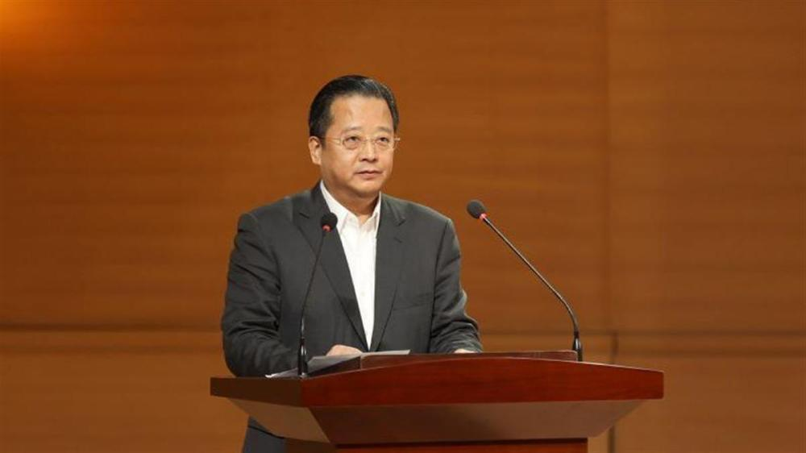

# 沈阳音乐学院原党委书记董亲学被查，曾任多个高校党委书记

据中央纪委国家监委8月26日消息，沈阳音乐学院原党委书记董亲学涉嫌严重违纪违法，目前正接受辽宁省纪委监委纪律审查和监察调查。

_董亲学（资料图）_

官方简历显示，董亲学，男，汉族，1965年5月出生，1987年12月加入中国共产党，1988年8月参加工作，在职研究生学历。

董亲学曾任辽宁省铁岭农业学校党委书记、校长，辽宁省铁岭农业职业技术学院党委书记兼院长，辽宁职业学院党委书记、院长，大连水产学院党委书记。

2010年5月起，董亲学担任大连海洋大学党委书记，2018年12月调任沈阳音乐学院党委书记。

2022年12月，董亲学任辽宁省教育厅一级巡视员，直至此番落马。

极目新闻综合中央纪委国家监委

（来源：极目新闻）

