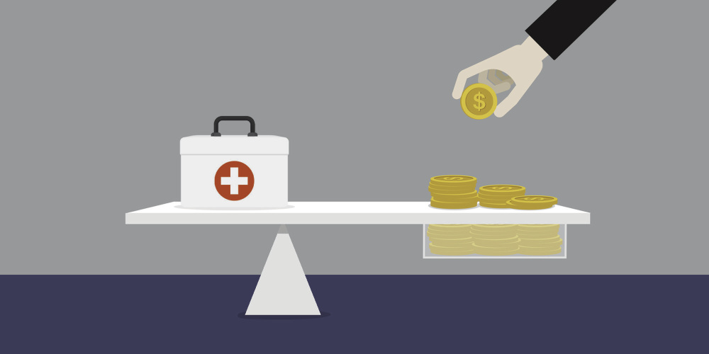

# 经观头条 | 我们和40位医生聊了聊：到底拿多少

_（美编：肖利亚）_

**经济观察报 记者 张英 瞿依贤 张铃**

离开公立医院10年后，张强医生集团创始人张强还记得在体制内的分裂感，一方面是公益性的治病救人，另一面是给科室“创收”指标的压力，这也是助推他从公立医疗系统出走的原因之一。

张强说，科室主任身负为全科室创收的责任。独吞回扣、红包等灰色收入的现象，总体是少数，大部分科室主任都会分下去。而灰色部分，直接影响到科室人员的收入，尤其是低年资医生，没有额外收入，生活压力较大。

中国医生群体的薪酬问题，一直是医改重要关切点，在医药反腐风暴下，再次被推到台前。

自2017年启动改革试点以来，中国公立医院薪酬改革一直在徐步前行。2021年8月，人社部、财政部、国家卫健委、国家医保局、国家中医药局等五部门联合印发《关于深化公立医院薪酬制度改革的指导意见》，公立医院薪酬改革在全国范围内推开。

两年过去，医生的“阳光收入”提高了吗？收入与绩效挂钩程度是否减弱了？“灰色收入”有被挤压掉吗？

近期，经济观察报在全国范围内寻访了40位医生，涵盖了东中西部地区，从科室主任到住院医师各层级、多科室，针对收入水平、收入结构、收入满意程度等问题进行了采访调查。对40位医生的访谈结果显示，对工资满意的医生仅占13%，认为一般的占31%，不满意的占56%。

在工资收入水平上，因地域、科室、职称不同而各异。比如北京、上海某些三甲医院的心内科、神内科主任一年收入可达100万元以上，而西南某地级市三甲医院的核医学科主任年薪仅15万元。

在薪酬结构上，受访者所在医院均采取“基本工资+绩效”的方式，总体来看绩效收入占大头。25%的医生除工资收入有其他收入来源，包括咨询/培训费、飞刀（指医生利用休息时间私下到其他医疗机构做手术的行为）、多点执业、互联网问诊、创新转化费等。

多位医生建议，应提高“阳光收入”，尤其是应提高反映医生技术水平和劳动价值的医疗服务价格。在绩效收入占比偏高的医院，医生建议加大财政投入比例，保障基本工资水平，这样才能减少“过度医疗”和“灰色收入”现象。

**阳光收入难言满意**

“我的基本工资只有两三千块钱。”西南某地级市核医学科主任何毅向记者晒出他的工资条。他介绍，由于医院是实行差额管理的事业单位，当地财政应拨付40%的基本工资，但实际仅拨付了20%-30%。

到手的基本工资偏低现象在中西部较为普遍，武汉某三甲医院急诊科主任介绍，她上月到手的基本工资仅约2100元。

在这种情况下，医生的收入主要依靠绩效。在何毅所在的医院，算绩效主要看收支结余。

其中的收入部分，是指科室收治病人获得的检查费、治疗费、床位费等；支出部分则包括科室人员成本、房屋及医疗设备折旧成本等。收入减去支出结余的钱，医院按10%或20%提成给科室作为绩效。科室主任在科室绩效的基础上按职称及工作量分配给科室医生。

“由于每个科室结余的钱不同，绩效差别很大。医院的心内科、神内科、消化内科都属于绩效高的科室。”何毅说，他所在市的同级医院，神内科主治医师的绩效收入甚至比他高出1万多。

以科室结余定绩效的方式较为普遍。上海一家三甲医院骨科主任医师李喆告诉经济观察报，他所在医院的整形美容外科、辅助生殖科收入是较高的，甚至远高于肿瘤、器官移植等科室。“开一个双眼皮1万-2万元，一位医生每天都做30-50个双眼皮，短平快且没有消耗，他的绩效就会非常好。而抢救生命的一些科室，比如一个肝移植整个团队要忙一整天，虽然社会效益高，但对医院来说经济效益可能是亏的。”

李喆说，绩效偏低的科室主任医师年收入与别的科室相差一两百万很正常。

尽管在当地，何毅算是中高收入人群，但他对目前的收入水平满意度一般，他认为与付出相比，目前的收入并不对等。

在接受采访前一天，他早晨7:30到医院，一直工作至下午6:00，期间都是高强度工作状态，午饭时间仅10分钟。

何毅认为，当前的规则没有体现出公立医院的公益性，医生仍然需要为自己创收，这就可能导致“过度医疗”、收“回扣”等问题。

他举例说，在收治病人时，对于可住可不住院的病人，医生可能会倾向于让他住院；也可能会多开检查，比如高血压患者可能会出现高血压脑病，医生建议做CT或磁共振检查，但有时依靠医生的经验是可以判断该患者的病情极大概率没有发展到脑病阶段。

李喆介绍，骨科以往收入在院内属于较高的科室，主要因关节、脊柱等耗材贡献较大，但骨科耗材集采后，医院失去了这一收入。同时，骨科手术费时、费人力，收费并未明显上涨，在此背景下，“以前医学生会积极报骨科，因为收入高，现在很少了。”

一位江苏无锡某县三甲医院医生介绍，他所在医院有9位副院长，27个大行政管理部门、61个具体分管部门，行政人员比例在30%-40%。而他们的工资奖金都需要我们临床一线职工创收。

**讲课费、回扣与红包的秘密**

“灰色收入”被认为是医生薪酬的巨大外挂，成为最近医药反腐风暴的重点整治内容。

在业内，怎么定义“灰色收入”仍有争议。比如此轮反腐中被重点关注的“讲课费”，多位医生认为，部分讲课或培训费也体现了医生的劳动成果，不应该被算作灰色收入。

到外面讲课的一般是副高职称以上的医生。何毅的每次讲课费在1千-2千元，一年大概出去三四次，讲课总收入在5000元以内。“我认为这是正常收入，讲课前我需要查阅许多文献和资料，制作PPT，促进同行知识更新。如果医生完全没有出去学习的机会，肯定会跟不上时代。”

武汉某三甲医院急诊科主任介绍，作为正高职称，她讲一小时的课有1000元讲课费，大专家一般在2000元或3000元。她认为这是合理收入，同时据她了解，业内也有要价极高的专家，这类专家一年的讲课费可能会有几十万甚至上百万元。

药械回扣也被认为是灰色收入的大头。

浙江某三甲医院一位科室主任介绍，许多国产药物确实存在回扣，以往在抗生素上较为常见，现在轮到了肿瘤药物。而进口药物回扣较少，更多是通过赞助医生参加行业学术会议、出国培训学习等方式影响处方。

张强认为，回扣现象对医疗行业伤害极大，不仅仅是提高了病人看病费用这么简单。

“能够拿回扣的医生一般是高年资的，他又不会告诉年轻医生某个药某个器械是拿了回扣的，这就导致年轻医生无法分辨某个诊疗方案是基于科学还是利益驱动。他可能并没拿回扣，但是他的诊疗方案会跟着高年资医生学。”张强说，国际上也存在医学指南和专家被某些药企“绑架”的现象，导致医学指南可信度下降，这种现象非常恶劣，直接影响到广大医生和患者的治疗选择。

除药械企业给予的回扣外，患者红包也是不容忽视的一笔收入。

“我每年退掉的红包大概在50万-100万元。”李喆说，一个患者给的红包就在5000-10000元。

有的医生并不拒绝红包。一位肿瘤患者告诉经济观察报，她在挂北京某顶级三甲医院主任医师的号时，中间人要了2万元红包，不仅要打点主刀医生，还需要打点整个手术团队。

李喆认为，收红包现象属于腐败，“早就应该反腐，要不然老实人吃亏”。

此外，也有部分医生观察到在北京、上海顶级三甲医院医生依靠“飞刀”方式获得大额收入。

“北京科室主任这个级别年收入上千万应该是不太可能的，除非是顶尖医院的顶尖医生，常常外出做手术才有可能。”北京某三甲医院一位眼科主任介绍，不是所有医生都能“飞刀”，像她所在医院的医生都不可能去“飞刀”，因为不会被人认可。

**“年薪制”的启示**

陈晓帆在福建三明市第一医院工作了21年。2013年，当地实行年薪制之前，陈晓帆的收入是十几万元，改革当年，他的年薪涨幅约70%，现在是副主任医师的他，去年到手30多万元。

三明市从2013年开始实行医药体系的薪酬制改革，摒弃了以收支结余来核定公立医院工资总额的模式，在全市所有县级及以上公立医院实行以纯医疗服务收入（包括手术费、诊疗费、护理费等）来核定公立医院工资总额，而将检查检验费、药品耗材费等非医务性收入排除在工资总额之外。

三明市医改领导小组秘书处副主任周显葆从2009年开始深度参与三明医改，他告诉经济观察报，三明的薪酬制改革从一开始就有反对的声音，尤其是来自药品耗材使用量大、有灰色收入的关键岗位，“但总体上大多数人还是满意的”。

李长明2014年从三明市一家医院到三明沙县区总医院创建精神科，从2015年开始拿年薪制，年收入一下子从原来的12万元涨到17万元、18万元，现在已经到30万元。

李长明认为精神科的治疗手段比较单一，收入主要来自医疗服务，在年薪制改革中的利好比较明显。比如，他的挂号费之前是13元左右，到现在挂号费+药事服务费是48元。

从2013年开始，三明市22家二级以上医院实行了院长年薪制和医生（技师）年薪制，2015年又将在职在岗的护理、药剂、行政后勤人员纳入目标年薪管理。

所定标准大致是，院长的年薪是社平工资的5-6倍，医生的年薪是城镇在岗职工平均工资的2-3倍，护士的年薪比公务员平均工资水平略高一点。

三明第一阶段的薪酬体系改革，吃的红利主要来自挤压药品耗材价格虚高水分。2022年，三明地区公立医院药品耗材费用11.5亿元，占比从改革前的60.08%，下降到30.96%。改革11年来，节约药品耗材费用198.58亿元，大部分通过医疗服务价格调整与医保基金打包支付，转化为公立医院的改革红利。

近十年，三明地区前后10次调整了医疗服务价格，理顺医疗收费项目9220项次，大幅提高了诊察、治疗、手术、护理等技术性服务价格，共转移增加78.64亿元。

周显葆表示，药品耗材不可能无限降价，等到药价虚高水分已经被挤干，医院收入结构中药品耗材占比已经基本达到国际公认的30%的合理水平，继续推进改革就需要寻求新的红利。

从2018年开始，年薪制改革的思路变成了将医保基金按县域、年度、人头总额打包给健康管理组织（总医院），实行“结余留用、超支自负”，简单说就是引导医务人员从“治病挣钱”模式转变为“合理医疗与管健康”省钱。

周显葆表示，因为医保基金的筹资额每年都在稳定增长，而老百姓的健康水平总体又在提升，这就决定了健康红利的可持续性。

在陈晓帆的工作中，“健康红利”体现在，三明市第一医院跟社区医疗卫生机构共同建立了三级诊疗体系，前者派医生到后者工作，帮助后者提升整个医疗诊疗能力。另外，疾病宣教管理在医生工作中的重要性被强调，比如高血压、糖尿病这些慢病管理，提高老百姓的健康意识，早期干预后发展为重症的几率变低。

“因为三明市配套实行了医保基金打包支付，建立‘总额包干、超支不补、结余留用’的激励约束机制，把慢病管好以后，虽然病人少了，但并不影响医生收入。”陈晓帆说。

提到最近的医疗反腐，李长明认为，医生是一个活到老学到老的行业，如果花过多的精力去想如何挣钱、有灰色收入，就永远做不了一个好医生。

尽管三明“年薪制”受到了有关部门推崇，但在全国范围内推行仍有困难。

浙江湖州被认为是学习三明医改的标杆城市，也未能全面铺开年薪制。一位当地医生介绍，院长和少数科室主任执行年薪制，绝大部分科室主任和医生仍然实行基本工资+绩效。

上海某三甲医院一位主任医师认为，实行年薪制需要衡量各科室的劳动价值，谁高谁低很难权衡，在三明或许各科室间差距不大，但在上海，科室收入差距很大。如果对科室主任实行年薪制，差距小难留住创收高的科室主任，差距大到上百万，年薪低的主任也不情愿。

李喆说，当前的主要问题是，公立医院顶着事业单位的帽子，与其他事业单位需要“一碗水端平”，没有考虑到医疗高风险、高强度的特殊性。年薪制如果只是将目前每个月的收入简单相加，也无法解决年轻医生的现实困难。

张强提出，医生收入应该着重体现医生的技术水平和劳动价值。在张强医生集团，医生工资是“底薪+医生费”模式，“医生费”是按照疾病编码（CPT）估算，按照医生劳动（强度、时间、技能与风险）制定，这种方式在国际上是通行的。

“国内公立医疗系统比较复杂，三明医改或许是一个可借鉴的模式。当然他们也碰到一些问题，比如高年资医生因对所定年薪不满意。走掉也是好事，这说明他能找到更高薪水的岗位，他还在为社会服务，对国家不算损失。”张强认为，最怕的局面是没人愿意学医了。

在张强看来，加大对违规行为整治的同时，建立合理合规的医师薪酬体系才是长效机制。

据李喆在国外学习期间的观察，国外骨科医生收入极高，知名专家年薪50万-100万美元，他的老师每个礼拜都要到教会捐钱。“他们的职业荣誉感是非常高的，收入不会成为影响他职业道德的因素。并且收一次红包会被取消执业资格，而且将进入医生的档案，没有人愿意冒这样的险。”

（应受访者要求，文中何毅、李喆为化名）

