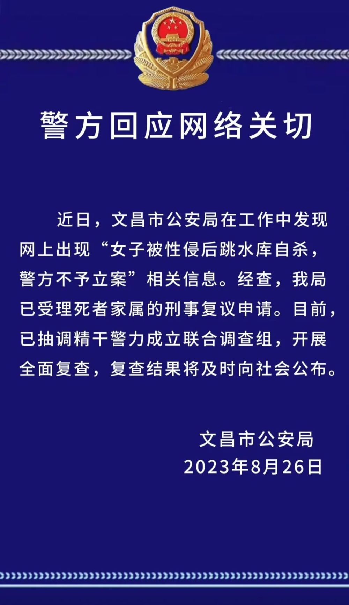

# 网上出现“女子被性侵后跳水库自杀，警方不予立案”信息，海南文昌警方通报

来源：文昌公安

警方回应网络关切

近日，文昌市公安局在工作中发现网上出现“女子被性侵后跳水库自杀，警方不予立案”相关信息。经查，我局已受理死者家属的刑事复议申请。目前，已抽调精干警力成立联合调查组，开展全面复查，复查结果将及时向社会公布。

文昌市公安局

2023年8月26日

**此前报道：**

[被强奸后对方因证据不足被释放？女子留遗书跳水库自杀，警方介入处理
](https://new.qq.com/rain/a/20230825A09PYI00)

