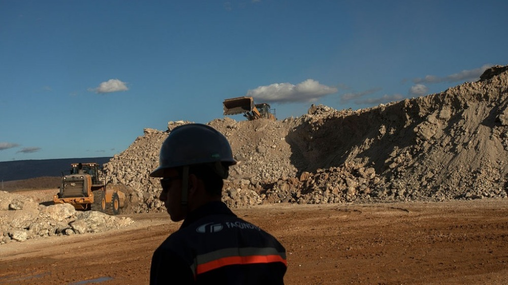
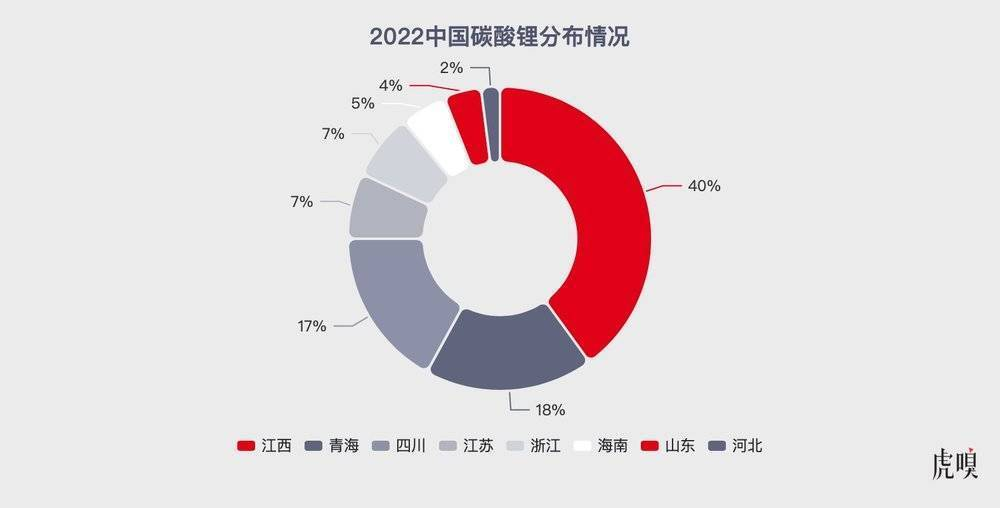

# 锂价再度狂飙背后：四川一锂矿被疯抢，竞价1万多轮、溢价1317倍成交

出品｜虎嗅科技组

作者｜包校千

编辑｜廖影

题图｜视觉中国

是什么，让宁德时代也曾连连叫苦？

在锂价一度冲破60万大关，上游矿商赚得盆满钵满的2022年，行业亲历了“造电池还不如去卖矿”的魔幻现实，就连宁德时代也沦为了矿主们的“打工仔”。

这场属于碳酸锂的“超级周期”，本质上虽然是因供需错配，促成了碳酸锂价格大涨，但海外锂精矿的数次高价竞拍、炒作式涨价，无疑加剧了电池和车企的成本压力。就连有着相对较强议价能力的宁德时代，2022年一季度净利润都因此出现了负增长。

但在经历多轮的扩产潮后，国产动力电池已陷入产能过剩、同质化严重的瓶颈。在不到一年的时间里，锂价就从爆发式的急涨转为了骤跌。自年初以来，碳酸锂价格开始回落，截至8月24日，国内电池级碳酸锂现货价格为22.0万元/吨，较上月同期的28.5万元/吨环比下降22.8%，较2022年11月的高点59.10万元/吨更是跌去62.7%。

可是故事总有意外，就在行业绝大多数人以为，新的供需关系将以另一种不平衡的方式，宣告拥“锂”行天下的故事结束时，去年4月宁德时代高价拿下宜春一处锂矿勘探权后，近期四川两桩“天价锂矿案”再度引起业内的关注。

显然，围绕锂矿的争夺，没能成为过去。

这不禁让人产生疑惑，在锂价下行周期，为什么会出现再次抢矿的现象？高价囤矿，还是不是稳赚不赔的买卖？是否会再次拉升成本，让下游买单？

**千倍溢价，锂矿抢疯了？**

8月13日凌晨，历时三天三夜的四川省马尔康市加达锂矿勘探权的拍卖结果，尘埃落定。

11307次的竞价，多家上市公司持续加码，这场竞拍角逐得异常激烈。最终，内蒙古大中矿业旗下子公司大中新能源以42.06亿的价格，拍得加达锂矿勘查矿权，成为了这场抢锂大战的赢家。

最令人咋舌的是，该竞拍项目的起始价仅为319万元，落槌后最终竟溢价了1317倍。

无独有偶，在距离加达锂矿只有150公里的四川金川县李家沟北锂矿，经过3412次的报价，该项目的勘查矿权在8月11日，被四川能投资本以10.1亿元的最高报价斩获。最后成交价较57万元的起拍价番了1771倍。

目前国内锂盐市场仍处于跌势，未来锂矿的供应趋势业内普遍认为会供过于求，此次四川两处锂矿以如此惊人的价格成交，竞争异常激烈，令人多少有些诧异。

尽管去年很多车企为了确保供应稳定，纷纷开始大量囤货。但今年以来，动力电池上游原材料价格回落，加之部分车企仍在消化之前采购的电池库存，在订单方面有所削减，甚至退掉了之前“超订”的订单，导致了供给过剩的进一步加剧。

据中国汽车动力电池产业创新联盟数据，2023年1月到7月，国内动力电池的累计产量和装车量分别为354.6GWh和184.4GWh，即便刨除67.1GWh的出口订单，依旧积压了103.1GWh的产量。

另据华泰证券研报测算，2023－2025年，全球锂资源过剩量预计将分别为7万吨、25万吨和31万吨，占各年需求量的7%、17%和16%。中国科学院院士、清华大学车辆与运载学院教授欧阳明高也指出，2025年中国动力电池产能可能达到3000GWh，但出货量仅为1200GWh，产能将明显过剩。

不容忽视的是，当前锂金属已经被中日美欧澳相继列为战略性资源。“从资源的角度来说，锂永远是有价值的。”赛德美总经理赵勇告诉虎嗅，中国是全球锂资源消耗量最大的国家，80%的锂资源依赖进口。对于保障国内锂资源需求而言，国际市场存在着诸多不稳定性。

全球锂资源集中分布于南美、澳洲。而这些矿产资源富饶的国家，正有意关闭自由市场的大门，目的就是通过垄断来抬高锂价，掌握锂资源的绝对控制权。随着境外矿业投资风险提高，且国内市场中计划出让的锂矿矿业权较少，优质锂矿资源早已被头部企业抢占，导致国内本来就不遑多让的锂矿资源普遍竞争激烈，且锂市场的长期增长趋势仍然存在。

我国新能源车企，去年就曾因上游原材料价格暴涨，普遍陷入盈利困局。市场一度认为电池厂商趁机攫取了大部分利润，甚至直言“主机厂都是在给宁德时代打工”。但实际上，“无论是正极材料厂商，抑或是电池企业，都更像是搬运工的角色，真正的利润其实是被矿商牢牢占据。”中国科学院宁波材料所研究员、宁波工程学院新能源学院院长夏永高告诉虎嗅。

一位下游行业人士表示，“抢矿”一方面是企业被说涨就涨的锂价给“整怕了”，抢矿锁矿成为了增强安全感的行为；另一方面，“有矿在身”就等于具备了话语权和溢价的能力。“这也是为什么，即使像宁德时代这样的电池巨头，也要亲自下场，收购或入股锂矿企业的原因。”

去年4月，宁德时代以 8.65
亿元拿下了宜春一处锂矿勘探权。据天眼查数据，今年7月11日，宁德时代间接全资持股的马尔康时代矿业有限公司在马尔康成立，注册资本高达3亿元。有市场观点认为，这家公司或许是加达锂矿勘查权的竞拍者之一。

“企业抢矿的目的，主要还是为了降本。现在国内如果是100%自有矿，每吨成本只有7万至8万元，和要依赖的进口矿相比，优势还是很明显的。”鑫椤锂电研究员钱艺表示。

经过几轮地质大调查，我目前已发现大量锂矿资源。目前已经探明的锂资源储量约为150万吨，占比并不高，且分布范围散。上述行业人士指出，在硬岩型锂矿方面，四川锂辉石矿和江西锂云母矿的开发潜力巨大，这对于保障国内锂资源安全稳定供应将发挥一定的作用。

**高价开“盲盒”，值不值得？**

事实上，这并不是国内的锂矿拍卖首次以超百倍于起拍价的价格成交。

今年2月，新疆若羌县瓦石峡南锂矿勘查区块挂牌出让，新疆志特新材料有限公司以60.88亿元竞得，而此次挂牌起始价为1581万元。高达60.88亿元的最终成交价约为起拍价的385倍。

就在不久后，持续数月、曾吸引多家上市公司角力的斯诺威矿业争夺战也熬出战果，宁德时代作为斯诺威的重整投资人，出资64亿元拿下全部股权，正式入主这家公司。而这距离首轮仅335万元的起拍价，更是溢价1900多倍。

多位行业人士表示，国内的锂矿被视为一种有潜力的“金矿”，有人担忧市场通过炒作的方式，营造供不应求的紧张气氛以达到涨价的目的。对此，内蒙古大法扬律师事务所合伙人张婷表示，任何炒作和哄抬价格的行为都可能会触犯相关法律，并承担一切法律后果。

目前，国内矿产交易通常以交易市场、拍卖或直接交易的方式进行，相对比较灵活。而与海外国有矿业企业签署长期合作协议通常需要进行更多的谈判和合作安排，涉及更复杂的合作细节和合同条款。总体而言，国内矿产交易更注重市场机制和灵活性，而与海外国有矿业企业签署长期合作协议更注重长期供应关系和稳定性。

需要注意的是，此次四川锂矿李家沟北锂矿和加达锂矿在内的两桩竞拍，竞得的均是锂矿的勘探权。

张婷表示，矿业权分为探矿权和采矿权，获得探矿权并不意味着获得了产权和采矿权。依据现有法律法规及相关规定，矿产资源属于国家所有。企业获得了探矿权就有权在划定的勘查作业区内进行规定的勘查作业，并优先取得区域内的矿产资源的采矿权。

不过，虽然探矿权的持有者可以优先竞得采矿权，但通常探矿权的价值不高，因为不确定是否能勘探到矿，以及勘探到的话又能勘探到多少。

根据四川省地质矿产勘查开发局化探队编制的调查评价报告显示，此次竞拍的预测勘查区块氧化锂（Li2O）平均品位是1.26%，氧化锂推断资源量37万吨至60万吨，折合碳酸锂当量92万吨至148万吨，具备“大-超大型”锂辉石矿产资源潜力。

对于“高价抢矿”是否值得，某动力电池从业者认为，假设按照现在每吨碳酸锂20万的价格为参考值，最终的收益率如何，既取决于实际的储量和开采量，同时也要考虑未来锂价一旦跌到10万，还有多少钱可以赚。

“加达锂矿42亿元并不算高，假设是120万吨LCE（碳酸锂当量），算下来相当于每吨增加了3500元成本。”该从业者推断，此次竞拍价格高企是锂矿勘探的确定性强所致，因此企业愿意把采矿权购买价的一部分前移至勘探部分，提高探矿权竞拍成功的概率。

可即便拿下高价锂矿，动辄数十亿的资金对于不少企业来说也是风险。根据四川省公共资源交易信息网公告，马尔康加达市锂矿从勘查许可证有效期开始之日起算，拟出让年限为5年，探矿权出让收益缴纳方式也为一次性缴清。

随着拍卖的落幕，对于此次竞得加达锂矿勘查权的大中矿业而言，能否一次性缴纳成交价格的金额也受到外界关注，很多人也在担心锂矿悔拍的情况出现。

作为锂电行业的新军，大中矿业去年才开始进军锂资源。公司此前的主营业务为铁矿石采选、铁精粉和球团的生产销售以及机制砂石的加工销售。根据大中矿业披露的半年报，公司货币资金为13.54亿元，上半年经营活动的现金流量净额仅为2.06亿元，同比减少70.99%。

从2022年10月开始，大中矿业突然开始大手笔进军锂资源产业。2022年10月19日，大中矿业公告称，公司拟与湖南省郴州市临武县政府签署《合作备忘录》，与下游企业拟在临武县投资建设含锂多金属露天矿采选、4
万吨/年碳酸锂加工及电池项目，预计总投资160亿元。

张婷表示，过去因锂价下跌或高价囤矿而直接毁约的案例并不多，但由此衍生出来的各类诉讼纠纷比较多。如果发生毁约，双方通过协商重新议定合同条款，以适应新的市场环境。协商不成的可以依据合同约定申请仲裁或提起诉讼。无论采用何种解决方式，双方应尽量保持沟通和合作，寻求互利共赢的解决方案。同时，在签订合同时，双方可以考虑设定合理的解除合同条款，以便在未来发生类似情况时有明确的解决路径。

随着新能源车销量、储能需求的持续增长会导致下游企业对锂资源的需求较大。一些上游企业仍旧可能会通过竞价、拍卖等方式来获取锂矿资源，以保障自己的生产需求。对下游企业来说掌控矿产，意味着能够握住锂资源供应稳定与成本控制的关键。

不过，多位行业人士指出，近期矿产竞拍案件还不足以改变未来一到两年的供需结构，国内企业想要提高锂矿自给率，以逐渐降低成本压力，还需要比较长的时间。

