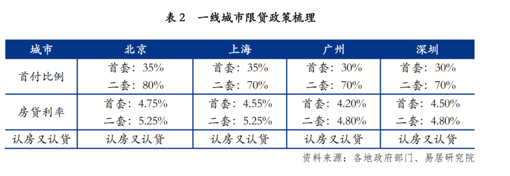

# 首付压力最大的北上广深，会执行“认房不认贷”吗？ 专家：很有可能

“认房不用认贷”政策措施，将被推动落地。这也意味着，在一些热点城市执行多年的“认房又认贷”政策，即将迎来松动。

8月25日，据新华社消息，近日住房和城乡建设部、中国人民银行、金融监督管理总局联合印发了《关于优化个人住房贷款中住房套数认定标准的通知》（简称《通知》），推动落实购买首套房贷款“认房不用认贷”政策措施。

“将使更多购房人能够享受首套房贷款的首付比例和利率优惠，有助于降低居民购房成本。”住房城乡建设部表示，此项政策，能更好满足刚性和改善性住房需求。

“若地方加快‘认房不认贷’执行速度，将有利于带动需求入市，核心城市楼市‘金九银十’行情可期。”中指研究院市场研究总监陈文静告诉《中国新闻周刊》。

_在一些热点城市执行多年的“认房又认贷”政策，即将迎来松动。图/中国新闻图片网_

对“卖一买一”人群影响较大

《通知》提到，家庭成员在当地名下无成套住房的，不论是否已利用贷款购买过住房，银行业金融机构均按首套住房执行住房信贷政策，即“认房不用认贷”。

上海易居房地产研究院研究总监严跃进表示，观察地方上出台的楼市优化政策比较多，尤其是一些二线城市持续发布政策，但是市场方面依然很期待高层有更为统一的政策。此次三部门出台政策，明确定调，对于后续各地房地产政策的出台具有很好的指导价值。

2023年以来，三四线城市房地产限制性政策已基本放开，但据中指研究院统计，北京、上海、广州、深圳、西安、厦门、成都等十余个重点一二线城市仍执行“认房又认贷”。

“认房又认贷”是指，除了名下有房再买房算第二套之外，如果名下曾有房贷，无论是否结清，再贷款买房都会被认定为第二套，首付比例、房贷利率都会调高不少，对外地有过贷款记录本地无房和“卖一买一”人群影响较大。

“‘认房又认贷’误伤了很多刚需与改善性住房需求，使不少无房户执行二套房房贷政策，提高了贷款门槛和房贷利率，不利于购房需求实现。”首都经济贸易大学京津冀房地产研究院院长赵秀池告诉《中国新闻周刊》

据易居研究院梳理，在“认房又认贷”条件下，北京、上海、广州、深圳普通住宅二套房首付比例分别为80%、70%、70%、70%，比首套首付高出40%~45%，房贷利率差最高达到了70BP。

若上述城市均实施“认房不认贷”，二套房首付比例可从73%（北上广深平均数据，以下同）降至33%。按600万总价的房源计算，首付款将从435万元降至195万元，可以降低55%的资金支付压力。房贷利率从5.03%降至4.50%。按一线城市二套房平均贷款本金405万元计算，月供额将从21816元降至20521元，即减少1295元/月，30年累计减少47万元。

“若一线城市积极调整认房又认贷政策，其将通过降低首付款和降低月供款等渠道产生显著的减负效应。”严跃进说。

“认房又认贷”是上一个房地产政策调整周期的产物。

2010年5月26日，为落实《关于坚决遏制部分城市房价过快上涨的通知》，住建部联合人民银行、原银监会出台《关于规范商业性个人住房贷款中第二套住房认定标准的通知》，明确二套房认定以家庭为单位，对“借款人已利用贷款购买过一套（及以上）住房，又申请贷款购买住房的”，贷款人应对借款人执行第二套（及以上）差别化住房信贷政策。

“认房又认贷”开始作为楼市限制性措施，被许多城市采纳，但政策松紧存在差异。北京首次出现“认房又认贷”是在2010年7月，第二次是在2017年3月，沿用至今。北京、上海两地对二套房界定标准最严，即全国有住房贷款记录的，无论是商贷还是公积金贷款，已结清还是未结清，均记作一套。

在此前两轮房地产市场调控周期中，“认房又认贷”就像个阀门，极大影响热门城市楼市活跃度。当房地产面临过热情形时，出来降温，市场低迷则退出舞台。

据贝壳研究院数据，2016年末、2017年初一线城市相继重启“认房又认贷”之后，2017年深圳、上海及北京全年二手住宅成交量同比分别下降34%、57%及49%。

从成交价格看，“认房又认贷”有效遏制了房价上涨。北京在两次启动“双认”之后，二手住宅成交均价都经历了约1年的下跌期，房价累计跌幅均达到15%。

一线城市会跟进吗？

这一轮调整的信号，从7月下旬开始密集释放。

7月24日，中共中央政治局会议提出，“适应我国房地产市场供求关系发生重大变化的新形势，适时调整优化房地产政策”。

几天后，住房和城乡建设部部长倪虹召开企业座谈会，提出进一步落实好降低购买首套住房首付比例和贷款利率、改善性住房换购税费减免、个人住房贷款“认房不认贷”等政策措施。

随后，郑州率先跟进，明确落实“认房不认贷”，更大程度满足刚需和改善性住房需求。此前，郑州执行的是“认贷不认房”的政策，即有一套住房并已结清购房贷款的家庭，执行首套房贷款政策，政策已较为宽松。

受新政影响，郑州房地产市场成交量出现短期上涨行情。根据诸葛数据研究中心监测数据显示，第32周（7.31-8.6）郑州二手房成交1831套，环比上涨61.32%，33、34周再涨1.02%和3.41%。

“认房不认贷”能提振楼市活跃度。但《通知》只是将此项政策作为政策工具，纳入“一城一策”工具箱，供城市自主选用，并非作为强制性措施。

“各地因城施策制定相应政策，给各地政府一定的自主权。有利于有的放矢，做好各城市房地产调控。”赵秀池说。

严跃进认为，因为各地情况不一样，如果全国都统一执行“认房不认贷”，可能会出现在一些重点城市集中跨城买房的情况，导致部分楼市过于火热，存在风险隐患，不利于“房住不炒”总基调。所以强调“因城施策”，各地灵活使用。

至于一线城市是否会跟进？赵秀池认为，各城市情况不一样，二三线城市“认房不认贷”会很快落地，一线城市出台政策会比较谨慎，可能根据不同情况给予不同的房贷政策，但一线城市应该跟进。

陈文静表示，“认房不认贷”纳入政策工具箱，为核心城市优化房地产信贷政策打开了空间。对于一线城市而言，同样存在政策预期，由于一线城市房屋总价高，且首套房与二套房首付比例差距较大，若政策跟进执行，预计将对市场产生较为明显的带动。

“市场有压力，政策肯定会以宽松为主，进一步减轻购房者负担。一线城市现在也有这种呼声，所以跟进‘认房不认贷’是很有可能的。”严跃进说。

另据财政部网站25日消息，财政部、税务总局、住房和城乡建设部发布《关于延续实施支持居民换购住房有关个人所得税政策的公告》。其中提出，自2024年1月1日至2025年12月31日，对出售自有住房并在现住房出售后1年内在市场重新购买住房的纳税人，对其出售现住房已缴纳的个人所得税予以退税优惠。

严跃进表示，多部门联合推出新政策，表现出住房、金融、财税等部门积极发力的导向，体现宏观政策的针对性、组合性和协同性，有助于进一步促进购房政策的效力释放。

作者：哈力克

