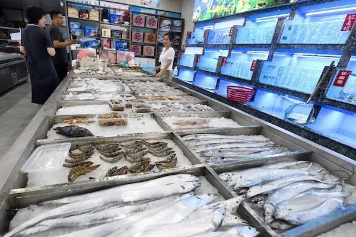
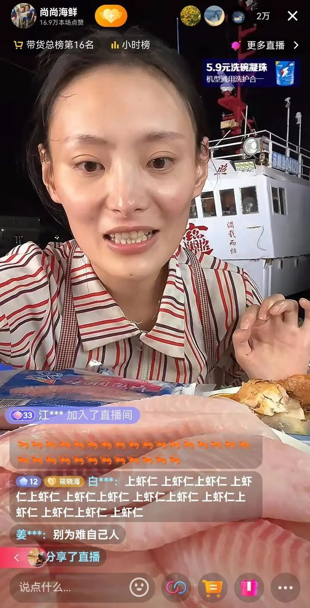

# 海鲜生意还有活路吗？本土海鲜能不能吃？商家：过分担心是庸人自扰

8月24日，日本启动福岛核污染水排海，当天，海关总署叫停进口日本水产品，市场监管总局发布声明，高度重视食品安全及价格监管工作。

而我国海鲜生意同样被波及，上海的海鲜销售是否受到影响？记者探访上海最大的水产品批发市场。

**商家：无日产，过分担心是庸人自扰！**

8月26日，记者探访上海的日料店和江阳水产品市场。

某日料批发店店长表示，“这两天生意不太行，也不能说只是日本，可能过两天，进口的海鲜都不能卖。”

水产商郑先生表示：“营业额跟平常差不多，我们的东西没有日本进口的。”

王先生表示，“不敢吃海鲜，我觉得是庸人自扰，如果是不达标或者有污染，不会让它进来的。”

**暂无近忧但有远虑**

8月25日下午，记者来到长兴横沙渔港。作为上海唯一的国家一级渔港，每天有大量的进口、本地海鲜从这里进入本市各地的商超市场。在一家水产零售店家，记者看到店主正在打包梭子蟹和带鱼，忙得不可开交。

 _来自俄罗斯的鲜活帝王蟹运抵上海 本文图片均为 新民晚报记者 徐程 摄_

“这几天新鲜梭子蟹到货，生意很不错，和之前没什么太大变化。”店主告诉记者，他们这里零售的海鲜基本都是近海捕捞的鱼货，进口产品很少，来自日本的产品更是没有。而且离核污染水影响我国海域还有一段时间，从这几天消费者的反馈来看，暂时没有对此事表现出过度焦虑。

“虽然销售暂时没有明显影响，但不代表我们就不担心。”这位店主表示，她所认识的水产品商家都非常关注核污染水入海事件，万一今后核污染水扩散到我国近海，水产品还能不能卖？有没有人来买？他们心里也没底，目前只能走一步看一步，静观其变。

在不远处的码头，一艘渔船刚刚完成卸货。船老大孙先生告诉记者，现在感觉有些无能为力。“现在捕鱼成本很高，近海收获也不好，这趟出海算下来还是亏本的。”孙先生表示，因为近海渔业资源枯竭，本来生意就不好做，如今又发生了核污染水排海，他这样的渔民首当其冲成为受害者。“如果之后情况不好的话，可能会转行吧。”

_水产海鲜经销商的店内，各类海鲜品种比较齐全_

在渔港附近的一家餐饮店，经营者赵女士告诉记者，店里菜品原本将海鲜作为主推品，但随着核污染水入海事件的发酵，担心会影响到消费者对于海鲜食品安全的信心，也正在考虑准备一些后备方案。“万一发生了这种情况，海鲜卖不动了，我们也能够用其他产品顶上去。”

_来自挪威的冰鲜大西洋鲑鱼_

“我们这几天正在举办首届海鲜美食节，非常成功，渔港很久都没这么热闹了。”上海长兴岛渔港有限公司总裁助理姚志军告诉记者，长兴横沙渔港主要以海鲜批发为主，零售占比不高。但这次从8月22日到27日首次尝试举办的海鲜美食节，在没有大规模宣传的情况下也很受欢迎，连续几天人流量都很高。由此也能看出，市民非常期盼此类夜市的出现，对于海鲜的消费热情也很高涨。

但就在此时，发生了核污染水排海事件，让渔港方面感受到很大的压力。“我们最为担心的，就是核污染水排海事件会影响消费者对于海鲜食品安全的信心，产生过度担忧情绪。”姚志军表示，目前渔港的主要进口海鲜中，并没有日本产品。帝王蟹是从俄罗斯进口的，三文鱼来自挪威和智利。但凡市民通过正规渠道买到的进口海鲜，都是通过了国家检验检疫环节，符合相关标准才能进入市场销售。而且进口海鲜已经建立了成熟的溯源体系，可以查到每一批产品的捕捞海域，在安全性上有较高的保障。

**海鲜直播间被围攻**

**主播急得差点哭**

8月24日半夜12点，江苏连云港的带货主播尚尚（网名）还在直播卖海鲜。“可以放心吃，我们的海鲜都是安全的，生产日期都在今天之前。”尚尚着急得几乎哭出来，不断重复同样的几句话。“卖完转行”“无辐射”“国产货”等关键词，她用红色水彩笔写在白色纸板上，然后贴在身上，展示在直播间最显眼位置。

当天中午，日本启动福岛核污染水排海。不少人担心海鲜会受到核污染，即便是出自我国海域的海鲜。恩贝（网名）也在电商平台销售海鲜，他看到消息后，首先是生气，然后感到无奈，没办法阻止。一打开手机，全是相关消息，“何时影响到我国海域？有人说57天，有人说240天，但人们对于海鲜的防范心立马便会产生。”

_主播尚尚正在直播中。_

海鲜直播间一下被送上风口浪尖。尚尚评论区的留言还在不停翻滚更新，“这几天可能问题不大，一个礼拜之后真不敢吃”“谁知道有没有辐射，不能吃了，白给也不能吃”“趁早转行吧，卖海鲜的快失业了”……类似的风凉话一直跳出来，她怎么也翻不到底。这样的场面让尚尚一时不知所措。她声音发抖，眼中含泪，压抑着哭腔，手忙脚乱地展示产品。

看热闹的人很多。尚尚当晚直播间共涌入几十万人，最多时同时在线将近3万人。她的直播账号粉丝量刚过50万，平日里，看她直播的一般不到1000人。据恩贝观察，流量激增的直播间有许多个，“会涌进一大波网络喷子，发表一些不理智的言论，在评论里带节奏，说海鲜有毒，不能吃了。”不过，善意的声音更多。不少网友在评论区声援，还有网友专门跑到账号后台留言鼓励，“中国渔民没有错，主播加油！”

**对我国影响几何？**

**本土海鲜能不能吃？**

**后续影响仍然未知**

日本核污染水排海后，对我国影响几何？本土海鲜能不能吃？记者联系了几位海洋大学的专家学者，得到一致回复：尚未进行相关实验，很难做出科学评估，目前还无法得出结论。

不过，在不少消费者看来，我国的海鲜产品也将被污染，几乎已成为既定事实。

有人想抓住最后的机会，赶紧囤货。尚尚24日直播间销售额冲到带货总榜第16名。不少人蹲守直播，把虾仁、带鱼段等海鲜成箱买回家，冷冻起来，保质期最长能有2年。尚尚把库存都尽可能放出来，其中大部分是为中秋节准备的囤货，提前一个月卖了。记者观察到，当晚直播平台带货总榜上，前20名中，海鲜直播间占据3席。海鲜品类客单价不高，受众群体也小，如此带货成绩，此前很少出现。

也有的海鲜产品已经遭遇冷落。浙江舟山的海鲜主播三旬（网名）直播间便冷清许多。他主要卖舟山梭子蟹，“梭子蟹还是要吃新鲜的、活的，跟鱼虾不一样，没法提前准备。”今年的舟山梭子蟹已于8月初开捕，目前量不大，最近到舟山旅游吃蟹的游客多，价格处于相对高位，但也正常，渔民出海捕捞的产量比较平稳。线下市场价格变动不大，线上看直播的人却明显少了，下单的人也少，三旬说，有些人到直播间看看，问螃蟹还能不能吃，便离开了。销量下降，长此以往，梭子蟹的价格可能会下跌。

_今年8月初，浙江省舟山市普陀区大批渔船穿过朱家尖大桥，奔赴东海开捕。新华社发（邹训永摄）_

“日本排放核污水对我们而言，无异于‘当头一棒’。 **”**
三旬说。他是舟山本地人，很多家人朋友都从事海鲜相关产业，父辈大多出海打渔，没船的便到工厂仓库打包、分拣，年轻人回乡创业，在电商平台开直播销售，一家人的生计几乎全系于此，“祖祖辈辈靠海吃海，不知道这回能不能靠得住。”

“一想到我们村这些渔民心里可难受。”尚尚说，“我们年轻有知识，还能转行，以后接着卖衣服卖化妆品，他们靠一条渔船养家糊口过了一辈子，之后可怎么办？”尚尚是90后，从小生活在渔村，父亲是捕鱼40年的渔民，家里有两艘渔船。她的直播间便搭建在大海边，时不时还能听到汽笛声，那是出海的渔船回港了。

很多从业者都想到了转行的事，不过谁都下不了决心，他们决定先做好当下的事，边做边看，并对未来保留一丝希望和期许。于他们而言，海鲜是事业，海洋是家园，都难以割舍。

**日本并非我国主要的水产品进口国**

根据海关总署公布的数据，2023年1月至7月，中国前五大水产品进口国为厄瓜多尔、俄罗斯、加拿大、印度、美国，日本并未排入前十。7个月内，我国从日本进口鱼类等水产品的商品总额为19.37亿元，其中7月进口额为2.35亿元，同比减少28.5%，环比下降33.7%。由此可见，日本并非我国主要的水产品进口国。

**国家已出台一整套监管制度**

日本排放核污水可能会影响到中国的渔业经济及食品安全。但有污染风险不代表绝对不能吃。从科学的角度看，此次核污染水排海影响至我国海域仍需要一定的时间。在洋流影响下，核污水将随日本暖流先向西北方向漂流，并随北大西洋暖流最先抵达加拿大海域。而根据清华大学海洋工程研究院张建民院士等团队的模型推算，核污水在排放后240天才能到达我国沿岸海域。即使不考虑来自内陆河流河水在近海对污水的净化作用，在日本排放核污染水的第二天就给本土的水产品贴上“核污染物”的标签，显然矫枉过正了。

中国海洋大学海洋生命学院副教授周仲元此前接受记者采访时表示，从短期来看，人们不必对海产品陷入恐慌，他表示就食用海产品来说，产地很重要。“我国已全面暂停进口日本水产品。来自远海、我国近海的海产品仍然可以放心食用，海产品在我国上市之前一定经过严格的检测，如果超过安全标准，国家相关部门也不会允许进入市场。”

从政策的角度看，早在2011年福岛核事故后，国家相关部门就已经出台了一整套监管制度，确保公众更安全地食用水产品。比如，进口日本部分地区食品、饲料等都要提供日本政府出具的放射性物质检测合格的证明与原产地证明；放射性物质监测从2012年开始就被纳入了国家食品安全风险监测范畴。

**国内企业调整采购寻找更多替代品**

日本进口水产遇冷同时，其他替代海产品开始走俏。8月24日晚，“南美白虾卖爆了”登上微博热搜。东方甄选就透露，自营南美白虾销量暴涨，截至当日17时，单日销量已突破2.5万单，远高于日常的7000单销量。

主营水产批发的北京蔚莱国际贸易有限公司相关负责人张经理告诉记者，公司南美白虾主要向电商客户销售，近期正值开渔期，很多直播间原本筹备了出海捕捞鲜货的内容。8月24日日本核污水排海后，电商直播间便将带货产品迅速更换为原产地为厄瓜多尔的南美白虾冻品，公司南美白虾的需求量两天内涨了50%—60%，“好在备货充足，突增的供应都可以满足。”

国产淡水养殖业也可能面临机会。从事海洋生物和水产研究的博士郑维中曾向新京报记者表示，三文鱼是大西洋鲑鱼、虹鳟鱼等多类鲑鳟鱼的统称。目前我国市场上流通的进口三文鱼多来源于海水养殖的鲑鱼，国产三文鱼则以淡水养殖的虹鳟鱼为主。日本核污水排海事件下，消费者对海产品选购开始持谨慎态度，淡水产品出现走俏苗头。

除了水产替代外，肉企也嗅到了机会。8月25日，国内猪企上市公司新希望董秘在互动平台回复投资者，我国对日本水产品进口禁止，整体来看对国内的水产养殖是利好，同时也会产生对其他肉类的消费替代，对猪肉、禽肉等消费带来利好。

**海鲜，吃还是不吃**

**会不会纠结一下？**

本文综合自：上观新闻、新民晚报、澎湃新闻、新京报

相关作者：巩持平 王术

校对：咚咚咚

