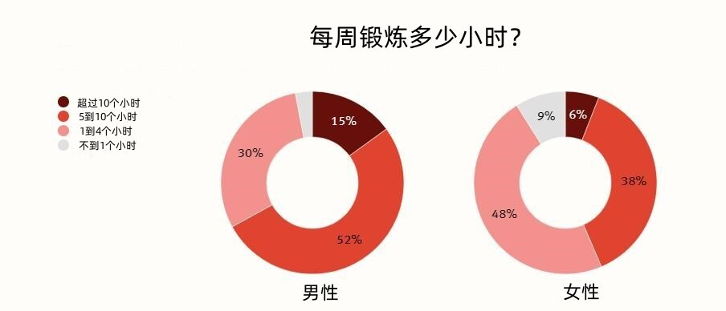
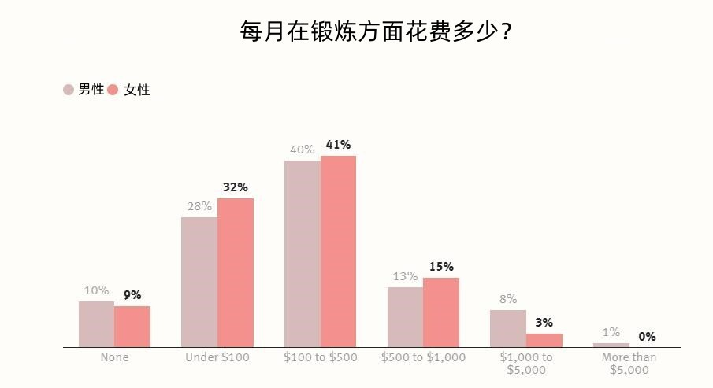
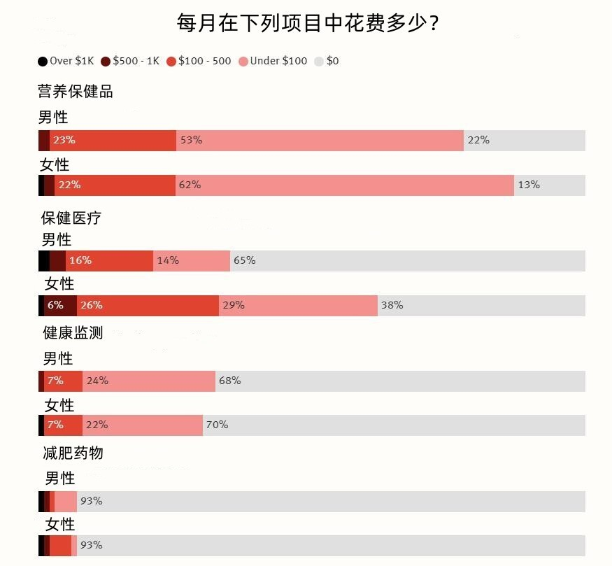
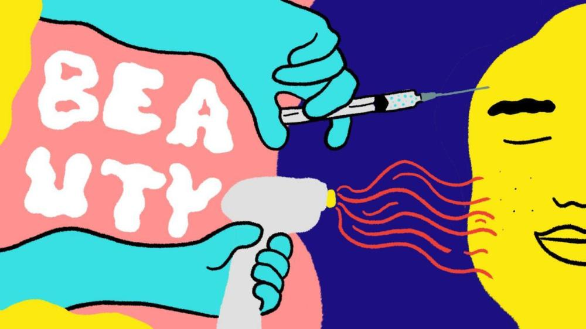

# 硅谷精英砸钱换“命”：锻炼时间是普通人两倍，花费超十倍

**划重点**

  * _1_ 调查显示，硅谷科技行业领袖锻炼的时间是普通美国成年人的两倍，他们花在锻炼上的金钱则是普通美国成年人的10倍。
  * _2_ 最受IT人欢迎的健身项目包括举重和力量训练、跑步、骑自行车或动感单车，但跑步、瑜伽不再像过去那样受欢迎。
  * _3_ 营养补充剂（保健品）是受访者中最受欢迎的健康相关购买产品，80%的受访者每月都会购买。
  * _4_ 女性在美容方面的支出继续超过男性，尤其是在注射和其他美容手术方面。愿意接受美容手术的女性是男性的5倍。

长期以来，被视为科技圣地的硅谷也是超级马拉松运动员、超量补充剂使用者以及量化自我者的聚集地。但最近，科技大咖们对健身和保持健康的热情正逐渐成为主流，这要归因于营养补充剂的日益普及，迷幻剂的逐渐被接受。可以说，始于硅谷的趋势最终往往会渗透到世界其他地方。

美国科技媒体外媒始终在密切关注硅谷科技行业从业者对健康的痴迷，从数据驱动的睡眠到全身扫描。但是，这家媒体想对硅谷人在健康方面的投资提供更多确凿的数据，并找出新兴趋势。

因此，外媒进行了有史以来首次“大脑-
身体投资调查”，对500多名订户进行了匿名调查，询问他们在锻炼、保持健康和美容这三大领域的支出情况。研究结果表明，人们在保持健康方面投入了更多时间和金钱。无需奇怪，还有很多人甚至愿意花上数万美元来让自己变得更强壮、更长寿、更年轻。

**01 锻炼：科技行业领袖锻炼的时间是普通美国成年人的两倍，他们花在锻炼上的金钱则是普通美国成年人的10倍**

潮流趋势：凯利·斯莱特(Kelly Slater)的冲浪牧场(Surf Ranch)、价值1.5万美元的电动自行车、攀岩训练

大多数受访者每周花5到10个小时锻炼，但12%的人每周锻炼时间超过10个小时。美国人的平均锻炼时间要短得多，其中男性每周平均只有2小时18分钟，而女性大约为1小时45分钟。

创始人基金(Founders Fund)的普通合伙人、风险投资家基思·拉布伊斯(Keith
Rabois)就是这群每周锻炼超过10小时以上的人中的一员，他每天锻炼90分钟，通常会参加知名健身房Barry's Bootcamp的课程。

在调查对象中，最受欢迎的健身项目包括举重和力量训练、跑步、骑自行车或动感单车。

过去，跑步的人更多，但许多受访者称他们在过去五年中已经放弃了这种运动。另一种日益被抛弃的锻炼方式是瑜伽，它也不如健身那么受欢迎。

与此同时，超过20%的受访者每月在锻炼上的花费超过500美元，有三位受访者表示他们每月在健身上的花费超过1万美元。与他们相比，美国消费者平均每年在锻炼上的花费仅为112美元，而且这个数字已经是疫情前的两倍。

还有很多人承认，他们有过数额相当大的一次性投资，比如花费1.9万美元购买Colnago
C68自行车、4000美元购买Tonal家庭健身房健身卡、1000美元的Concept2划船机和3500美元的Peloton跑步机，还有人每月花费3000美元聘请私人教练，或花费数百美元购买马匹涂装等装备。

事实证明，旅行依然是最受欢迎的消费项目，其中一位受访者前往凯利·斯莱特的冲浪牧场(Kelly Slater's Surf
Ranch)度假(每天6000美元)。另一位受访者承认，他们每年在冲浪探险上的花费高达10万美元。

总体而言，男性和女性受访者在锻炼上的花费大致相同。然而，花钱更多的人，即每月花费1000美元或以上的人，主要是男性。

**02 健康：保健品占主导地位，五分之四的受访者每月都会购买**

潮流趋势：肽补充剂、家用红外线桑拿、减肥药

营养补充剂（保健品）无疑是受访者中最受欢迎的健康相关购买产品，80%的受访者每月都会购买。这项开支并不算少：根据美国国立卫生研究院的数据，近四分之一的受访者每月在补充剂上的花费超过100美元，几乎是全美平均水平的四倍。

其次最受欢迎的消费类别是按摩、针灸和红外疗法等健康治疗，以及连续血糖监测和选择性血液检查等健康监测。

近三分之一的受访者每周花1个多小时进行某种形式的健康练习，如接受红外线疗法、静脉滴注、冷冻疗法和淋巴引流等。保健品零售商Athletic
Greens的总裁兼首席运营官凯特·科尔(Kat
Cole)说，她每个月花10到12个小时来养生，其中大部分时间是使用红外线和芬兰桑拿相结合的方式。科尔也会去做预防性的扫描和检查，比如2500美元的选择性核磁共振检查Prenuvo。

创始人基金(Founders
Fund)的普通合伙人、风险投资家基思·拉布伊斯说，他每周花1个小时进行冷冻治疗，使用极低的温度来减少炎症和肌肉酸痛等症状。尽管FDA指出，这些好处尚未得到证实。

Long Journey Ventures的普通合伙人阿里尔·扎克伯格(Arielle
Zuckerberg)安排了每周45分钟的针灸疗程和每两周1次、持续90分钟的按摩，这两种做法在受访者中都很常见。

总体而言，40%的女性受访者每个月至少花1个小时在健康养生上，而男性比例为25%。

**03 美容：女性在美容方面的支出继续超过男性，尤其是在注射和其他美容手术方面**

潮流趋势：微针疗法、1700美元的护肤品订阅、激光面部护理

在美容方面，包括美容治疗、注射、头发和指甲护理，不同性别的支出存在明显差异。只有7%的男性受访者会花钱做整容手术，而女性受访者的这一比例为35%。

就时间而言，21%的女性受访者表示她们每月花在美容上的时间超过5小时，而男性受访者中这一比例仅为2%。

个人服务市场StyleSeat的创始人梅洛迪·麦克洛斯基(Melody
McCloskey)也每月花5个小时美容，主要集中在美甲预约上。每隔两周，她就会去和米西·艾略特（Missy Elliott）和泰亚娜·泰勒（Teyana
Taylor）合作的美甲师那里修指甲。

肉毒杆菌毒素是最受欢迎的美容消费服务之一，许多受访者表示，他们每次治疗的花费从400美元到1000美元不等。其他人使用的是用于皮肤水合的玻璃酸注射，每次花费最高1000美元。

其他的还包括每年4000美元的减肥疗法CoolSculting，使用小针头刺激胶原蛋白生成的疗法Morpheus
8，使用真皮填充物、每次治疗1000美元的Sculptra，以及塑造身体轮廓的电磁疗法Emculpt。

保健品零售商Athletic Greens的总裁兼首席运营官凯特·科尔花了255美元购买了Biologique
Recherche的面部护理，她更喜欢在亚特兰大的Aviary Beauty and Wellness接受服务。

然而，有些人更愿意在最简单的快乐上花最多的钱。一位受访者声称聘用了贝弗利山庄的造型师，只是简单地修饰了一下，价格就是普通理发师的4倍。

**04 如何防止衰老，让时间倒流？**

尽管这些硅谷富人正千方百计地寻求健康长寿，但依然无法完全阻止衰老。现在，许多痴迷于解决衰老问题的科学家正在绘图，显示人体随着年龄增长而发生的变化，并希望能由此找到帮助我们活得更长寿、更健康的治疗方法。

他们称这张图为“衰老的标志”，即与我们走向死亡有关的生物特征和机制，包括端粒(染色体末端的DNA片段)缩短、细胞衰老（即细胞停止分裂）以及细胞如何调节营养分配等。在过去的十年里，这些特征帮助发现了清除已经停止分裂细胞的药物，以及似乎可以使细胞恢复到更年轻状态的基因疗法。

这些特征随着年龄的增长而显现，并在增强时加速衰老。它们以研究人员试图理解的方式相互联系。有些人认为，这可以解开我们衰老的原因。西班牙奥维耶多大学生物化学家卡洛斯·洛佩斯-
奥廷(Carlos Lopez-Otin)说：“在整个人类历史上，人们始终在探索衰老的秘密。但直到最近，它才受到深刻的科学审视。”

其中，一个引人注目的标志是表观基因组的变化，它由化合物和蛋白质组成，它们可以附着在DNA上，并调节基因的开启或关闭。有些研究人员认为，表观基因组中错误的积累会导致衰老，通过“重新编程”细胞来消除这些错误可以延长寿命。

2012年，日本干细胞研究人员山中伸弥(Shinya
Yamanaka)因发现将细胞表观基因组重新编程至胚胎状态的蛋白质而获得诺贝尔奖。科学家们已经利用这种蛋白质延长了老鼠的寿命，并逆转了老鼠和猴子的失明。山中伸弥充当顾问的Altos
Labs、谷歌母公司Alphabet旗下Retro Biosciences和Calico Life
Sciences等生物技术公司，都在探索细胞重编程是否能延长寿命或改善健康。

其他科学家正在试验被称为营养感应途径的方法，即细胞用来识别糖和蛋白质等燃料来源的传感器。随着年龄的增长，这些传感器的作用会减弱，而它们的退化与包括代谢紊乱和癌症在内的无数健康问题有关。营养感应路径受到限制饮食的影响，研究表明，限制饮食、显著减少卡路里的摄入都可以延长寿命，改善健康。

包括雷帕霉素（Rapamycin）在内的药物似乎可以模拟卡路里限制的效果，从而延长老鼠的预期寿命。雷帕霉素可以阻断一种营养传感器，通常被器官移植接受者用来抑制免疫反应。总部设在华盛顿大学的预防狗衰老项目正在测试雷帕霉素是否能延长宠物狗的寿命。AgelessRx和哥伦比亚大学的研究人员正在帮助开发临床试验，以测试雷帕霉素在人体中的抗衰老潜力。

上个世纪出现的一个流行理论认为，端粒可以提供解决衰老的灵丹妙药。研究表明，端粒随着年龄的增长而缩短，而更短的端粒似乎与疾病有关。但目前尚不清楚延长端粒是否会延长寿命。激活端粒酶可以让癌细胞不受控制地复制。
尽管如此，有些研究人员和公司，包括端粒治疗公司(Telomere
Therapeutics)和Geron公司，正在通过操纵端粒来治疗癌症和其他与年龄有关的疾病。

达拉斯德克萨斯大学西南医学中心分子生物学家、Telos Biotech联合创始人杰里·谢伊(Jerry
Shay)说：“我们想阻止癌细胞中的端粒酶，但安全地延长端粒可能对各种与年龄有关的疾病有用。”Telos
Biotech正在延长端粒，试图改善癌症患者的免疫功能。（文/金鹿）

