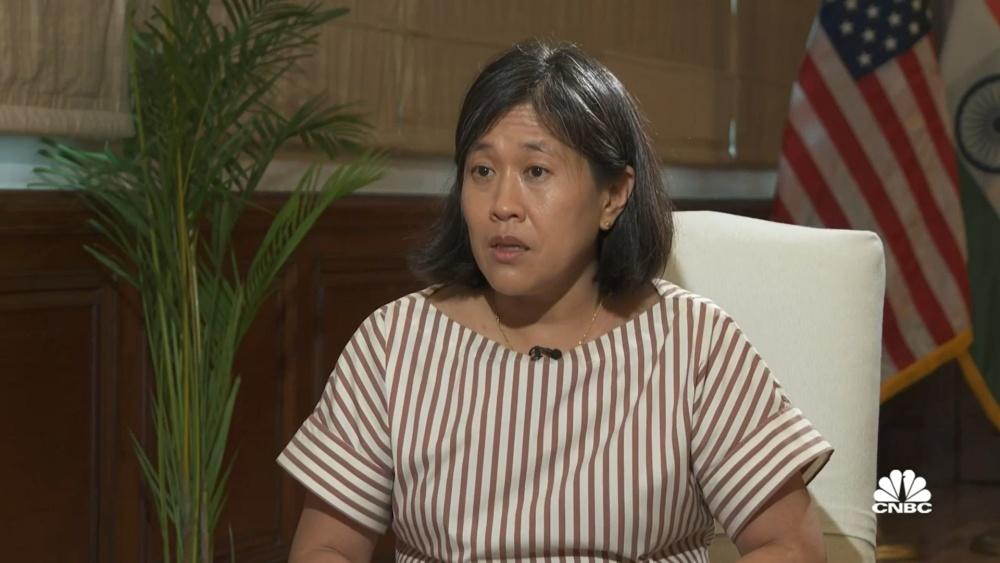

# 美贸易代表：中国在稀土领域占主导，让美国供应链“很脆弱”

（观察者网讯）据美国消费者新闻与商业频道（CNBC）26日报道，美国贸易代表戴琪在印度出席二十国集团工商峰会（B20）期间接受采访声称，中国在稀土领域的“主导地位”令美国的供应链变得脆弱。

报道提到，稀土金属可被用于制造新能源汽车电机等高科技产品，在过去几十年间中国已经建立起了加工稀土金属的能力，这使中国在这个至关重要的全球市场上拥有了巨大的定价权。

当被问及美国是否在稀土领域受中国影响时，戴琪承认，中国在全球稀土金属市场具有“非常明显的主导地位”，“我确实认为他们在稀土供应、提取和加工方面把握着重要的‘咽喉要道’（choke
point）”。

20世纪80年代，美国曾是世界上最大的稀土供应国。戴琪说，中国从某个时候起“非常聪明地认识到了稀土的实用性”并大规模加工生产，以美国无法竞争的价格向世界市场销售，而美国生产商则相继停产。

_戴琪接受CNBC采访截图_

“就供应链而言，我们今天所处的位置并不是我们想要的位置。”戴琪声称，就稀土供应而言，中国垄断了全球市场，美国目前仍然“非常脆弱”且容易被影响。此外，中国还是澳大利亚锂产品的“唯一买家”，她宣称，这给了中国政府另一个杠杆支点。

戴琪借此开始炒作中国威胁，将矛头指向中国政府对稀土行业的政策支持，称中国的优势并不一定是像稀土储量这样的“天然优势”，而是中国推行的“协调的工业和贸易政策使其能够占领市场”。

她渲染道：“我想提请你们注意的不仅仅是（美国稀土产业）因中国（海外）投资而面对的脆弱性，而是中国目前在世界（稀土）市场上的主导地位意味着它能够打开水龙头，也能关闭水龙头。”

CNBC则提到，中国至少每五年制定一次经济计划，提前数年制定出提高技术自给率和实现碳中和等重要目标。报道承认，这种提前规划的做法已经成功让中国工业在某些领域的供应链中占据重要市场份额，新能源汽车就是范例之一。

这不是西方第一次炒作所谓“中国稀土担忧”。7月3日，中国商务部和海关总署宣布对镓、锗相关物项实施出口管制引发外界高度关注。路透社当时发表文章，宣称随着上述管制措施的出台，一些人“担忧稀土可能成为下一个（目标）”。

文章称，中国稀土产量占全球精炼产量的90%，欧洲和美国正努力摆脱对中国稀土的依赖。路透社援引美国高盛集团6日的预测称，要复制中国每年5万吨的稀土产量，西方可能需花费150亿至300亿美元才能“匹敌来自中国的稀土供应”。

北方稀土集团2022年发布的年报曾分析称，近年来全球新探明的稀土资源储量日益增多，以美国、澳大利亚、缅甸等为代表的多元供应格局已经形成，而产能多点释放对我国稀土市场供给格局形成一定冲击。但我国在稀土冶炼分离领域占据主导地位，且作为全球最大稀土生产国，有明显成本优势。

面对所谓“中国稀土担忧”，中方此前早已做出过回应。中国外交部发言人指出，中方一贯认为，关键矿产资源国都应该为保障相关产业链供应链安全稳定发挥积极作用，共同承担全球相关矿产供应的责任，确保相关经贸合作正常开展。同时，不应将世界经济政治化、工具化、武器化，破坏全球产业链供应链稳定，冲击现有世界经济体系。中方将继续深度参与全球产业分工和合作，维护多元稳定的国际经济格局和经贸关系。

**本文系观察者网独家稿件，未经授权，不得转载。**

