# 2023香港小姐三甲出炉：大热庄子璇夺冠，江苏女孩王怡然获亚军

据TVB官方微博，《2023香港小姐竞选决赛》完满收官，最终冠亚季军也已经出炉。15号庄子璇获得冠军。

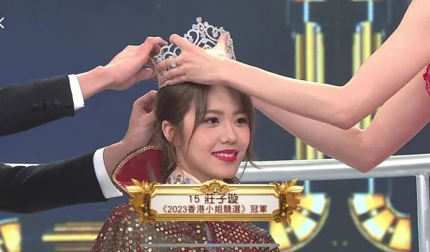

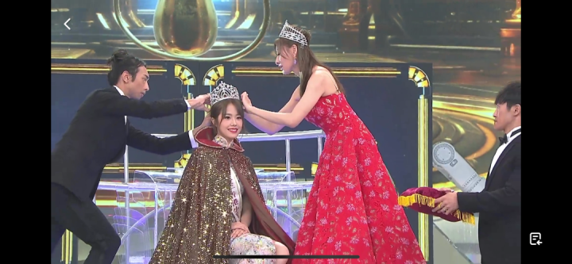

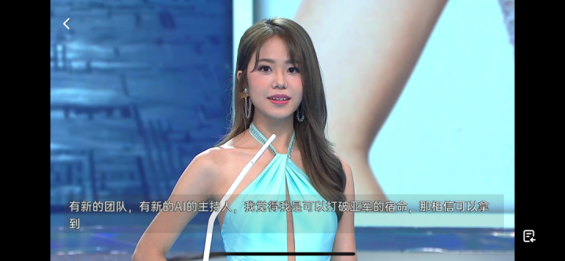

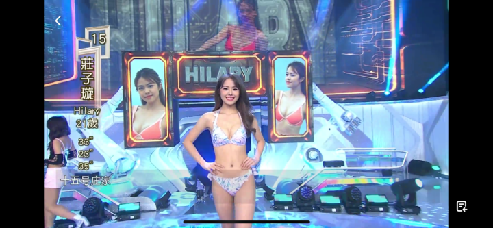

4号王怡然获得亚军，她同时是最上镜小姐。这位来自江苏的女孩现正就读浸会大学传理系，拥有精致五官及甜美笑容的她，此前被香港网友昵称为“Cute版阿Sa”，是今年港姐三甲的大热门之一。

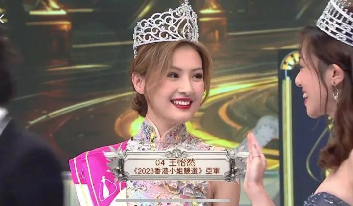

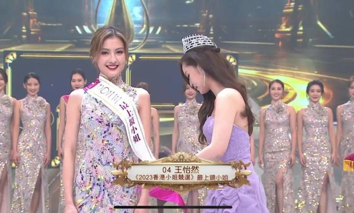

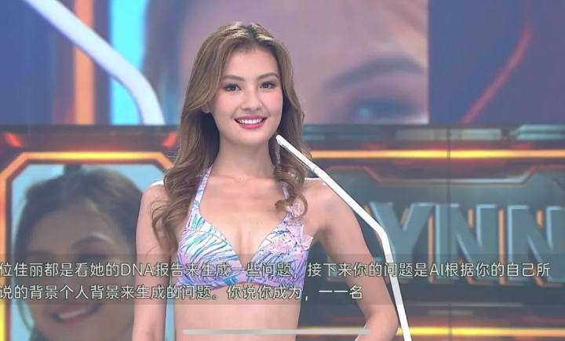

17号王敏慈获得本届香港小姐季军，目前就读于北京中央戏剧学院。此前在面对“如果你成为香港小姐冠军，怎么去宣传香港？”这样的问题时，王敏慈用普通话答道：“希望自己有香港小姐这个身份的加持，可以代表香港，代表我们的祖国，把我们的中华文化传扬到全世界，把我们的中国故事告诉世界各地的人。”

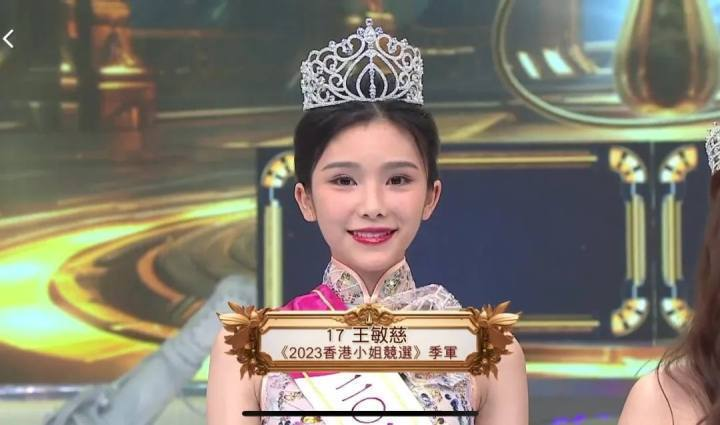

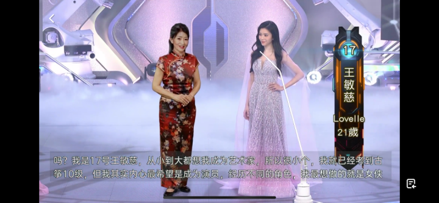

友谊小姐则由8号姜依宁获得。

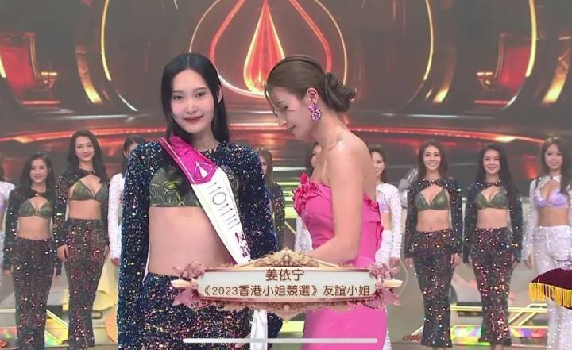

结果出炉后，不少网友热议，此前呼声很高的10号选手陈霈錤，可惜没能进前三。“香港小姐10号 意难平”还一度冲上了微博热搜第一。

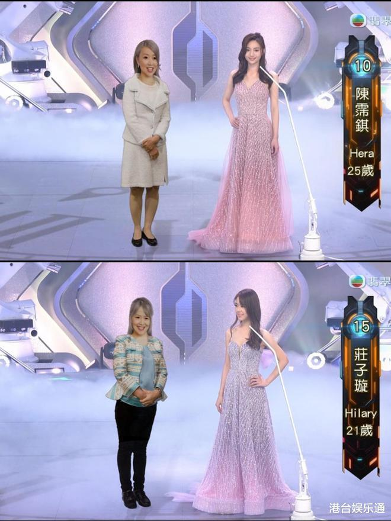

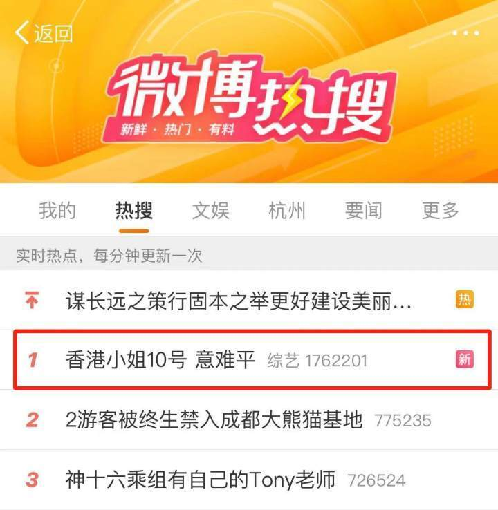

据TVB官方微博消息，今年港姐决赛将AI元素融入选美，诞生了“史上首位AI港姐司仪”。

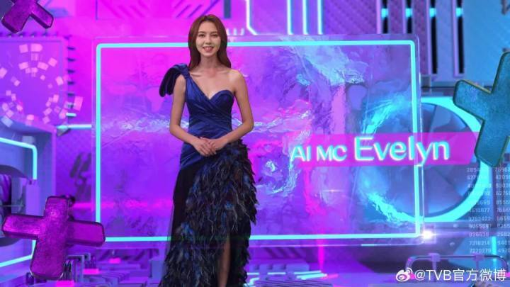

大赛官方通过AI综合“过往50年港姐冠军的参赛片段”，生成了“陈婉嫣”（Evelyn）。她的名字由来，也是AI根据历届冠军的中英文名资料生成，意为“聪明及迷人”。

总决赛上， **大数据以过往51年的港姐三甲作为素材生成16位AI港姐，与本届佳丽一一对比，** 生成颜值相似度；此后，
**AI又为每位佳丽生成出“未来的自己”，让她们进行一场跨时空对话。** 而港姐竞选一向的重头戏—— **泳装问答，**
此次的问题也由AI生成；而在最终的五强角逐环节，佳丽还要跟AI司仪陈婉嫣直接“对决”进行一分钟同题演讲。

今年是香港小姐举办的第51个年头，多年来港姐竞选秉承“美貌与智慧并重”的选拔原则，为观众贡献了一台台美丽盛事。今届入围的候选佳丽，此前曾到广东顺德进行为期4天的港姐特别节目拍摄之旅，记者发现，今年的港姐出现一个新趋势：
**有内地生活经历的佳丽比往年增多，她们带着对香港这座繁华城市的向往与憧憬，勇敢站上这个舞台展现自己的风采，也为港姐竞选增添了一抹多样的风采。**
此外，今年的佳丽整体学历较高，素质平均， **16位候选佳丽中有5位是硕士生，**
展现出“港姐之美”从不只停留在外在美，更体现在有深度和厚度的内在美。在接受南都记者访问时，她们亦纷纷表达了对粤港澳大湾区建设、向世界讲好中国故事、宣扬中华文化等热点社会议题的关注，她们希望通过自己的努力和影响力，为大湾区的繁荣贡献一份力量。

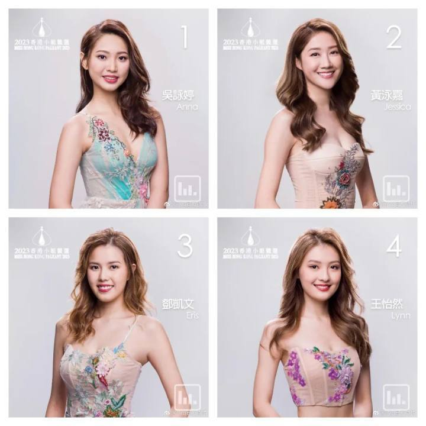

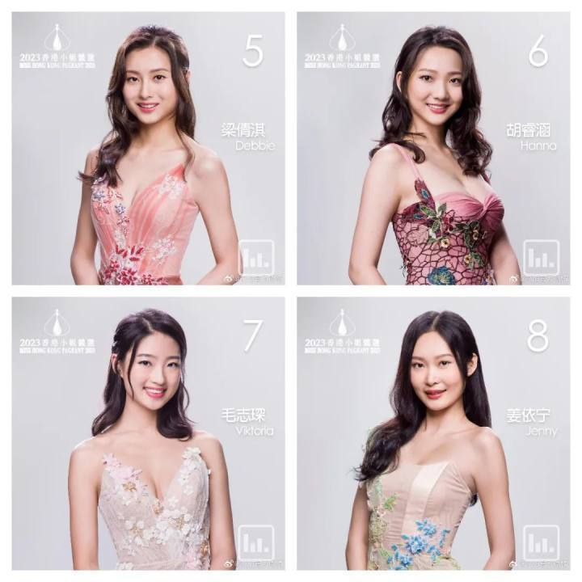

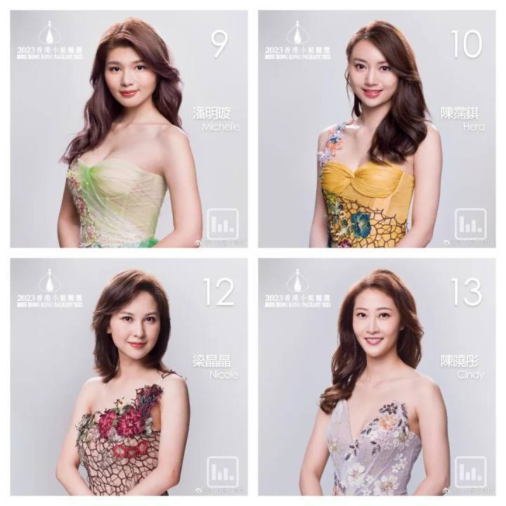

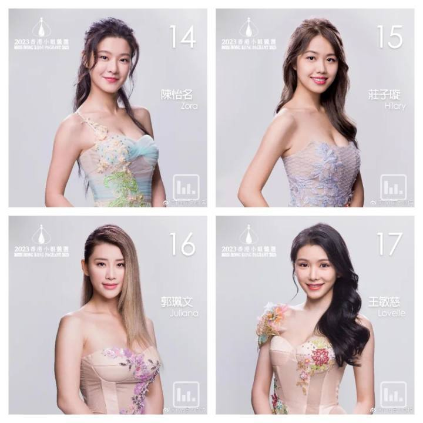

