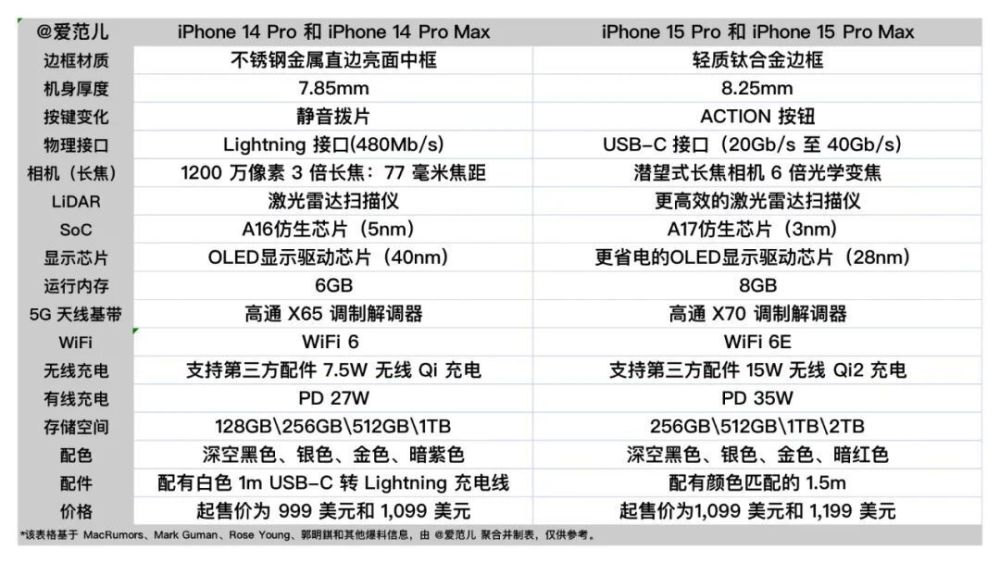
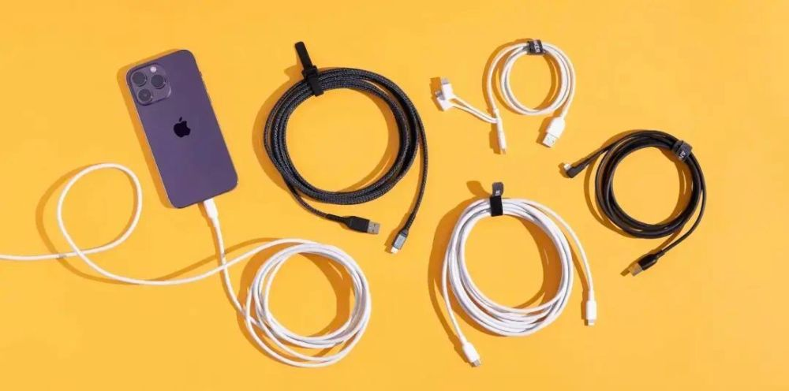
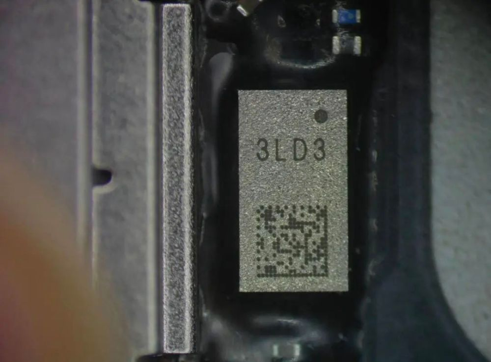
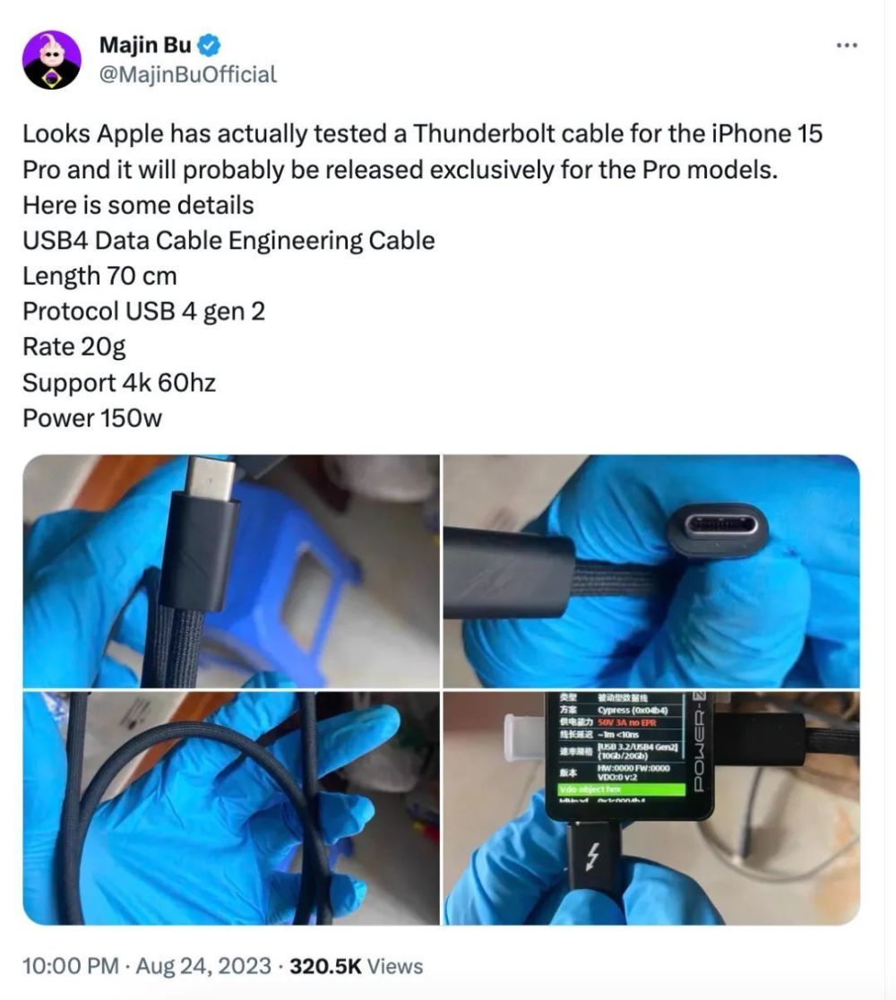
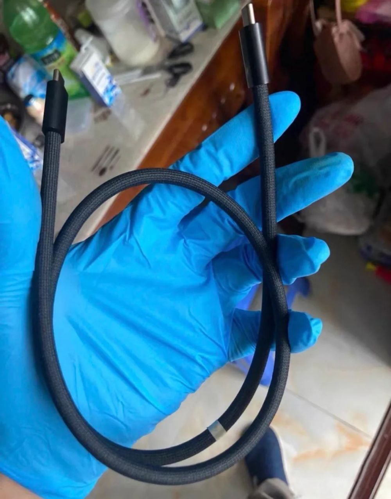
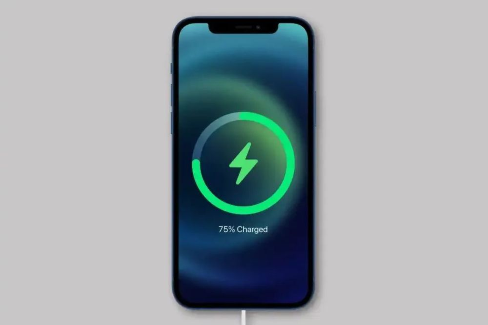
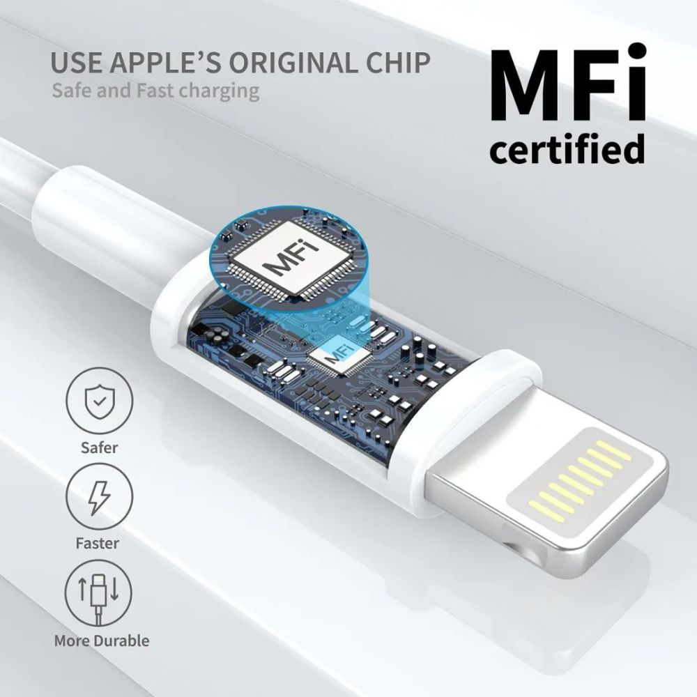
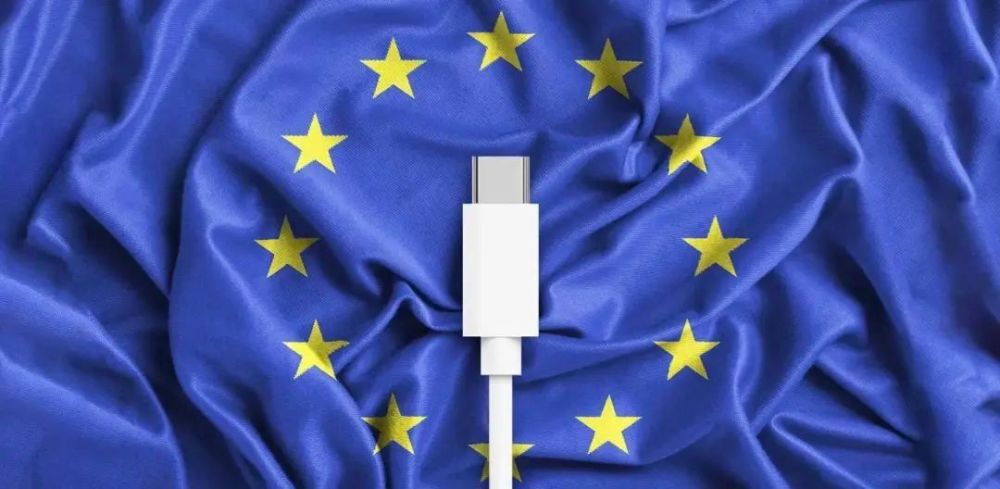
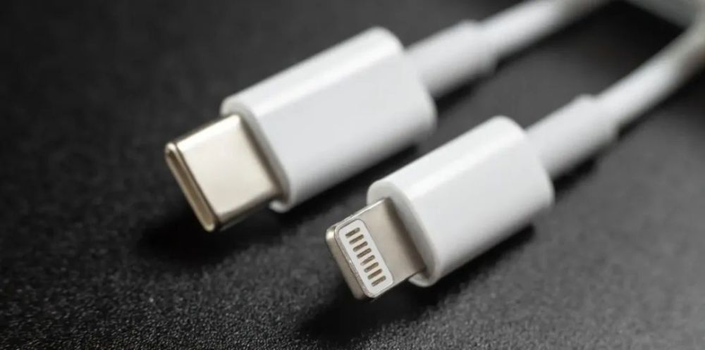
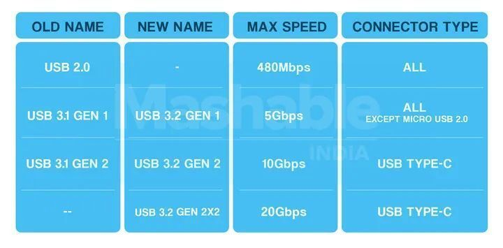

# iPhone 15 Pro曝光的这些新变化，只有它让人又爱又恨

苹果发布会临近，关于新 iPhone 的爆料也多了起来。

爱范儿根据 MacRumors、Mark Guman、Rose Young、郭明錤和其他知名苹果爆料人提供的信息，将 iPhone 15 Pro
的变化整理成表格。

iPhone 15 系列将成为苹果首款具备 USB-C 接口的 iPhone，USB-C 接口或许是本次 iPhone
最大的更新，但也别太兴奋，它可能会让你「又爱又恨」。

等待十一年之后，iPhone 身上牢固的 Lightning 接口终于被撬动。

_图片来自：The New York Times_

一些泄密者也在 X (原 Twitter)上泄露了 iPhone 15 系列 USB-C 接口的图片。

图片显示标准 iPhone 15、iPhone 15 Plus 和 iPhone 15 Pro Max 的 Type-C 都连接到柔性 PCB 组件，这表明
iPhone 15 将全系配备 USB-C 接口。

不过天风国际证券分析师郭明錤表示，尽管 iPhone 有望从 Lightning 接口转向 USB-C 接口，但苹果有可能会限制其传输的速度。

他表示， **只有 iPhone 15 Pro 和 iPhone 15 Pro Max 才会配备 USB 3.2 接口。而基本款 iPhone 15 和
iPhone 15 Plus 将配备 USB 2.0 接口** 。

此外，知名爆料者 Majin Bu 也分享了一张标记为 3LD3 芯片的芯片组照片，并称这是 iPhone 15 系列即将推出的充电组件。

而该充电组件或将识别不同充电线和适配器，并针对非苹果认证的第三方配件进行限制，以保护手机和用户。

前两天 Majin Bu 又曝出 **，iPhone 15 所标配的 USB-C 数据线为 USB 2.0，最高传输速率为 480 Mbps**
。据称苹果内部已经为 iPhone 15 Pro 测试了 Thunderbolt 数据线。

这款数据线同样采用编织线缆，长度为 70 厘米，重量为 20 克，采用 USB 4 Gen 2 协议，支持外接 4K 60Hz 显示器，供电功率为
150W。

根据曝光的测试截图，这款工程在 USB 3.2 下最高传输速率为 10Gbps；在 USB 4 Gen 2 下最高可以达到 20Gbps。

此外根据 IT 之家从爆料者 Kosutami 拿到的「iPhone 15 USB-C 数据线」实测，其最高支持 60W 充电功率（20V3A），传输速度在
35MB/s 到 37MB/s 左右，刚好是 USB 2.0 规格标称速度，也从侧面印证了 Majin Bu 的爆料。iPhone 换用 USB-C
接口带来的另外一个变化可能是充电速度。

9to5Mac 通过业内消息人士得知，至少部分新款 iPhone 15 机型的充电功率高达 35W，这将使新手机的充电速度更快。

目前尚不清楚 35W 充电是否仅限于 iPhone 15 Pro 机型，还是适用于整个 iPhone 15 系列。

USB 的「U」是 Universal 的缩写，即通用的意思，而倘若上述限制加以实装，也就意味着 iPhone 15 上的 USB-C
则并不完全通用。值得一提的是，当 Lightning 技术首次在 2012 年亮相时，相比同期的 USB-C 技术，它并没有太大优势。从传输速度上，彼时
USB-C 和 Lightning 都最大支持 480Mbps 的传输速度。

更何况当下 USB 4.0 的最大数据传输率高达 80Gbps，而 Lightning 传输速度却丝毫不变。举个直观的例子，iPhone 14 Pro
系列拍摄一张 4800 万像素的 ProRAW 照片，照片大小约为 100 MB。

当前 Lightning 接口的最大传输速度为 480Mbps，约合 60MB/s，经过换算，传输该照片需要 1.67 秒，而换成支持 80Gbps 的
USB 4.0 则只需要 0.01 秒。从功能上，USB-C 支持 USB 的所有功能协议，包括 Power Delivery 快充和
DisplayPort 视频输出等。

Lightning 部分功能则需要经过专门的 MFi（Made for iPhone/iPod/iPad）认证。

只有加入 MFi 计划获得授权认证的厂商，才能生产苹果认可的 Lightning 接口配件，非 MFi 认证配件的兼容性和功能则会受限。

百亿量级的Lightning产业链

归功于这种限制，MFi 认证计划确保了高质量的 Lightning 生态，也催生出一个百亿量级的 Lightning 产业链。这并不夸张，一根 1 米的
USB-A 闪电接头连接线在苹果官网售价 148 元人民币。

公开数据显示，苹果每年大约会出货 2 亿条 Lightning 充电线。假如每条充电线的利润约为 50 元人民币（保守估算），那么每年苹果大约可以从
Lightning 充电线上获得 100 亿元人民币的惊人利润。

除了基本利润，苹果还选择在 MFi 认证计划上大作文章。据此前《科创板日报》报道，申请 MFi 认证的厂商，每年除了需要向苹果缴纳 99 美元的 MFi
会员年费，还需要缴纳 2060 美元的工厂审核费用。

同时第三方配件厂商每售出一个MFi 配件，苹果还会收取 20%-25% 的分成，将羊毛彻底薅到底。

Lightning 充电线还内置一颗芯片，既起到安全质量认证的效果，也起到身份识别的作用。而原装芯片单颗的采购价格大概在 2-3
美元。所以也难怪苹果迟迟不愿意放弃 Lightning 接口的「聚宝盘」，毕竟躺着就能赚钱，又何必改变这安逸的局面。

既如此，那么为什么苹果要在下一代 iPhone 开始换用 USB-C 接口呢？

原因还得追溯到去年。去年 10 月份，欧洲议会以压倒性的优势通过了一项法案，要求从 2024 年底开始，所有手机、平板等便携智能设备新机都必须使用
USB-C 的充电接口。

就在前几天，沙特阿拉伯也宣布了一项新规，明确要求从 2025 年起，所有在该国市场销售的手机和其他电子设备必须使用 USB-C
接口进行充电和数据传输。这也是继欧盟之后第二个实施统一充电接口规定的地区。

_图片来自：9to5mac_

苹果自然是相关法规的最大反对者，认为这些法规扼杀了创新，并多次强调接近 10 亿苹果产品搭载 Lightning 接口，一旦强迫使用 USB-C
接口，可能会产生更多的电子废物，不符合欧盟的环保初心，也不符合苹果的创新气质。

在法案大棒的监管之下，苹果的妥协无可厚非。更何况无论是放弃欧盟市场，还是给欧盟以外的地区提供 Lightning 接口特供版，都不是相对可行的想法。

此外，虽然欧盟的期限要求是 2024 年底开始，原则上是可以从 iPhone 16
系列才开始转变的，但提前转变接口既能留出更多的时间余地，还可以根据届时的舆论及时调整。

种种考量之下，iPhone 15 系列用上 USB-C 接口的爆料倒也合情合理。

 _图片来自：IDG_

混乱的USB-C生态

用上归用上，iPhone 15 系列想要融入 USB-C 还得先解决一些小麻烦。近些年来，卷上加卷的 USB-C 生态每年都在大跃进。上一秒将传输速度拉进
80Gbps 时代，下一秒又将充电速度卷进分钟时代，可谓是捷报频传，让一众 iPhone 用户都「馋哭了」。

有个问题是，水面之上是看似繁荣的 USB-C 生态，水面之下却隐藏着不同规格与协议所带来的混乱。

其中有两个问题较为突出。第一是 USB-C 接口命名的混乱，比如最开始 2008 年 11 月 8 日推出的 USB 2.0 的下一代标准叫做 USB
3.0，峰值速率达到了 5Gbps，是 USB 2.0 峰值速率 480Mbps 的十倍以上。

到这里，命名标准还没整什么「幺蛾子」。在 USB 3.0 之后，2013 年 12 月 3 日，又正式推出了 USB 3.1，将峰值速率再翻一倍，达到了
10Gbps。

 _图片来自：Mashable India_

然后 USB-IF 直接将已经使用好几年的 USB 3.0 改名叫 USB 3.1 Gen1，而新推出的 10Gbps 的 USB 3.1 则改名为 USB
3.1 Gen2。

4年之后，同样的做法又在后续的 USB 3.2 上重演了一遍。混乱的改名也让很多非专业用户对 USB-C 的规格感到头疼。彼时为了方便，大多数用户也只会以
USB 3.0 来统指 USB 3.X 的所有规格。

除了命名标准的混乱，USB-C 接口支持的协议也「千口千面」。PD 快充协议、SCP 快充协议、高通 QC 协议、VOOC
充电协议等令人眼花缭乱的协议都挤在这个小小的 USB-C 接口。甚至部分快充技术也只与同系列产品兼容，不兼容其他协议，比如 OPPO 的
VOOC、Realme 的 Dart 只兼容其生态产品。

_图片来自：pengo_

此前也有爆料指出，iPhone 15 系列尽管用上了 USB-C 接口，也依旧坚守 MFi 认证计划，也就是说，iPhone 15 系列依旧不会与
Android 生态兼容。

消费者若想购买新的苹果充电线，仍需要在苹果官网或者通过 MFi 认证的配件厂商处购买。

在这个转变过程中，欧盟得到了环保，消费者得到了新生态，唯有苹果的百亿量级 Lightning 产业链受到了伤害。

